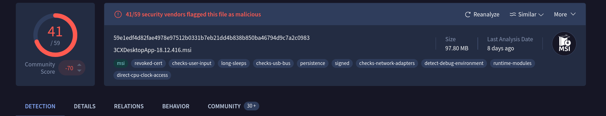
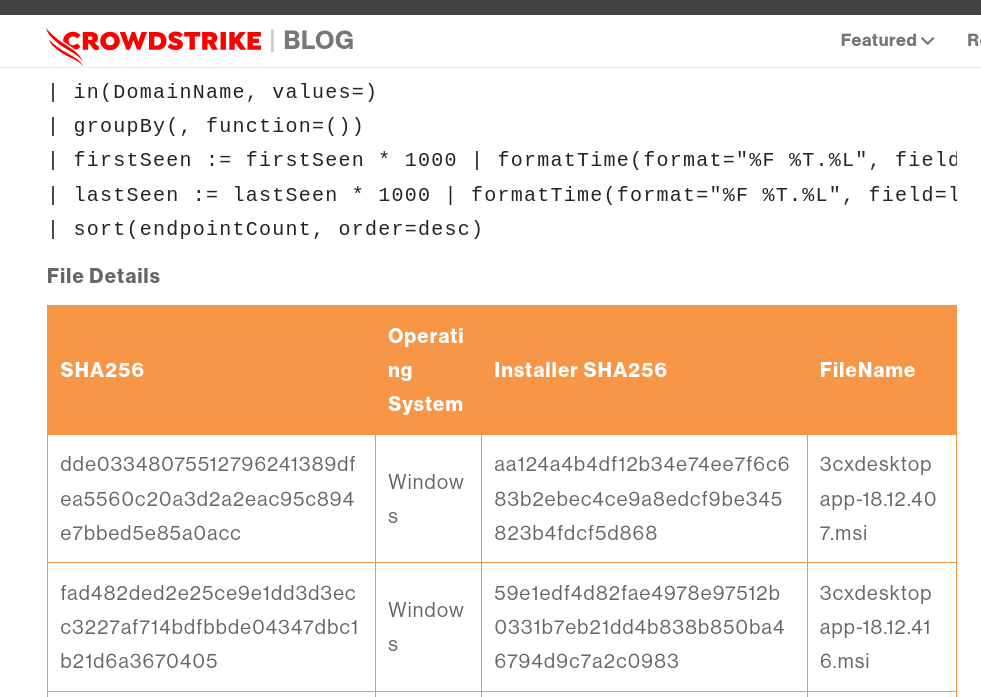
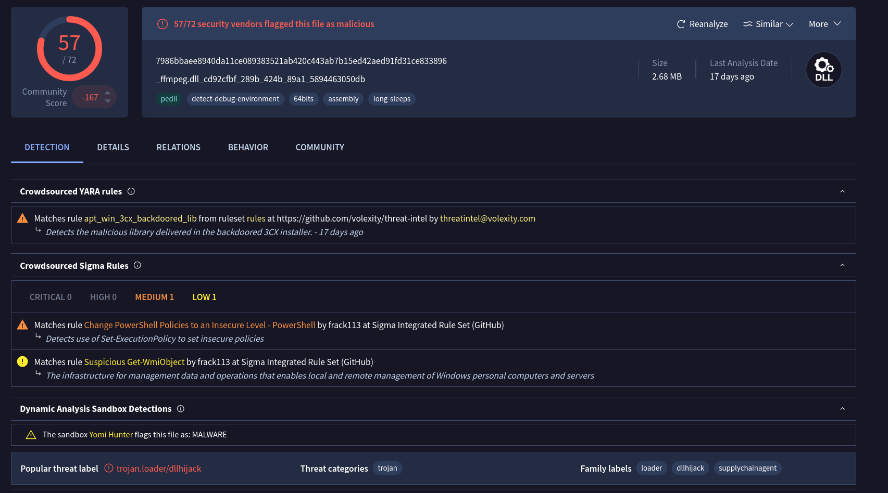
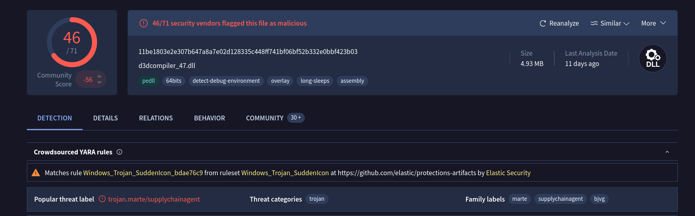
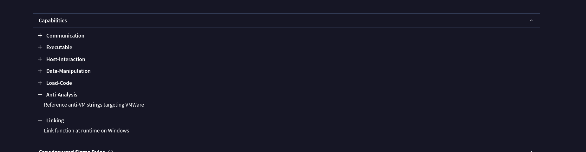
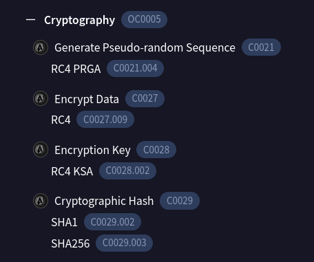
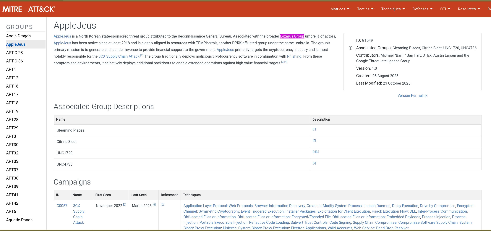

# 3CX Supply Chain – Malware Investigation

## Overview

This lab focuses on investigating the 3CX supply chain compromise, where legitimate software was trojanized and distributed with malicious components. The goal was to identify compromised versions, analyze dropped payloads, determine persistence mechanisms, and map behaviors to MITRE ATT&CK while attributing the campaign to a known threat actor.

This case highlights how trusted software can become an infection vector and reinforces the importance of threat intelligence pivoting through VirusTotal and MalwareBazaar.

---

## 1. Malicious 3CX Versions Identified

Pivoting through VirusTotal using file hashes revealed that:

**2 Windows versions** of 3CX were flagged as malicious.

Identifying affected versions is critical to scoping enterprise exposure and initiating containment procedures.

---

## 2. Malware Creation Timeline

The malicious `.msi` installer creation time in UTC:

**2023-03-13 06:33**

Establishing file creation timestamps helps determine campaign timeline and correlate with global threat reports.

the Creation Time is 2023-03-13 06:33:26 UTC

## 3. Malicious DLLs Dropped by the MSI

Analysis of the Microsoft Installer package revealed two malicious DLLs dropped during execution:

- `ffmpeg.dll`
    
- `d3dcompiler_47.dll`
    

These DLLs acted as the primary malicious execution components embedded within an otherwise legitimate software installation process.
![[supply_attack.png]]
## 4. Persistence Mechanism

The MSI file used a technique to load malicious DLLs during execution.

MITRE ATT&CK Technique ID:

**T1574 – Hijack Execution Flow**

This reflects DLL side-loading behavior where legitimate processes load attacker-controlled DLLs.

## 5. Threat Category

VirusTotal and intelligence pivots categorized the malicious DLLs as:

**Trojan**

Understanding the threat classification helps analysts anticipate behaviors such as C2 communication, credential theft, and staged payload delivery.

## 6. Virtualization / Sandbox Evasion

Dynamic analysis revealed virtualization detection behavior.

MITRE ATT&CK Technique ID:

**T1497 – Virtualization/Sandbox Evasion**

The malware checks for hypervisor artifacts to avoid executing in analysis environments.

## 7. Targeted Hypervisor

The anti-analysis techniques within `ffmpeg.dll` specifically targeted:

**VMware**

This indicates deliberate evasion efforts against common sandbox and analyst environments.

## 8. Encryption Algorithm

Reverse engineering findings revealed the malware used:

**AES**

Encryption was used to protect embedded configuration or C2 communications from easy static inspection.

## 9. Threat Actor Attribution

Based on intelligence correlations, infrastructure reuse, and reporting:

The attack was attributed to:

**Lazarus Group**

This APT group is known for supply chain attacks and sophisticated evasion techniques.

## Key Takeaways

This lab reinforced several critical analyst skills:

- Identifying compromised software versions in supply chain attacks
    
- Extracting dropped DLLs from MSI packages
    
- Mapping DLL side-loading to MITRE ATT&CK
    
- Recognizing virtualization evasion techniques
    
- Using VirusTotal behavior tabs to identify MITRE techniques
    
- Correlating intelligence feeds for APT attribution

## Personal Lesson Learned

A major takeaway from this lab was leveraging the **Behavior tab in VirusTotal** to quickly extract MITRE technique mappings. This reinforced how powerful VT enrichment can be when pivoting from file hashes to tactics, techniques, and procedures.

Rather than manually inferring techniques from behavior, VirusTotal can accelerate triage by surfacing ATT&CK mappings directly.
## Conclusion

>The 3CX supply chain attack demonstrates how trusted software can be weaponized to deliver trojanized DLLs using DLL side-loading techniques. The malware leveraged sandbox evasion, AES encryption, and targeted VMware environments to avoid detection.

This investigation highlights the importance of:

- Hash-based threat intelligence pivoting
    
- DLL drop analysis
    
- MITRE ATT&CK correlation
    
- Behavior-based detection
    
- Attribution through threat intelligence
    

Supply chain compromises require rapid version identification and strong telemetry to prevent widespread organizational impact.

## IOCs 

| Type                      | Value                                                            |
| ------------------------- | ---------------------------------------------------------------- |
| filename                  | 3CXDesktopApp-18.12.416.msi                                      |
| MSI sha256                | 59e1edf4d82fae4978e97512b0331b7eb21dd4b838b850ba46794d9c7a2c0983 |
| ffmpeg.dll SHA256         | 7986bbaee8940da11ce089383521ab420c443ab7b15ed42aed91fd31ce833896 |
| d3dcompiler_47.dll SHA256 | 11be1803e2e307b647a8a7e02d128335c448ff741bf06bf52b332e0bbf423b03 |
|                           |                                                                  |

I successfully completed 3CX Supply Chain Blue Team Lab at @CyberDefenders!
https://cyberdefenders.org/blueteam-ctf-challenges/achievements/inksec/3cx-supply-chain/
 
#CyberDefenders #CyberSecurity #BlueYard #BlueTeam #InfoSec #SOC #SOCAnalyst #DFIR #CCD #CyberDefender
