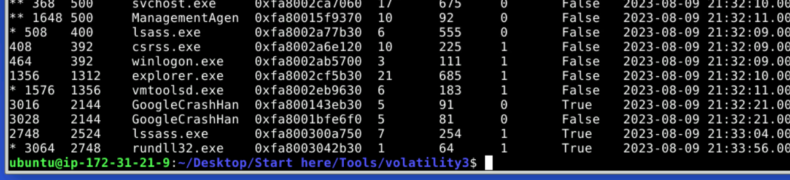
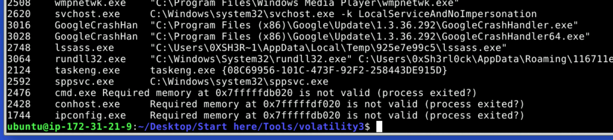
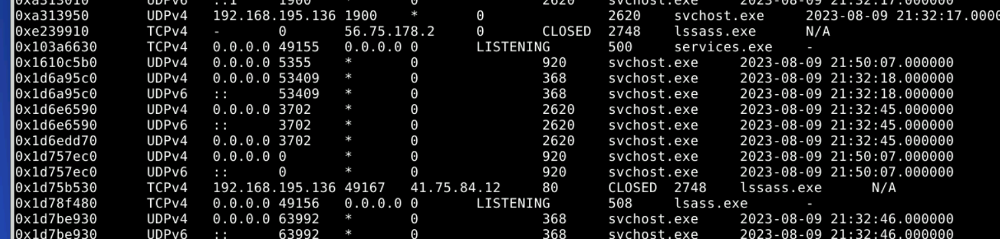
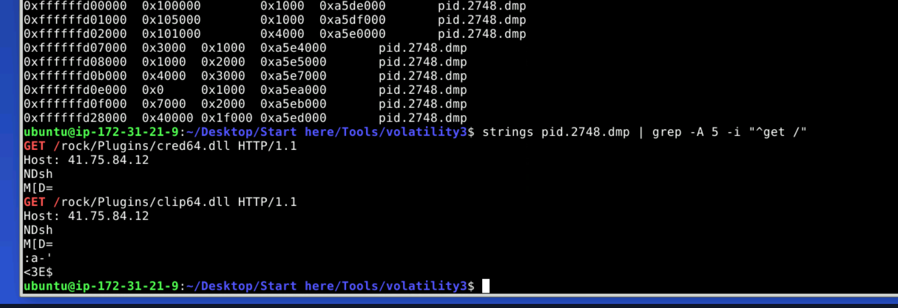
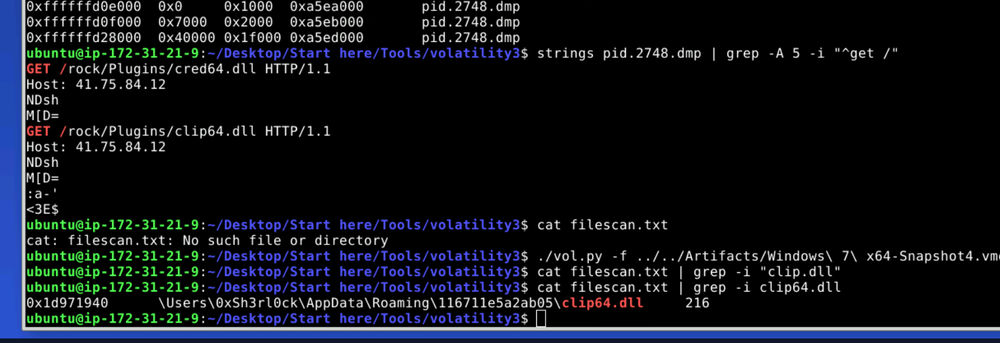
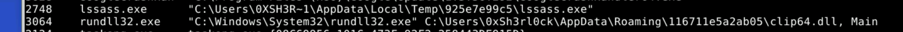
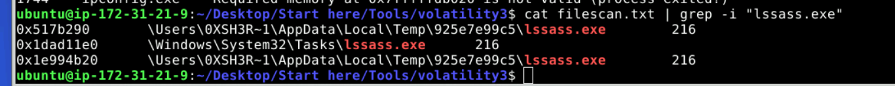

#### Scenario

An after-hours alert from the Endpoint Detection and Response (EDR) system flags suspicious activity on a Windows workstation. The flagged malware aligns with the Amadey Trojan Stealer. Your job is to analyze the presented memory dump and create a detailed report for actions taken by the malware.

##  Transparency

 ⚠️`First hands-on Volatility 3 lab. I used the hint feature to understand 
 `plugin selection — my focus was learning the investigation methodology, 
 `not guessing commands blind.

## Scenario Overview

An after-hours alert from the EDR flagged suspicious activity on a Windows 7 workstation.

Indicators aligned with **Amadey Trojan Stealer**, a MaaS (Malware-as-a-Service) loader known for:

- Payload delivery
    
- C2 communication
    
- Persistence mechanisms
    
- Execution via LOLBins
    

We were provided:

- `Windows 7 x64-Snapshot4.vmem` (memory dump)
    
- Volatility 3
    

Objective: Identify malicious processes, network activity, dropped files, persistence, and C2 infrastructure.

# 1. Process Investigation

## Process Tree Analysis

'./vol.py -f ../../Artifacts/Windows\ 7\ x64-Snapshot4.vmem windows.pstree.PsTree'

Suspicious process observed:

lssass.exe

Note: This mimics `lsass.exe` (Windows security process).

This is a common masquerading technique.

Command Line Inspection

`./vol.py -f ../../Artifacts/Windows\ 7\ x64-Snapshot4.vmem cmdline`

Malicious binary located at:

C:\Users\0XSH3R~1\AppData\Local\Temp\925e7e99c5\lssass.exe

This confirms:

- Execution from Temp directory
    
- Non-legitimate system process
    
- User-space malware execution

# 2. Network Analysis

## Active Connections
`./vol.py -f ../../Artifacts/Windows\ 7\ x64-Snapshot4.vmem windows.netscan.NetScan`

Filtering connections related to `lssass.exe` revealed outbound traffic to:

41.75.84.12

This is the **Command & Control (C2) server**.

# 3. Memory Dump of Malicious Process

To inspect network artifacts and downloaded content:
`./vol.py -f ../../Artifacts/Windows\ 7\ x64-Snapshot4.vmem  windows.memmap.Memmap --pid 2748 --dump`
Extracted strings:
`strings pid.2748.dmp | grep -A 5 -i "^get /"`

Observed:

GET /rock/Plugins/clip64.dll HTTP/1.1  
Host: 41.75.84.12

This shows:

- Malware is downloading additional payload
    
- Secondary module: `clip64.dll`

# 4. File Scan & Artifacts

`./vol.py -f ../../Artifacts/Windows\ 7\ x64-Snapshot4.vmem windows.filescan.FileScan > filescan.txt
Search for DLL:
`cat filescan.txt |grep -i clip64.dll

Found:

C:\Users\0xSh3rl0ck\AppData\Roaming\116711e5a2ab05\clip64.dll

# 5. Execution Mechanism

Child process initiated:

RUNDLL32.EXE

This confirms:

- DLL executed via Living-Off-The-Land binary
    
- Standard Amadey loader behavior

# 6. Persistence Mechanism

Additional persistence located at:

C:\Windows\System32\Tasks\lssass.exe

This indicates:

- Scheduled task persistence
    
- Long-term foothold
    
- Survives reboots

## Artifacts

| Type | Value |
|------|-------|
| Fake Process | lssass.exe |
| Execution Path | `C:\Users\0XSH3R~1\AppData\Local\Temp\925e7e99c5\lssass.exe` |
| C2 Server | `41.75.84.12` |
| Downloaded Module | `clip64.dll` |
| DLL Path | `C:\Users\0xSh3rl0ck\AppData\Roaming\116711e5a2ab05\clip64.dll` |
| Execution Method | `RUNDLL32.EXE` |
| Persistence | Scheduled Task |
# Distinct Files Retrieved

From analysis of network requests:

2 distinct files

Amadey was pulling additional modules post-compromise.
# Malware Behavior Observed

- Process masquerading
    
- Temp directory execution
    
- External C2 communication
    
- Payload staging
    
- DLL execution via RUNDLL32
    
- Scheduled task persistence
    

Classic loader-style behavior.

---

# Final Thoughts

This lab was an excellent introduction to:

- Volatility 3 workflow
    
- Memory-based detection
    
- Correlating processes + network activity
    
- Identifying C2 infrastructure
    
- Recognizing LOLBin execution
    

Even with hints, the key takeaway was learning how to:

1. Identify suspicious processes
    
2. Trace parent-child relationships
    
3. Extract network artifacts from memory
    
4. Map persistence mechanisms
    

I successfully completed Amadey - APT-C-36 Blue Team Lab at @CyberDefenders!
https://cyberdefenders.org/blueteam-ctf-challenges/achievements/inksec/amadey-apt-c-36/
 
#CyberDefenders #CyberSecurity #BlueYard #BlueTeam #InfoSec #SOC #SOCAnalyst #DFIR #CCD #CyberDefender