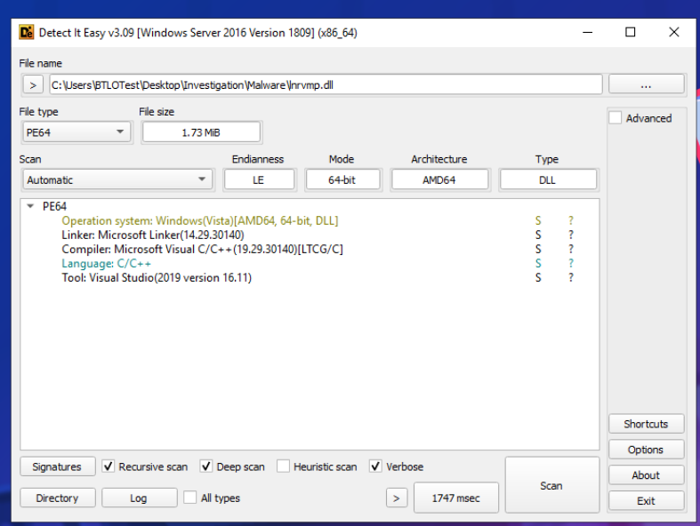
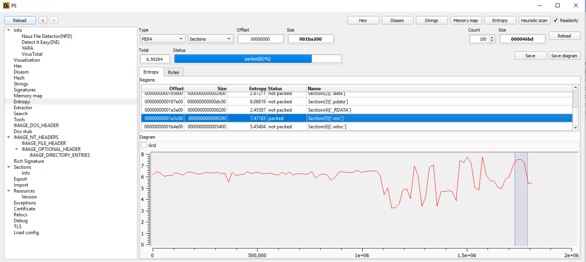
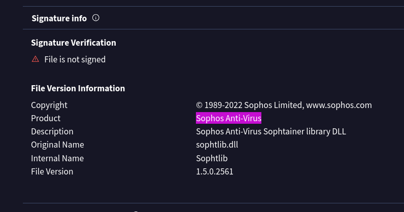
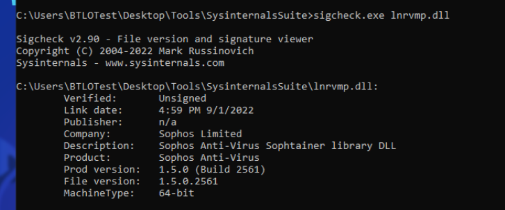
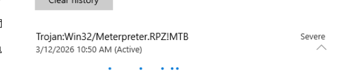
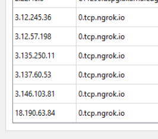
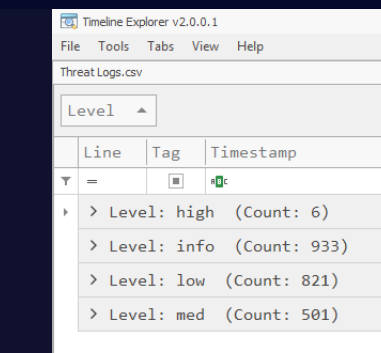
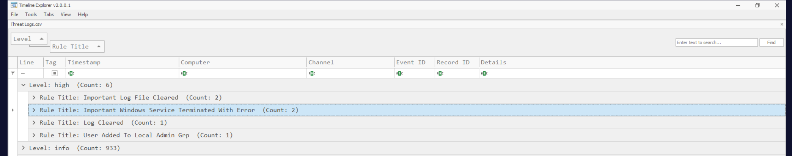
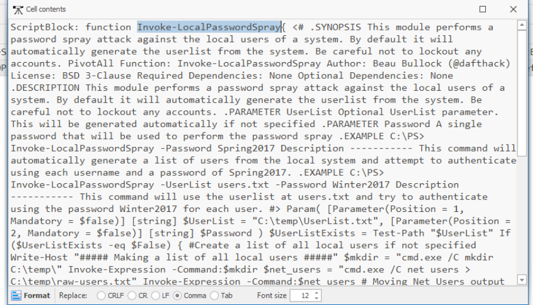

## Overview

Anakus drops us into a malware analysis scenario through the lens of Loda Sukana — an aspiring analyst sitting a virtual OA to land a role at her brother's DFIR firm. We're handed a VM stocked with tools and tasked with analyzing suspicious files and incident logs to piece together what happened. The lab covers static malware analysis, network indicator extraction, and log triage across two artifacts: a suspicious DLL and an executable that Windows Defender has opinions about.

Tools used: Detect It Easy, VirusTotal, SigCheck, Wireshark, Windows Defender, Timeline Explorer.

---

## Static Analysis — lnrvmp.dll

### Identify the File

The first stop is Detect It Easy (DIE). Loading `lnrvmp.dll` gives us the SHA256 hash immediately in the header panel, and the compiler detection identifies the language as **C++**.

SHA256: `fb20fc4e474369e6d8626be3ef6e79027c2db3ba0a46f7b68c6981d6859d6d32`

Punching the hash into VirusTotal confirms the file has a detection history, giving us early confidence this isn't a false positive.

### Entropy Analysis — Identifying the Packed Section

Back in DIE, the entropy graph is the next thing to examine. The overall file entropy gives a broad picture of randomness, but what we're hunting for is a section with entropy above 7.2 — the threshold generally associated with compressed or encrypted data (packed content).

The `.rsrc` section stands out immediately with high entropy, indicating this is where the packed payload lives. Resource sections are a common hiding spot for packed or embedded executables since they're less scrutinised than `.text`.

### Impersonation — Masquerading as Sophos

Checking the file metadata and version info strings (DIE's strings tab or PE headers) reveals the malware has embedded product name strings referencing **Sophos Anti-Virus**. This is a classic defense evasion technique — T1036.005 (Masquerading: Match Legitimate Name or Location) — where the attacker dresses the binary up as a trusted security product to reduce suspicion on endpoint review.

### Signature Check — SigCheck

Running SigCheck against the file confirms what we suspected: the file is **Unsigned**, with a Link Date of **4:59 PM 9/1/2022**. Legitimate Sophos binaries are code-signed by Sophos. The absence of a valid certificate combined with the impersonation strings is a strong combined indicator of malicious intent.

---
## Dynamic Analysis — hataker.exe

### Windows Defender Detection

With Defender enabled, executing `hataker.exe` triggers a detection almost immediately. The threat name returned is:

`Trojan:win32/meterpreter.tpz!MTB`

The `meterpreter` string in the detection name tells us exactly what we're dealing with — a Meterpreter payload, which is a staple of post-exploitation frameworks like Metasploit.

### Reverse Shell

Knowing this is a Meterpreter trojan, the connection method follows logically. Meterpreter is designed to establish an outbound connection from the victim back to the attacker's C2 — this is called a **Reverse Shell**. The distinction matters: a reverse shell originates from the victim, bypassing inbound firewall rules that would block a traditional bind shell where the attacker connects inward.

### C2 Infrastructure — Wireshark

Capturing traffic during execution in Wireshark reveals the dynamic domain the malware phones home to:

`0[.]tcp[.]ngrok[.]io`

ngrok is a legitimate tunnelling service frequently abused by attackers as a low-cost, rapidly-deployed C2 relay. It allows them to expose a local listener through a public domain without standing up dedicated infrastructure — making attribution harder and setup faster.

---

## Incident Log Triage — Timeline Explorer

### High-Risk Alerts

Loading the provided `Threat Logs.csv` into Timeline Explorer and grouping by Level, the **high** severity group contains **6 alerts** across 4 distinct Rule Titles.

### Most Frequent High-Risk Rules

Expanding the high-risk group and sorting by count, the two Rule Titles with the highest occurrence are:

- **Important Log File Cleared** — Count: 2
- **Important Windows Service Terminated with Error** — Count: 2

Log clearing is a textbook anti-forensics move — T1070.001 (Indicator Removal: Clear Windows Event Logs) — aimed at disrupting investigation post-compromise. Service termination with errors can indicate the attacker killed defensive tooling or destabilised the host during lateral movement.

### Last High-Risk Rule — Account Manipulation

The final Rule Title in the high-risk group is **User Added To Local Admin Grp** (Count: 1).

This maps to **T1098 — Account Manipulation**. Adding a controlled account to the local Administrators group is a persistence and privilege escalation technique — ensuring the attacker retains elevated access even if their initial foothold is discovered and cleaned.

Expanding the entry in Timeline Explorer reveals the target group: **Administrators**

### Medium-Risk Alerts — PowerShell Activity

Switching to the medium-risk level and sorting by count, the standout alert is:

**Potentially Malicious PwSh — Count: 457**

457 hits on a PowerShell detection rule is not subtle. Searching the Details column for "password" surfaces the culprit function: **Invoke-LocalPasswordSpray**.

This is a PowerShell-based credential spraying function that attempts a single password across many local accounts — designed to fly under account lockout thresholds. MITRE maps this to **T1110.003 — Brute Force: Password Spraying**.

---

## IOCs

|Type|Value|
|---|---|
|SHA256|`fb20fc4e474369e6d8626be3ef6e79027c2db3ba0a46f7b68c6981d6859d6d32`|
|C2 Domain|`0[.]tcp[.]ngrok[.]io`|
|Malware Detection|`Trojan:win32/meterpreter.tpz!MTB`|
|Link Date|`4:59 PM 9/1/2022`|

---

## MITRE ATT&CK

|Technique|ID|Tactic|
|---|---|---|
|Masquerading: Match Legitimate Name|T1036.005|Defense Evasion|
|Indicator Removal: Clear Windows Event Logs|T1070.001|Defense Evasion|
|Account Manipulation|T1098|Persistence|
|Brute Force: Password Spraying|T1110.003|Credential Access|
|Command and Scripting Interpreter: PowerShell|T1059.001|Execution|

---
























