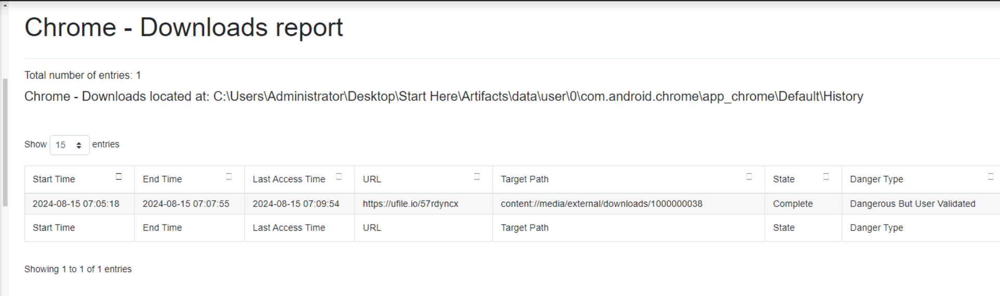
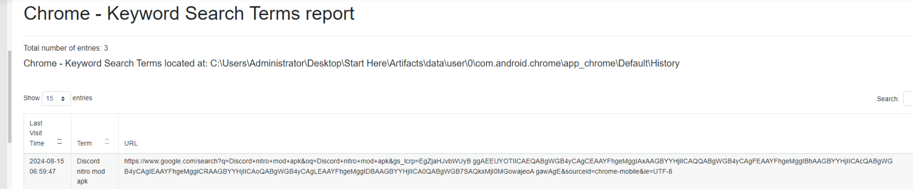
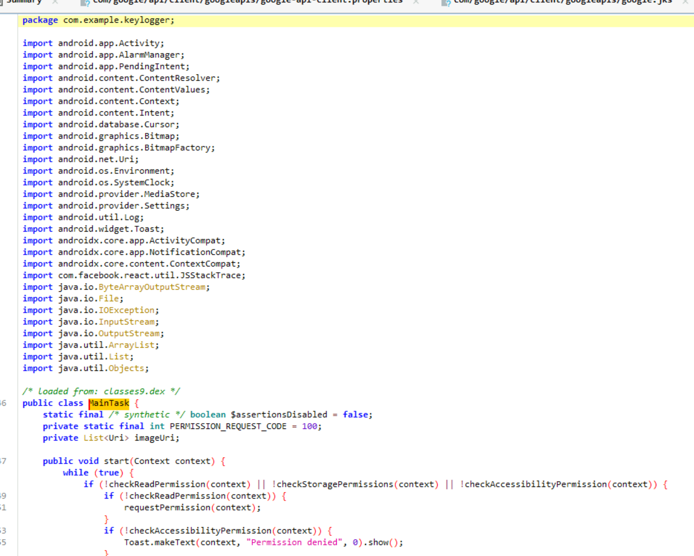
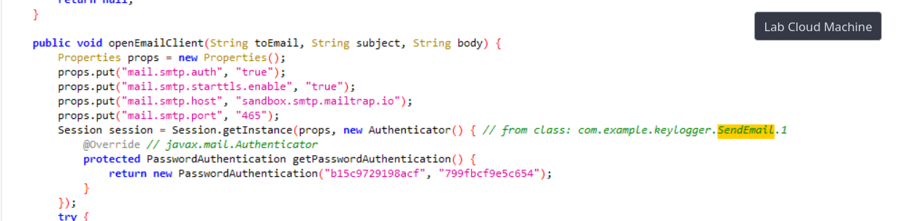
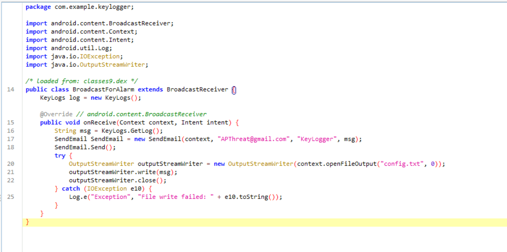
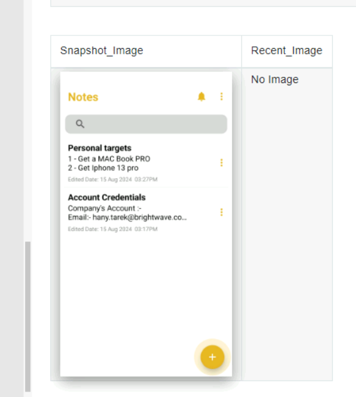
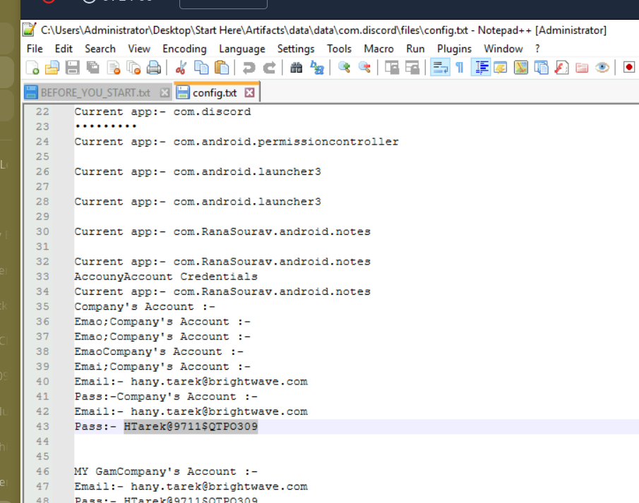
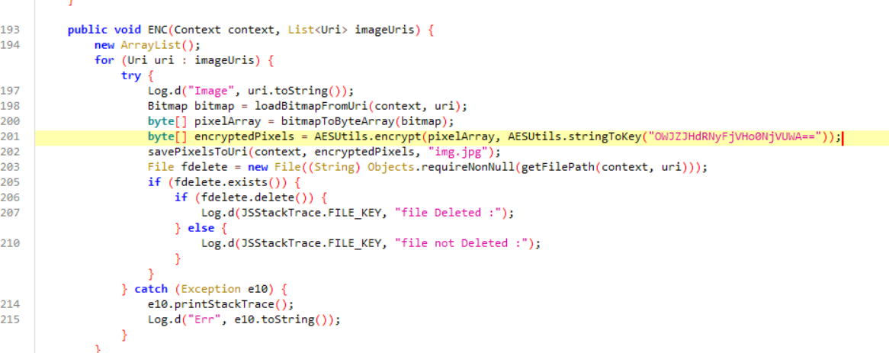
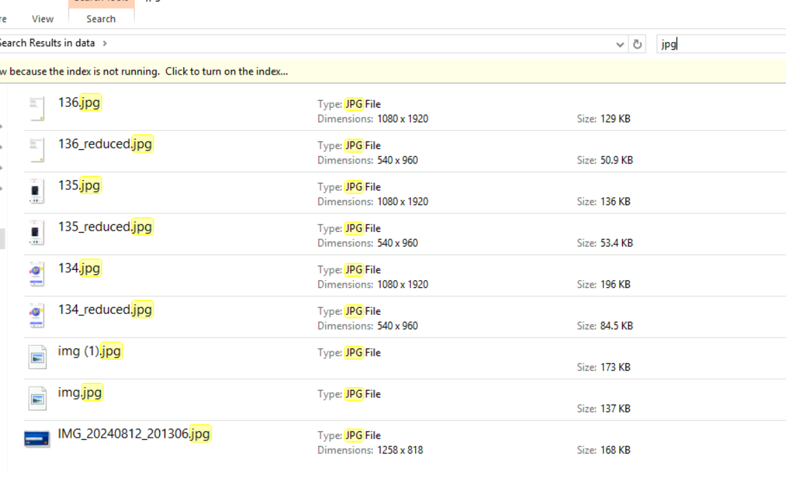
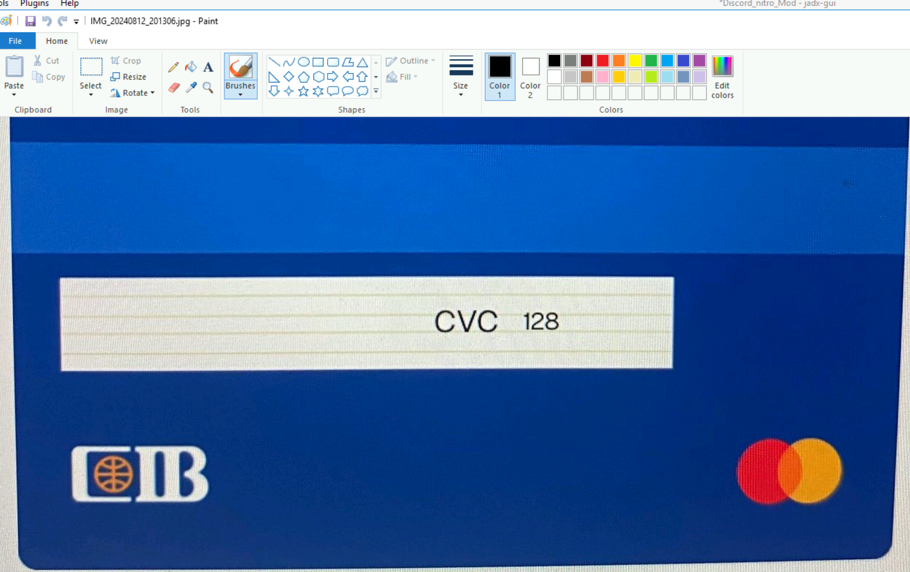

## Scenario

An employee at BrightWave Company compromised the organisation's security through poor personal security hygiene — storing credentials in a phone notes app and downloading APK files from untrusted sources. An attacker exploited these habits to steal credentials and exfiltrate sensitive data. An Android dump from the employee's device has been provided for analysis.

---

## Methodology

### Initial Triage — ALEAPP Report

ALEAPP (Android Logs Events And Protobuf Parser) is used to build a structured report from the Android dump. This gives a quick overview of browser history, downloads, installed apps, and device activity without manually digging through raw files.

The report surfaces the malicious download URL immediately:



```
https://ufile.io/57rdyncx
```

Browser history confirms what was searched for and downloaded — the employee was looking for a Discord Nitro mod, a common social engineering lure targeting users who want free premium features:



The downloaded file `Discord_nitro_Mod.apk` is found sitting in `data/media/0/downloads/` — exactly where Android stores browser downloads. The filename is designed to look like a legitimate Discord modification rather than malware.

### Static Analysis — JADX Decompilation

The APK is loaded into JADX for static analysis. JADX decompiles the Android bytecode back into readable Java, making it possible to understand exactly what the app does without running it.

The malicious package name is identified immediately in the class structure:



```
com.example.keylogger
```

The developer left the package name as `com.example.keylogger` — a development placeholder that was never cleaned up before deployment. This is a strong indicator of a low-sophistication threat actor who built the malware quickly without much operational security.

### Exfiltration Mechanism — SMTP over Port 465

Digging through the code reveals extensive email protocol references:

```
com.sun.mail.imap.IMAPProvider
com.sun.mail.smtp.SMTPProvider
com.sun.mail.smtp.SMTPSSLProvider
com.sun.mail.pop3.POP3Provider
```

The `com.example.keylogger.sendmail` function confirms how the stolen data leaves the device — SMTP over port 465 (SMTPS) via `sandbox.smtp.mailtrap.io`:



Mailtrap.io is a legitimate email testing service that developers use to catch outbound emails during development. The attacker abused it here as a free, low-suspicion SMTP relay to receive exfiltrated data — outbound traffic to a known mail testing service is less likely to be blocked than traffic to a suspicious custom domain.

The destination email address used to receive stolen data is found inside the keylogger class:



```
APThreat@gmail.com
```

### Credential Recovery — Notes App and Discord Config

Two sources of stolen credentials are identified on the device. The notes app contains the employee's work email stored in plaintext:



```
hany.tarek@brightwave.com
```

A configuration file from the Discord mod (`config.txt`) contains the associated password:



```
HTarek@9711$QTPO309
```

Storing credentials in a phone notes app is a common and dangerous habit — any app with storage access, or any malware that achieves file read permissions, can harvest them trivially.

### AES Encryption Key Recovery

The malware doesn't just steal data — it also encrypts images on the device, likely to cause additional damage or hold files hostage. The encryption routine uses AES and the key is hardcoded in the code as a Base64-encoded string:



```
OWJZJHdRNyFjVHo0NjVUWA==
```

Decoding it from the command line recovers the plaintext key:

```
echo "OWJZJHdRNyFjVHo0NjVUWA==" | base64 -d
9bY$wQ7!cTz465TX
```

Hardcoding encryption keys in the binary is poor tradecraft — any analyst with JADX can recover it in minutes, making the encryption trivially reversible.

### Credit Card Data — Image Search

Searching the dump for JPG files surfaces images stored in the gallery. The employee had photographed their credit card information and stored it on the device:





The CVC value `128` is visible in the recovered image. This demonstrates the full scope of the breach — beyond work credentials, the malware had access to personal financial information stored carelessly in the device gallery.


---

## Attack Summary

|Phase|Action|
|---|---|
|Initial Access|Employee downloads `Discord_nitro_Mod.apk` from `hxxps[://]ufile[.]io/57rdyncx`|
|Execution|APK installs `com.example.keylogger` package on device|
|Collection|Keylogger harvests credentials from notes app, Discord config, and device gallery|
|Encryption|AES key `9bY$wQ7!cTz465TX` used to encrypt device images|
|Exfiltration|Stolen data emailed to `APThreat@gmail.com` via SMTP port 465 through mailtrap.io|


---

## IOCs

|Type|Value|
|---|---|
|Malicious Download URL|hxxps[://]ufile[.]io/57rdyncx|
|Malicious APK|Discord_nitro_Mod.apk|
|Package Name|com.example.keylogger|
|Exfil Email|[APThreat@gmail.com](mailto:APThreat@gmail.com)|
|Exfil SMTP Host|sandbox.smtp.mailtrap.io|
|Exfil Port|465|
|AES Key (Base64)|OWJZJHdRNyFjVHo0NjVUWA==|
|AES Key (Plaintext)|9bY$wQ7!cTz465TX|
|Stolen Credential|[hany.tarek@brightwave.com](mailto:hany.tarek@brightwave.com):HTarek@9711$QTPO309|
|CVC|128|


---

## MITRE ATT&CK

|Technique|ID|Description|
|---|---|---|
|Deliver Malicious App via Other Means|T1476|Malicious APK distributed via third-party file hosting rather than official app store|
|Input Capture: Keylogging|T1417.001|`com.example.keylogger` captures credentials and device data|
|Archive Collected Data|T1532|AES encryption applied to device images before exfiltration|
|Exfiltration Over C2 Channel|T1041|Stolen credentials and data emailed to attacker via SMTP port 465|
|Encrypted Channel: Symmetric Cryptography|T1573.001|AES used to encrypt harvested images prior to transmission|

---

## Defender Takeaways

**Sideloading APKs is a direct path to compromise** — the Android security model is built around the Play Store's vetting process. Downloading APKs from file hosting sites like ufile.io bypasses all of that completely. The `Discord_nitro_Mod.apk` filename is a classic social engineering lure — free premium features in exchange for installing unknown code. Organisations should enforce mobile device management (MDM) policies that block sideloading entirely on work-adjacent devices.

**Credentials stored in notes apps are plaintext by default** — the notes app has no encryption, no access controls, and is readable by any app with storage permissions. A password manager with a master password is the minimum viable alternative. This single habit change would have prevented the credential theft entirely regardless of whether the malware was installed.

**Hardcoded keys and credentials in malware are a forensic gift** — the attacker embedded the AES key as a Base64 string directly in the APK code. JADX decoded the entire malware logic in minutes. Any encryption scheme with a hardcoded key is not real security — it's just obfuscation, and a weak one at that.

**SMTP exfiltration to legitimate services evades naive filtering** — using mailtrap.io as the exfiltration relay is deliberate. Traffic to a known developer tool service looks less suspicious than traffic to a custom C2 domain. Network monitoring that flags unexpected SMTP connections from mobile devices, or allowlisting only known corporate mail servers for outbound port 465, would catch this pattern.

**Sensitive data in the device gallery is high-risk** — photographs of credit cards, passwords written on paper, or screenshots of credentials are commonly found in device galleries and are trivially accessible to any app with media permissions. Employees handling sensitive data should be trained to never photograph that information on personal or work devices.

---

<div class="qa-item"> <div class="qa-question-text">What suspicious link was used to download the malicious APK from your initial investigation?</div> <div class="flag-reveal"> <input type="checkbox"> <span class="r-placeholder">Click flag to reveal</span> <span class="r-answer">https://ufile.io/57rdyncx</span> <button class="copy-btn" onclick="event.stopPropagation();navigator.clipboard.writeText(this.previousElementSibling.textContent);this.textContent='copied';setTimeout(()=>this.textContent='copy',1500)">copy</button> </div> </div>

<div class="qa-item"> <div class="qa-question-text">What is the name of the downloaded APK?</div> <div class="answer-reveal"> <input type="checkbox"> <span class="r-placeholder">Click to reveal answer</span> <span class="r-answer">Discord_nitro_Mod.apk</span> <button class="copy-btn" onclick="event.stopPropagation();navigator.clipboard.writeText(this.previousElementSibling.textContent);this.textContent='copied';setTimeout(()=>this.textContent='copy',1500)">copy</button> </div> </div>

<div class="qa-item"> <div class="qa-question-text">What is the malicious package name found in the APK?</div> <div class="flag-reveal"> <input type="checkbox"> <span class="r-placeholder">Click flag to reveal</span> <span class="r-answer">com.example.keylogger</span> <button class="copy-btn" onclick="event.stopPropagation();navigator.clipboard.writeText(this.previousElementSibling.textContent);this.textContent='copied';setTimeout(()=>this.textContent='copy',1500)">copy</button> </div> </div>

<div class="qa-item"> <div class="qa-question-text">Which port was used to exfiltrate the data?</div> <div class="answer-reveal"> <input type="checkbox"> <span class="r-placeholder">Click to reveal answer</span> <span class="r-answer">465</span> <button class="copy-btn" onclick="event.stopPropagation();navigator.clipboard.writeText(this.previousElementSibling.textContent);this.textContent='copied';setTimeout(()=>this.textContent='copy',1500)">copy</button> </div> </div>

<div class="qa-item"> <div class="qa-question-text">What is the service platform name the attacker utilized to receive the data being exfiltrated?</div> <div class="flag-reveal"> <input type="checkbox"> <span class="r-placeholder">Click flag to reveal</span> <span class="r-answer">mailtrap.io</span> <button class="copy-btn" onclick="event.stopPropagation();navigator.clipboard.writeText(this.previousElementSibling.textContent);this.textContent='copied';setTimeout(()=>this.textContent='copy',1500)">copy</button> </div> </div>

<div class="qa-item"> <div class="qa-question-text">What email was used by the attacker when exfiltrating data?</div> <div class="answer-reveal"> <input type="checkbox"> <span class="r-placeholder">Click to reveal answer</span> <span class="r-answer">APThreat@gmail.com</span> <button class="copy-btn" onclick="event.stopPropagation();navigator.clipboard.writeText(this.previousElementSibling.textContent);this.textContent='copied';setTimeout(()=>this.textContent='copy',1500)">copy</button> </div> </div>

<div class="qa-item"> <div class="qa-question-text">The attacker has saved a file containing leaked company credentials before attempting to exfiltrate it. Based on the data, can you retrieve the credentials found in the leak?</div> <div class="flag-reveal"> <input type="checkbox"> <span class="r-placeholder">Click flag to reveal</span> <span class="r-answer">hany.tarek@brightwave.com:HTarek@9711$QTPO309</span> <button class="copy-btn" onclick="event.stopPropagation();navigator.clipboard.writeText(this.previousElementSibling.textContent);this.textContent='copied';setTimeout(()=>this.textContent='copy',1500)">copy</button> </div> </div>

<div class="qa-item"> <div class="qa-question-text">The malware altered images stored on the Android phone by encrypting them. What is the encryption key used by the malware to encrypt these images?</div> <div class="answer-reveal"> <input type="checkbox"> <span class="r-placeholder">Click to reveal answer</span> <span class="r-answer">9bY$wQ7!cTz465TX</span> <button class="copy-btn" onclick="event.stopPropagation();navigator.clipboard.writeText(this.previousElementSibling.textContent);this.textContent='copied';setTimeout(()=>this.textContent='copy',1500)">copy</button> </div> </div>

<div class="qa-item"> <div class="qa-question-text">The employee stored sensitive data in their phone's gallery, including credit card information. What is the CVC of the credit card stored?</div> <div class="flag-reveal"> <input type="checkbox"> <span class="r-placeholder">Click flag to reveal</span> <span class="r-answer">128</span> <button class="copy-btn" onclick="event.stopPropagation();navigator.clipboard.writeText(this.previousElementSibling.textContent);this.textContent='copied';setTimeout(()=>this.textContent='copy',1500)">copy</button> </div> </div>

