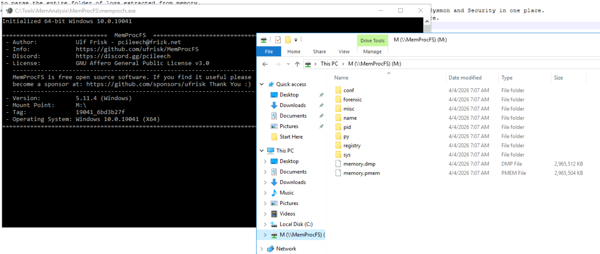
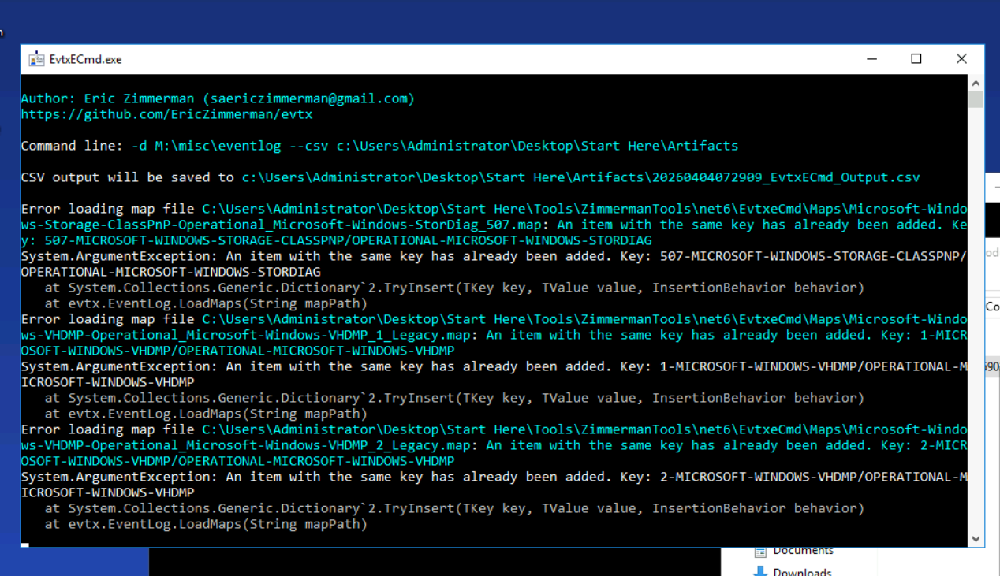
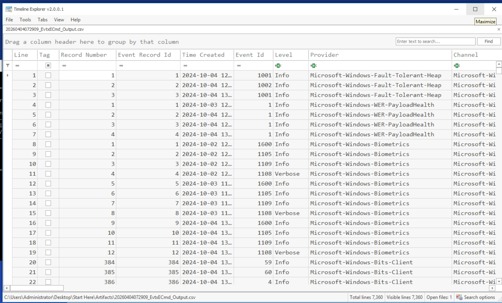
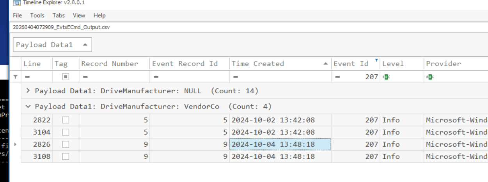
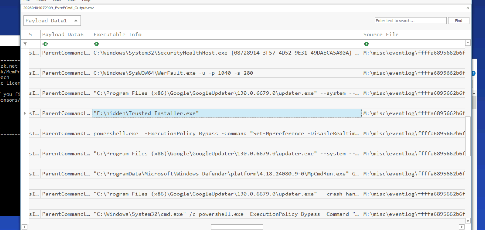
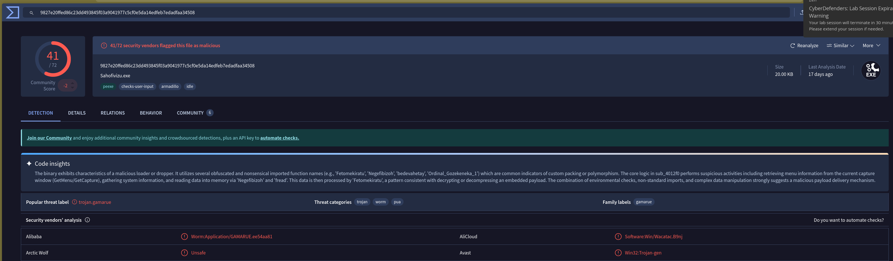
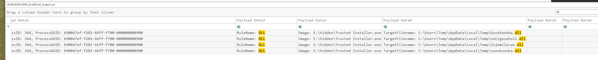

## Scenario

SecuTech's DFIR team is responding to a breach affecting multiple endpoints. Alerts suggest the infection spread via removable devices. A memory image from one of the compromised machines has been provided — the objective is to trace the infection source, identify malware propagation artefacts, and assess the full scope of the breach.

---

## Methodology

### Memory Mounting — MemProcFS

Rather than running Volatility plugins sequentially, the memory image is mounted as a live filesystem using MemProcFS, exposing registry hives, event logs, and process artefacts as browsable files:

```
memprocfs.exe -f "C:\Users\Administrator\Desktop\Start Here\Artifacts\memory.dmp"
```



This mounts the image to `M:\` — giving direct access to the registry, event logs, and process memory without plugin invocations for each artefact type.

### USB Device Identification — Registry

The USBSTOR registry key records every USB storage device that has connected to the system. Navigating to the mounted registry hive surfaces the device entry:

```
M:\registry\HKLM\SYSTEM\ControlSet001\Enum\USBSTOR\Disk&Ven_VendorCo&Prod_ProductCode&Rev_2.00\7095411056659025437&0
```

The serial number `7095411056659025437&0` uniquely identifies the removable device used as the infection vector — this is the pivot point for the entire investigation. USB serial numbers are persistent across systems, meaning this device can be tracked across any other endpoint that logged its insertion.

### Event Log Extraction — EvtxECmd

With the memory mounted, event logs are extracted from `M:\misc\eventlog` and converted to CSV for Timeline Explorer analysis:

```
EvtxECmd.exe -d M:\misc\eventlog --csv "C:\Users\Administrator\Desktop\Start Here\Artifacts"
```



### Timeline Analysis — USB Insertion Timestamp

Opening the exported CSV in Timeline Explorer and filtering for USB-related events establishes the infection timeline:





The USB device was last inserted at **2024-10-04 13:48** — this timestamp anchors the investigation. All subsequent malicious activity can be correlated forward from this point.

### Execution — Sysmon Event ID 1

Filtering logs for Sysmon process creation events (Event ID 1) reveals the executable launched from the USB device immediately after insertion:



```
E:\hidden\Trusted Installer.exe
```

The masquerading is deliberate — `TrustedInstaller.exe` is a legitimate Windows system process responsible for Windows Update operations. Placing a malicious binary with this name in a hidden directory on a USB device exploits the implicit trust users place in familiar process names. This is T1036.005 — Masquerading via Match Legitimate Name.

### Threat Intelligence — Andromeda / UNC4210 Attribution

The executable path and behaviour pattern matches published threat intelligence. Cross-referencing with the NEC Security Blog report on Andromeda:

**Reference:** [NEC Security Blog — Andromeda Analysis (2024-08-23)](https://www.nec.com/en/global/solutions/cybersecurity/blog/240823/index.html)

The C2 URL used by the bot to download its configuration file is identified as:

```
hxxp[://]anam0rph[.]su/in.php
```

The dropper filename identified in threat intelligence is `Sahofivizu.exe` — a component of the Andromeda bot framework reactivated by the threat actor UNC4210, later attributed to **Turla** (FSB-linked Russian APT) by Mandiant:

**Reference:** [Mandiant Threat Intelligence — Turla Galaxy of Opportunity](https://cloud.google.com/blog/topics/threat-intelligence/turla-galaxy-opportunity/)

### Hash Verification — VirusTotal

Log filtering surfaces the hash values for the dropped executable:

```
MD5:    7FE00CC4EA8429629AC0AC610DB51993
SHA256: 9827E20FFED86C23DD493845F03A9041977C5CF0E5DA14EDFEB7EDADFAA34508
IMPHASH: DB5FEF752F497DBF87C18EC9E09857F0
```

VirusTotal confirms the sample as Andromeda/Gamarue:



### DLL Drops — Sysmon Event ID 11

Filtering logs for Sysmon file creation events (Event ID 11) and searching for `.dll` returns four entries, all created simultaneously — consistent with a dropper unpacking its payload components in a single execution:



The first DLL dropped lands at:

```
C:\Users\Tomy\AppData\Local\Temp\Gozekeneka.dll
```

`AppData\Local\Temp` is a standard dropper staging location — writable without elevation, excluded from many AV scans by default, and cleaned on reboot making forensic recovery time-sensitive.

---


## Attack Summary


|Phase|Action|
|---|---|
|Initial Access|USB device (serial: 7095411056659025437&0) inserted 2024-10-04 13:48|
|Execution|`E:\hidden\Trusted Installer.exe` launched from USB — masqueraded as Windows system binary|
|Defence Evasion|PowerShell commands disable Windows Defender protections prior to payload execution|
|C2 Contact|Andromeda bot contacts `hxxp[://]anam0rph[.]su/in.php` to retrieve C2 configuration|
|Payload Drop|`Sahofivizu.exe` dropper stages four DLLs to `C:\Users\Tomy\AppData\Local\Temp\`|
|Persistence|Andromeda bot establishes C2 channel for Turla/UNC4210 follow-on operations|


---

## IOCs

|Type|Value|
|---|---|
|USB Serial|7095411056659025437&0|
|USB Insertion Time|2024-10-04 13:48 UTC|
|Malicious Executable|E:\hidden\Trusted Installer.exe|
|Dropper|Sahofivizu.exe|
|C2 URL|hxxp[://]anam0rph[.]su/in.php|
|MD5|7FE00CC4EA8429629AC0AC610DB51993|
|SHA256|9827E20FFED86C23DD493845F03A9041977C5CF0E5DA14EDFEB7EDADFAA34508|
|IMPHASH|DB5FEF752F497DBF87C18EC9E09857F0|
|First DLL Dropped|C:\Users\Tomy\AppData\Local\Temp\Gozekeneka.dll|
|APT Group|Turla (UNC4210)|


---

## MITRE ATT&CK

|Technique|ID|Description|
|---|---|---|
|Replication Through Removable Media|T1091|Andromeda spread via USB device containing hidden malicious executable|
|Command and Scripting Interpreter: PowerShell|T1059.001|PowerShell used to disable Windows Defender prior to payload execution|
|Impair Defenses: Disable or Modify Tools|T1562.001|Windows Defender protections disabled via PowerShell before dropper runs|
|Masquerading: Match Legitimate Name|T1036.005|Dropper named `Trusted Installer.exe` to mimic legitimate Windows process|
|Application Layer Protocol: Web Protocols|T1071.001|Andromeda bot contacts C2 via HTTP to `anam0rph.su/in.php`|
|Ingress Tool Transfer|T1105|Sahofivizu.exe dropper retrieves C2 configuration and secondary payloads|
|Process Injection|T1055|DLLs staged to Temp for injection into legitimate processes|


---

## Defender Takeaways

**USB autorun and device control are non-negotiable in enterprise environments** — the entire infection chain began with a USB insertion. Group Policy can enforce device control policies that prevent unauthorised removable media from executing content or even mounting entirely. In a financial or critical infrastructure environment, USB storage should require explicit allowlisting by device serial number — exactly the serial number we recovered from USBSTOR.

**MemProcFS dramatically accelerates memory forensics workflows** — mounting a memory image as a filesystem and accessing registry hives, event logs, and process artefacts as files eliminates the sequential plugin invocation overhead of traditional Volatility analysis. For time-sensitive IR engagements, the ability to open event logs directly in Timeline Explorer without intermediate extraction steps is a meaningful efficiency gain.

**Sysmon Event ID 11 (FileCreate) is essential for dropper detection** — without Sysmon deployed, the DLL staging to `AppData\Local\Temp` would leave no persistent log artefact. The four simultaneous DLL creation events at identical timestamps is a high-confidence dropper execution signature. Sysmon deployed with a mature configuration (SwiftOnSecurity or Olaf Hartong baseline) provides the visibility required to reconstruct this activity.

**Threat intelligence pivoting from a single IOC unlocks attribution** — the C2 URL `anam0rph.su` and dropper filename `Sahofivizu.exe` were sufficient to connect this sample to published Andromeda/Gamarue analysis and ultimately to Turla/UNC4210 via the Mandiant report. Maintaining TI feed subscriptions and practising IOC pivoting on VirusTotal and open-source reports is a core DFIR skill that converts a malware sample into a full threat actor profile.

**Masqueraded process names require context not just name matching** — `TrustedInstaller.exe` running from `E:\hidden\` is immediately suspicious, but a detection rule matching only on process name would miss it entirely since the name is legitimate. Detection rules must validate the full image path — legitimate `TrustedInstaller.exe` lives exclusively in `C:\Windows\servicing\`. Any instance of this process name running from a non-standard path should alert immediately.


---

<div class="qa-item"> <div class="qa-question-text">Tracking the serial number of the USB device is essential for identifying potentially unauthorized devices used in the incident, helping to trace their origin and narrow down your investigation. What is the serial number of the inserted USB device?</div> <div class="flag-reveal"> <input type="checkbox"> <span class="r-placeholder">Click flag to reveal</span> <span class="r-answer">7095411056659025437&0</span> <button class="copy-btn" onclick="event.stopPropagation();navigator.clipboard.writeText(this.previousElementSibling.textContent);this.textContent='copied';setTimeout(()=>this.textContent='copy',1500)">copy</button> </div> </div>

<div class="qa-item"> <div class="qa-question-text">Tracking USB device activity is essential for building an incident timeline, providing a starting point for your analysis. When was the last recorded time the USB was inserted into the system?</div> <div class="answer-reveal"> <input type="checkbox"> <span class="r-placeholder">Click to reveal answer</span> <span class="r-answer">2024-10-04 13:48</span> <button class="copy-btn" onclick="event.stopPropagation();navigator.clipboard.writeText(this.previousElementSibling.textContent);this.textContent='copied';setTimeout(()=>this.textContent='copy',1500)">copy</button> </div> </div>

<div class="qa-item"> <div class="qa-question-text">Identifying the full path of the executable provides crucial evidence for tracing the attack's origin and understanding how the malware was deployed. What is the full path of the executable that was run after the PowerShell commands disabled Windows Defender protections?</div> <div class="flag-reveal"> <input type="checkbox"> <span class="r-placeholder">Click flag to reveal</span> <span class="r-answer">E:\hidden\Trusted Installer.exe</span> <button class="copy-btn" onclick="event.stopPropagation();navigator.clipboard.writeText(this.previousElementSibling.textContent);this.textContent='copied';setTimeout(()=>this.textContent='copy',1500)">copy</button> </div> </div>

<div class="qa-item"> <div class="qa-question-text">Identifying the bot malware’s C&C infrastructure is key for detecting IOCs. According to threat intelligence reports, what URL does the bot use to download its C&C file?</div> <div class="answer-reveal"> <input type="checkbox"> <span class="r-placeholder">Click to reveal answer</span> <span class="r-answer">http://anam0rph.su/in.php</span> <button class="copy-btn" onclick="event.stopPropagation();navigator.clipboard.writeText(this.previousElementSibling.textContent);this.textContent='copied';setTimeout(()=>this.textContent='copy',1500)">copy</button> </div> </div>

<div class="qa-item"> <div class="qa-question-text">Understanding the IOCs for files dropped by malware is essential for gaining insights into the various stages of the malware and its execution flow. What is the MD5 hash of the dropped .exe file?</div> <div class="flag-reveal"> <input type="checkbox"> <span class="r-placeholder">Click flag to reveal</span> <span class="r-answer">7FE00CC4EA8429629AC0AC610DB51993</span> <button class="copy-btn" onclick="event.stopPropagation();navigator.clipboard.writeText(this.previousElementSibling.textContent);this.textContent='copied';setTimeout(()=>this.textContent='copy',1500)">copy</button> </div> </div>

<div class="qa-item"> <div class="qa-question-text">Having the full file paths allows for a more complete cleanup, ensuring that all malicious components are identified and removed from the impacted locations. What is the full path of the first DLL dropped by the malware sample?</div> <div class="answer-reveal"> <input type="checkbox"> <span class="r-placeholder">Click to reveal answer</span> <span class="r-answer">C:\Users\Tomy\AppData\Local\Temp\Gozekeneka.dll</span> <button class="copy-btn" onclick="event.stopPropagation();navigator.clipboard.writeText(this.previousElementSibling.textContent);this.textContent='copied';setTimeout(()=>this.textContent='copy',1500)">copy</button> </div> </div>

<div class="qa-item"> <div class="qa-question-text">Connecting malware to APT groups is crucial for uncovering an attack's broader strategy, motivations, and long-term goals. Based on IOCs and threat intelligence reports, which APT group reactivated this malware for use in its campaigns?</div> <div class="flag-reveal"> <input type="checkbox"> <span class="r-placeholder">Click flag to reveal</span> <span class="r-answer">Turla</span> <button class="copy-btn" onclick="event.stopPropagation();navigator.clipboard.writeText(this.previousElementSibling.textContent);this.textContent='copied';setTimeout(()=>this.textContent='copy',1500)">copy</button> </div> </div>

