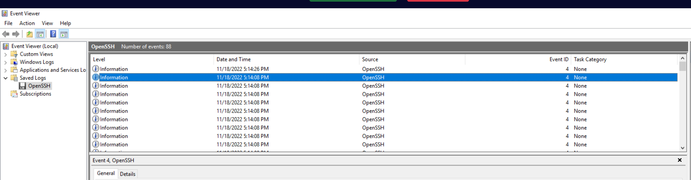
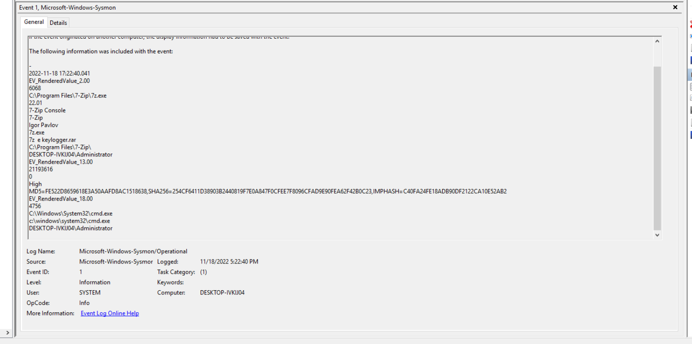
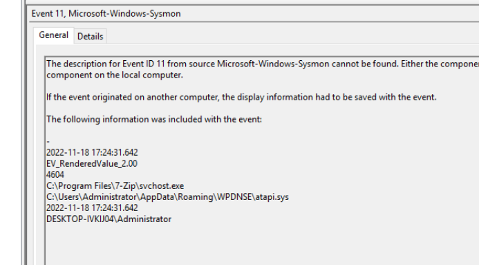
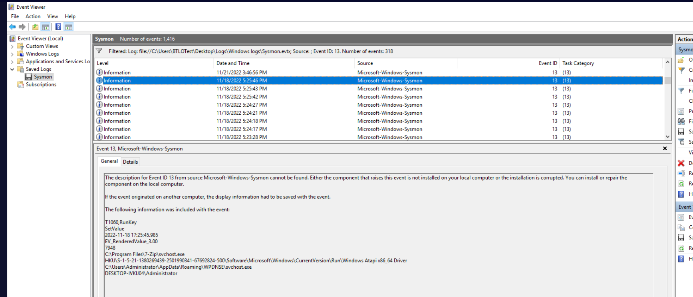
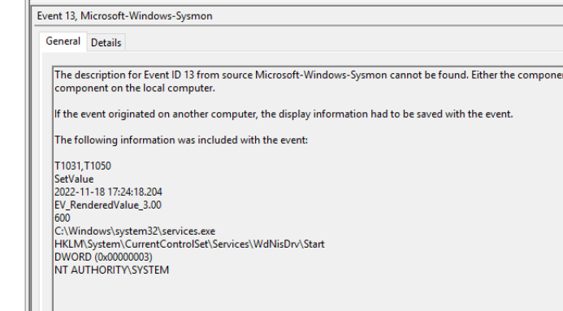

## Overview

ATTACKS is a straightforward MITRE ATT&CK mapping lab built around a compromised Windows host. The scenario provides firewall logs, Windows Event Logs, and Sysmon telemetry, and tasks you with tracing the full attack chain from initial reconnaissance through to malware persistence. It's a solid exercise in correlating events across multiple log sources while mapping each action to the ATT&CK framework.

Tools used: Windows Event Viewer, Sysmon, Firewall Logs, Netstat, GitHub OSINT.

---

## Reconnaissance

### Active Scanning

The firewall log on the Desktop is the starting point. Reviewing it reveals the source IP `192[.]168[.]1[.]33` systematically probing ports on the target — classic active scanning behaviour.

MITRE: **T1595 — Active Scanning**

To confirm what ports are exposed on the endpoint from the victim's perspective, the command `netstat -an` lists all listening ports and active connections without resolving hostnames — a quick way to see the attack surface.

Reviewing the output reveals **SSH on port 22** is open, which becomes the attacker's entry point.

---
## Initial Access & Credential Access

### Brute Force SSH

With SSH exposed, the attacker targeted the **Administrator** account with a brute force attack. Filtering the Windows Security logs reveals repeated failed logon attempts followed by a successful authentication at:

**11/18/2022 5:14:08 PM**

The credential access technique is **T1110 — Brute Force**. Once the password was obtained, the attacker authenticated using those credentials, making the initial access technique **T1078 — Valid Accounts**. The distinction matters: T1110 describes how the credentials were obtained, T1078 describes how they were used to gain entry.

---

## Persistence — Account Creation

### New Local Account

Filtering Security Event logs for **Event ID 4720** (user account created) reveals the attacker created a new local account: **sysadmin**.

MITRE: **T1136 — Create Account**

Following that, **Event ID 4732** (user added to local group) confirms the sysadmin account was added to the Administrators group at:

**11/18/2022 5:15:33 PM**

---

## Impact — Account Deletion

### Deleting User drb

Filtering for **Event ID 4726** (user account deleted) shows the attacker deleted the account **drb** — likely to remove a legitimate user and limit recovery options or cover tracks.

MITRE: **T1531 — Account Access Removal**

The relevant MITRE detection data source for account-based activity is **DS0002 — User Account**.

---

## Execution — Malware Deployment

### Keylogger Extraction

Filtering Sysmon for **Event ID 1** (Process Create) and looking for 7-Zip activity reveals the command:

`7z e keylogger.rar`

The compressed file **keylogger.rar** was extracted using 7-Zip, producing two files dropped into `C:\Users\Administrator\AppData\Roaming\WPDNSE\`:

- `rundell33.exe` — note the triple e, masquerading as the legitimate rundll33
- `svchost.exe` — masquerading as the Windows system process

Sysmon **Event ID 11** (File Created) confirms both file creation events in that path.

The keylogger maps to **T1056 — Input Capture**, specifically sub-technique **T1056.001 — Keylogging**.

### atapi.sys

Also visible in the Event ID 11 entries is the creation of **atapi.sys** — a driver file dropped by the malware, mimicking the legitimate Windows ATAPI storage driver name.

---
## Defense Evasion — Defender Tampering

### Disabling WdNisDrv

Sysmon **Event ID 13** (Registry Value Set) at **11/18/2022 5:24:18 PM** reveals a modification to:

`HKLM\System\CurrentControlSet\Services\WdNisDrv\Start`

The value was set to `DWORD 0x00000003` (Manual), effectively disabling automatic startup of the **Windows Defender Network Inspection Service** — a targeted defense evasion move to reduce detection capability.

MITRE: **T1562.001 — Impair Defenses: Disable or Modify Tools**

---
## Persistence — Registry Run Keys

### Malware Autostart Entries

Continuing through the Event ID 13 entries reveals two registry values written to the `CurrentVersion\Run` key, establishing persistence across reboots. In order of creation:

1. **Windows SCR Manager** — pointing to `rundell33.exe` in WPDNSE
2. **Windows Atapi x86_64 Driver** — pointing to `svchost.exe` in WPDNSE

Both use legitimate-sounding names to blend in during casual registry inspection.

MITRE: **T1547.001 — Boot or Logon Autostart Execution: Registry Run Keys / Startup Folder**

---
## Malware Attribution

Searching GitHub for the keylogger's characteristics leads to the repository:

`hxxps[://]github[.]com/ajayrandhawa/Keylogger`

The malware author's GitHub username is **ajayrandhawa**.

---

## IOCs

|Type|Value|
|---|---|
|Attacker IP|`192[.]168[.]1[.]33`|
|Malicious Archive|`keylogger.rar`|
|Dropped Executable|`rundell33.exe`|
|Dropped Executable|`svchost.exe` (fake)|
|Dropped Driver|`atapi.sys`|
|Drop Path|`C:\Users\Administrator\AppData\Roaming\WPDNSE\`|
|C2 / Attribution|`hxxps[://]github[.]com/ajayrandhawa/Keylogger`|

---

## MITRE ATT&CK

|Technique|ID|Tactic|
|---|---|---|
|Active Scanning|T1595|Reconnaissance|
|Brute Force|T1110|Credential Access|
|Valid Accounts|T1078|Initial Access|
|Create Account|T1136|Persistence|
|Account Access Removal|T1531|Impact|
|Input Capture: Keylogging|T1056.001|Collection|
|Masquerading|T1036|Defense Evasion|
|Impair Defenses: Disable or Modify Tools|T1562.001|Defense Evasion|
|Boot or Logon Autostart Execution: Registry Run Keys|T1547.001|Persistence|

---
















































