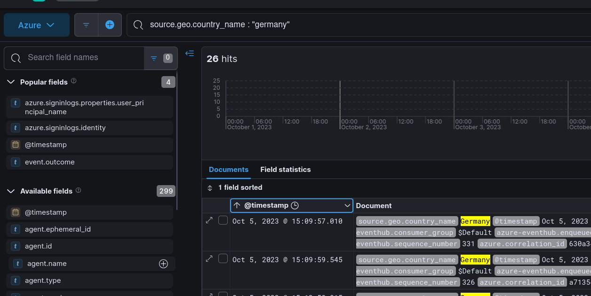
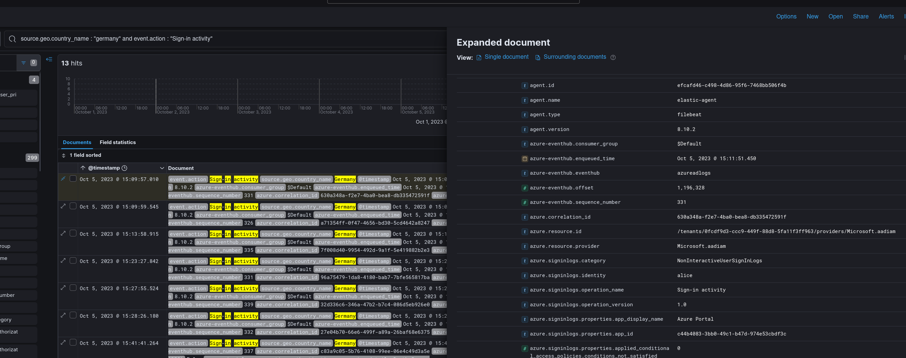
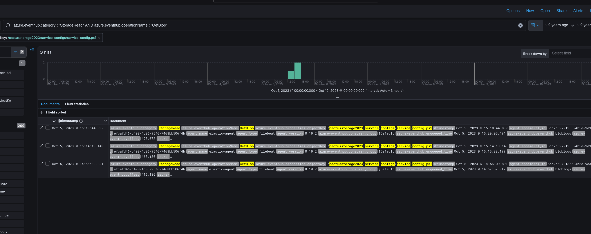
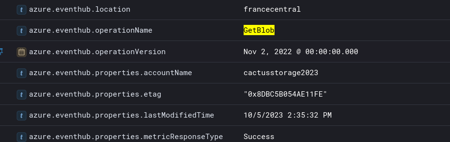
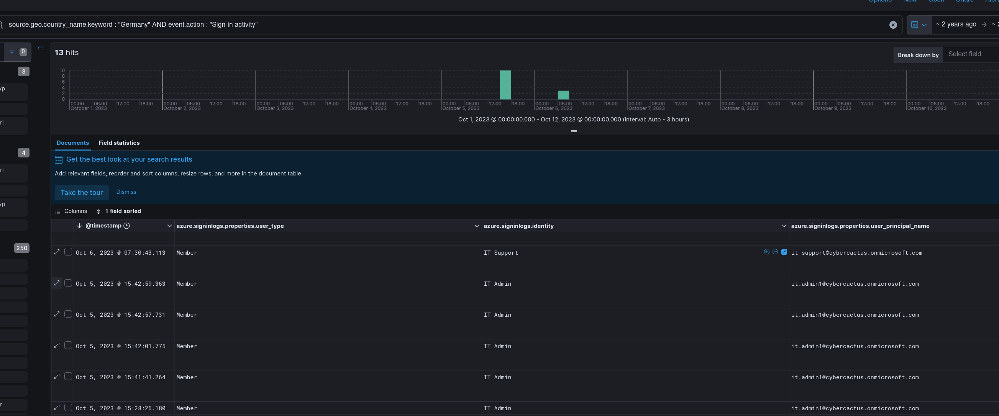
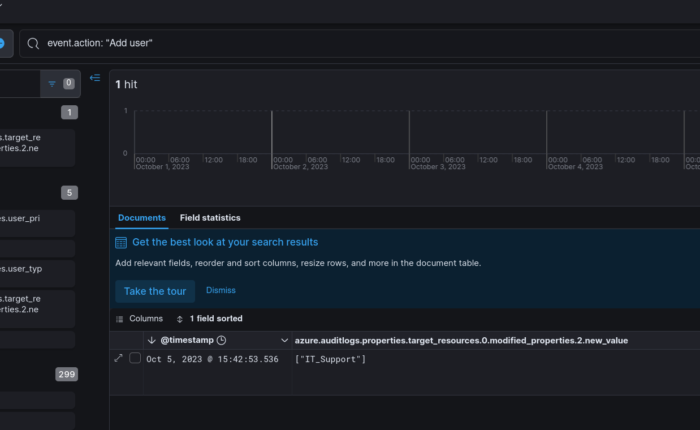

## Scenario

A finance company's Azure environment has flagged multiple failed login attempts from an unfamiliar geographic location, followed by a successful authentication. Shortly after, logs indicate access to sensitive Blob Storage files and a virtual machine start action. Investigate authentication logs, storage access patterns, and VM activity to determine the scope of the compromise.

---

## Methodology

### Origin — Geographic Anomaly

The investigation opens in Kibana against ingested Azure EventHub logs. Pivoting on `source.geo.country_name.keyword` immediately surfaces **Germany** as an outlier for a US-based organisation — all other authentication traffic originates domestically.


Sorting by `@timestamp` ascending narrows the first recorded event from Germany to **2023-10-05 15:09** — the start of the attacker's footprint in the environment.


### Initial Access — Credential Access (alice)

Filtering sign-in activity originating from Germany isolates the compromised entry point:

```kql
source.geo.country_name : "Germany" and event.action : "Sign-in activity"
```


The account **alice** recorded a successful authentication following the initial Germany-origin attempts. The pattern is consistent with password spraying or credential stuffing against a known account — failed attempts absorbed by the cloud identity layer before a valid credential lands.

### Discovery — Blob Storage Enumeration

With a foothold established, the attacker moved to enumerate accessible storage. Filtering on `StorageRead` category and `GetBlob` operation name surfaces the accessed object:

```kql
azure.eventhub.category: "StorageRead" and azure.eventhub.operationName: "GetBlob"
```

Show Image

The attacker retrieved **service-config.ps1** from the storage account **cactusstorage2023**. A PowerShell configuration script sitting in blob storage is a high-value target — these routinely contain service credentials, connection strings, or infrastructure layout details that enable lateral movement.


### Lateral Movement — Pivot to it.admin1

The credentials or context harvested from `service-config.ps1` appear to have directly enabled lateral movement. Re-filtering sign-in activity from Germany surfaces a second compromised account:

```kql
source.geo.country_name.keyword : "Germany" AND event.action : "Sign-in activity"
```


The UPN **it.admin1@cybercactus[.]onmicrosoft[.]com** authenticated successfully from Germany — a privileged IT administrator account, almost certainly referenced or implicitly accessible via the config script retrieved in the previous step.

### Execution — VM Start

Operating under the elevated `it.admin1` identity, the attacker started a dormant virtual machine:

```kql
event.action.keyword: "MICROSOFT.COMPUTE/VIRTUALMACHINES/START/ACTION"
```

```text
azure.resource.name:     DEV01VM
azure.resource.provider: MICROSOFT.COMPUTE/VIRTUALMACHINES
```

Starting **DEV01VM** suggests the attacker intended to use it as a staging node, pivot point, or additional compute resource — a common pattern when an attacker wants a persistent interactive foothold beyond the identity plane.

### Exfiltration — Database Export

The attacker triggered a SQL database export action:

```kql
event.action: "MICROSOFT.SQL/SERVERS/DATABASES/EXPORT/ACTION"
```

The scope field confirms the target:

```text
/subscriptions/42439ab4-76df-453b-a380-2f7a4580f01f/resourceGroups/Rss1/
  providers/Microsoft.Sql/servers/cactusdbserver/databases/CustomerDataDB
```

**CustomerDataDB** — the name alone signals the data classification. Azure SQL export writes a BACPAC file to storage, making the entire database portable and exfiltrable outside the subscription boundary without triggering traditional DLP controls.

### Persistence — Backdoor Account and RBAC Escalation

The final phase established durable access independent of the two compromised user accounts. The attacker created a new Azure AD user:

```kql
event.action: "Add user"
```


The account display name **IT Support** is deliberate — it blends into a legitimate IT department context, reducing the likelihood of manual review flagging it. Following account creation, an RBAC role assignment was issued:

```kql
event.action: "MICROSOFT.AUTHORIZATION/ROLEASSIGNMENTS/WRITE"
```

The assigned role was **Owner** — the highest privilege level in Azure RBAC, granting full control over all resources in scope. The first recorded successful login for this backdoor account was **2023-10-06 07:30**, the morning after initial compromise.

---

## Attack Summary

|Phase|Action|
|---|---|
|Reconnaissance|Failed authentication attempts from Germany against Azure AD|
|Initial Access|alice account compromised; successful sign-in 2023-10-05 15:09|
|Discovery|GetBlob on service-config.ps1 from cactusstorage2023|
|Lateral Movement|[it.admin1@cybercactus.onmicrosoft.com](mailto:it.admin1@cybercactus.onmicrosoft.com) authenticated from Germany|
|Execution|DEV01VM started via MICROSOFT.COMPUTE/VIRTUALMACHINES/START/ACTION|
|Exfiltration|CustomerDataDB exported via SQL EXPORT/ACTION|
|Persistence|"IT Support" account created; Owner RBAC role assigned|

---

## IOCs

|Type|Value|
|---|---|
|Country (Origin)|Germany|
|Compromised Account|alice|
|Compromised Account (UPN)|it[.]admin1@cybercactus[.]onmicrosoft[.]com|
|Storage Account|cactusstorage2023|
|File Accessed|service-config.ps1|
|VM|DEV01VM|
|SQL Server|cactusdbserver|
|Database Exfiltrated|CustomerDataDB|
|Backdoor Account|IT Support|
|Subscription ID|42439ab4-76df-453b-a380-2f7a4580f01f|
|First Activity Timestamp|2023-10-05 15:09|
|Backdoor First Login|2023-10-06 07:30|

---

## MITRE ATT&CK

|Technique|ID|Description|
|---|---|---|
|Valid Accounts: Cloud Accounts|T1078.004|alice and it.admin1 authenticated from attacker-controlled session|
|Data from Cloud Storage|T1530|service-config.ps1 retrieved from cactusstorage2023 blob container|
|Transfer Data to Cloud Account|T1537|CustomerDataDB exported via Azure SQL BACPAC export action|
|Create Account: Cloud Account|T1136.003|"IT Support" Azure AD account created for persistence|
|Account Manipulation: Additional Cloud Roles|T1098.003|Owner RBAC role assigned to backdoor account|

---

## Defender Takeaways

**Conditional Access policies on geographic anomalies** — Authentication from a country with no prior login history for that account should trigger MFA step-up or block outright. Azure AD Conditional Access supports named locations and risk-based policies that would have interrupted the initial alice compromise before it landed.

**Blob Storage access logging and sensitivity classification** — `service-config.ps1` sitting in a storage account with credentials or infrastructure references is a misconfiguration, not just a detection gap. Secrets belong in Azure Key Vault with managed identity access. Storage diagnostic logs feeding a SIEM allow GetBlob events on sensitive containers to alert in near-real-time.

**RBAC Owner assignment as a high-fidelity alert** — `ROLEASSIGNMENTS/WRITE` assigning the Owner role to any account should be a P1 alert with immediate human review. This event is low-volume, high-signal, and essentially never legitimate outside a formal change window. Alerting on this single event would have surfaced the persistence mechanism within minutes of creation.

**SQL Export action monitoring** — Azure SQL `EXPORT/ACTION` in the activity log is an explicit, auditable event that produces a BACPAC containing the entire database schema and data. An alert on this action scoped to production database servers gives the SOC an opportunity to intercept exfiltration before the file leaves the subscription.

**Azure AD audit log retention and UEBA baselining** — The attacker created a plausible-looking account ("IT Support") and granted it Owner rights the day after initial compromise. UEBA baselining new account creations against expected IT provisioning workflows — combined with alerting on any new account assigned a privileged role within 24 hours of creation — is a reliable control against this persistence class.


---

<div class="qa-item"> <div class="qa-question-text">As a US-based company, the security team has observed significant suspicious activity from an unusual country. What is the name of the country from which the attack originated?</div> <div class="flag-reveal"> <input type="checkbox"> <span class="r-placeholder">Click flag to reveal</span> <span class="r-answer">Germany</span> <button class="copy-btn" onclick="event.stopPropagation();navigator.clipboard.writeText(this.previousElementSibling.textContent);this.textContent='copied';setTimeout(()=>this.textContent='copy',1500)">copy</button> </div> </div>

<div class="qa-item"> <div class="qa-question-text">To establish an accurate incident timeline, what is the timestamp of the initial activity originating from the country?</div> <div class="answer-reveal"> <input type="checkbox"> <span class="r-placeholder">Click to reveal answer</span> <span class="r-answer">2023-10-05 15:09</span> <button class="copy-btn" onclick="event.stopPropagation();navigator.clipboard.writeText(this.previousElementSibling.textContent);this.textContent='copied';setTimeout(()=>this.textContent='copy',1500)">copy</button> </div> </div>

<div class="qa-item"> <div class="qa-question-text">To assess the scope of compromise, we must determine the attacker's entry point. What is the display name of the compromised user account?</div> <div class="flag-reveal"> <input type="checkbox"> <span class="r-placeholder">Click flag to reveal</span> <span class="r-answer">alice</span> <button class="copy-btn" onclick="event.stopPropagation();navigator.clipboard.writeText(this.previousElementSibling.textContent);this.textContent='copied';setTimeout(()=>this.textContent='copy',1500)">copy</button> </div> </div>

<div class="qa-item"> <div class="qa-question-text">To gain insights into the attacker's tactics and enumeration strategy, what is the name of the script file the attacker accessed within blob storage?</div> <div class="answer-reveal"> <input type="checkbox"> <span class="r-placeholder">Click to reveal answer</span> <span class="r-answer">service-config.ps1</span> <button class="copy-btn" onclick="event.stopPropagation();navigator.clipboard.writeText(this.previousElementSibling.textContent);this.textContent='copied';setTimeout(()=>this.textContent='copy',1500)">copy</button> </div> </div>

<div class="qa-item"> <div class="qa-question-text">For a detailed analysis of the attacker's actions, what is the name of the storage account housing the script file?</div> <div class="flag-reveal"> <input type="checkbox"> <span class="r-placeholder">Click flag to reveal</span> <span class="r-answer">cactusstorage2023</span> <button class="copy-btn" onclick="event.stopPropagation();navigator.clipboard.writeText(this.previousElementSibling.textContent);this.textContent='copied';setTimeout(()=>this.textContent='copy',1500)">copy</button> </div> </div>

<div class="qa-item"> <div class="qa-question-text">Tracing the attacker's movements across our infrastructure, what is the User Principal Name (UPN) of the second user account the attacker compromised?</div> <div class="answer-reveal"> <input type="checkbox"> <span class="r-placeholder">Click to reveal answer</span> <span class="r-answer">it.admin1@cybercactus.onmicrosoft.com</span> <button class="copy-btn" onclick="event.stopPropagation();navigator.clipboard.writeText(this.previousElementSibling.textContent);this.textContent='copied';setTimeout(()=>this.textContent='copy',1500)">copy</button> </div> </div>

<div class="qa-item"> <div class="qa-question-text">Analyzing the attacker's impact on our environment, what is the name of the Virtual Machine (VM) the attacker started?</div> <div class="flag-reveal"> <input type="checkbox"> <span class="r-placeholder">Click flag to reveal</span> <span class="r-answer">Dev01VM</span> <button class="copy-btn" onclick="event.stopPropagation();navigator.clipboard.writeText(this.previousElementSibling.textContent);this.textContent='copied';setTimeout(()=>this.textContent='copy',1500)">copy</button> </div> </div>

<div class="qa-item"> <div class="qa-question-text">To assess the potential data exposure, what is the name of the database exported?</div> <div class="answer-reveal"> <input type="checkbox"> <span class="r-placeholder">Click to reveal answer</span> <span class="r-answer">CustomerDataDB</span> <button class="copy-btn" onclick="event.stopPropagation();navigator.clipboard.writeText(this.previousElementSibling.textContent);this.textContent='copied';setTimeout(()=>this.textContent='copy',1500)">copy</button> </div> </div>

<div class="qa-item"> <div class="qa-question-text">In your pursuit of uncovering persistence techniques, what is the display name associated with the user account you have discovered?</div> <div class="flag-reveal"> <input type="checkbox"> <span class="r-placeholder">Click flag to reveal</span> <span class="r-answer">IT Support</span> <button class="copy-btn" onclick="event.stopPropagation();navigator.clipboard.writeText(this.previousElementSibling.textContent);this.textContent='copied';setTimeout(()=>this.textContent='copy',1500)">copy</button> </div> </div>

<div class="qa-item"> <div class="qa-question-text">The attacker utilized a compromised account to assign a new role. What role was granted?</div> <div class="answer-reveal"> <input type="checkbox"> <span class="r-placeholder">Click to reveal answer</span> <span class="r-answer">Owner</span> <button class="copy-btn" onclick="event.stopPropagation();navigator.clipboard.writeText(this.previousElementSibling.textContent);this.textContent='copied';setTimeout(()=>this.textContent='copy',1500)">copy</button> </div> </div>

<div class="qa-item"> <div class="qa-question-text">For a comprehensive timeline and understanding of the breach progression, What is the timestamp of the first successful login recorded for this user account?</div> <div class="flag-reveal"> <input type="checkbox"> <span class="r-placeholder">Click flag to reveal</span> <span class="r-answer">2023-10-06 07:30</span> <button class="copy-btn" onclick="event.stopPropagation();navigator.clipboard.writeText(this.previousElementSibling.textContent);this.textContent='copied';setTimeout(()=>this.textContent='copy',1500)">copy</button> </div> </div>

