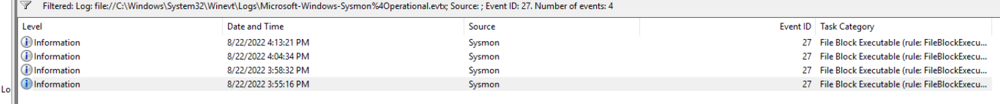
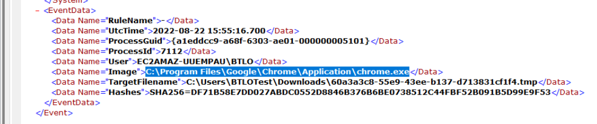

## Overview

Sysmon 14 introduced `FileBlockExecutable` — a proactive defense capability that prevents executable files from being written to disk based on configurable rules. This lab explores the feature through real blocked events, hash-based threat intelligence enrichment, and writing detection rules to block executables dropped by weaponized Office macros.

---

## Event Viewer — FileBlockExecutable Events

Opening Event Viewer as administrator and navigating to:

`Microsoft → Windows → Sysmon → Operational`

Filtering on **Event ID 27** (FileBlockExecutable) surfaces all blocked executable write attempts. The first blocked event occurred at:

**`8-22-2022 3:55:16 PM`**


---

## First Block Event Analysis

Examining the first Event ID 27 reveals the process that initiated the blocked download:

**`c:\program files\google\chrome\application\chrome.exe`**

Chrome attempting to write an executable to a monitored location — consistent with a drive-by download or user-initiated malware download from the browser.


---

## Hash Enrichment — URLHaus

The SHA256 hash from the first block event is submitted to URLHaus for threat intelligence enrichment. The tags on the URLHaus entry identify the malware family as:

**`a310logger`**

A keylogger/infostealer — exactly the kind of payload that FileBlockExecutable was designed to stop before it ever touches disk.

---

## Sysmon Configuration — Writing Prevention Rules

### Blocking Office Macro Drops

The reference article by Olaf Hartong demonstrates how to configure FileBlockExecutable rules. To prevent Microsoft Word from dropping executables (a common weaponized macro technique), the relevant config line without the `name` property is:

```xml
<Image condition="image">winword.exe</Image>
```

This sits inside a `<FileBlockExecutable onmatch="include">` block and prevents any executable write operations initiated by `winword.exe`.

### Blocking Temp Directory Writes

The `block-downloads-config.xml` in `/Downloads/Sysmon/` uses a `TargetFilename` rule to block executables in the Downloads folder. Adapting this rule to target the OS-level Temp directory:

```xml
<TargetFilename condition="contains all">C:\windows;temp\</TargetFilename>
```

The `contains all` condition with a semicolon-separated list means the path must contain both `C:\windows` AND `temp\` — precise enough to avoid false positives while catching temp directory drops.

---

## Second Block Event — freebl3.dll

Searching Event ID 27 logs for the hash ending in `B4A2` reveals the blocked file:

**`freeb13.dll`**

Submitting this hash to VirusTotal and checking the **Community** tab surfaces the source URL where the DLL was being pulled from:

**`hxxp://safe-car[.]ru/lib/freebl3[.]dll`**

---

## FileBlockExecutable — Scope and Limitations

### Supported File Types

FileBlockExecutable doesn't only block `.exe` files — it also covers:

**`DLL, XLL, WLL`**

XLL and WLL are Excel and Word add-in formats respectively, both commonly abused for macro-based payload delivery.

### Current Limitation — OriginalFileName

A key limitation noted in the Olaf Hartong article (as of August 2022): files downloaded via browser show the `TargetFilename` as a randomly generated Windows temp filename rather than the actual filename. The property hoped to address this in future Sysmon versions is:

**`OriginalFileName`**

This would give defenders much better visibility over what was actually blocked, rather than a random temp path.

---

<div class="qa-item"> <div class="qa-question-text">In Sysmon 14, we can now use Sysmon configuration files to take preventative actions using the new feature, FileBlockExecutable. This allows us to prevent files from being written to specific locations! Open Event Viewer as an administrator (select the BTLO user if you receive a popup), and navigate to Microsoft > Windows > Sysmon > Operational. Filter on Event ID 27 to only see File Block Executable events. What is the timestamp of the first observed 27 event?</div> <div class="flag-reveal"> <input type="checkbox"> <span class="r-placeholder">Click flag to reveal</span> <span class="r-answer">8-22-2022 3:55:16 pm</span> <button class="copy-btn" onclick="event.stopPropagation();navigator.clipboard.writeText(this.previousElementSibling.textContent);this.textContent='copied';setTimeout(()=>this.textContent='copy',1500)">copy</button> </div> </div>

<div class="qa-item"> <div class="qa-question-text">In the first 27 event, what is the Image that initiated the file download?</div> <div class="answer-reveal"> <input type="checkbox"> <span class="r-placeholder">Click to reveal answer</span> <span class="r-answer">c:\program files\google\chrome\application\chrome.exe</span> <button class="copy-btn" onclick="event.stopPropagation();navigator.clipboard.writeText(this.previousElementSibling.textContent);this.textContent='copied';setTimeout(()=>this.textContent='copy',1500)">copy</button> </div> </div>

<div class="qa-item"> <div class="qa-question-text">In the first 27 event, retrieve the SHA256 hash of the file that was blocked and search for it on URLHaus. Based on the tags, what is the name of this malware?</div> <div class="flag-reveal"> <input type="checkbox"> <span class="r-placeholder">Click flag to reveal</span> <span class="r-answer">a310logger</span> <button class="copy-btn" onclick="event.stopPropagation();navigator.clipboard.writeText(this.previousElementSibling.textContent);this.textContent='copied';setTimeout(()=>this.textContent='copy',1500)">copy</button> </div> </div>

<div class="qa-item"> <div class="qa-question-text">If we wanted to create a new Sysmon configuration file that would prevent Microsoft Word from creating executable files (dropped from weaponized macros), what line would we use? (You do not need to include a Image 'name' property)</div> <div class="answer-reveal"> <input type="checkbox"> <span class="r-placeholder">Click to reveal answer</span> <span class="r-answer">&lt;Image condition="image"&gt;winword.exe&lt;/Image&gt;</span> <button class="copy-btn" onclick="event.stopPropagation();navigator.clipboard.writeText(this.previousElementSibling.textContent);this.textContent='copied';setTimeout(()=>this.textContent='copy',1500)">copy</button> </div> </div>

<div class="qa-item"> <div class="qa-question-text">View the block-downloads-config.xml in the /Downloads/Sysmon/ folder. Review the logic to block all executables within the Downloads folder. What would be the re-written line to block files being written to the OS-level Temp directory?</div> <div class="flag-reveal"> <input type="checkbox"> <span class="r-placeholder">Click flag to reveal</span> <span class="r-answer">&lt;TargetFilename condition="contains all"&gt;C:\windows;temp\&lt;/TargetFilename&gt;</span> <button class="copy-btn" onclick="event.stopPropagation();navigator.clipboard.writeText(this.previousElementSibling.textContent);this.textContent='copied';setTimeout(()=>this.textContent='copy',1500)">copy</button> </div> </div>

<div class="qa-item"> <div class="qa-question-text">Find the 27 event with the hash ending in B4A2. What is the TargetFilename (filename only, not path)</div> <div class="answer-reveal"> <input type="checkbox"> <span class="r-placeholder">Click to reveal answer</span> <span class="r-answer">freeb13.dll</span> <button class="copy-btn" onclick="event.stopPropagation();navigator.clipboard.writeText(this.previousElementSibling.textContent);this.textContent='copied';setTimeout(()=>this.textContent='copy',1500)">copy</button> </div> </div>

<div class="qa-item"> <div class="qa-question-text">Search the hash on VirusTotal and look at the Community tab. What is the source URL?</div> <div class="flag-reveal"> <input type="checkbox"> <span class="r-placeholder">Click flag to reveal</span> <span class="r-answer">http://safe-car.ru/lib/freebl3.dll</span> <button class="copy-btn" onclick="event.stopPropagation();navigator.clipboard.writeText(this.previousElementSibling.textContent);this.textContent='copied';setTimeout(()=>this.textContent='copy',1500)">copy</button> </div> </div>

<div class="qa-item"> <div class="qa-question-text">One limitation of Sysmon 14's new blocking feature (as of 22/08/2022) is that files downloaded from a browser show the TargetFilename as the temporary file name, randomly generated by Windows. What is the name of the property that we hope to see in the near future, giving us better visibility over the file that was actually blocked?</div> <div class="answer-reveal"> <input type="checkbox"> <span class="r-placeholder">Click to reveal answer</span> <span class="r-answer">OriginalFileName</span> <button class="copy-btn" onclick="event.stopPropagation();navigator.clipboard.writeText(this.previousElementSibling.textContent);this.textContent='copied';setTimeout(()=>this.textContent='copy',1500)">copy</button> </div> </div>

<div class="qa-item"> <div class="qa-question-text">File Block Executable doesn't just work on .exe files - what are the other filetypes that are affected by this functionality?</div> <div class="flag-reveal"> <input type="checkbox"> <span class="r-placeholder">Click flag to reveal</span> <span class="r-answer">DLL, XLL, WLL</span> <button class="copy-btn" onclick="event.stopPropagation();navigator.clipboard.writeText(this.previousElementSibling.textContent);this.textContent='copied';setTimeout(()=>this.textContent='copy',1500)">copy</button> </div> </div>
