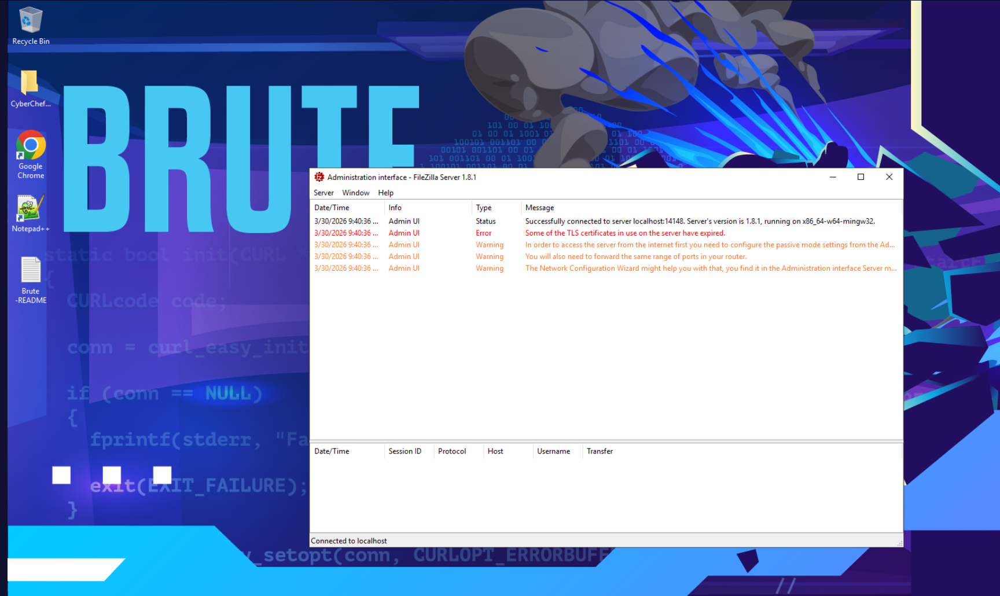
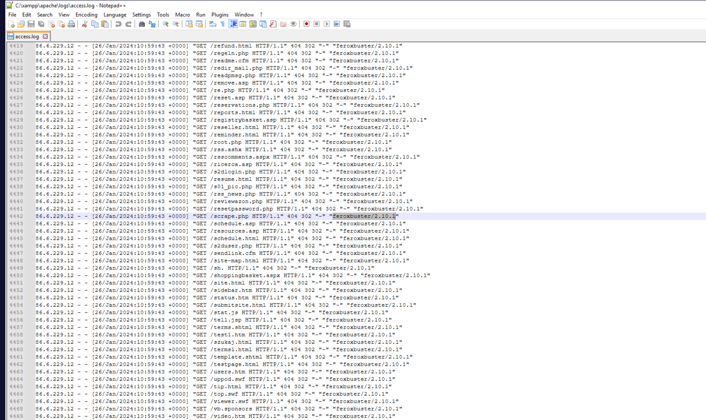
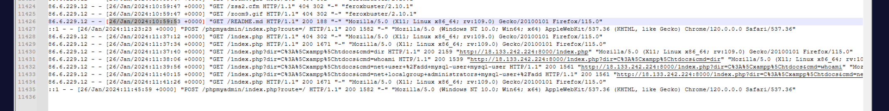
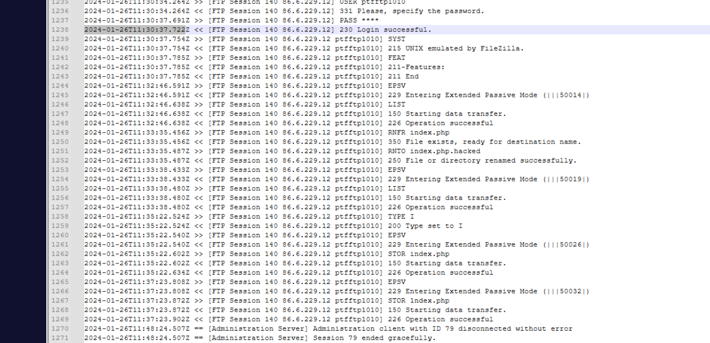
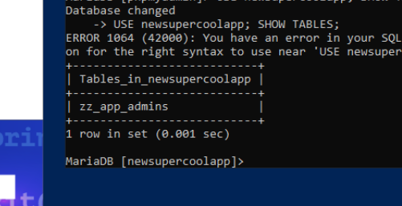
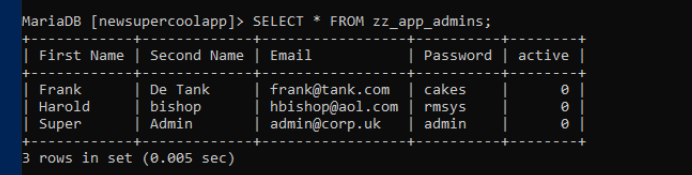
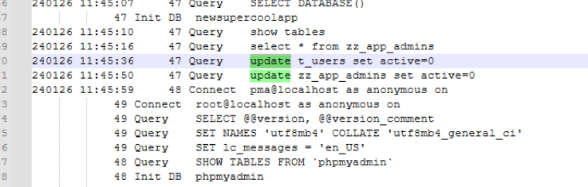

## Scenario

A server hosting a soon-to-be website is behaving oddly — redirecting visitors away from the site — and a suspicious database-related account has been discovered and disabled. The server runs FileZilla FTP, XAMPP (Apache + MariaDB), and has Notepad++ available for log analysis. The investigation spans Apache access logs, FileZilla session logs, the filesystem, and the MariaDB query log.

---

## Methodology

### Stage 1 — FileZilla Server Triage

Opening the FileZilla Server administration interface confirms the server is active and accessible:


The interface shows no current active sessions — but the session log columns (Session ID, Protocol, Host, Username, Transfer) provide the structure needed to identify the brute force event once the logs are examined.

### Stage 2 — Apache Access Log: Scanner Identification

Opening `C:\xampp\apache\logs\access.log` in Notepad++ and scrolling to the investigation timeframe reveals a large volume of 404 responses from a single IP — the signature of automated directory enumeration:



The user agent string on these requests identifies the tool immediately — `feroxbuster/2.10.1`. Feroxbuster is a fast, recursive content discovery tool written in Rust, commonly used for web directory brute forcing. The volume of requests across a short time window with sequential path probing confirms automated scanning rather than manual browsing.

### Stage 3 — Credential Exposure via README.md

After the feroxbuster scan completes, a distinct request appears in the log — made with a Firefox user agent (human browsing) rather than the scanner UA, indicating the attacker pivoted to manual investigation after the scan:



```
86.6.229.12 - - [26/Jan/2024:10:59:53 +0000] "GET /README.md HTTP/1.1" 200 188 "-" "Mozilla/5.0..."
```

The attacker retrieved `README.md` at `26/Jan/2024:10:59:53` — a file that should never have been publicly accessible. Examining the file reveals it contains FTP credentials including the username `ptfftp1010`. Leaving configuration documentation, README files, or credential files in the web root is a critical misconfiguration — feroxbuster surfaced it in seconds.

### Stage 4 — FTP Brute Force and Successful Login

Armed with the username, the attacker brute forced the FTP password against the FileZilla server. The FileZilla session log records the successful authentication:



The attacker authenticated as `ptfftp1010` at `2024-01-26T11:30:37` — Session ID **140**. The session log shows multiple failed attempts preceding this entry, confirming the brute force pattern consistent with T1110.003 (Password Spraying / Brute Force).

### Stage 5 — Web Shell Deployment and Website Defacement

With FTP access to the web root, the attacker uploaded a web shell and used it to execute commands directly on the server. The Apache access log records the web shell activity:

```
GET /index.php?dir=C%3A%5Cxampp%5Chtdocs&cmd=dir
GET /index.php?dir=C%3A%5Cxampp%5Chtdocs&cmd=whoami
GET /index.php?dir=C%3A%5Cxampp%5Chtdocs&cmd=net+user+%2Fadd+mysql-user+mysql-user
GET /index.php?dir=C%3A%5Cxampp%5Chtdocs&cmd=net+localgroup+administrators+mysql-user+%2Fadd
```

URL-decoded, the backdoor creation commands at `26/Jan/2024:11:39:56` are:

```
net user /add mysql-user mysql-user
net localgroup administrators mysql-user /add
```

A local account named `mysql-user` was created with its own name as password — chosen to appear as a legitimate database service account. It was immediately added to the local Administrators group, providing persistent privileged access independent of the FTP credentials.

The attacker also modified the website to redirect all visitors. Examining the defaced index file reveals an injected script:

```html
<script>window.location.href = "https://amzn.eu/d/4f1Lyod";</script>
```

The redirect destination is an Amazon listing for the book "We Are Anonymous" — a hacktivism reference and the attacker's calling card. The ISBN-13 of the book is **978-0434022083**.

### Stage 6 — Backdoor Account Profile Timestamp

The `mysql-user` Windows profile creation time confirms when the account became active on the system:

```
Get-LocalUser mysql-user | Select-Object *
# or via user profile directory timestamp
```

Profile CreationTime: `1/26/2024 11:40:15 AM` — approximately 19 seconds after the web shell command at 11:39:56, consistent with Windows creating the user profile on first logon or account creation.

### Stage 7 — Database Investigation

Connecting to MariaDB directly:

```sql
C:\xampp\mysql\bin\mysql.exe -u root -p
```


```sql
SHOW DATABASES;
USE supercoolapp;
SHOW TABLES;
```



The application database `supercoolapp` contains the admin table `zz_app_admins`. Querying the table:

```sql
SELECT * FROM zz_app_admins;
```



The table contains all application admin accounts including Harold Bishop — email `hbishop@aol.com`.

### Stage 8 — Attacker's Database Query

Examining the MariaDB general query log surfaces the attacker's database activity:




```sql
240126 11:45:50   47 Query   update zz_app_admins set active=0
```

The attacker ran `update zz_app_admins set active=0` — deactivating every admin account in the application database simultaneously. This locks out all legitimate administrators from the web application, compounding the damage beyond the defacement alone.

---

## Attack Summary

|Phase|Action|
|---|---|
|Reconnaissance|feroxbuster/2.10.1 scans web server — surfaces README.md containing FTP credentials|
|Credential Theft|Attacker manually retrieves README.md at 26/Jan/2024:10:59:53 — obtains ptfftp1010|
|Brute Force|FTP password brute forced — successful login at 2024-01-26T11:30:37 Session 140|
|Initial Access|FTP access to web root gained as ptfftp1010|
|Web Shell|index.php web shell uploaded via FTP — cmd parameter enables RCE|
|Defacement|index.php modified to redirect to Amazon "We Are Anonymous" listing|
|Persistence|net user /add mysql-user mysql-user + net localgroup administrators|
|Account Created|mysql-user profile created 1/26/2024 11:40:15 AM|
|Database Access|MariaDB supercoolapp database accessed|
|Impact|UPDATE zz_app_admins SET active=0 — all application admins deactivated|

---

## IOCs

|Type|Value|
|---|---|
|IP (Attacker)|86[.]6[.]229[.]12|
|Tool (Scanner)|feroxbuster/2.10.1|
|File (Exposed)|/README.md|
|FTP Username|ptfftp1010|
|FTP Login Time|2024-01-26T11:30:37|
|FTP Session ID|140|
|Backdoor Account|mysql-user|
|Account Created|1/26/2024 11:40:15 AM|
|Defacement URL|hxxps[://]amzn[.]eu/d/4f1Lyod|
|ISBN-13|978-0434022083|
|Database|supercoolapp|
|Table|zz_app_admins|
|SQL (Attacker)|update zz_app_admins set active=0|

---

## MITRE ATT&CK

|Technique|ID|Description|
|---|---|---|
|Active Scanning: Wordlist Scanning|T1595.003|feroxbuster/2.10.1 enumerates web directories surfacing README.md|
|Brute Force: Password Brute Forcing|T1110.003|FTP password brute forced against ptfftp1010 account|
|Create Local Account|T1136.001|mysql-user backdoor account created via web shell net user command|
|Remote Services: FTP|T1021.001|FTP used to upload web shell to XAMPP web root|
|Server Software Component: Web Shell|T1505.003|index.php web shell enables RCE via cmd GET parameter|
|Data Manipulation|T1565.001|zz_app_admins set active=0 deactivates all application administrators|

---

## Defender Takeaways

**README files and documentation must never live in the web root** — `README.md` containing FTP credentials was the single point of failure that enabled the entire attack chain. A feroxbuster scan found it in seconds. Any file not required for application functionality — documentation, configuration samples, credential files, backups — must be excluded from web-accessible directories. A `.htaccess` rule or web server configuration denying access to `.md`, `.txt`, `.cfg`, and similar extensions provides a safety net.

**FTP credentials in plaintext files is a critical misconfiguration** — even if README.md had been moved out of the web root, storing plaintext credentials in a file is poor practice. FTP accounts should use key-based authentication where possible, or passwords should be stored in a secrets manager rather than documentation files.

**Rate limiting on FTP prevents brute force** — FileZilla Server supports login attempt rate limiting and IP-based blocking. Configuring a lockout after 5-10 failed attempts would have prevented the brute force regardless of whether the username was known. The FTP service should also not be publicly exposed if it only needs to be accessed from known IPs.

**Web shell detection via access log anomalies** — the `?cmd=` and `?dir=` parameter pattern in the Apache access log is a clear web shell indicator. WAF rules or SIEM alerts matching on common web shell parameter names (`cmd`, `exec`, `shell`, `command`) in GET requests provide reliable detection. The URL-encoded system commands (`net+user`, `localgroup+administrators`) are also high-fidelity indicators.

**Database query logging for post-compromise forensics** — the MariaDB general query log was the only source proving the attacker's `UPDATE zz_app_admins` statement. Without it there would be no forensic record of the database tampering. Enabling query logging in production databases — with appropriate log retention — is essential for incident investigation. The log also revealed the exact session ID and timing for precise incident timeline reconstruction.

---

<div class="qa-item"> <div class="qa-question-text">Q1) What is the user agent of the tool used to scan the web server? (Format: string/version)</div> <div class="flag-reveal"> <input type="checkbox"> <span class="r-placeholder">Click flag to reveal</span> <span class="r-answer">feroxbuster/2.10.1</span> <button class="copy-btn" onclick="event.stopPropagation();navigator.clipboard.writeText(this.previousElementSibling.textContent);this.textContent='copied';setTimeout(()=>this.textContent='copy',1500)">copy</button> </div> </div>

<div class="qa-item"> <div class="qa-question-text">Q2) At what time did the attacker (not the tool) retrieve the file that contained the username for the compromised service? (Format: dd/mmm/yyyy:hh:mm:ss)</div> <div class="answer-reveal"> <input type="checkbox"> <span class="r-placeholder">Click to reveal answer</span> <span class="r-answer">26/Jan/2024:10:59:53</span> <button class="copy-btn" onclick="event.stopPropagation();navigator.clipboard.writeText(this.previousElementSibling.textContent);this.textContent='copied';setTimeout(()=>this.textContent='copy',1500)">copy</button> </div> </div>

<div class="qa-item"> <div class="qa-question-text">Q3) What was the username of the account used to compromise the service? (Format: Username)</div> <div class="flag-reveal"> <input type="checkbox"> <span class="r-placeholder">Click flag to reveal</span> <span class="r-answer">ptfftp1010</span> <button class="copy-btn" onclick="event.stopPropagation();navigator.clipboard.writeText(this.previousElementSibling.textContent);this.textContent='copied';setTimeout(()=>this.textContent='copy',1500)">copy</button> </div> </div>

<div class="qa-item"> <div class="qa-question-text">Q4) At what time did the attacker successfully login & what was the session number? (Format: yyyy-mm-ddThh:mm:ss, xxx)</div> <div class="answer-reveal"> <input type="checkbox"> <span class="r-placeholder">Click to reveal answer</span> <span class="r-answer">2024-01-26T11:30:37, 140</span> <button class="copy-btn" onclick="event.stopPropagation();navigator.clipboard.writeText(this.previousElementSibling.textContent);this.textContent='copied';setTimeout(()=>this.textContent='copy',1500)">copy</button> </div> </div>

<div class="qa-item"> <div class="qa-question-text">Q5) What the ISBN-13 associated with the website defacement? (Format: xxx-xxxxxx)</div> <div class="flag-reveal"> <input type="checkbox"> <span class="r-placeholder">Click flag to reveal</span> <span class="r-answer">978-0434022083</span> <button class="copy-btn" onclick="event.stopPropagation();navigator.clipboard.writeText(this.previousElementSibling.textContent);this.textContent='copied';setTimeout(()=>this.textContent='copy',1500)">copy</button> </div> </div>

<div class="qa-item"> <div class="qa-question-text">Q6) What two commands did the attacker run in the web shell to create a backdoor user? URL decoded, replace any + with a space Format Command1, Command2</div> <div class="answer-reveal"> <input type="checkbox"> <span class="r-placeholder">Click to reveal answer</span> <span class="r-answer">net user add mysql-user mysql-user, net localgroup administrators mysql-user add</span> <button class="copy-btn" onclick="event.stopPropagation();navigator.clipboard.writeText(this.previousElementSibling.textContent);this.textContent='copied';setTimeout(()=>this.textContent='copy',1500)">copy</button> </div> </div>

<div class="qa-item"> <div class="qa-question-text">Q7) What is the CreationTime of this users profile? (Format: M/DD/YYYY HH:MM:SS AM/PM)</div> <div class="flag-reveal"> <input type="checkbox"> <span class="r-placeholder">Click flag to reveal</span> <span class="r-answer">1/26/2024 11:40:15 AM</span> <button class="copy-btn" onclick="event.stopPropagation();navigator.clipboard.writeText(this.previousElementSibling.textContent);this.textContent='copied';setTimeout(()=>this.textContent='copy',1500)">copy</button> </div> </div>

<div class="qa-item"> <div class="qa-question-text">Q8) What is the table name for the application admins? (Format: xx_xxx_xxxxxx)</div> <div class="answer-reveal"> <input type="checkbox"> <span class="r-placeholder">Click to reveal answer</span> <span class="r-answer">zz_app_admins</span> <button class="copy-btn" onclick="event.stopPropagation();navigator.clipboard.writeText(this.previousElementSibling.textContent);this.textContent='copied';setTimeout(()=>this.textContent='copy',1500)">copy</button> </div> </div>

<div class="qa-item"> <div class="qa-question-text">Q9) What is the email address of Harold Bishop? (Format: mailbox@domain.tld)</div> <div class="flag-reveal"> <input type="checkbox"> <span class="r-placeholder">Click flag to reveal</span> <span class="r-answer">hbishop@aol.com</span> <button class="copy-btn" onclick="event.stopPropagation();navigator.clipboard.writeText(this.previousElementSibling.textContent);this.textContent='copied';setTimeout(()=>this.textContent='copy',1500)">copy</button> </div> </div>

<div class="qa-item"> <div class="qa-question-text">Q10) What SQL query did the attacker run against all users in the applications admin table? (Format: statement table clause field=value;)</div> <div class="answer-reveal"> <input type="checkbox"> <span class="r-placeholder">Click to reveal answer</span> <span class="r-answer">update zz_app_admins set active=0</span> <button class="copy-btn" onclick="event.stopPropagation();navigator.clipboard.writeText(this.previousElementSibling.textContent);this.textContent='copied';setTimeout(()=>this.textContent='copy',1500)">copy</button> </div> </div>

