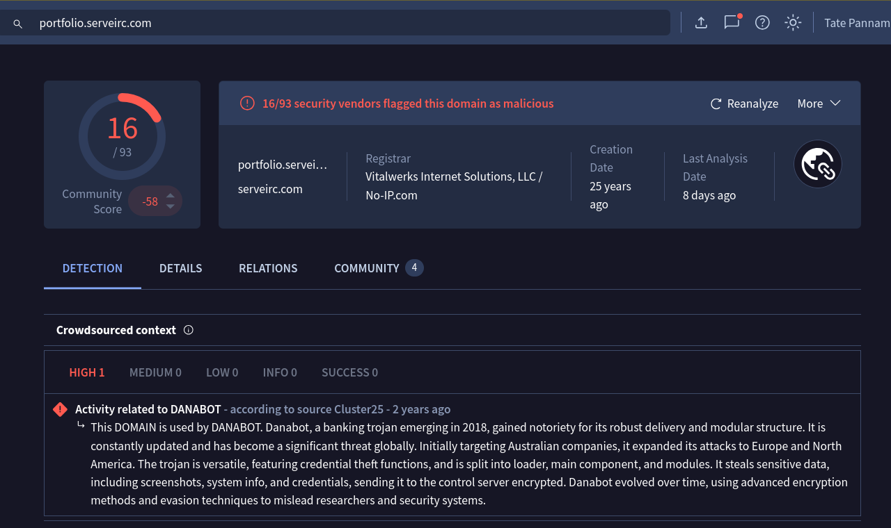
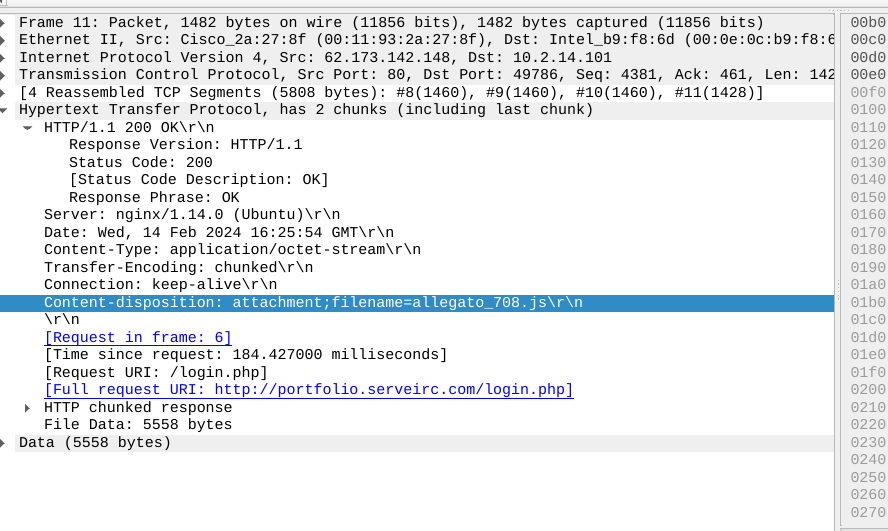
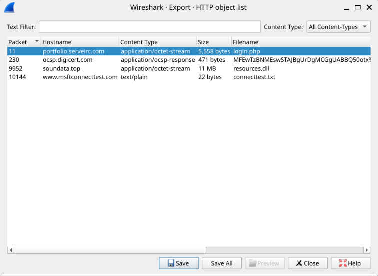
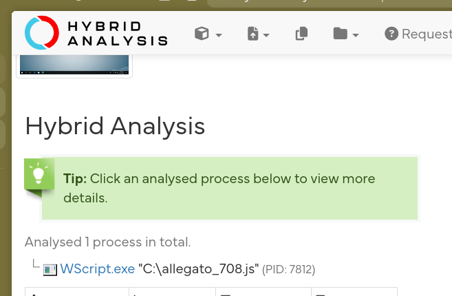
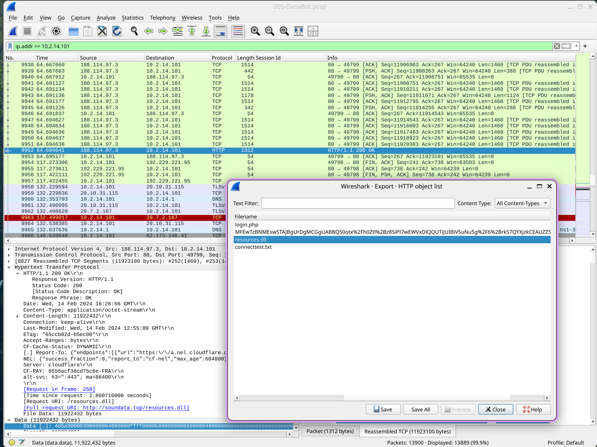

# DanaBot – Network Forensics Investigation

## Overview

In this lab, the SOC team identified suspicious network activity indicating a compromised host and potential data theft. The investigation relied entirely on PCAP analysis and threat intelligence pivoting to reconstruct the attack chain.

The objective was to determine how initial access occurred, identify the malicious payloads, and extract file hashes for intelligence enrichment.

## Initial Traffic Analysis

Applying HTTP filters in Wireshark revealed suspicious outbound traffic:

Filter used  
http.request.method == "GET"

This exposed a request to:

/login.php  
Host portfolio.serveirc.com

The source IP initiating the request was:

62.173.142.148

This IP was identified as the attacker infrastructure used for initial access.
![[dana_get.png]]
    Host: portfolio.serveirc.com\r\n

## Initial Access Payload

Following the HTTP stream revealed that the server returned a file as:

Content Type application/octet-stream  
Filename login.php

Although named login.php, the response contained a malicious JavaScript payload delivered as an attachment.

Using:

File  
Export Objects  
HTTP

The object login.php was extracted directly from the PCAP.

## Hashing the Malicious File

After exporting the object, the SHA256 hash was calculated:

847b4ad90b1daba2d9117a8e05776f3f902dda593fb1252289538acf476c4268

This hash was pivoted in sandbox environments and threat intelligence platforms.

Dynamic analysis revealed the file was executed by:

wscript.exe

This confirms script based execution via Windows Script Host.

## Second Stage Payload

Further PCAP analysis identified another file transfer:

resources.dll

The file was extracted using HTTP object export and hashed.

MD5 hash:

2597322a49a6252445ca4c8d713320b238

This DLL represents the second stage malicious component used by the attacker.

The file extension of the second malicious file:

.dll

## Attack Chain Summary

1. Victim system connects to portfolio.serveirc.com
    
2. Malicious login.php payload is delivered
    
3. Payload executed via wscript.exe
    
4. Secondary DLL resources.dll downloaded
    
5. Infection progresses to next stage
    

This behavior aligns with known DanaBot delivery mechanisms involving staged payload deployment.

## IOCs 

| Type                | Value                                                            |
| ------------------- | ---------------------------------------------------------------- |
| resources.dll       | 2597322a49a6252445ca4c8d713320b238113b3b8fd8a2d6fc1088a5934cee0e |
| login.php           | 847b4ad90b1daba2d9117a8e05776f3f902dda593fb1252289538acf476c4268 |
| domain              | portfolio.serveirc.com                                           |
| ip                  | 62.173.142.148                                                   |
| associated filename | allegato_708.js                                                  |
| Second Stage File   | resources.dll                                                    |

## Key Technical Findings

Initial access method  
Malicious file delivered via HTTP GET request

Execution process  
wscript.exe

Second stage payload  
DLL file delivered via HTTP

---

## Personal Lesson Learned

The most valuable takeaway from this lab was learning how to properly use:

Wireshark > Export Objects > HTTP

>Recovering full malicious payloads directly from a PCAP and reconstructing them for hashing is a critical network forensic skill.

Rather than relying on provided samples, extracting artifacts from raw traffic gives full investigative control and mirrors real SOC workflows.

---

## Conclusion

The DanaBot infection began with a malicious script delivered through a compromised web server. The attacker leveraged staged payload delivery, executing JavaScript via Windows Script Host and deploying a secondary DLL component.

Through HTTP stream reconstruction and file extraction, the full attack chain was reconstructed using only network evidence and threat intelligence correlation.

This investigation demonstrates the importance of:

Network artifact reconstruction  
File hashing and intelligence pivoting  
Understanding execution chains  
Identifying staged malware deployment

> A strong example of how PCAP analysis alone can reveal complete compromise timelines.

I successfully completed DanaBot Blue Team Lab at @CyberDefenders!
https://cyberdefenders.org/blueteam-ctf-challenges/achievements/inksec/danabot/
 
#CyberDefenders #CyberSecurity #BlueYard #BlueTeam #InfoSec #SOC #SOCAnalyst #DFIR #CCD #CyberDefender
