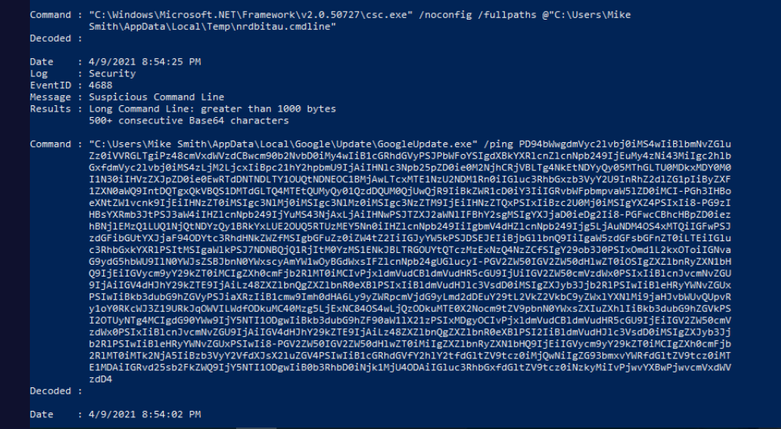
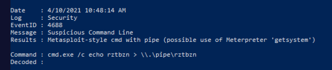
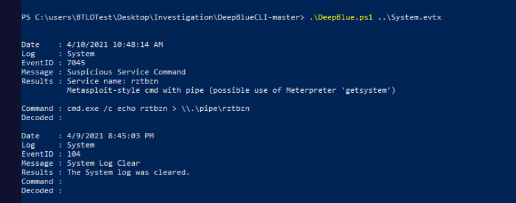
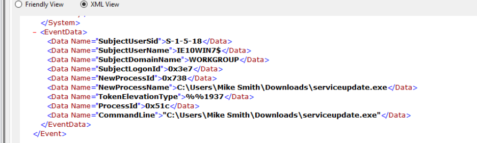
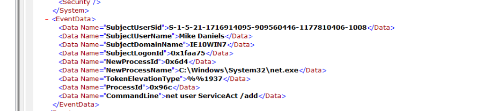
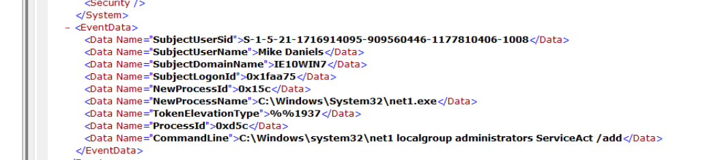

## Overview

Windows endpoint forensics investigation using **DeepBlueCLI** — a PowerShell-based threat hunting tool from SANS that parses Windows event logs and surfaces suspicious activity without manual event-by-event review. The scenario involves a confirmed RDP compromise followed by Meterpreter deployment and attacker persistence.

Two log files provided in `\Desktop\Investigation\`:

- `Security.evtx` — authentication, process creation, account management
- `System.evtx` — service installation, system events

---

## DeepBlueCLI — Security Log Analysis

DeepBlueCLI processes the Security log and automatically flags suspicious events including unusual process execution, obfuscated commands, and known attack patterns.

```ps
.\DeepBlue.ps1 .\Security.evtx
```


The output immediately surfaces **Mike Smith** as the account that executed `GoogleUpdate.exe` — a common masquerading technique where malware adopts legitimate-sounding names to blend in with normal system activity.

Shortly after, DeepBlueCLI flags likely Meterpreter activity at **4/10/2021 10:48:14** — Meterpreter leaves characteristic signatures in Windows event logs through its process injection and named pipe communication patterns.



**MITRE: T1036.005 — Masquerading: Match Legitimate Name or Location**

---

## DeepBlueCLI — System Log Analysis

Running DeepBlueCLI against the System log reveals a suspicious service installation:

```powershell
.\DeepBlue.ps1 .\System.evtx
```



The service **`rztbzn`** was created — a randomly generated six-character name consistent with Meterpreter's service-based persistence mechanism. Meterpreter's `getsystem` and persistence modules commonly install services with randomised names to avoid detection.

**MITRE: T1543.003 — Create or Modify System Process: Windows Service**

---

## Event Viewer — Process Creation (Event ID 4688)

With DeepBlueCLI establishing the approximate attack timeline, drilling into Event Viewer for Event ID 4688 (process creation) between **10:30 and 10:50 AM on April 10, 2021** reveals the Meterpreter delivery mechanism:



`Downloads\serviceupdate.exe` was executed by **Mike Smith** — the malicious executable that established the Meterpreter reverse shell. The `Downloads` directory and generic service-themed name are both red flags, confirming this as the payload delivered post-RDP compromise.

**MITRE: T1059.003 — Command and Scripting Interpreter: Windows Command Shell** **MITRE: T1021.001 — Remote Services: Remote Desktop Protocol**

---

## Persistence — Account Creation

Checking Event ID 4720 (account creation) returns no results, meaning the attacker avoided the standard account creation event. However, filtering Event ID 4688 for `net` commands between **11:25 and 11:40 AM** reveals the persistence mechanism:



The command `net user ServiceAct /add` was executed — creating a local account named `ServiceAct`, a service-themed name chosen to blend in with legitimate service accounts and avoid casual scrutiny.

**MITRE: T1136.001 — Create Account: Local Account**

The account was then added to two local groups to ensure RDP access would be available for future re-entry:



- **Administrators** — full local admin rights
- **Remote Desktop Users** — persistent RDP access

**MITRE: T1098 — Account Manipulation**

---

## IOCs

|Type|Value|
|---|---|
|Compromised User|Mike Smith|
|Malicious Executable|Downloads\serviceupdate[.]exe|
|Masquerading Binary|GoogleUpdate[.]exe|
|Suspicious Service|rztbzn|
|Persistence Account|ServiceAct|
|Meterpreter Activity|2021-04-10 10:48:14|
|Account Creation Command|`net user ServiceAct /add`|
|Groups Added To|Administrators, Remote Desktop Users|

---

## MITRE ATT&CK

|Technique|ID|Notes|
|---|---|---|
|Valid Accounts|T1078|RDP brute force → Mike Smith account|
|Remote Desktop Protocol|T1021.001|Initial access vector|
|Windows Command Shell|T1059.003|serviceupdate.exe execution|
|Masquerading|T1036.005|GoogleUpdate.exe disguise|
|Windows Service|T1543.003|rztbzn service created by Meterpreter|
|Create Local Account|T1136.001|net user ServiceAct /add|
|Account Manipulation|T1098|Added to Administrators + RDP Users|

---

## Lessons Learned

- **DeepBlueCLI first** — running DeepBlueCLI before manually digging through Event Viewer immediately surfaces the key timestamps and events to pivot on, turning hours of log review into minutes
- **Event ID 4688 over 4720** — the attacker avoided triggering 4720 (account creation) by using `net user` — always check 4688 process creation for `net.exe` commands as a fallback when account creation events are absent
- **Service name entropy** — six random lowercase characters like `rztbzn` is a strong Meterpreter persistence indicator; legitimate services use descriptive names. High-entropy short service names warrant immediate investigation
- **Masquerading pattern** — `GoogleUpdate.exe` in an unexpected context, executed by a standard user rather than the SYSTEM account, is a reliable detection opportunity — process creation logging with 4688 makes this visible even when AV misses it


---

<div class="qa-item"> <div class="qa-question-text">Using DeepBlueCLI, investigate the recovered Security log (Security.evtx). Which user account ran GoogleUpdate.exe?</div> <div class="flag-reveal"> <input type="checkbox"> <span class="r-placeholder">Click flag to reveal</span> <span class="r-answer">Mike Smith</span> <button class="copy-btn" onclick="event.stopPropagation();navigator.clipboard.writeText(this.previousElementSibling.textContent);this.textContent='copied';setTimeout(()=>this.textContent='copy',1500)">copy</button> </div> </div>

<div class="qa-item"> <div class="qa-question-text">Using DeepBlueCLI investigate the recovered Security.evtx log. At what time is there likely evidence of Meterpreter activity?</div> <div class="answer-reveal"> <input type="checkbox"> <span class="r-placeholder">Click to reveal answer</span> <span class="r-answer">4/10/2021 10:48:14</span> <button class="copy-btn" onclick="event.stopPropagation();navigator.clipboard.writeText(this.previousElementSibling.textContent);this.textContent='copied';setTimeout(()=>this.textContent='copy',1500)">copy</button> </div> </div>

<div class="qa-item"> <div class="qa-question-text">Using DeepBlueCLI investigate the recovered System.evtx log. What is the name of the suspicious service created?</div> <div class="flag-reveal"> <input type="checkbox"> <span class="r-placeholder">Click flag to reveal</span> <span class="r-answer">rztbzn</span> <button class="copy-btn" onclick="event.stopPropagation();navigator.clipboard.writeText(this.previousElementSibling.textContent);this.textContent='copied';setTimeout(()=>this.textContent='copy',1500)">copy</button> </div> </div>

<div class="qa-item"> <div class="qa-question-text">Investigate the Security.evtx log in Event Viewer. Process creation is being audited (event ID 4688). Identify the malicious executable downloaded that was used to gain a Meterpreter reverse shell, between 10:30 and 10:50 AM on the 10th of April 2021.</div> <div class="answer-reveal"> <input type="checkbox"> <span class="r-placeholder">Click to reveal answer</span> <span class="r-answer">mike smith, serviceupdate.exe</span> <button class="copy-btn" onclick="event.stopPropagation();navigator.clipboard.writeText(this.previousElementSibling.textContent);this.textContent='copied';setTimeout(()=>this.textContent='copy',1500)">copy</button> </div> </div>

<div class="qa-item"> <div class="qa-question-text">It's also believed that an additional account was created to ensure persistence between 11:25 AM and 11:40 AM on the 10th April 2021. What was the command line used to create this account? (Make sure you've found the right account!)</div> <div class="flag-reveal"> <input type="checkbox"> <span class="r-placeholder">Click flag to reveal</span> <span class="r-answer">net user ServiceAct /add</span> <button class="copy-btn" onclick="event.stopPropagation();navigator.clipboard.writeText(this.previousElementSibling.textContent);this.textContent='copied';setTimeout(()=>this.textContent='copy',1500)">copy</button> </div> </div>

<div class="qa-item"> <div class="qa-question-text">What two local groups was this new account added to?</div> <div class="answer-reveal"> <input type="checkbox"> <span class="r-placeholder">Click to reveal answer</span> <span class="r-answer">administrators, Remote Desktop Users</span> <button class="copy-btn" onclick="event.stopPropagation();navigator.clipboard.writeText(this.previousElementSibling.textContent);this.textContent='copied';setTimeout(()=>this.textContent='copy',1500)">copy</button> </div> </div>
