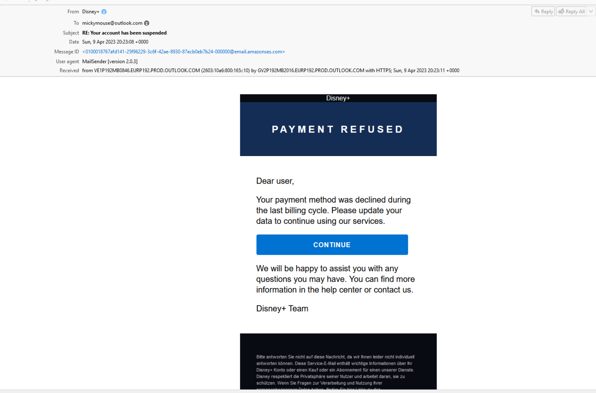
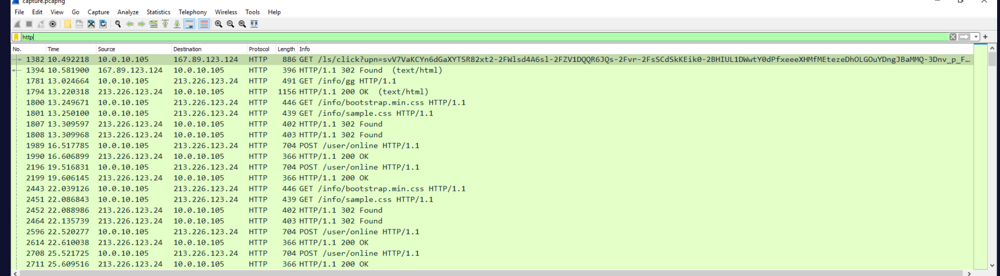
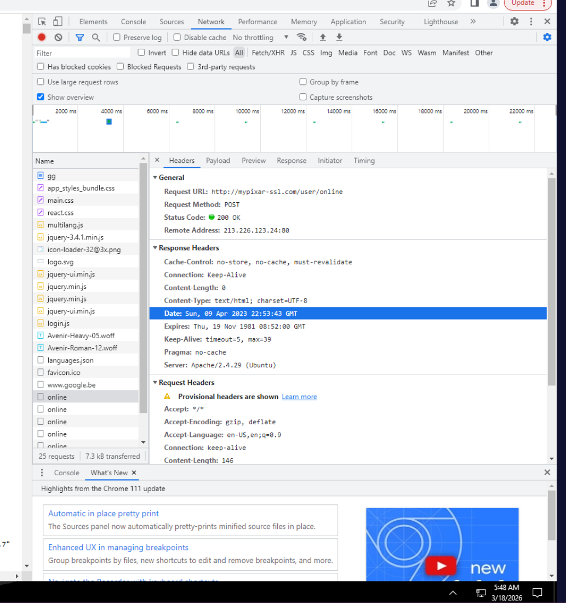
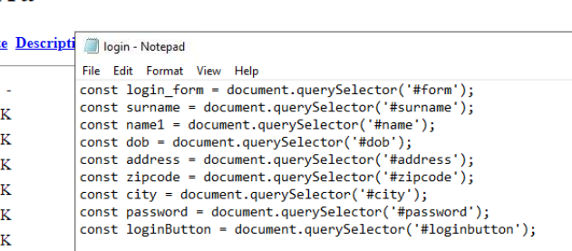
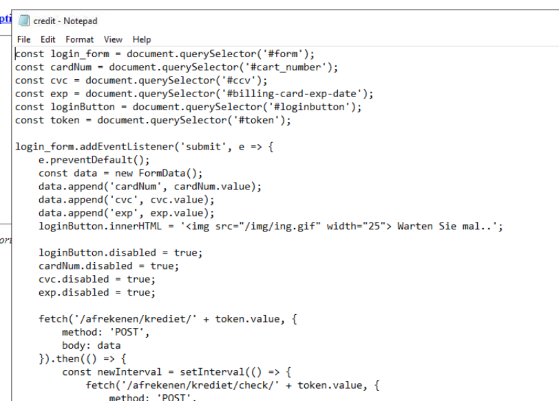
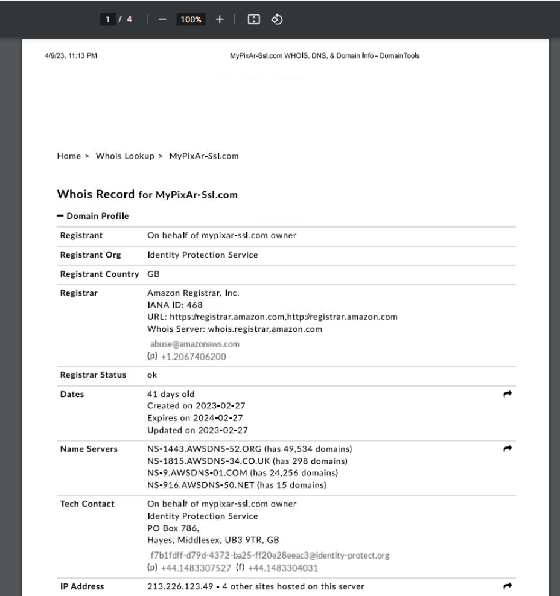
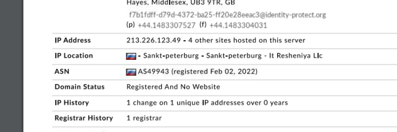
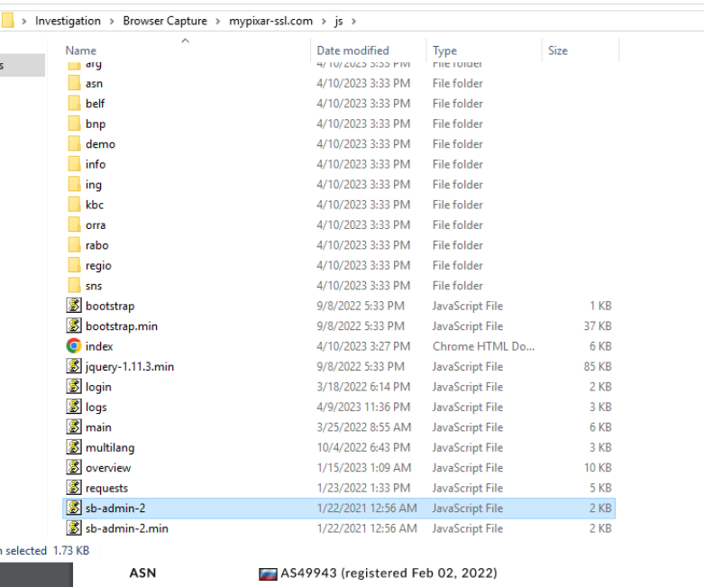
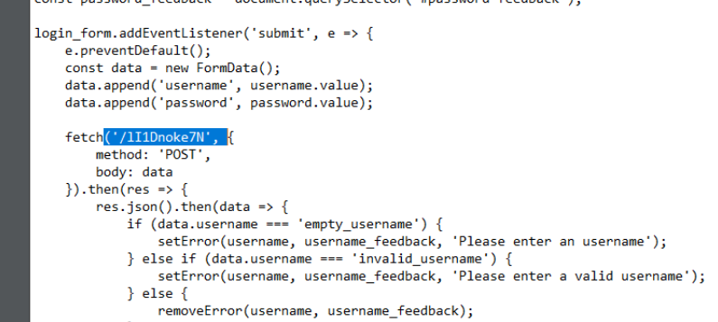

## Overview

A phishing email impersonating Disney+ is delivered to a target, luring them with a credential harvesting campaign. The investigation involves tracing a multi-hop redirect chain, analysing browser capture files, dissecting JavaScript harvesters, and pivoting to uncover a broader banking phishing operation running on the same infrastructure.

---

## Investigation

### Email Analysis

The phishing email presents itself as a Disney+ communication, with the display name encoded in base64 — decoding `RGlzbmV5Kw==` reveals `Disney+`. The true sending address, however, is `supp@agnisys[.]com`, exposing the spoofed sender immediately.


```text
From: =?utf-8?B?RGlzbmV5Kw==?= <supp@agnisys.com>
Reply-To: supp@agnisys.com
```

The email footer contains German-language content, indicating the campaign's primary target audience is users located in **Germany**. The link embedded in the email points to `url1817[.]epoc[.]com[.]br` — the start of a multi-stage redirect chain.

---

### Redirect Chain

Querying the first URI live returns a 404 — the domain is no longer active — but the provided PCAP confirms the original HTTP response was a **302 Found**, redirecting via the `Location` header.

The Location header reveals the first hop: `hxxps[://]jigsy[.]com/redirect.asp?url=hxxps[://]bedrockprop[.]com` — meaning `jigsy[.]com` is the first domain in the redirect chain, acting as an open redirect service to obscure the true destination.

`bedrockprop[.]com` is itself a thin intermediary. Opening the captured HTML shows a meta refresh tag firing after one second, silently forwarding the browser to `hxxp[://]mypixar[.]ssl[.]com/info/gg` — the actual phishing landing page.


---

### HAR Analysis — Phishing Site

Importing the provided HAR file into Chrome DevTools Network tab reveals the full request timeline against `mypixar-ssl[.]com`. The landing page `gg` is returned with a **200 OK** at `Sun, 09 Apr 2023 22:53:43 GMT`, served by **Apache/2.4.29 (Ubuntu)** as disclosed in the response headers.


Repeated `fetch` calls to `/user/online` appear throughout the capture at regular intervals — this is the heartbeat, polling the server to confirm the victim remains on the page. The full request URI is `hxxp[://]mypixar-ssl[.]com/user/online`.

---

### Credential Harvester — Stage 1

The HAR initiator trace points to `hxxp[://]mypixar-ssl[.]com/js/orra/credit[.]js` as the script driving the landing page. Navigating to the `orra` subfolder reveals two JavaScript files — `login.js` and `credit.js`.

`login.js` implements the first harvester stage, collecting personal identity information and POSTing it to `/afrekenen/inloggen/`:

```javascript
data.append('surname', surname.value);
data.append('name', name1.value);
data.append('address', address.value);
data.append('dob', dob.value);
data.append('zipcode', zipcode.value);
data.append('city', city.value);
data.append('tel', password.value);
```


"Afrekenen" is Dutch for _checkout_ and "inloggen" for _login_ — the campaign is specifically targeting Dutch-speaking banking customers.

---

### Credential Harvester — Stage 2

`credit.js` handles the second stage, presenting a card details form after the identity data is submitted:

```javascript
data.append('cardNum', cardNum.value);
data.append('cvc', cvc.value);
data.append('exp', exp.value);
```

This data is POSTed to `/afrekenen/krediet/check/` — the same endpoint used as the heartbeat check for the credit stage.


---

### WHOIS & Infrastructure

The `mypixar-ssl[.]com` WHOIS report confirms the domain was registered on **2023-02-27** — just **41 days** before the phishing email was received on 2023-04-09. Freshly registered domains used immediately for phishing are a classic indicator of compromise.


At the time of the campaign, the site was hosted on **213[.]226[.]123[.]49**, geolocated to **Russia**.


---

### Broader Infrastructure Pivot

Investigating the full JavaScript directory at `mypixar-ssl[.]com/js/` exposes a far larger operation. Beyond the Disney+ lure, the server hosts **10 additional credential harvesters**, each targeting a different financial institution. Two of the companies being impersonated beginning with 'R' stand out immediately: **Rabobank** and **Regiobank** — both Dutch banks, consistent with the language targeting observed in the harvester code.

All 10 impersonated companies share a single industry: **banking**.


---

### Admin Dashboard

Further investigation of `login.js` exposes an obfuscated admin endpoint — `login.js` contains a fetch to `('/lI1Dnoke7N'` — this is the URI of the site's admin dashboard. The dashboard itself is built on the **SB Admin 2** Bootstrap template, identified by the presence of `sb-admin-2.js` and `sb-admin-2.min.js` in the js directory.


---

## IOCs

| Type   | Value                                               |
| ------ | --------------------------------------------------- |
| Email  | supp[@]agnisys[.]com                                |
| Domain | url1817[.]epoc[.]com[.]br                           |
| Domain | jigsy[.]com                                         |
| Domain | bedrockprop[.]com                                   |
| Domain | mypixar-ssl[.]com                                   |
| IP     | 213[.]226[.]123[.]49                                |
| URI    | hxxp[://]mypixar-ssl[.]com/user/online              |
| URI    | hxxp[://]mypixar-ssl[.]com/afrekenen/inloggen/      |
| URI    | hxxp[://]mypixar-ssl[.]com/afrekenen/krediet/check/ |
| URI    | hxxp[://]mypixar-ssl[.]com/lI1Dnoke7N               |


---

<div class="qa-item"> <div class="qa-question-text">What online service is the email impersonating?</div> <div class="flag-reveal"> <input type="checkbox"> <span class="r-placeholder">Click flag to reveal</span> <span class="r-answer">disney+</span> <button class="copy-btn" onclick="event.stopPropagation();navigator.clipboard.writeText(this.previousElementSibling.textContent);this.textContent='copied';setTimeout(()=>this.textContent='copy',1500)">copy</button> </div> </div>

<div class="qa-item"> <div class="qa-question-text">What is the name of the sender, and what is the true sending email address?</div> <div class="answer-reveal"> <input type="checkbox"> <span class="r-placeholder">Click to reveal answer</span> <span class="r-answer">disney+, supp@agnisys.com</span> <button class="copy-btn" onclick="event.stopPropagation();navigator.clipboard.writeText(this.previousElementSibling.textContent);this.textContent='copied';setTimeout(()=>this.textContent='copy',1500)">copy</button> </div> </div>

<div class="qa-item"> <div class="qa-question-text">To understand the phishing campaign, we should look for indicators that relate to an intended primary audience. Analyze the email content, what country are the primary targets most likely located in?</div> <div class="flag-reveal"> <input type="checkbox"> <span class="r-placeholder">Click flag to reveal</span> <span class="r-answer">germany</span> <button class="copy-btn" onclick="event.stopPropagation();navigator.clipboard.writeText(this.previousElementSibling.textContent);this.textContent='copied';setTimeout(()=>this.textContent='copy',1500)">copy</button> </div> </div>

<div class="qa-item"> <div class="qa-question-text">What is the domain from the first URI that a HTTP GET request is sent to when clicking the link in the email?</div> <div class="answer-reveal"> <input type="checkbox"> <span class="r-placeholder">Click to reveal answer</span> <span class="r-answer">url1817.epoc.com.br</span> <button class="copy-btn" onclick="event.stopPropagation();navigator.clipboard.writeText(this.previousElementSibling.textContent);this.textContent='copied';setTimeout(()=>this.textContent='copy',1500)">copy</button> </div> </div>

<div class="qa-item"> <div class="qa-question-text">What is the HTTP response code when accessing this first URI?</div> <div class="flag-reveal"> <input type="checkbox"> <span class="r-placeholder">Click flag to reveal</span> <span class="r-answer">302 found</span> <button class="copy-btn" onclick="event.stopPropagation();navigator.clipboard.writeText(this.previousElementSibling.textContent);this.textContent='copied';setTimeout(()=>this.textContent='copy',1500)">copy</button> </div> </div>

<div class="qa-item"> <div class="qa-question-text">What is the FIRST domain found in a specific HTTP header field related to the HTTP response code from the previous question?</div> <div class="answer-reveal"> <input type="checkbox"><span class="r-placeholder">Click to reveal answer</span> <span class="r-answer">jigsy.com</span> <button class="copy-btn" onclick="event.stopPropagation();navigator.clipboard.writeText(this.previousElementSibling.textContent);this.textContent='copied';setTimeout(()=>this.textContent='copy',1500)">copy</button> </div> </div>

<div class="qa-item"> <div class="qa-question-text">What is the destination domain that the first domain is redirecting the visitor to?</div> <div class="flag-reveal"> <input type="checkbox"> <span class="r-placeholder">Click flag to reveal</span> <span class="r-answer">bedrockprop.com</span> <button class="copy-btn" onclick="event.stopPropagation();navigator.clipboard.writeText(this.previousElementSibling.textContent);this.textContent='copied';setTimeout(()=>this.textContent='copy',1500)">copy</button> </div> </div>

<div class="qa-item"> <div class="qa-question-text">Coming to the end of the redirect chain, what is the domain of the actual phishing website currently being used by this campaign?</div> <div class="answer-reveal"> <input type="checkbox"> <span class="r-placeholder">Click to reveal answer</span> <span class="r-answer">mypixar-ssl.com</span> <button class="copy-btn" onclick="event.stopPropagation();navigator.clipboard.writeText(this.previousElementSibling.textContent);this.textContent='copied';setTimeout(()=>this.textContent='copy',1500)">copy</button> </div> </div>

<div class="qa-item"> <div class="qa-question-text">While browsing the website, it is requesting that the client's browser send a 'heartbeat' to see if they are still connected. What is the Full Request URI for the heartbeat?</div> <div class="flag-reveal"> <input type="checkbox"> <span class="r-placeholder">Click flag to reveal</span> <span class="r-answer">http://mypixar-ssl.com/user/online</span> <button class="copy-btn" onclick="event.stopPropagation();navigator.clipboard.writeText(this.previousElementSibling.textContent);this.textContent='copied';setTimeout(()=>this.textContent='copy',1500)">copy</button> </div> </div>

<div class="qa-item"> <div class="qa-question-text">Investigate HTTP responses from the server. What is the server version and OS?</div> <div class="answer-reveal"> <input type="checkbox"> <span class="r-placeholder">Click to reveal answer</span> <span class="r-answer">Apache/2.4.29 (Ubuntu)</span> <button class="copy-btn" onclick="event.stopPropagation();navigator.clipboard.writeText(this.previousElementSibling.textContent);this.textContent='copied';setTimeout(()=>this.textContent='copy',1500)">copy</button> </div> </div>

<div class="qa-item"> <div class="qa-question-text">Upload the provided .HAR file to Chrome's Developer Tools Network tab. At what time did the visitor receive a response for the GET request to retrieve the phishing site's landing page?</div> <div class="flag-reveal"> <input type="checkbox"> <span class="r-placeholder">Click flag to reveal</span> <span class="r-answer">Sun, 09 Apr 2023 22:53:43 GMT</span> <button class="copy-btn" onclick="event.stopPropagation();navigator.clipboard.writeText(this.previousElementSibling.textContent);this.textContent='copied';setTimeout(()=>this.textContent='copy',1500)">copy</button> </div> </div>

<div class="qa-item"> <div class="qa-question-text">Identify and investigate the JavaScript file related to the first part of the credential harvester site. What information must be submitted by the visitor?</div> <div class="flag-reveal"> <input type="checkbox"> <span class="r-placeholder">Click flag to reveal</span> <span class="r-answer">surname, name, address, dob, zipcode, city, tel</span> <button class="copy-btn" onclick="event.stopPropagation();navigator.clipboard.writeText(this.previousElementSibling.textContent);this.textContent='copied';setTimeout(()=>this.textContent='copy',1500)">copy</button> </div> </div>

<div class="qa-item"> <div class="qa-question-text">Use another tool to identify and investigate the JavaScript related to the second part of the credential harvester. What information must be submitted?</div> <div class="answer-reveal"> <input type="checkbox"> <span class="r-placeholder">Click to reveal answer</span> <span class="r-answer">cardNum, cvc, exp</span> <button class="copy-btn" onclick="event.stopPropagation();navigator.clipboard.writeText(this.previousElementSibling.textContent);this.textContent='copied';setTimeout(()=>this.textContent='copy',1500)">copy</button> </div> </div>

<div class="qa-item"> <div class="qa-question-text">What endpoint does this data get POST'ed to?</div> <div class="answer-reveal"> <input type="checkbox"> <span class="r-placeholder">Click to reveal answer</span> <span class="r-answer">/afrekenen/krediet/check/</span> <button class="copy-btn" onclick="event.stopPropagation();navigator.clipboard.writeText(this.previousElementSibling.textContent);this.textContent='copied';setTimeout(()=>this.textContent='copy',1500)">copy</button> </div> </div>

<div class="qa-item"> <div class="qa-question-text">According to the provided WHOis report PDF for the phishing domain, how long had this domain been registered since the phishing email was recieved?</div> <div class="flag-reveal"> <input type="checkbox"> <span class="r-placeholder">Click flag to reveal</span> <span class="r-answer">41 days</span> <button class="copy-btn" onclick="event.stopPropagation();navigator.clipboard.writeText(this.previousElementSibling.textContent);this.textContent='copied';setTimeout(()=>this.textContent='copy',1500)">copy</button> </div> </div>

<div class="qa-item"> <div class="qa-question-text">At this time, what IP was this site hosted on, and what country is this in?</div> <div class="answer-reveal"> <input type="checkbox"> <span class="r-placeholder">Click to reveal answer</span> <span class="r-answer">213.226.123.49, russia</span> <button class="copy-btn" onclick="event.stopPropagation();navigator.clipboard.writeText(this.previousElementSibling.textContent);this.textContent='copied';setTimeout(()=>this.textContent='copy',1500)">copy</button> </div> </div>

<div class="qa-item"> <div class="qa-question-text">Let's see if this website is hosting other phishing pages than just the one linked in the original email. Investigate the JavaScript files retrieved from the site. What are the names of the two companies that are being impersonated, beginning with 'R'?</div> <div class="flag-reveal"> <input type="checkbox"> <span class="r-placeholder">Click flag to reveal</span> <span class="r-answer">Rabobank, Regiobank</span> <button class="copy-btn" onclick="event.stopPropagation();navigator.clipboard.writeText(this.previousElementSibling.textContent);this.textContent='copied';setTimeout(()=>this.textContent='copy',1500)">copy</button> </div> </div>

<div class="qa-item"> <div class="qa-question-text">Excluding the original credential harvester, how many other harvesters are present on this website?</div> <div class="answer-reveal"> <input type="checkbox"> <span class="r-placeholder">Click to reveal answer</span> <span class="r-answer">10</span> <button class="copy-btn" onclick="event.stopPropagation();navigator.clipboard.writeText(this.previousElementSibling.textContent);this.textContent='copied';setTimeout(()=>this.textContent='copy',1500)">copy</button> </div> </div>

<div class="qa-item"> <div class="qa-question-text">What industry to all of these 10 impersonated companies have in common?</div> <div class="flag-reveal"> <input type="checkbox"> <span class="r-placeholder">Click flag to reveal</span> <span class="r-answer">banking</span> <button class="copy-btn" onclick="event.stopPropagation();navigator.clipboard.writeText(this.previousElementSibling.textContent);this.textContent='copied';setTimeout(()=>this.textContent='copy',1500)">copy</button> </div> </div>

<div class="qa-item"> <div class="qa-question-text">Continue investigating the JavaScript. What is the URI of the sites' admin dashboard?</div> <div class="answer-reveal"> <input type="checkbox"> <span class="r-placeholder">Click to reveal answer</span> <span class="r-answer">(/lI1Dnoke7N</span> <button class="copy-btn" onclick="event.stopPropagation();navigator.clipboard.writeText(this.previousElementSibling.textContent);this.textContent='copied';setTimeout(()=>this.textContent='copy',1500)">copy</button> </div> </div>

<div class="qa-item"> <div class="qa-question-text">What is the name of the boostrap template that is used for the admin dashboard?</div> <div class="flag-reveal"> <input type="checkbox"> <span class="r-placeholder">Click flag to reveal</span> <span class="r-answer">SB Admin 2</span> <button class="copy-btn" onclick="event.stopPropagation();navigator.clipboard.writeText(this.previousElementSibling.textContent);this.textContent='copied';setTimeout(()=>this.textContent='copy',1500)">copy</button> </div> </div>


