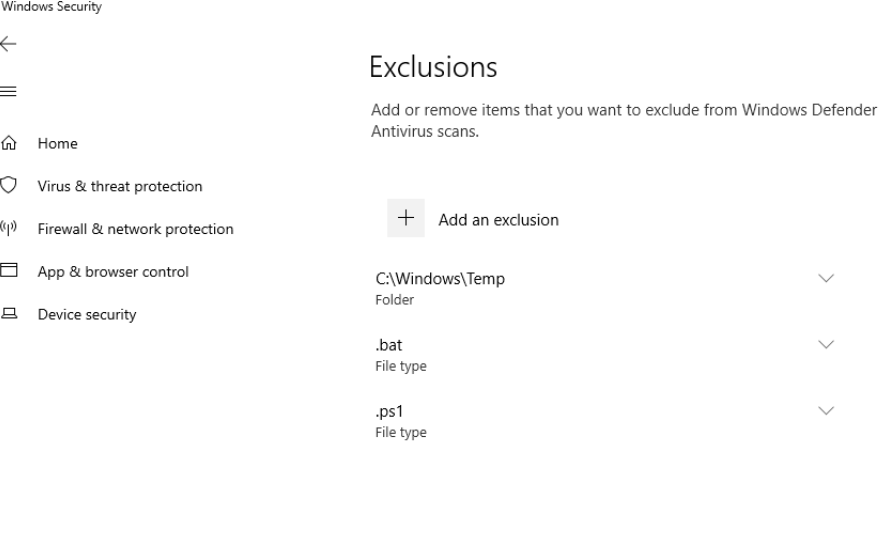
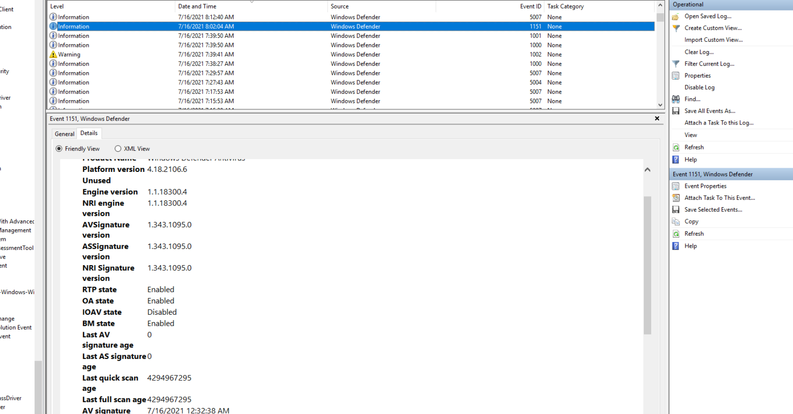
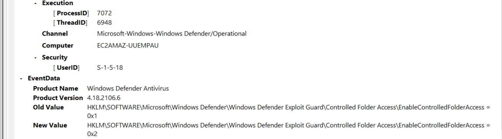

## Scenario

Microsoft Defender Antivirus has been present for over a decade providing security against known threats — until tampered with. Admin privileges are required to tamper, but the logs serve as forensic footprints. Several questions require prior knowledge of Defender internals rather than direct log analysis.

---

## Methodology

### Exclusions — Registry Editor

Opening Registry Editor and navigating to the Defender exclusions keys surfaces the file extension exclusions configured on the system:


Two extensions are excluded from scanning — `.bat` and `.ps1`. Both are scripting extensions commonly abused by attackers, making their exclusion a significant defensive gap. An attacker who can add these exclusions can drop and execute malicious scripts without triggering Defender.

The directory exclusion (`c:\windows\temp`) is visible in the Defender Operational event log — Event ID 5007 (configuration changed) logged at `7/16/2021 7:11:53 AM`. Excluding `C:\Windows\Temp` is a classic attacker move — it's a writable system directory that most tooling drops payloads into.

### Windows Defender Operational Log — Event Viewer

The Defender operational log lives at:

```
%SystemRoot%\System32\Winevt\Logs\Microsoft-Windows-Windows Defender%4Operational.evtx
```

Note the `%4` separator — Windows uses this in the filename rather than a backslash for logs with subdirectory-style names.

Filtering for **Event ID 5007** (configuration changed) surfaces all the tamper activity. All changes were made by the same process (`PID 7072`) at various thread IDs, indicating a single actor session making sequential configuration changes.

**Controlled Folder Access** was changed from `0x1` (Enabled) to `0x2` — mapping to **AuditMode**. This weakens the protection without fully disabling it, potentially to avoid detection while still allowing write access to protected folders.

**MAPS (Microsoft Active Protection Service)** was disabled — `SpyNetReporting` changed to `0x0`, cutting off cloud-delivered threat intelligence:

```
\SOFTWARE\Microsoft\Windows Defender\SpyNet\SpyNetReporting = 0x0
```

**Script scanning** was disabled via `Set-MpPreference -DisableScriptScanning $true` (visible in PowerShell history), logged as a 5007 event modifying:

```
\SOFTWARE\Microsoft\Windows Defender\Real-Time Protection
```

Note: Q7's answer format drops both the `HKLM\` prefix and the value name — BTLO expects just the key path.

**IOAV protection** (scanning of downloaded files and attachments) was confirmed disabled via registry query:

powershell

```
reg query "HKLM\SOFTWARE\Microsoft\Windows Defender\Real-Time Protection" /v DisableIOAVProtection
# DisableIOAVProtection    REG_DWORD    0x1
```

No dedicated 5007 event was generated for this change — it was likely set via direct registry write rather than through the Defender API. The change is attributable to PID `7072` based on the 1151 health report event:



The 1151 event (Endpoint Protection client health report) confirmed `IOAV state: Disabled` and was generated by the same process responsible for all other configuration changes.



**Tamper protection** — Event ID 5013 is logged when tamper protection blocks a configuration change. The command `Set-MpPreference -DisableScriptScanning $true` succeeded in this lab (tamper protection was not active), but 5013 is the knowledge answer for what would be logged if it had been blocked.

---

## Attack Summary

|Phase|Action|
|---|---|
|Defense Evasion|`.bat` and `.ps1` extensions excluded from Defender scanning|
|Defense Evasion|`C:\Windows\Temp` directory excluded — common payload staging location|
|Defense Evasion|Controlled Folder Access downgraded from Enabled to AuditMode|
|Defense Evasion|MAPS (SpyNetReporting) disabled — cloud threat intel severed|
|Defense Evasion|Script scanning disabled via PowerShell (`Set-MpPreference`)|
|Defense Evasion|IOAV protection disabled via direct registry write|

---

## IOCs

|Type|Value|
|---|---|
|Excluded Extensions|.bat, .ps1|
|Excluded Directory|C:\Windows\Temp|
|Registry Key Modified|HKLM\SOFTWARE\Microsoft\Windows Defender\Real-Time Protection|
|Registry Key Modified|HKLM\SOFTWARE\Microsoft\Windows Defender\SpyNet\SpyNetReporting|
|Process|PID 7072 (all Defender config changes)|

---

## MITRE ATT&CK

|Technique|ID|Description|
|---|---|---|
|Impair Defenses: Disable or Modify Tools|T1562.001|Multiple Defender protections disabled — IOAV, script scanning, MAPS, controlled folder access|
|Modify Registry|T1112|Direct registry writes used to disable IOAV bypassing Defender API logging|
|PowerShell|T1059.001|`Set-MpPreference` used to disable script scanning via PowerShell|

---

## Defender Takeaways

**Tamper protection should always be enabled** — the most significant finding here is that tamper protection was not active, allowing all these changes to succeed. With tamper protection enabled, the PowerShell command would have generated a 5013 event and been blocked. Enabling tamper protection via Intune or Group Policy is a one-step control that prevents the entire attack chain documented in this lab.

**Monitor Event ID 5007 as a high-fidelity detection** — every Defender configuration change generates a 5007. Alerting on 5007 events outside of scheduled maintenance windows — particularly changes to exclusions, MAPS reporting, and real-time protection settings — provides early warning of tamper activity. SIEM rules on 5007 with `DisableIOAVProtection`, `SpyNetReporting = 0x0`, and exclusion additions are practical starting points.

**Script extension exclusions are a red flag** — excluding `.ps1` and `.bat` from scanning has almost no legitimate use case in a corporate environment. Baselining Defender exclusion lists and alerting on new exclusion additions — particularly for scripting extensions — is a cheap and effective detection.

**Direct registry writes bypass API logging** — IOAV was disabled without generating a 5007 event by writing directly to the registry rather than using `Set-MpPreference`. Detecting this requires Security event log auditing (Event ID 4657 — registry value modified) on sensitive Defender registry paths. 5007 alone is insufficient for complete coverage.

**C:\Windows\Temp exclusion enables payload staging** — excluding the system temp directory from scanning creates a reliable staging ground for malware. File integrity monitoring or at minimum Defender exclusion alerting on `C:\Windows\Temp` additions should be standard in any hardened environment.


---

<div class="qa-item"> <div class="qa-question-text">What is the ‘Log Path’ for Windows Defender logs? (Format: log\path\directory\file.evtx)</div> <div class="flag-reveal"> <input type="checkbox"> <span class="r-placeholder">Click flag to reveal</span> <span class="r-answer">%SystemRoot%\System32\Winevt\Logs\Microsoft-Windows-Windows Defender%4Operational.evtx</span> <button class="copy-btn" onclick="event.stopPropagation();navigator.clipboard.writeText(this.previousElementSibling.textContent);this.textContent='copied';setTimeout(()=>this.textContent='copy',1500)">copy</button> </div> </div>

<div class="qa-item"> <div class="qa-question-text">What are the extensions excluded in Windows Defender? (Format: extension1, extension2)</div> <div class="answer-reveal"> <input type="checkbox"> <span class="r-placeholder">Click to reveal answer</span> <span class="r-answer">.bat, .ps1</span> <button class="copy-btn" onclick="event.stopPropagation();navigator.clipboard.writeText(this.previousElementSibling.textContent);this.textContent='copied';setTimeout(()=>this.textContent='copy',1500)">copy</button> </div> </div>

<div class="qa-item"> <div class="qa-question-text">What is the excluded directory, when was the event logged? (Format: drive:\path\directory, M/DD/YYYY h:mm:ss am/pm)</div> <div class="flag-reveal"> <input type="checkbox"> <span class="r-placeholder">Click flag to reveal</span> <span class="r-answer">c:\windows\temp, 7/16/2021 7:11:53 AM</span> <button class="copy-btn" onclick="event.stopPropagation();navigator.clipboard.writeText(this.previousElementSibling.textContent);this.textContent='copied';setTimeout(()=>this.textContent='copy',1500)">copy</button> </div> </div>

<div class="qa-item"> <div class="qa-question-text">Is controlled folder access enabled? What mode is it in? (Format: XxxxxXxxx)</div> <div class="answer-reveal"> <input type="checkbox"> <span class="r-placeholder">Click to reveal answer</span> <span class="r-answer">AuditMode</span> <button class="copy-btn" onclick="event.stopPropagation();navigator.clipboard.writeText(this.previousElementSibling.textContent);this.textContent='copied';setTimeout(()=>this.textContent='copy',1500)">copy</button> </div> </div>

<div class="qa-item"> <div class="qa-question-text">What is the symbolic name for the Event ID 5001? (Format: symbolic_name)</div> <div class="flag-reveal"> <input type="checkbox"> <span class="r-placeholder">Click flag to reveal</span> <span class="r-answer">MALWAREPROTECTION_RTP_DISABLED</span> <button class="copy-btn" onclick="event.stopPropagation();navigator.clipboard.writeText(this.previousElementSibling.textContent);this.textContent='copied';setTimeout(()=>this.textContent='copy',1500)">copy</button> </div> </div>

<div class="qa-item"> <div class="qa-question-text">The adversaries can remove all the Windows Defender Antivirus signatures using the command, &quot;\some\path&quot; -RemoveDefinitions -All (Complete the command) (Format: &quot;\some\path&quot; -RemoveDefinitions -All)</div> <div class="answer-reveal"> <input type="checkbox"> <span class="r-placeholder">Click to reveal answer</span> <span class="r-answer">"C:\Program Files\Windows Defender\MpCmdRun.exe" -RemoveDefinitions -All</span> <button class="copy-btn" onclick="event.stopPropagation();navigator.clipboard.writeText(this.previousElementSibling.textContent);this.textContent='copied';setTimeout(()=>this.textContent='copy',1500)">copy</button> </div> </div>

<div class="qa-item"> <div class="qa-question-text">What registry key is modified when script scanning is disabled for Microsoft Defender Antivirus? (Format: path\to\registry)</div> <div class="flag-reveal"> <input type="checkbox"> <span class="r-placeholder">Click flag to reveal</span> <span class="r-answer">\SOFTWARE\Microsoft\Windows Defender\Real-Time Protection</span> <button class="copy-btn" onclick="event.stopPropagation();navigator.clipboard.writeText(this.previousElementSibling.textContent);this.textContent='copied';setTimeout(()=>this.textContent='copy',1500)">copy</button> </div> </div>

<div class="qa-item"> <div class="qa-question-text">What event id is logged if the following powershell command is executed but blocked by tamper protection mechanism? Command: Set-MpPreference -DisableScriptScanning $true (Format: eventID)</div> <div class="answer-reveal"> <input type="checkbox"> <span class="r-placeholder">Click to reveal answer</span> <span class="r-answer">5013</span> <button class="copy-btn" onclick="event.stopPropagation();navigator.clipboard.writeText(this.previousElementSibling.textContent);this.textContent='copied';setTimeout(()=>this.textContent='copy',1500)">copy</button> </div> </div>

<div class="qa-item"> <div class="qa-question-text">Microsoft Active Protection Service was disabled at some point. What is the value for the field ‘New Value’ in the log? (Format: value)</div> <div class="flag-reveal"> <input type="checkbox"> <span class="r-placeholder">Click flag to reveal</span> <span class="r-answer">\SOFTWARE\Microsoft\Windows Defender\SpyNet\SpyNetReporting = 0x0</span> <button class="copy-btn" onclick="event.stopPropagation();navigator.clipboard.writeText(this.previousElementSibling.textContent);this.textContent='copied';setTimeout(()=>this.textContent='copy',1500)">copy</button> </div> </div>

<div class="qa-item"> <div class="qa-question-text">What is the processID and ThreadID that disabled IOAV protection in Microsoft Defender Antivirus? (Format: processID, threadID)</div> <div class="answer-reveal"> <input type="checkbox"> <span class="r-placeholder">Click to reveal answer</span> <span class="r-answer">ANSWER</span> <button class="copy-btn" onclick="event.stopPropagation();navigator.clipboard.writeText(this.previousElementSibling.textContent);this.textContent='copied';setTimeout(()=>this.textContent='copy',1500)">copy</button> </div> </div>

<div class="qa-item"> <div class="qa-question-text">What is the command prompt command to query the registry for excluded processes in Windows Defender Antivirus? (Format: reg query “\path\”)</div> <div class="flag-reveal"> <input type="checkbox"> <span class="r-placeholder">Click flag to reveal</span> <span class="r-answer">reg query "HKLM\SOFTWARE\Microsoft\Windows Defender\Exclusions\Processes"</span> <button class="copy-btn" onclick="event.stopPropagation();navigator.clipboard.writeText(this.previousElementSibling.textContent);this.textContent='copied';setTimeout(()=>this.textContent='copy',1500)">copy</button> </div> </div>
