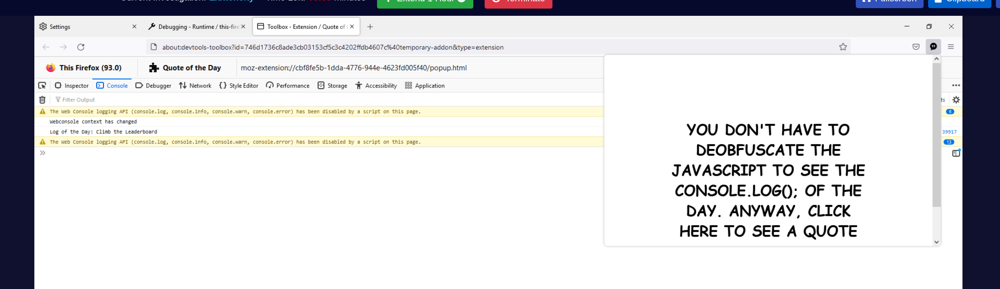
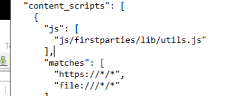
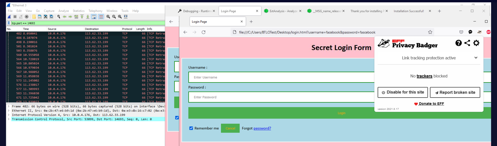
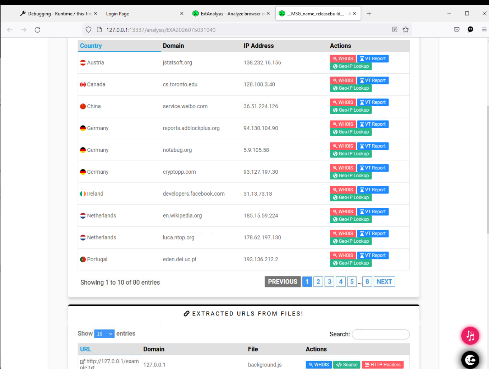

## Overview

A deceptively challenging lab despite its "Easy" rating. The company suspects malicious browser extensions are being used to harvest employee credentials. The investigation requires removing enterprise browser policies, installing and analyzing extensions, identifying keylogger code via content script analysis, and capturing C2 traffic in Wireshark.

---

## Registry — Removing Extension Blocks

Before any extension analysis can begin, enterprise group policies are blocking installation in both Chrome and Firefox. Two registry keys need to be located and cleared:

```note
HKEY_LOCAL_MACHINE\SOFTWARE\Policies\Google\Chrome
HKEY_LOCAL_MACHINE\SOFTWARE\Policies\Mozilla\Firefox
```

Under the Chrome path, the subkey preventing installation is **`ExtensionInstallBlocklist`** — a Group Policy setting that blocks specific or all extension installs. Deleting or clearing this key re-enables extension installation in Chrome.

The Firefox equivalent lives under `ExtensionSettings` — same principle, enterprise policy preventing add-on installation via `nsIEnterprisePolicies`.

---

## Quote of the Day — Firefox Extension Analysis

With Firefox policies cleared, the Quote of the Day extension can be loaded as a temporary add-on via `about:debugging` → This Firefox → Load Temporary Add-on. The extension folder needs to be zipped with `manifest.json` at the root level and renamed to `.xpi` before Firefox will accept it.

Once installed, clicking **Inspect** on the extension in `about:debugging` opens a scoped DevTools window. The console output reveals:

**`Log of the Day: Climb the Leaderboard`**

The JS was obfuscated but the lab authors left the answer as the `console.log()` output — readable directly from the extension's DevTools console without needing to deobfuscate.


---


## Identifying the Malicious Extension — Privacy Badger

Three extensions are available for analysis: AdGuard, Quote of the Day, and Privacy Badger. Examining each `manifest.json` for `content_scripts` — scripts that inject into web pages — Privacy Badger immediately stands out:

```json
"content_scripts": [{
  "js": ["js/firstparties/lib/utils.js"],
  "matches": ["https://*/*", "file:///*/*"]
}]
```

The `file:///*/*` match pattern is the red flag — legitimate extensions don't inject into local `file://` URLs. This tells us **`utils.js`** is the malicious keylogger content script, designed to intercept credentials entered into local HTML files like `login.html`.

Firefox also flags a manifest warning: _"An unexpected property was found in the WebExtension manifest"_ — another indicator of tampering.


---
## Keylogger Traffic Capture — Wireshark

With Privacy Badger loaded in Chrome (not Firefox — the content script fires correctly in Chrome), opening `login.html` from the Desktop and entering credentials triggers the keylogger. Filtering Wireshark for the C2 port:

bash

```bash
tcp.port == 14693
```

TCP SYN packets immediately appear attempting to connect to the attacker's C2 server. The connection fails (all retransmissions — C2 unreachable from lab environment) but the destination IP is captured:

**C2 IP:** `113[.]62[.]33[.]199`



---

## ExtAnalysis — AdBlock Plus Domain Enumeration

Loading the AdBlock Plus extension into ExtAnalysis and navigating to **URLs & Domains** reveals **80 unique domains** referenced within the extension — useful baseline data for distinguishing normal extension behaviour from malicious outbound connections.


---

## IOCs

|Type|Value|
|---|---|
|C2 IP|`113[.]62[.]33[.]199`|
|C2 Port|`14693`|
|Malicious Extension|Privacy Badger (trojanized)|
|Keylogger Script|`utils.js`|


<div class="qa-item"> <div class="qa-question-text">What is the name of the subkey in the registry preventing installation of browser extensions in Google Chrome?</div> <div class="flag-reveal"> <input type="checkbox"> <span class="r-placeholder">Click flag to reveal</span> <span class="r-answer">ExtensionInstallBlocklist</span> <button class="copy-btn" onclick="event.stopPropagation();navigator.clipboard.writeText(this.previousElementSibling.textContent);this.textContent='copied';setTimeout(()=>this.textContent='copy',1500)">copy</button> </div> </div>

<div class="qa-item"> <div class="qa-question-text">Enable installation of browser extensions in Mozilla Firefox and install the extension ‘Quote of the Day’. What is the log of the day?</div> <div class="answer-reveal"> <input type="checkbox"> <span class="r-placeholder">Click to reveal answer</span> <span class="r-answer">Climb the Leaderboard</span> <button class="copy-btn" onclick="event.stopPropagation();navigator.clipboard.writeText(this.previousElementSibling.textContent);this.textContent='copied';setTimeout(()=>this.textContent='copy',1500)">copy</button> </div> </div>

<div class="qa-item"> <div class="qa-question-text">Employee’s passwords were seen on Network logs. It could be a malicious extension. Where are the key logs sent? (Use login.html file to generate keylogger requests, use destination port 14693 to filter requests in Wireshark as HTTP requests will not be initiated in the lab environment) (Format: Attacker’s IP)</div> <div class="flag-reveal"> <input type="checkbox"> <span class="r-placeholder">Click flag to reveal</span> <span class="r-answer">113.62.33.199</span> <button class="copy-btn" onclick="event.stopPropagation();navigator.clipboard.writeText(this.previousElementSibling.textContent);this.textContent='copied';setTimeout(()=>this.textContent='copy',1500)">copy</button> </div> </div>

<div class="qa-item"> <div class="qa-question-text">What file has the malicious keylogger code? (Tip: Content scripts are files that run in the context of web pages) (Format: filename.extension)</div> <div class="answer-reveal"> <input type="checkbox"> <span class="r-placeholder">Click to reveal answer</span> <span class="r-answer">utils.js</span> <button class="copy-btn" onclick="event.stopPropagation();navigator.clipboard.writeText(this.previousElementSibling.textContent);this.textContent='copied';setTimeout(()=>this.textContent='copy',1500)">copy</button> </div> </div>

<div class="qa-item"> <div class="qa-question-text">Analyze “AdBlock Plus” extension using ExtAnalysis. How many unique domains are found? (Format: NumberOfUniqueDomains)</div> <div class="flag-reveal"> <input type="checkbox"> <span class="r-placeholder">Click flag to reveal</span> <span class="r-answer">80</span> <button class="copy-btn" onclick="event.stopPropagation();navigator.clipboard.writeText(this.previousElementSibling.textContent);this.textContent='copied';setTimeout(()=>this.textContent='copy',1500)">copy</button> </div> </div>
