## Scenario

A system has been compromised by ransomware. A password-protected zip is provided containing the builder used to generate the payload. As a defender, crack the archive, identify the malware family, hunt the deployed sample using YARA, perform static analysis and decompilation to extract encryption behaviour and persistence mechanisms, and investigate attacker-planted persistence separate from the ransomware itself.

---

## Methodology

### Stage 1 — Cracking the Builder Archive

The investigation begins with a password-protected zip. `zip2john` extracts the hash and `john` cracks it against a wordlist:

```bash
zip2john builder.zip > builder.hash
john builder.hash --wordlist=/usr/share/wordlists/rockyou.txt
```

Password recovered: `BTL0_C3_D4ve!`. The archive contains the **Chaos Ransomware Builder v5.2**.

### Stage 2 — Static Analysis of the Builder Sample (PEStudio)

Loading the builder sample in PEStudio reveals the default process name the malware masquerades as and the full extension infection list. The extension list is stored as a comma-delimited string — counting entries with PowerShell confirms the scope:


```zsh
(Get-Content .\count.txt) -split ',' | Measure-Object | Select-Object -ExpandProperty Count
```

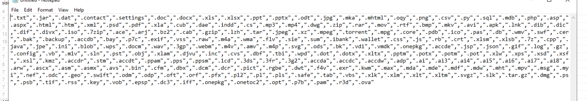

Result: **230 extensions** targeted. The default masquerade process is `svchost.exe` — a deliberate choice to blend into process listings since svchost instances are numerous and rarely scrutinised.
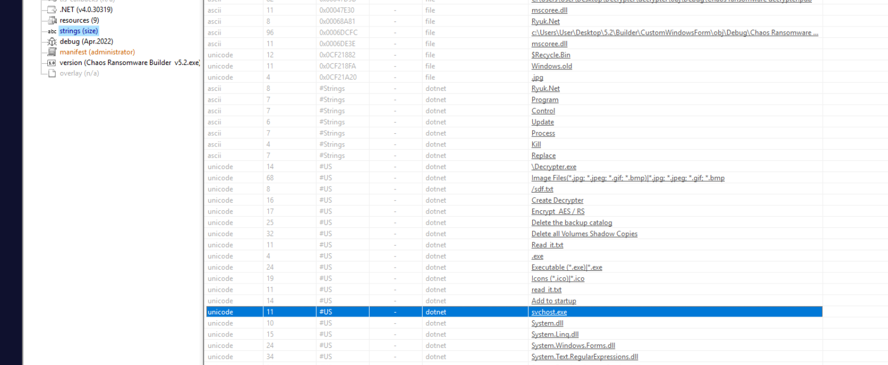

### Stage 3 — YARA Rule Development and Hidden Sample Hunt

With the builder analysed, the next objective is locating the deployed sample elsewhere on the system. A custom YARA rule is written targeting unique string artefacts embedded in Chaos v5.2 binaries:

```yara
rule chaos_custom_sample
{
    strings:
        $s1 = "MyApplication.app" ascii wide
        $s2 = "CustomWindowsForm" ascii wide
        $s3 = "Chaos Ransomware Builder v5.2.exe" ascii wide
        $s4 = ".txt,.jar,.dat,.contact,.settings,.doc,.docx" ascii wide

    condition:
        2 of them
}
```

The rule requires only two matches to fire — this reduces false negatives if the builder strips some strings while preserving others. Running it against the filesystem surfaces the hidden sample:

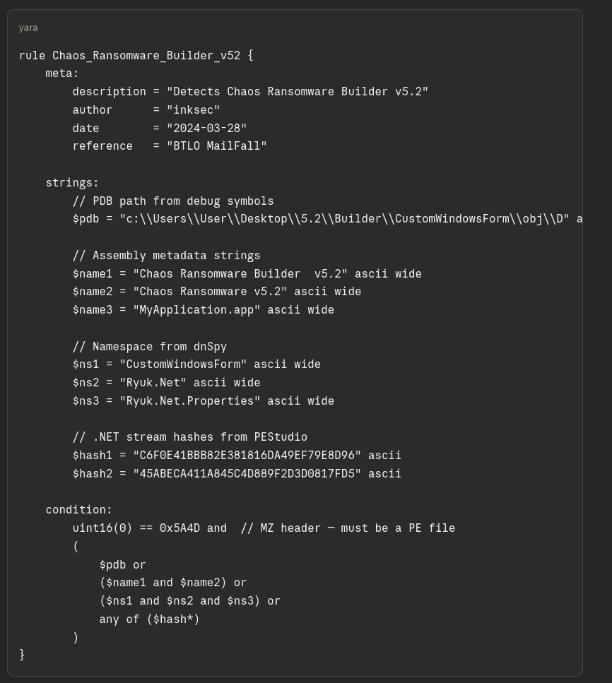

Sample located at `C:\Users\BTLOTest\AppData\Local\Mystery\UnleashMayhem.exe`.
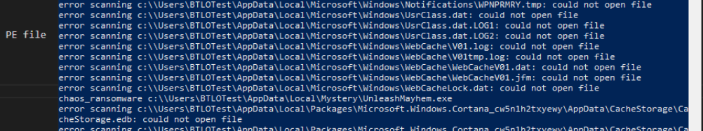

The `Mystery` directory name is a deliberate attempt to avoid detection — non-standard AppData subdirectories are worth flagging in any endpoint triage.

### Stage 4 — Static Analysis of UnleashMayhem.exe

**PEStudio** is loaded with `UnleashMayhem.exe`. The blacklisted imports immediately surface suspicious capability: clipboard monitoring, AES encryption, shell execution, and system parameter manipulation.

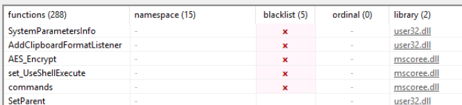

Blacklisted functions in alphabetical order: `AddClipboardFormatListener`, `AES_Encrypt`, `set_UseShellExecute`, `SystemParametersInfo`. Two libraries imported.

**Detect-it-Easy (DiE)** confirms the binary is compiled .NET — important because it means the binary is fully decompilable with ILSpy with near-source-level fidelity.
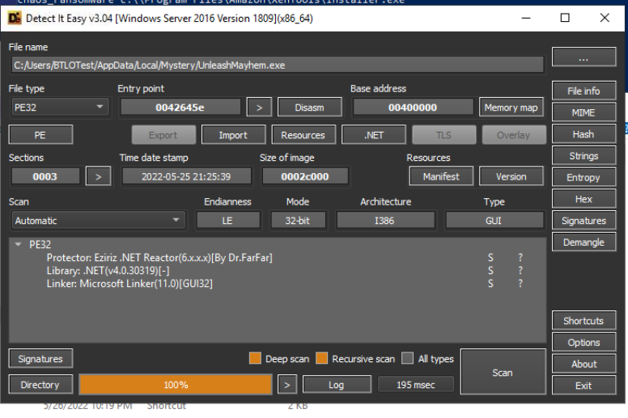

Runtime: `.NET(v4.0.30319)`, Linker: `Microsoft Linker`.

### Stage 5 — Decompilation with ILSpy

Loading `UnleashMayhem.exe` into ILSpy exposes the full source logic.

**Encryption threshold.** The file processing loop contains a size conditional determining which encryption path is taken. Files below the threshold receive full AES encryption via `AES_Encrypt`; files at or above it are handled by `AES_Encrypt_Large`:

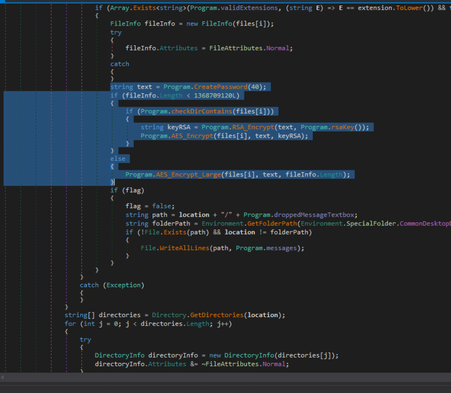

```csharp
if (fileInfo.Length < 1368709120L)
{
    string keyRSA = Program.RSA_Encrypt(text, Program.rsaKey());
    Program.AES_Encrypt(files[i], text, keyRSA);
}
else
{
    Program.AES_Encrypt_Large(files[i], text, fileInfo.Length);
}
```

`AES_Encrypt_Large` doesn't encrypt — it overwrites the file contents with a single character (`?`), destroying the data without the overhead of real encryption. This is a deliberate design decision: large files are too slow to encrypt, so they are simply destroyed to maximise damage in minimum time.

**Registry persistence.** Searching `SetValue` in ILSpy leads directly to the ransomware's persistence write:
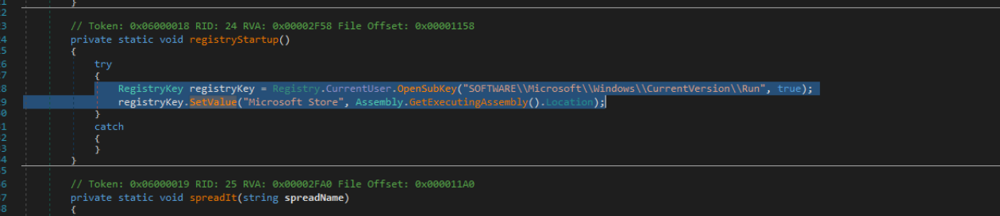

```csharp
RegistryKey registryKey = Registry.CurrentUser.OpenSubKey(
    "SOFTWARE\\Microsoft\\Windows\\CurrentVersion\\Run", true);
registryKey.SetValue("Microsoft Store", Assembly.GetExecutingAssembly().Location);
```

The value name `Microsoft Store` is chosen to appear legitimate — most users and analysts glancing at the Run key would skip it.

**Ransom note.** The `addAndOpenNote()` method writes `READMENOW.txt` to AppData and opens it on execution. The `Program.messages` list contains the note content including the DLS URL and ransom demand:

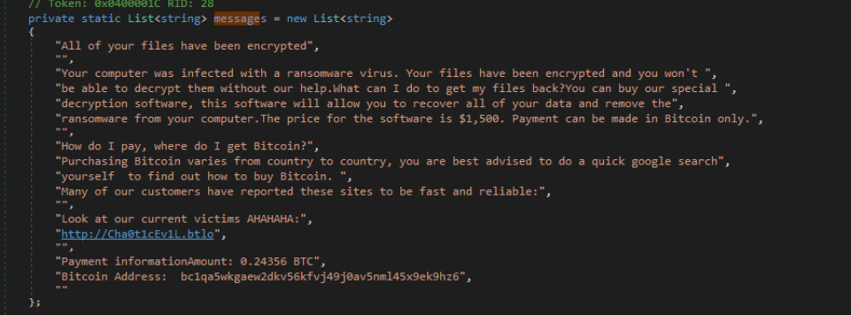

DLS: `hxxp[://]Cha0t1cEv1L[.]btlo` — ransom demand: `0.24356 BTC` ($1,500 USD at the time of the campaign).

### Stage 6 — Data Leak Site Enumeration

Navigating to the DLS at `cha0t1cev1l.btlo:8080` within the lab environment reveals the double-extortion pressure page listing exfiltrated victim data:
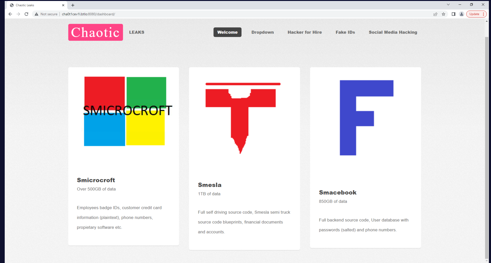

Three victims listed in order: **Smicrocroft** (500GB+), **Smesla** (1TB), **Smacebook** (850GB). The DLS mimics legitimate company branding — spoofed logos for Microsoft, Tesla, and Facebook analogues — a standard double-extortion tactic to apply reputational pressure on victims.

### Stage 7 — Attacker-Planted Persistence (Separate from Ransomware)

Querying the Run keys reveals a second persistence entry not created by the ransomware itself — indicating the attacker maintained their own foothold independently:

```zsh
reg query "HKLM\Software\Microsoft\Windows\CurrentVersion\Run"
```
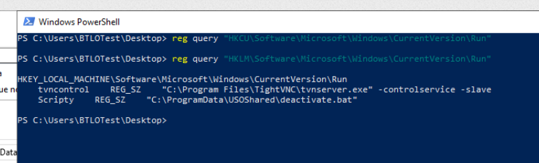

Entry: `Scripty` → `"C:\ProgramData\USOShared\deactivate.bat"`. The `USOShared` path masquerades as a legitimate Windows Update directory.

Reading the bat file:

```zsh
Get-Content "C:\ProgramData\USOShared\deactivate.bat"
```
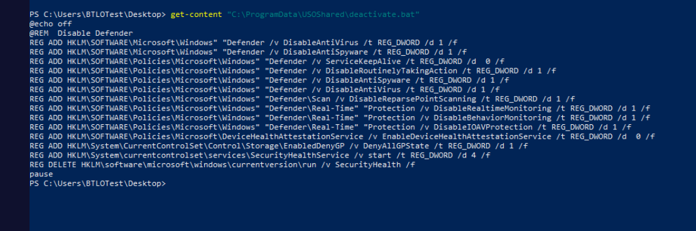

The script systematically disables Windows Defender via a chain of registry writes across multiple Defender policy paths — disabling real-time monitoring, antispyware, antivirus, behaviour monitoring, and IOAV protection. It concludes by removing the Defender health check from the Run key entirely:

```
REG DELETE HKLM\software\microsoft\windows\currentversion\run /v SecurityHealth /f
pause
```

The second-to-last command is the `REG DELETE` line — `pause` is the final entry. This sequence ensures Defender cannot restart after reboot and leaves no health tray icon to alert the user.

### Stage 8 — Variant Research

Chaos Ransomware v5.2 was rebranded in early 2022 as **Yashma** — a more capable variant with improved evasion and broader targeting. Identifying the lineage matters for threat intel correlation: IOCs, TTPs, and builder artefacts from Chaos v5.x investigations are directly applicable to Yashma detections.

---

## Attack Summary

|Phase|Action|
|---|---|
|Initial Access|Chaos Ransomware Builder v5.2 deployed; archive password BTL0_C3_D4ve!|
|Discovery|Masquerades as svchost.exe; targets 230 file extensions|
|Execution|UnleashMayhem.exe deployed to AppData\Local\Mystery\|
|Encryption|Files <1368709120 bytes AES encrypted; larger files overwritten with ?|
|Persistence (Ransomware)|HKCU Run key: Microsoft Store → UnleashMayhem.exe location|
|Persistence (Attacker)|HKLM Run key: Scripty → C:\ProgramData\USOShared\deactivate.bat|
|Defense Evasion|deactivate.bat disables all Defender components and removes SecurityHealth Run entry|
|Extortion|READMENOW.txt dropped; DLS at hxxp[://]Cha0t1cEv1L[.]btlo demands 0.24356 BTC|
|Inhibit Recovery|deleteShadowCopies, disableRecoveryMode, deleteBackupCatalog called in Main()|

---

## IOCs

|Type|Value|
|---|---|
|File (Builder)|Chaos Ransomware Builder v5.2.exe|
|File (Payload)|C:\Users\BTLOTest\AppData\Local\Mystery\UnleashMayhem.exe|
|File (Persistence)|C:\ProgramData\USOShared\deactivate.bat|
|File (Ransom Note)|READMENOW.txt|
|Registry Key|HKCU\SOFTWARE\Microsoft\Windows\CurrentVersion\Run|
|Registry Value (Ransomware)|Microsoft Store|
|Registry Value (Attacker)|Scripty|
|URL (DLS)|hxxp[://]Cha0t1cEv1L[.]btlo|
|Crypto Address|bc1qa5wkgaew2dkv56kfvj49j0av5nml45x9ek9hz6|
|Ransom Demand|0.24356 BTC|
|Archive Password|BTL0_C3_D4ve!|
|Masquerade Process|svchost.exe|

---

## MITRE ATT&CK

|Technique|ID|Description|
|---|---|---|
|Data Encrypted for Impact|T1486|AES encryption of files <1368709120 bytes; overwrite with ? for larger files|
|Boot or Logon Autostart: Registry Run Keys|T1547.001|Ransomware writes Microsoft Store Run key; attacker writes Scripty Run key|
|Masquerading: Match Legitimate Name|T1036.005|Payload masquerades as svchost.exe; persistence bat hidden in USOShared|
|Impair Defenses: Disable or Modify Tools|T1562.001|deactivate.bat disables all Defender components via registry|
|Inhibit System Recovery|T1490|Shadow copies deleted; recovery mode disabled; backup catalog deleted|
|Obfuscated Files or Information|T1027|Builder password-protected; payload hidden in non-standard AppData subdirectory|
|File and Directory Discovery|T1083|Recursive file enumeration to build encryption target list|
|Process Discovery|T1057|Masquerades as svchost.exe to blend into process listings|

---

## Defender Takeaways

**YARA as a hunting primitive** — The Chaos v5.2 builder embeds distinctive string artefacts (`CustomWindowsForm`, `MyApplication.app`, the extension list) that survive into deployed payloads. A two-condition YARA rule requiring only two of these strings provides resilient coverage even if individual strings are stripped during build customisation. Adding builder-derived YARA rules to endpoint tooling surfaces deployed payloads that would otherwise evade signature-based detection.

**Run key anomaly detection** — Both persistence entries exploited the Run key under innocuous names (`Microsoft Store`, `Scripty`). Run key monitoring with allowlisting of known-good entries would have flagged both writes immediately. Value names referencing legitimate software that don't resolve to expected binary paths are high-fidelity indicators.

**Large file destruction over encryption** — The `?` overwrite behaviour on files above 1.3GB means no decryption is possible even with the key. This makes backup strategy more critical than any decryption capability: organisations without tested offline backups have no recovery path for large files even after paying the ransom.

**Defender tampering as a pre-encryption signal** — `deactivate.bat` runs before encryption begins. The registry writes across `HKLM\SOFTWARE\Policies\Microsoft\Windows\Defender` are noisy and detectable — a SIEM rule alerting on bulk Defender policy key modifications would provide pre-encryption warning. Protecting these keys via Tamper Protection makes the script's approach fail entirely without elevated access.

**Double extortion via DLS** — The DLS is embedded as a hardcoded string in the binary and deployed as a functional site within the lab. Organisations should assume that any ransomware infection also involves exfiltration — incident response scope must include data loss assessment, not just encryption recovery. Network egress monitoring and DLP controls are the relevant preventive layer.


---

<div class="qa-item"> <div class="qa-question-text">Question 1) Using your blue team skills, crack the password to the builder and identify the name of the malware which has infected the system (Format: Password, Malware Name)</div> <div class="flag-reveal"> <input type="checkbox"> <span class="r-placeholder">Click flag to reveal</span> <span class="r-answer">BTL0_C3_D4ve!, Chaos Ransomware</span> <button class="copy-btn" onclick="event.stopPropagation();navigator.clipboard.writeText(this.previousElementSibling.textContent);this.textContent='copied';setTimeout(()=>this.textContent='copy',1500)">copy</button> </div> </div>

<div class="qa-item"> <div class="qa-question-text">Question 2) What is the default process that the malware masquerades as? How many extensions are included in the infection list? (Format: Process.ext, Number)</div> <div class="answer-reveal"> <input type="checkbox"> <span class="r-placeholder">Click to reveal answer</span> <span class="r-answer">svchost.exe, 230</span> <button class="copy-btn" onclick="event.stopPropagation();navigator.clipboard.writeText(this.previousElementSibling.textContent);this.textContent='copied';setTimeout(()=>this.textContent='copy',1500)">copy</button> </div> </div>

<div class="qa-item"> <div class="qa-question-text">Question 3) A piece of malware is hidden somewhere on the system and you must develop your own custom Yara rule to detect and locate the sample. Provide the path to the file and the associated name (Format: X:\..\..\..\..\..\..\file.ext)</div> <div class="flag-reveal"> <input type="checkbox"> <span class="r-placeholder">Click flag to reveal</span> <span class="r-answer">c:\\Users\BTLOTest\AppData\Local\Mystery\UnleashMayhem.exe</span> <button class="copy-btn" onclick="event.stopPropagation();navigator.clipboard.writeText(this.previousElementSibling.textContent);this.textContent='copied';setTimeout(()=>this.textContent='copy',1500)">copy</button> </div> </div>

<div class="qa-item"> <div class="qa-question-text">Question 4) Find the Library and Linker which were used in the making of the malware (Format: Library(Name), Linker Used)</div> <div class="answer-reveal"> <input type="checkbox"> <span class="r-placeholder">Click to reveal answer</span> <span class="r-answer">.NET(v4.0.30319), Microsoft Linker</span> <button class="copy-btn" onclick="event.stopPropagation();navigator.clipboard.writeText(this.previousElementSibling.textContent);this.textContent='copied';setTimeout(()=>this.textContent='copy',1500)">copy</button> </div> </div>

<div class="qa-item"> <div class="qa-question-text">Question 5) List the blacklisted functions in Alphabetical order. Also, enter the number of libraries which are imported by the malware (Format: BlackA, BlackB, BlackC, BlackD, Number)</div> <div class="flag-reveal"> <input type="checkbox"> <span class="r-placeholder">Click flag to reveal</span> <span class="r-answer">AddClipboardFormatListener, AES_Encrypt, set_UseShellExecute, SystemParametersInfo, 2</span> <button class="copy-btn" onclick="event.stopPropagation();navigator.clipboard.writeText(this.previousElementSibling.textContent);this.textContent='copied';setTimeout(()=>this.textContent='copy',1500)">copy</button> </div> </div>

<div class="qa-item"> <div class="qa-question-text">Question 6) AES encryption is used for small files, what is the number (in Bytes) in which it checks to see if the files are smaller than? With larger files, what is the character that they are overwritten with? (Format: Bytes, Character)</div> <div class="answer-reveal"> <input type="checkbox"> <span class="r-placeholder">Click to reveal answer</span> <span class="r-answer">1368709120, ?</span> <button class="copy-btn" onclick="event.stopPropagation();navigator.clipboard.writeText(this.previousElementSibling.textContent);this.textContent='copied';setTimeout(()=>this.textContent='copy',1500)">copy</button> </div> </div>

<div class="qa-item"> <div class="qa-question-text">Question 7) A method of persistence allows the author to persist across reboots. Name the location where the new value is created and give the value name (Format: Location\of\registry\key (make double slashes singular), Key Created)</div> <div class="flag-reveal"> <input type="checkbox"> <span class="r-placeholder">Click flag to reveal</span> <span class="r-answer">SOFTWARE\Microsoft\Windows\CurrentVersion\Run, Microsoft Store</span> <button class="copy-btn" onclick="event.stopPropagation();navigator.clipboard.writeText(this.previousElementSibling.textContent);this.textContent='copied';setTimeout(()=>this.textContent='copy',1500)">copy</button> </div> </div>

<div class="qa-item"> <div class="qa-question-text">Question 8) A ransom note is dropped to the user upon execution. What is the URL of their leak site and how much is the ransom demand? (Format: http://xxx.xxx, X.XXXXX XXX)</div> <div class="answer-reveal"> <input type="checkbox"> <span class="r-placeholder">Click to reveal answer</span> <span class="r-answer">http://Cha0t1cEv1L.btlo, 0.24356 BTC</span> <button class="copy-btn" onclick="event.stopPropagation();navigator.clipboard.writeText(this.previousElementSibling.textContent);this.textContent='copied';setTimeout(()=>this.textContent='copy',1500)">copy</button> </div> </div>

<div class="qa-item"> <div class="qa-question-text">Question 9) Navigate to the Leak Site within the lab environment (adding :8080 to the end), and list the 3 victims who have had their data leaked by the APT group in the order of which they appear (Format: VictimA, VictimB, VictimC)</div> <div class="flag-reveal"> <input type="checkbox"> <span class="r-placeholder">Click flag to reveal</span> <span class="r-answer">smicrocroft, smesla, smacebook</span> <button class="copy-btn" onclick="event.stopPropagation();navigator.clipboard.writeText(this.previousElementSibling.textContent);this.textContent='copied';setTimeout(()=>this.textContent='copy',1500)">copy</button> </div> </div>

<div class="qa-item"> <div class="qa-question-text">Question 10) The malicious actor managed to create a persistence method before the computer was turned off. Enter the value created by the actor and the value data (Format: Value, ValueData (no quotes))</div> <div class="answer-reveal"> <input type="checkbox"> <span class="r-placeholder">Click to reveal answer</span> <span class="r-answer">Scripty, C:\ProgramData\USOShared\deactivate.bat</span> <button class="copy-btn" onclick="event.stopPropagation();navigator.clipboard.writeText(this.previousElementSibling.textContent);this.textContent='copied';setTimeout(()=>this.textContent='copy',1500)">copy</button> </div> </div>

<div class="qa-item"> <div class="qa-question-text">Question 11) What is the second last command executed by the persistence method? (Format: Full command)</div> <div class="flag-reveal"> <input type="checkbox"> <span class="r-placeholder">Click flag to reveal</span> <span class="r-answer">REG DELETE HKLM\software\microsoft\windows\currentversion\run /v SecurityHealth /f</span> <button class="copy-btn" onclick="event.stopPropagation();navigator.clipboard.writeText(this.previousElementSibling.textContent);this.textContent='copied';setTimeout(()=>this.textContent='copy',1500)">copy</button> </div> </div>

<div class="qa-item"> <div class="qa-question-text">Question 12) As of early 2022, a new variant of this ransomware has been released under a new name. Perform research into the ransomware to locate the new name that has been assigned to the latest variant (Format: NewName)</div> <div class="answer-reveal"> <input type="checkbox"> <span class="r-placeholder">Click to reveal answer</span> <span class="r-answer">Yashma</span> <button class="copy-btn" onclick="event.stopPropagation();navigator.clipboard.writeText(this.previousElementSibling.textContent);this.textContent='copied';setTimeout(()=>this.textContent='copy',1500)">copy</button> </div> </div>

