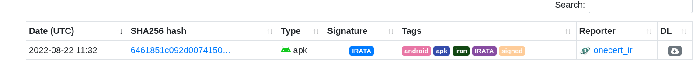
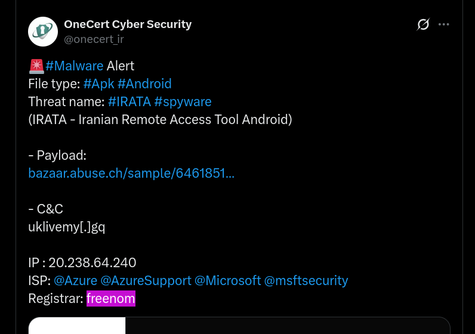
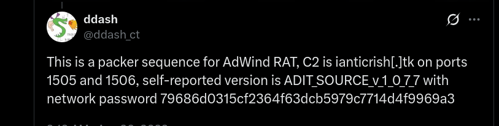
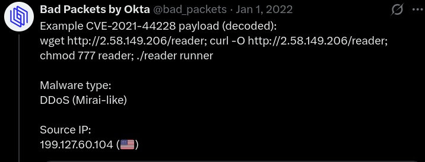

## Overview

Foxy is a threat intelligence lab centred around analysing ThreatFox CSV export files using command-line tooling. The investigation covers a range of malware families including CobaltStrike, IRATA Android RAT, AdWind/JAR RAT, Dridex, and Log4Shell exploitation. The workflow involves grep, wc, and Gnumeric to interrogate large threat feed datasets, cross-referenced against external sources including MalwareBazaar, Joe Sandbox, and Twitter/X threat researcher posts.

---

## Investigation

### CobaltStrike Beacon — dot.gif C2

The SOC flagged outbound connections from three internal hosts to `hxxp://45[.]63[.]126[.]199/dot[.]gif`. Grepping the ThreatFox exports confirmed the indicator:

bash

```zsh
cat * | grep -i 45.63.126.199/dot.gif
```

The result returned a high-confidence (100) ThreatFox entry tagging the URL as a CobaltStrike botnet C2, with aliases including BEACON, Agentemis, and cobeacon. This is a classic CobaltStrike staging pattern — a benign-looking GIF endpoint masking C2 traffic.

To determine the full scope of dot.gif usage across all export files:

bash

```zsh
cat * | grep -i dot.gif | wc
```

**Result: 568 URLs** referencing the dot.gif endpoint across all exports.

---

### IRATA Android RAT — Executive Device

A SHA256 hash detected and quarantined on an executive's Android device was submitted for analysis:

`6461851c092d0074150e4e56a146108ae82130c22580fb444c1444e7d936e0b5`

MalwareBazaar identified the sample as **IRATA** — an Android banking trojan/RAT. Following the reference link to a Twitter/X post from a threat researcher provided additional context on the infrastructure:


|Indicator|Value|
|---|---|
|Threat Name|IRATA|
|C2 Domain|`uklivemy[.]gq`|
|C2 IP|`20[.]238[.]64[.]240`|
|Registrar|Freenom|

The Joe Sandbox analysis at `hxxps://www[.]joesandbox[.]com/analysis/1319345/1/html` was reviewed for MITRE ATT&CK Collection techniques. The following five techniques were identified under the Collection tactic in alphabetical order:

- Access Contact List
- Access Stored Application Data
- Capture SMS Messages
- Location Tracking
- Network Information Discovery

This indicates IRATA has significant data harvesting capability targeting mobile devices — contacts, SMS, location, stored app data, and network enumeration. High risk to an executive device with access to sensitive communications.

---

### AdWind JAR RAT — 192.236.198.236

A junior analyst flagged outbound connections to `192[.]236[.]198[.]236` without further investigation. Grepping the ThreatFox IP:port exports:


```zsh
cat * | grep -i "192.236.198.236"
```

The IP was identified as a botnet C2 for **AdWind** (also known as AlienSpy, JSocket, Frutas, UNRECOM, JBifrost, Sockrat) — a Java-based cross-platform RAT. Two ports were in use:

- Port **1505**
- Port **1506**

The reference link pointed to a Twitter/X post from `@ddash_ct` providing the C2 domain: `ianticrish[.]tk`

The likely delivery method into the organisation was **Phishing (T1566)**. Further investigation of the reference material identified the weaponised Word document used for delivery:

**Filename:** `08.2022 pazartesi sipari#U015fler.docx`

This document dropped the following JAR payload:

**JAR:** `NMUWYTGOKCTUFSVCHRSLKJYOWPRFSYUECNLHFLTBLFKVTIJJMQ.jar`

---

### Discord CDN Abuse — Dridex Distribution

Discord's CDN has been observed being abused for malware hosting and distribution. The relevant CDN base URL is:

`hxxps://cdn[.]discordapp[.]com/attachments`

Counting references across all export files:

bash

```bash
cat * | grep -c "https://cdn.discordapp.com/"
```

**Result: 565 rows** referencing the Discord CDN. The malware family being widely distributed via this infrastructure is **Dridex** — a prolific banking trojan.

---

### High-Confidence Blocking — full_urls.csv

When evaluating indicators for proactive blocking on a web proxy, confidence rating is critical to avoid blocking legitimate traffic. Filtering full_urls.csv for confidence rating of 100:

bash

```zsh
cat full_urls.csv | grep -c '"100",'
```

**Result: 39,993 rows** with a confidence rating of 100 — safe candidates for web proxy blocking.

---

### Log4Shell Exploitation — CVE-2021-44228

An analyst reported suspicious activity from an IP using source port 8001. Filtering `full_ip-port.csv` in Gnumeric for `malware_printable = Unknown malware` and port 8001 identified:

**IP:** `107[.]172[.]214[.]23`

The reference link pointed to a Twitter/X post from `@bad_packets` confirming the IP was attempting to exploit **CVE-2021-44228** — better known as **Log4Shell**. A critical unauthenticated RCE vulnerability in Apache Log4j reported in November 2021, weaponised almost immediately in the wild via rogue LDAP callbacks.

---

## IOCs

|Type|Value|
|---|---|
|URL|`hxxp://45[.]63[.]126[.]199/dot[.]gif`|
|IP|`45[.]63[.]126[.]199`|
|SHA256|`6461851c092d0074150e4e56a146108ae82130c22580fb444c1444e7d936e0b5`|
|Domain|`uklivemy[.]gq`|
|IP|`20[.]238[.]64[.]240`|
|IP:Port|`192[.]236[.]198[.]236:1505`|
|IP:Port|`192[.]236[.]198[.]236:1506`|
|Domain|`ianticrish[.]tk`|
|URL|`hxxps://cdn[.]discordapp[.]com/attachments`|
|IP|`107[.]172[.]214[.]23`|
|CVE|CVE-2021-44228|

---

## MITRE ATT&CK

|Technique|ID|
|---|---|
|Phishing|T1566|
|Ingress Tool Transfer|T1105|
|Command and Scripting Interpreter|T1059|
|Collection — Mobile (Access Contact List, Capture SMS, Location Tracking)|Various|
|Exploit Public-Facing Application (Log4Shell)|T1190|

---

## Lessons Learned

ThreatFox export analysis is a practical skill for proactive threat hunting and indicator enrichment. Grep and wc are sufficient for large dataset interrogation at L1/L2 level — no complex tooling required. Cross-referencing ThreatFox entries with Twitter/X threat researcher posts and sandbox reports (Joe Sandbox, MalwareBazaar) is standard enrichment workflow. Discord CDN abuse for payload delivery is well-documented and worth implementing as a detection rule. High-confidence (100) ThreatFox indicators should be fed directly into proxy blocklists as part of a proactive threat intel pipeline.


---

 

 

 





 

 



 

 



 

 

 

 

