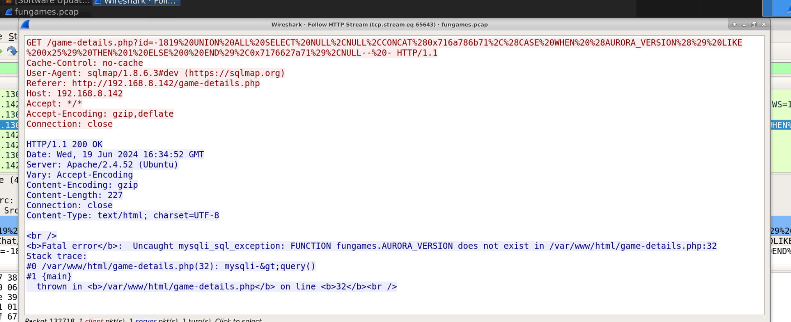
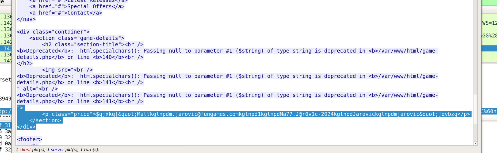
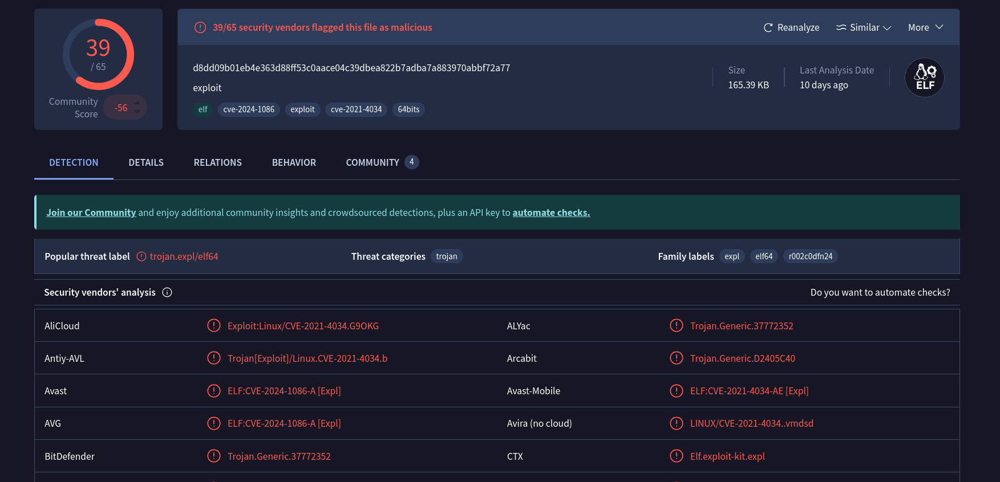

## Overview

FunTech Inc. have provided a PCAP from their FunGames e-commerce platform following a suspected breach. The task is to trace the full attack chain from initial access through to data exfiltration, identifying the tools, techniques, and data involved.

- **Attacker:** `192[.]168[.]8[.]130`
- **Victim:** `192[.]168[.]8[.]142`

---

## Investigation

### Initial Access — SQLi via sqlmap

Filtering for HTTP traffic immediately reveals a high volume of GET requests from the attacker to `/game-details.php` with heavily URL-encoded payloads — classic sqlmap fingerprinting and enumeration. The User-Agent header confirms the tool:

```
User-Agent: sqlmap/1.8.6.3#dev (https://sqlmap.org)
```

The attacker was injecting into the `id` parameter using UNION-based blind SQLi, probing the database version and enumerating tables.



**Key Wireshark tip:** Rather than manually scrolling hundreds of sqlmap requests, use **Edit → Find Packet → String (Packet Bytes)** to search for terms like `username` or `password` to locate the exact stream containing the credential dump.

### Credential Extraction

One of the successful UNION SELECT responses returned data from the users table. The sqlmap delimiter `kglnpd` separates the concatenated columns in the response, embedded inside the page HTML:

```
$qjxkq["Mattkglnpdm.jarovic@fungames.comkglnpd1kglnpdMa77.J@r0v1c-2024kglnpdJarovickglnpdmjarovic"]qvbzq
```

Parsing out the sqlmap delimiters reveals:

- **Name:** Matt Jarovic
- **Email:** `mjarovic@fungames[.]com`
- **Password:** `Ma77.J@r0v1c-2024`


### Post-Exploitation — SSH Access and Privilege Escalation

With valid credentials in hand, the attacker authenticated to the victim over SSH. To escalate from the user account to root, a file named **`exploit`** was transferred to the victim machine — a 64-bit ELF statically linked binary:

```
exploit: ELF 64-bit LSB executable, x86-64, version 1 (SYSV), statically linked, stripped
```

**SHA256:** `d8dd09b01eb4e363d88ff53c0aace04c39dbea822b7adba7a883970abbf72a77`

Submitting the hash to VirusTotal identifies this as a proof-of-concept exploit for **CVE-2024-1086** — a use-after-free vulnerability in the Linux kernel's `nf_tables` netfilter component, allowing local privilege escalation to root.


### Exfiltration — Credit Card Data over DNS

With root access established, the attacker exfiltrated sensitive customer data without transferring any files. The key filter to find post-compromise traffic:

```bash
ip.src == 192.168.8.142 && !ssh && !http
```

This reveals a single **malformed DNS query** from the victim to the attacker — DNS exfiltration. The query carries the stolen data hex-encoded in the query name:

```
j4672616e6b204d696c6c7320313233343536373839313233343536372065787020646174652030382f32382063767620313233200a
```

Decoding with Python (stripping the leading `j` label byte):

````zsh
python3 -c "print(bytes.fromhex('4672616e6b204d696c6c7320313233343536373839313233343536372065787020646174652030382f32382063767620313233200a').decode())"
```

**Output:**
```
Frank Mills 1234567891234567 exp date 08/28 cvv 123
````

A customer's full credit card details — number, expiry, and CVV — exfiltrated in a single DNS packet with no file transfer, no HTTP POST, and no obvious C2 traffic. The technique maps to **T1071.004** — Application Layer Protocol: DNS.


## Lessons Learned

The biggest time sink in this lab was manually scrolling through sqlmap's noise. sqlmap generates hundreds of requests during enumeration — trying to visually identify the one successful credential dump by hand is painful. The fix is simple:

**Edit → Find Packet → Packet Bytes → String → `username`**

That jumps straight to the relevant stream. Same approach works for any keyword you're hunting — `password`, `admin`, `SELECT`, etc. Get comfortable with packet search before reaching for display filters.

The DNS exfil piece reinforces another good habit — always check what the victim machine is talking to _after_ the main attack traffic. Filtering:

```
ip.src == 192.168.8.142 && !ssh && !http
```

Strips away all the noise and surfaces the one malformed DNS packet that would otherwise be invisible in a sea of sqlmap requests. A single DNS query containing a customer's full CC details is easy to miss if you're not looking for traffic anomalies beyond the obvious attack vectors.

---

## IOCs

|Type|Value|
|---|---|
|IP — Attacker|`192[.]168[.]8[.]130`|
|IP — Victim|`192[.]168[.]8[.]142`|
|Compromised credentials|`mjarovic@fungames[.]com` / `Ma77.J@r0v1c-2024`|
|Exploit binary|`exploit`|
|Exploit SHA256|`d8dd09b01eb4e363d88ff53c0aace04c39dbea822b7adba7a883970abbf72a77`|
|CVE|CVE-2024-1086|
|Exfiltrated data|Frank Mills — CC `1234567891234567` exp `08/28` CVV `123`|
|Exfil method|DNS hex encoding|

---

<div class="qa-item"> <div class="qa-question-text">What is the IP address of the attacker who is performing the attack?</div> <div class="flag-reveal"> <input type="checkbox"> <span class="r-placeholder">Click flag to reveal</span> <span class="r-answer">192.168.8.130</span> <button class="copy-btn" onclick="event.stopPropagation();navigator.clipboard.writeText(this.previousElementSibling.textContent);this.textContent='copied';setTimeout(()=>this.textContent='copy',1500)">copy</button> </div> </div>

<div class="qa-item"> <div class="qa-question-text">What is the IP address of the victim?</div> <div class="answer-reveal"> <input type="checkbox"> <span class="r-placeholder">Click to reveal answer</span> <span class="r-answer">192.168.8.142</span> <button class="copy-btn" onclick="event.stopPropagation();navigator.clipboard.writeText(this.previousElementSibling.textContent);this.textContent='copied';setTimeout(()=>this.textContent='copy',1500)">copy</button> </div> </div>

<div class="qa-item"> <div class="qa-question-text">Which attack was performed by the attacker?</div> <div class="flag-reveal"> <input type="checkbox"> <span class="r-placeholder">Click flag to reveal</span> <span class="r-answer">sqli</span> <button class="copy-btn" onclick="event.stopPropagation();navigator.clipboard.writeText(this.previousElementSibling.textContent);this.textContent='copied';setTimeout(()=>this.textContent='copy',1500)">copy</button> </div> </div>

<div class="qa-item"> <div class="qa-question-text">Q4) It seems the attacker used a famous tool to perform the attack</div> <div class="answer-reveal"> <input type="checkbox"> <span class="r-placeholder">Click to reveal answer</span> <span class="r-answer">sqlmap</span> <button class="copy-btn" onclick="event.stopPropagation();navigator.clipboard.writeText(this.previousElementSibling.textContent);this.textContent='copied';setTimeout(()=>this.textContent='copy',1500)">copy</button> </div> </div>

<div class="qa-item"> <div class="qa-question-text">Q5) In one of the packets, it is possible to view the victim's username and password</div> <div class="flag-reveal"> <input type="checkbox"> <span class="r-placeholder">Click flag to reveal</span> <span class="r-answer">ANSWER</span> <button class="copy-btn" onclick="event.stopPropagation();navigator.clipboard.writeText(this.previousElementSibling.textContent);this.textContent='copied';setTimeout(()=>this.textContent='copy',1500)">copy</button> </div> </div>

<div class="qa-item"> <div class="qa-question-text">Q6) Once the attacker obtained the victim's credentials he accessed the system via SSH. To gain root privileges, they transferred a file to the victim's machine. What is the name of the file?</div> <div class="answer-reveal"> <input type="checkbox"> <span class="r-placeholder">Click to reveal answer</span> <span class="r-answer">exploit</span> <button class="copy-btn" onclick="event.stopPropagation();navigator.clipboard.writeText(this.previousElementSibling.textContent);this.textContent='copied';setTimeout(()=>this.textContent='copy',1500)">copy</button> </div> </div>

<div class="qa-item"> <div class="qa-question-text">Q7) What is the sha256 hash of the file above?</div> <div class="flag-reveal"> <input type="checkbox"> <span class="r-placeholder">Click flag to reveal</span> <span class="r-answer">d8dd09b01eb4e363d88ff53c0aace04c39dbea822b7adba7a883970abbf72a77</span> <button class="copy-btn" onclick="event.stopPropagation();navigator.clipboard.writeText(this.previousElementSibling.textContent);this.textContent='copied';setTimeout(()=>this.textContent='copy',1500)">copy</button> </div> </div>

<div class="qa-item"> <div class="qa-question-text">Q8) With which CVE is this type of vulnerability identified?</div> <div class="answer-reveal"> <input type="checkbox"> <span class="r-placeholder">Click to reveal answer</span> <span class="r-answer">cve-2024-1086</span> <button class="copy-btn" onclick="event.stopPropagation();navigator.clipboard.writeText(this.previousElementSibling.textContent);this.textContent='copied';setTimeout(()=>this.textContent='copy',1500)">copy</button> </div> </div>

<div class="qa-item"> <div class="qa-question-text">Q9) After obtaining root privileges, it seems that the attacker exfiltrated sensitive data without transferring any files. Provide the string related to this data</div> <div class="flag-reveal"> <input type="checkbox"> <span class="r-placeholder">Click flag to reveal</span> <span class="r-answer">j4672616e6b204d696c6c7320313233343536373839313233343536372065787020646174652030382f32382063767620313233200a</span> <button class="copy-btn" onclick="event.stopPropagation();navigator.clipboard.writeText(this.previousElementSibling.textContent);this.textContent='copied';setTimeout(()=>this.textContent='copy',1500)">copy</button> </div> </div>

<div class="qa-item"> <div class="qa-question-text">Q10) It seems that the string has been encoded. What data did the attacker manage to obtain through exfiltration?</div> <div class="answer-reveal"> <input type="checkbox"> <span class="r-placeholder">Click to reveal answer</span> <span class="r-answer">Frank Mills 1234567891234567 exp date 08/28 cvv 123 </span> <button class="copy-btn" onclick="event.stopPropagation();navigator.clipboard.writeText(this.previousElementSibling.textContent);this.textContent='copied';setTimeout(()=>this.textContent='copy',1500)">copy</button> </div> </div>

<div class="qa-item"> <div class="qa-question-text">Q11) Provide the Mitre ID of this technique—in regard to the previous question</div> <div class="flag-reveal"> <input type="checkbox"> <span class="r-placeholder">Click flag to reveal</span> <span class="r-answer">T1071.004</span> <button class="copy-btn" onclick="event.stopPropagation();navigator.clipboard.writeText(this.previousElementSibling.textContent);this.textContent='copied';setTimeout(()=>this.textContent='copy',1500)">copy</button> </div> </div>

