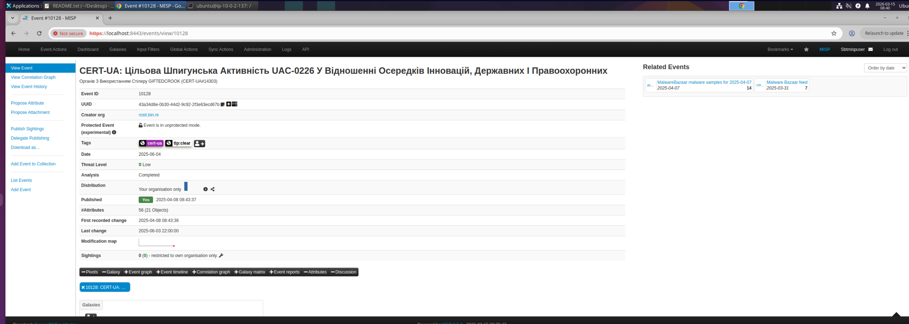
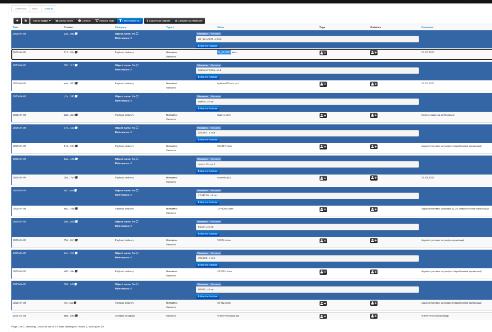

Scenario

Scenario

You have recently joined the Cyber Threat Intelligence (CTI) team at a mid-sized organization. Your manager asks you to get familiar with MISP, the organization's threat intelligence platform. You’ve been given access to a MISP instance containing threat events, tags, and correlations. Your task is to explore the platform and answer key questions that reflect day-to-day intelligence work. Optional task: This lab provides a fillable Threat Intelligence Template. This can be used to get the full experience of communicating your findings as an Analyst.

we are given access to a MISP, the event we are after is event ID 10128

## Threat Intelligence Summary Report

### 1. Executive Summary

**Event Title:** CERT-UA: Targeted Espionage Activity UAC-0226 Against Innovation Hubs, Government, and Law Enforcement — Utilizing the GIFTEDCROOK Stealer (CERT-UA#14303)

**Event ID:** 10128

**Date of Publication:** 2025-04-08 08:43:37

**Issuing Country:** Ukraine

**Campaign Identified:** Cyber-Espionage

**Org (Creator):** rcsti.bin.re

**TLP:** tlp:clear

---

### 2. Event Metadata

**2.1 Info Field:**

> CERT-UA: Targeted Espionage Activity UAC-0226 Against Innovation Hubs, Government, and Law Enforcement — Utilizing the GIFTEDCROOK Stealer (CERT-UA#14303)

**2.2 Originating Organization (Org):**

> rcsti.bin.re

This event was published by CERT-UA — the Computer Emergency Response Team of Ukraine — and ingested into the MISP instance via rcsti.bin.re. The campaign targets Ukrainian innovation hubs, government bodies, and law enforcement agencies using a stealer malware strain tracked as GIFTEDCROOK, attributed to threat actor cluster UAC-0226.

---

### 3. Attribute & Object Overview

**3.1 Total Number of Attributes:** 56

**3.2 Total Number of Objects:** 21

**3.3 Number of Unique Attribute Categories:** 4

The event contains 56 attributes structured across 21 MISP objects. The four unique attribute categories observed are consistent with a payload-delivery focused event: Payload delivery, Artifacts dropped, Network activity, and External analysis. The high ratio of objects to attributes indicates most IOCs are grouped into file objects (md5 + sha256 + filename triads), reflecting structured ingestion from the original CERT-UA advisory.

---

### 4. File & Payload Indicators

**4.1 Unique File Extensions Found (alphabetical):**

`.ps1, .xlsm, .zip`

Three distinct file types are present across the event attributes. The `.xlsm` files serve as the initial lure documents — macro-enabled Excel workbooks weaponised for payload delivery. The `.ps1` scripts handle post-open execution, and the `.zip` archive is the artifact dropped at the start of infection.

**4.2 Office Documents Identified:** 9

Nine macro-enabled Excel workbooks (`.xlsm`) were identified across the event attributes. These files are used as phishing lures themed around administrative fines and government notifications — a social engineering technique consistent with UAC-0226's documented TTPs targeting Ukrainian public sector employees. Filenames include numeric identifiers and Cyrillic-named variants such as `майно.xlsm` (property) suggesting localised targeting.

**4.3 Script File Names (alphabetical):**

`kpbbknwf32mm.ps1, nnnnrth.ps1`

Both scripts carry randomised names consistent with obfuscation tradecraft. These PowerShell scripts are likely responsible for staging or executing the GIFTEDCROOK stealer payload post-macro execution.

**4.4 Dropped Artifact Location & Name:**

`status.zip, %TMP%\nmpoyqv5l0ig\`

A zip archive named `status.zip` is dropped into a randomly-named subdirectory under the user's `%TMP%` path at the start of infection. The randomised directory name (`nmpoyqv5l0ig`) is a common sandbox-evasion and forensic-obfuscation technique, making the drop location unpredictable across victims.

---
### 5. Network Infrastructure

**5.1 First Command & Control (C2):**

- Defanged IP: `89[.]44[.]9[.]186`
- Port: `3240`

**5.2 Second Command & Control (C2):**

- Defanged IP: `37[.]120[.]239[.]187`
- Port: `6501`

Both C2 endpoints use non-standard ports, consistent with attempts to blend into noisy outbound traffic and avoid signature-based port blocking. The use of two separate C2 nodes suggests redundancy in the adversary's infrastructure — common in state-linked espionage operations.

---

### 6. Enrichment Details

**6.1 Country of First C2 (via ICANN Lookup):**

France — `89[.]44[.]9[.]186` resolves to infrastructure hosted in France, likely a bulletproof or rented VPS used to avoid direct attribution to the threat actor's origin.

**6.2 Country of Second C2 (via ICANN Lookup):**

Netherlands — `37[.]120[.]239[.]187` resolves to Dutch-hosted infrastructure. The Netherlands is a common hosting jurisdiction for threat actors due to permissive hosting providers and high-bandwidth infrastructure.

---

### 7. Classification & Handling

**7.1 TLP Level Assigned:** `tlp:clear`

**7.2 Sharing Restrictions:** None — this event is cleared for public distribution.

---

### 8. Analyst Observations

UAC-0226 / GIFTEDCROOK represents a well-structured phishing-to-stealer pipeline targeting Ukrainian institutions. The lure documents are socially engineered around administrative and legal themes (fines, compensation, property notices) — a technique that exploits the bureaucratic context of government employees rather than relying on generic pretexts.

The use of macro-enabled `.xlsm` files is notable given Microsoft's 2022 decision to block macros by default in Office. This suggests either the targets are running unpatched or legacy Office versions, or the lures are crafted to socially engineer victims into enabling macros manually.

The dual C2 infrastructure hosted across France and the Netherlands is consistent with operational security practices seen in state-nexus APT activity — leveraging European hosting to avoid geolocation-based blocking while maintaining redundancy.

**MITRE ATT&CK references:**

- T1566.001 — Spearphishing Attachment
- T1059.001 — PowerShell
- T1105 — Ingress Tool Transfer
- T1041 — Exfiltration Over C2 Channel

---

**Report compiled by:** Tate Pannam **Analyst Name:** Tate Pannam **Date Submitted:** 2025-03-15

---

 
In Event ID 10128, what country issued the alert? What type of campaign is it tied to?
 
 <input type="checkbox"> Click flag to reveal Ukraine, Cyber-Espionage 
 

 
What is the date the event was published? What is the Org (creator organization) of this event?
 
 <input type="checkbox"> Click to reveal answer 2025-04-08 08:43:37, rcsti.bin.re 
 

 
How many Attributes are in this event? How many objects are in this event?
 
 <input type="checkbox"> Click flag to reveal 56, 21 
 

 
How many unique categories are in the attributes section?
 
 <input type="checkbox"> Click to reveal answer 4 
 

 
What are the unique file extension IOCs we can extract from this event? Arrange in alphabetical order.
 
 <input type="checkbox"> Click flag to reveal .ps1, .xmls, .zip 
 

 
What is the total number of office documents included in the event attributes?
 
 <input type="checkbox"> Click to reveal answer 9 
 

 
What are the file names of the scripts included in the event attributes? Arrange in alphabetical order
 
 <input type="checkbox"> Click flag to reveal kpbbknwf32mm.ps1, nnnnrth.ps1 
 

 
According to this event, an artifact was dropped at the start of infection. What is the file name and the path?
 
 <input type="checkbox"> Click to reveal answer status.zip, %TMP%\nmpoyqv5l0ig\ 
 

 
According to this event, A C2 was established. What is the first IP and Port used by the adversary? Use the defanged IP recipe by CyberChef.
 
 <input type="checkbox"> Click flag to reveal 89[.]44[.]9[.]186, 3240 
 

 
What is the second IP and Port used by the adversary in this campaign? Use the defanged IP recipe by CyberChef.
 
 <input type="checkbox"> Click to reveal answer 37[.]120[.]239[.]187, 6501 
 

 
Perform IOC enrichment using ICANN IP Lookup for the first C2. In what country is this IP located?
 
 <input type="checkbox"> Click flag to reveal france 
 

 
Perform IOC enrichment using ICANN IP Lookup for the second C2. In what country is this IP located?
 
 <input type="checkbox"> Click to reveal answer netherlands 
 

 
Lastly, what is the TLP tag assigned to this event?
 
 <input type="checkbox"> Click flag to reveal tlp:clear 
 

