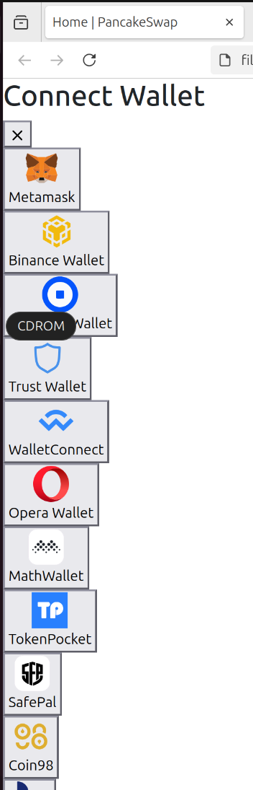
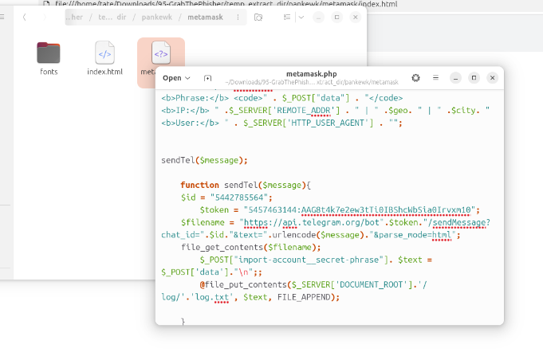
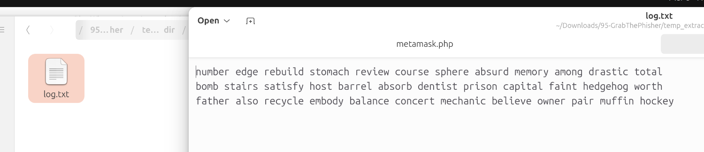

## MITRE ATT&CK

| ID | Technique | Tactic |
|---|---|---|
| T1566.002 | Phishing — Spearphishing Link | Initial Access |
| T1059.004 | Command and Scripting Interpreter — PHP | Execution |
| T1041 | Exfiltration Over C2 Channel | Exfiltration |
| T1592 | Gather Victim Host Information | Reconnaissance |
| T1078 | Valid Accounts (seed phrase theft) | Credential Access |

---

## Scenario

A decentralised finance (DeFi) platform reported multiple user complaints about unauthorised fund withdrawals. A forensic review uncovered a phishing site impersonating the legitimate PancakeSwap exchange — luring victims into entering their wallet seed phrases. The phishing kit was hosted on a compromised server and exfiltrated credentials via a Telegram bot. The objective was to conduct threat intelligence analysis on the phishing infrastructure, identify IOCs, and track the attacker's online presence including aliases and Telegram identifiers.

---

## Tooling

- Browser-based static analysis of phishing kit source files
- Telegram Bot API
- SypexGeo API review

---

## Investigation Findings

### 1. Phishing Kit Structure

The extracted phishing kit impersonated PancakeSwap's wallet connection interface. The kit presents victims with a "Connect Wallet" dialogue offering multiple wallet options — Metamask, Binance Wallet, Trust Wallet, WalletConnect, and others. However, only the **Metamask** option was functional and routed victims to the credential harvesting page.

The phishing flow is designed to request the victim's wallet seed phrase under the guise of "importing an account."

---



### 2. Malicious Code Analysis

The core phishing logic resided in **`metamask.php`** — a PHP script that handled seed phrase collection, geolocation enrichment, and Telegram exfiltration.

Key functionality in `metamask.php`:

- Captures submitted seed phrases via `$_POST["import-account__secret-phrase"]`
- Calls `http://api.sypexgeo.net/json/` to retrieve victim geolocation data (country, city) and date
- Enriches the log message with victim IP via `$_SERVER['REMOTE_ADDR']` and user agent via `$_SERVER['HTTP_USER_AGENT']`
- Appends collected credentials to `log/log.txt` on the server
- Immediately exfiltrates the seed phrase to a Telegram bot via `sendTel()`

The `sendTel()` function constructs a Telegram Bot API call to deliver each captured seed phrase directly to the attacker's channel in real time.

---
### 3. Credential Harvest

Inspection of `log.txt` revealed **3 seed phrases** had already been collected prior to analysis. An example recovered phrase:

> `father also recycle embody balance concert mechanic believe owner pair muffin hockey`

Each entry would have been accompanied by victim IP, geolocation, and user agent — giving the attacker enough context to target victims geographically or by browser fingerprint.


example `father also recycle embody balance concert mechanic believe owner pair muffin hockey`

---

### 4. C2 Infrastructure — Telegram Exfiltration

The kit used the Telegram Bot API as its C2 exfiltration channel — a common technique as Telegram traffic blends into normal HTTPS traffic and the bot API requires no infrastructure beyond an account.

Extracted from `metamask.php`:

```
Bot Token : 5457463144:AAG8t4k7e2ew3tTi0IBShcWbSia0Irvxm10
Chat ID   : 5442785564
```

The `sendMessage` endpoint was called with each new victim submission, meaning the attacker received seed phrases in real time via their Telegram client.

---
### 5. Attribution

The phishing kit contained a developer signature embedded in the source:

```
j1j1b1s@m3r0
```

This alias represents the kit developer or seller. Phishing kits are commonly sold or shared in underground markets — this signature is used to identify the original author and may appear across multiple campaigns using the same kit.

---

## IOCs 

| Type | Value |
|---|---|
| Telegram Bot Token | `5457463144:AAG8t4k7e[REDACTED]` |
| Telegram Chat ID | `5442785564` |
| Phishing File | `metamask.php` |
| Geolocation API | `http://api.sypexgeo[.]net/json/` |
| Kit Developer Alias | `j1j1b1s@m3r0` |
| Credential Log | `log/log.txt` |
| Impersonated Platform | PancakeSwap (DeFi) |

---
## Conclusion

>The GrabThePhisher kit is a lean, effective PHP-based credential harvester targeting cryptocurrency users via a convincing PancakeSwap impersonation. Seed phrases were exfiltrated immediately via Telegram, bypassing any need for attacker-controlled server infrastructure for C2. The use of SypexGeo for victim enrichment suggests the attacker was profiling targets — potentially for geographic filtering or to avoid collecting from specific regions. The embedded developer alias `j1j1b1s@m3r0` provides an attribution thread for further OSINT.

---





















I successfully completed GrabThePhisher Blue Team Lab at @CyberDefenders!
https://cyberdefenders.org/blueteam-ctf-challenges/achievements/inksec/grabthephisher/
 
#CyberDefenders #CyberSecurity #BlueYard #BlueTeam #InfoSec #SOC #SOCAnalyst #DFIR #CCD #CyberDefender