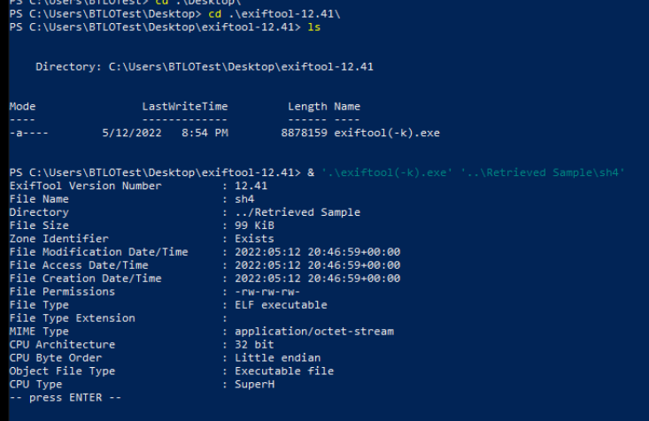
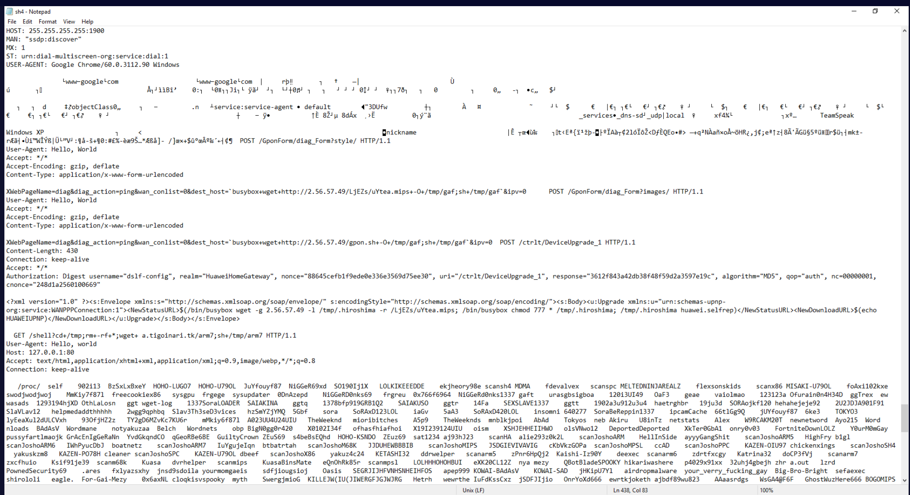

## Overview

A suspicious ELF binary (`sh4`) was found on a server. This lab covers the full indicator extraction workflow — file metadata, download source attribution via Zone Identifiers, hash-based threat intelligence enrichment across MalwareBazaar and VirusTotal, and manual string analysis to extract C2 infrastructure and attacker TTPs.

---

## File Metadata — Exiftool

Running Exiftool against the sample surfaces basic file properties:

```zsh
exiftool sh4
```

- **Filename:** `sh4`
- **File Size:** 98 KB
- **File Type:** ELF executable
- **CPU Architecture:** 32-bit
- **CPU Type:** SuperH

The SuperH architecture is a strong indicator this binary targets embedded/IoT devices — consistent with Mirai botnet variants which notoriously target routers, cameras, and DVRs.


---

## Zone Identifier — Download Source

Windows NTFS Zone Identifiers record where files originated. Querying the alternate data stream:

```powershell
Get-Content .\sh4 -Stream Zone.Identifier
```

Output:
```
[ZoneTransfer]
ZoneId=3
HostUrl=http://2.56.57.49/sh4
````

`ZoneId=3` confirms the file was downloaded from the internet. The `HostUrl` gives us the exact C2 server and path the binary was pulled from:

**`hxxp://2[.]56[.]57[.]49/sh4`**

---

## Hash Enrichment

Retrieving the SHA256 hash for threat intelligence lookups:

powershell

```powershell
Get-FileHash .\sh4
```

**SHA256:** `11B73397473AA2786D4F1E0A556F557CFE2729B194A3E64D38E245428198BE56`

### MalwareBazaar

Searching the full hash on MalwareBazaar confirms the sample is known malware with **6 YARA rules** triggered — covering signatures for Mirai variants and ELF malware families.
[malwarebazaar](https://bazaar.abuse.ch/sample/11b73397473aa2786d4f1e0a556f557cfe2729b194a3e64d38e245428198be56/#yara)
### VirusTotal

The VirusTotal detections page shows multiple vendors flagging this sample as **Mirai** — the notorious IoT botnet that caused major DDoS events including the 2016 Dyn attack. The binary targets SuperH architecture devices for recruitment into the botnet.
[Virustotal](https://www.virustotal.com/gui/file/11b73397473aa2786d4f1e0a556f557cfe2729b194a3e64d38e245428198be56)

---

## Binary String Analysis — Notepad

Opening the binary in Notepad reveals embedded plaintext strings including hardcoded User-Agent values used by the malware's HTTP scanner:

```text
User-Agent: Google Chrome/60.0.3112.90 Windows
User-Agent: Hello, world
User-Agent: python-requests/2.20.0
User-Agent: r00ts3c-owned-you-python-requests/2.20.0
User-Agent: Tsunami/2.0
User-Agent: Messiah/2.0
User-Agent: r00ts3c-owned-you
```

**7 unique User-Agent values** — used to rotate headers during scanning and exploitation to evade basic detection rules.


---

## C2 Infrastructure

### IP-Based C2

The IP `2[.]56[.]57[.]49` is referenced multiple times hosting different payload files. VirusTotal details for this IP showed it running **Apache** as the web server framework — a common choice for simple payload hosting infrastructure. Note: the server is no longer active (1400+ day old lab) so live lookups return no results.

### Domain-Based C2

A secondary GET request in the binary targets a domain rather than a raw IP:

**`a[.]tigoinari[.]tk/arm7`**

Using a domain provides the attacker flexibility to rotate infrastructure while keeping the malware functional — DNS can be updated without recompiling the binary.

---

## Post-Download Execution

After downloading files to the victim device, the binary executes:

```
chmod 777 /tmp/<filename>
```

Files are staged in **`/tmp/`** — a world-writable directory present on virtually all Linux/Unix systems, making it a reliable staging location regardless of the device's configuration. The `chmod 777` makes the downloaded payload executable before running it.

---

## IOCs

|Type|Value|
|---|---|
|Sample Hash (SHA256)|`11B73397473AA2786D4F1E0A556F557CFE2729B194A3E64D38E245428198BE56`|
|C2 IP|`2[.]56[.]57[.]49`|
|C2 Domain|`a[.]tigoinari[.]tk`|
|Payload Path|`/arm7`|
|Staging Directory|`/tmp/`|
|Malware Family|Mirai|

---

<div class="qa-item"> <div class="qa-question-text">Question 1) What is the filename and file syze in KB? (Format: filename, sizeinKB)</div> <div class="flag-reveal"> <input type="checkbox"> <span class="r-placeholder">Click flag to reveal</span> <span class="r-answer">sh4, 98</span> <button class="copy-btn" onclick="event.stopPropagation();navigator.clipboard.writeText(this.previousElementSibling.textContent);this.textContent='copied';setTimeout(()=>this.textContent='copy',1500)">copy</button> </div> </div>

<div class="qa-item"> <div class="qa-question-text">Question 2) Using exiftool, what is the file type? (Format: filetype)</div> <div class="answer-reveal"> <input type="checkbox"> <span class="r-placeholder">Click to reveal answer</span> <span class="r-answer"> ELF executable</span> <button class="copy-btn" onclick="event.stopPropagation();navigator.clipboard.writeText(this.previousElementSibling.textContent);this.textContent='copied';setTimeout(()=>this.textContent='copy',1500)">copy</button> </div> </div>

<div class="qa-item"> <div class="qa-question-text">Question 3) Using exiftool, what is the CPU architecture and CPU type?</div> <div class="flag-reveal"> <input type="checkbox"> <span class="r-placeholder">Click flag to reveal</span> <span class="r-answer">32 bit, SuperH</span> <button class="copy-btn" onclick="event.stopPropagation();navigator.clipboard.writeText(this.previousElementSibling.textContent);this.textContent='copied';setTimeout(()=>this.textContent='copy',1500)">copy</button> </div> </div>

<div class="qa-item"> <div class="qa-question-text">Question 4) Research Zone Identifiers and PowerShell's Get-Content cmdlet. Using this we can find out the exact URL this file was downloaded to the system from. Submit the full URL</div> <div class="answer-reveal"> <input type="checkbox"> <span class="r-placeholder">Click to reveal answer</span> <span class="r-answer">http://2.56.57.49/sh4</span> <button class="copy-btn" onclick="event.stopPropagation();navigator.clipboard.writeText(this.previousElementSibling.textContent);this.textContent='copied';setTimeout(()=>this.textContent='copy',1500)">copy</button> </div> </div>

<div class="qa-item"> <div class="qa-question-text">Question 5) Retrieve the SHA256 hash of the malicious file, submit the first 5 characters</div> <div class="flag-reveal"> <input type="checkbox"> <span class="r-placeholder">Click flag to reveal</span> <span class="r-answer">11B73</span> <button class="copy-btn" onclick="event.stopPropagation();navigator.clipboard.writeText(this.previousElementSibling.textContent);this.textContent='copied';setTimeout(()=>this.textContent='copy',1500)">copy</button> </div> </div>

<div class="qa-item"> <div class="qa-question-text">Question 6) Using the hash value, on your host system search for the full hash on MalwareBazaar. How many YARA rules have triggered on this sample?</div> <div class="answer-reveal"> <input type="checkbox"> <span class="r-placeholder">Click to reveal answer</span> <span class="r-answer">6</span> <button class="copy-btn" onclick="event.stopPropagation();navigator.clipboard.writeText(this.previousElementSibling.textContent);this.textContent='copied';setTimeout(()=>this.textContent='copy',1500)">copy</button> </div> </div>

<div class="qa-item"> <div class="qa-question-text">Question 7) Using the hash value, on your host system search for the full hash on VirusTotal. Based on the detections page, some vendors are flagging this file as it is related to a botnet. What is the name of the botnet?</div> <div class="flag-reveal"> <input type="checkbox"> <span class="r-placeholder">Click flag to reveal</span> <span class="r-answer">Mirai</span> <button class="copy-btn" onclick="event.stopPropagation();navigator.clipboard.writeText(this.previousElementSibling.textContent);this.textContent='copied';setTimeout(()=>this.textContent='copy',1500)">copy</button> </div> </div>

<div class="qa-item"> <div class="qa-question-text">Question 8) Open the sample using Notepad.exe. How many unique User-Agent values are found?</div> <div class="answer-reveal"> <input type="checkbox"> <span class="r-placeholder">Click to reveal answer</span> <span class="r-answer">7</span> <button class="copy-btn" onclick="event.stopPropagation();navigator.clipboard.writeText(this.previousElementSibling.textContent);this.textContent='copied';setTimeout(()=>this.textContent='copy',1500)">copy</button> </div> </div>

<div class="qa-item"> <div class="qa-question-text">Question 9) Still using Notepad, an IP address is referenced multiple times with different files being hosted. Search for 'http://IPHERE' on VirusTotal and look at the Details page (if it is not shown here, try other sites such as Shodan). What is the server framework in use?</div> <div class="flag-reveal"> <input type="checkbox"> <span class="r-placeholder">Click flag to reveal</span> <span class="r-answer">apache</span> <button class="copy-btn" onclick="event.stopPropagation();navigator.clipboard.writeText(this.previousElementSibling.textContent);this.textContent='copied';setTimeout(()=>this.textContent='copy',1500)">copy</button> </div> </div>

<div class="qa-item"> <div class="qa-question-text">Question 10) Still using Notepad, one GET request references a domain name instead of the IP. What is the domain name and the file it's hosting?</div> <div class="answer-reveal"> <input type="checkbox"> <span class="r-placeholder">Click to reveal answer</span> <span class="r-answer">a.tigoinari.tk/arm7</span> <button class="copy-btn" onclick="event.stopPropagation();navigator.clipboard.writeText(this.previousElementSibling.textContent);this.textContent='copied';setTimeout(()=>this.textContent='copy',1500)">copy</button> </div> </div>

<div class="qa-item"> <div class="qa-question-text">Question 11) What command is being executed after downloading a file to make it executable?</div> <div class="flag-reveal"> <input type="checkbox"> <span class="r-placeholder">Click flag to reveal</span> <span class="r-answer">chmod 777</span> <button class="copy-btn" onclick="event.stopPropagation();navigator.clipboard.writeText(this.previousElementSibling.textContent);this.textContent='copied';setTimeout(()=>this.textContent='copy',1500)">copy</button> </div> </div>

<div class="qa-item"> <div class="qa-question-text">Question 12) What folder is the actor storing file downloads in?</div> <div class="answer-reveal"> <input type="checkbox"> <span class="r-placeholder">Click to reveal answer</span> <span class="r-answer">/tmp/</span> <button class="copy-btn" onclick="event.stopPropagation();navigator.clipboard.writeText(this.previousElementSibling.textContent);this.textContent='copied';setTimeout(()=>this.textContent='copy',1500)">copy</button> </div> </div>

