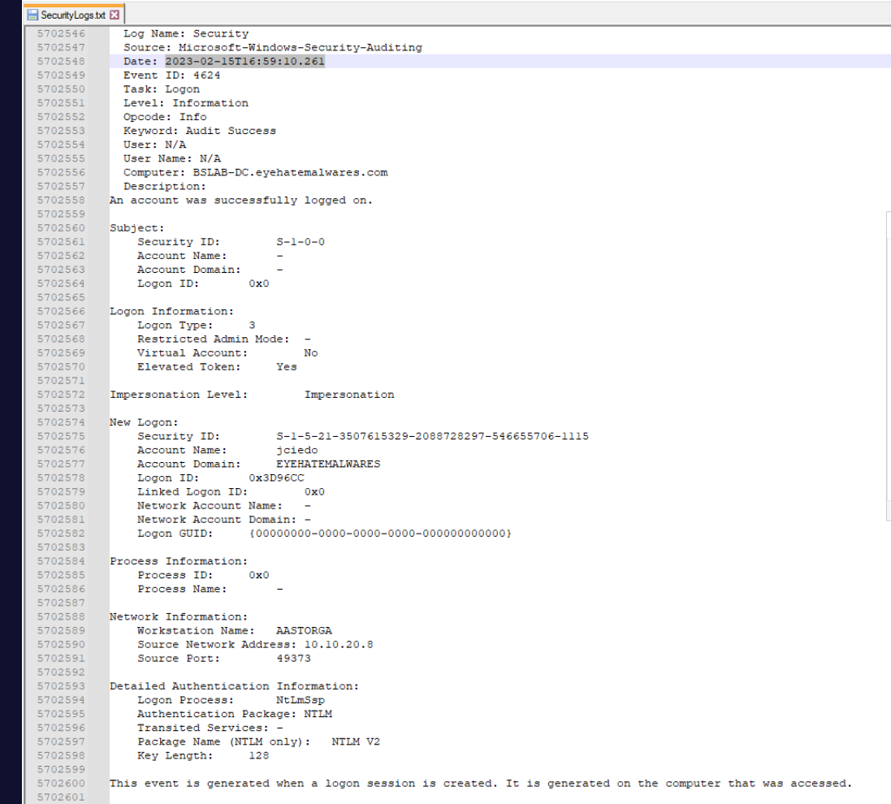
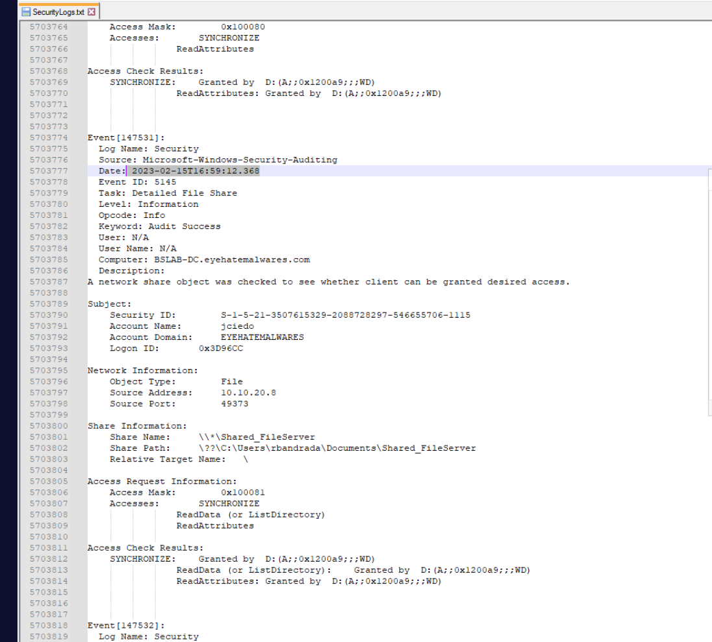
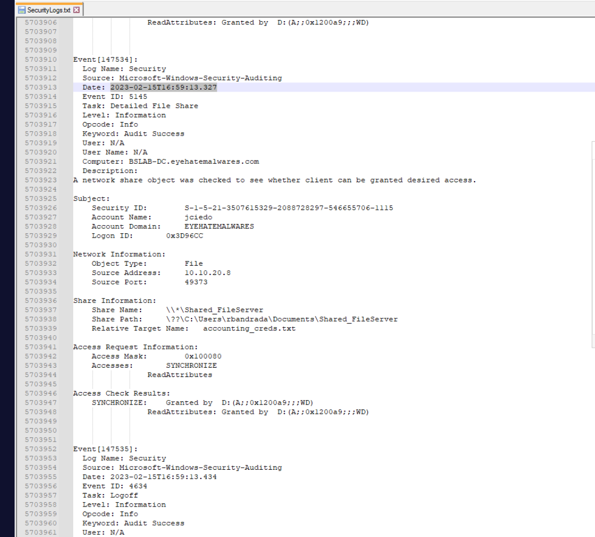
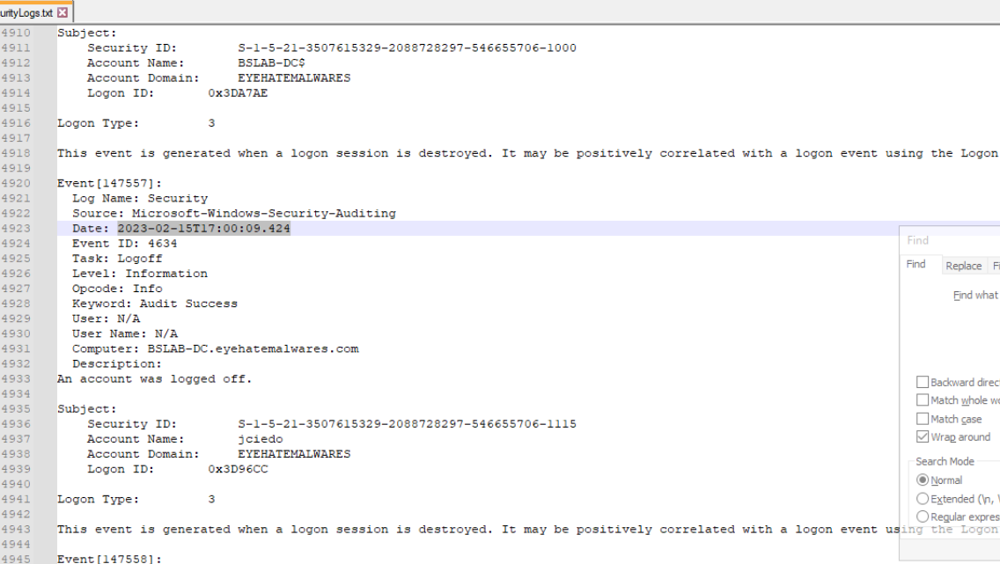
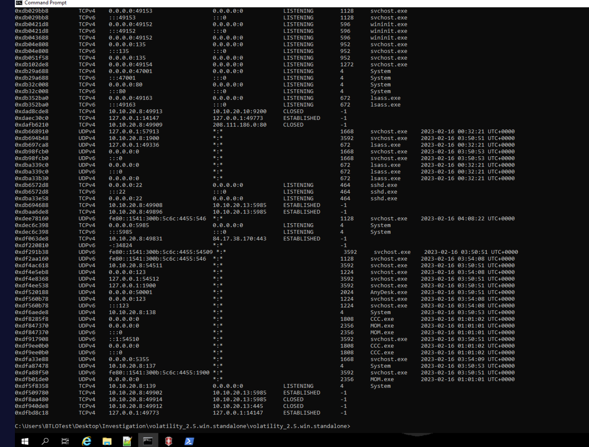
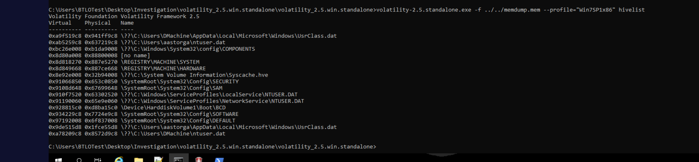
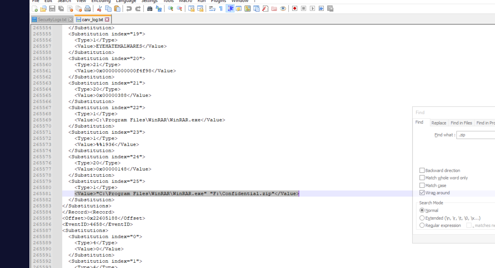
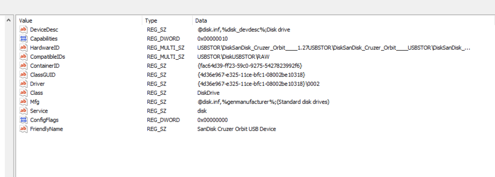

## Scenario

Jess Ciedo, a member of the accounting department, was terminated by their manager. Management discovered the account `jciedo` had access to the department's file server containing sensitive files. The last successful logon was from workstation `10.10.20.8`. Three artifacts are provided: a memory image of `10.10.20.8`, file server security logs, and `JCIEDO_USRCLASS.DAT` from the same host.

---

## Methodology

### File Server Security Logs — Notepad++

The security logs are a plain text export — EVTXtract cannot process them. Opened in Notepad++ and searched for `jciedo` with **Backward Direction** enabled to find the most recent session first.

#### Q1 — Workstation Logon

The last jciedo logon event (4624, Logon Type 3) originating from `10.10.20.8`:



**Logon timestamp:** `2023-02-15T16:59:10.261`

Workstation name `AASTORGA` confirms the machine identity. Authentication via NTLM V2.

#### Q2 & Q3 — File Server Access

Immediately following the logon, Event ID 5140 (network share access) and 5145 (detailed file share) fire in sequence, both logged on `BSLAB-DC.eyehatemalwares.com`:



Share accessed: `\\*\Shared_FileServer` — path `C:\Users\rbandrada\Documents\Shared_FileServer`. Source address `10.10.20.8` confirms jciedo's workstation. The file server IP is not directly visible in the logs — confirmed via Volatility `netscan` showing multiple ESTABLISHED connections from `10.10.20.8` to `10.10.20.13:5985`.

**File server:** `10.10.20.13, Shared_FileServer` **Access timestamp:** `2023-02-15T16:59:12.368`

#### Q4 & Q5 — Sensitive File Access

Continuing through jciedo events, Event 5145 surfaces the specific file accessed within the share:



**File accessed:** `accounting_creds.txt` **Timestamp:** `2023-02-15T16:59:13.327`

#### Q9 — Logoff

The logoff event (4634) for jciedo's session:



**Logoff timestamp:** `2023-02-15T17:00:09.424`

The session lasted under 2 minutes — consistent with targeted exfiltration.

---

### Memory Forensics — Volatility2

Profile: `Win7SP1x86`. All commands run from the Volatility standalone directory.

#### Network Connections — netscan

```
volatility_standalone.exe -f ..\..\memdump.mem --profile=Win7SP1x86 netscan
```



Key findings:

- Multiple ESTABLISHED connections from `10.10.20.8` → `10.10.20.13:5985` — confirms file server IP
- ESTABLISHED connection to `84.17.38.170:443` — AnyDesk external C2
- `AnyDesk.exe` and `TeamViewer.exe` both present — two remote access tools on the insider's workstation

#### Registry Hive Extraction — hivelist

```bash
volatility_standalone.exe -f ..\..\memdump.mem --profile=Win7SP1x86 hivelist
```



Hives of interest:

- `\REGISTRY\MACHINE\SYSTEM` at offset `0x8d818270` — needed for USB device identification
- `\??\C:\Users\aastorga\ntuser.dat` at offset `0xab5259c8` — workstation user hive

SYSTEM hive dumped for registry analysis:

```bash
volatility_standalone.exe -f ..\..\memdump.mem --profile=Win7SP1x86 dumpregistry -o 0x8d818270 --dump-dir .
```

#### EVTXtract — Carved Event Records

EVTXtract was run against the memory image to recover carved EVTX records not available in the provided log file:

```
C:\Python27\Scripts\evtxtract.exe ..\..\memdump.mem > evtx_carved.txt
```

Searching the 108MB output for WinRAR activity:

```
findstr /i "WinRAR" evtx_carved.txt
```

Recovered command line event:

```
"C:\Program Files\WinRAR\WinRAR.exe" "F:\Confidential.zip"
```

`C:\Program Files\WinRAR\WinRAR.exe`

 `F:\Confidential.zip` — drive letter `F:` confirms exfiltration directly to the mounted USB device.



---

### Registry Analysis — MiTec Windows Registry Recovery

#### USB Device Identification — SYSTEM Hive

The dumped SYSTEM hive loaded into MiTec Windows Registry Recovery. Navigated to:

```
ControlSet001\Enum\USBSTOR
```

Multiple USB storage devices enumerated. The SanDisk entry:



`SanDisk Cruzer Orbit`

The Kingston DataTraveler G3 was also present but the SanDisk Cruzer Orbit is the device used for exfiltration — confirmed by the `F:\Confidential.zip` output path correlating with a removable drive letter.

---

## Attack Summary

|Phase|Action|
|---|---|
|Account Access|jciedo authenticates to domain from workstation `AASTORGA` (10.10.20.8)|
|File Server Access|Network share `Shared_FileServer` on `10.10.20.13` accessed via SMB|
|Data Theft|`accounting_creds.txt` read from file server share|
|Compression|WinRAR used to compress stolen file — output to `F:\Confidential.zip`|
|Exfiltration|Compressed archive written directly to SanDisk Cruzer Orbit USB (drive `F:`)|
|Remote Access|AnyDesk and TeamViewer both active — external connection to `84.17.38.170:443`|

---

## IOCs

|Type|Value|
|---|---|
|Account|jciedo|
|Workstation|AASTORGA (10.10.20.8)|
|File Server|10.10.20.13 (Shared_FileServer)|
|File|accounting_creds.txt|
|Archive|F:\Confidential.zip|
|USB Device|SanDisk Cruzer Orbit|
|External IP|84[.]17[.]38[.]170|
|Software|AnyDesk, TeamViewer|

---

## MITRE ATT&CK

|Technique|ID|Description|
|---|---|---|
|Valid Accounts|T1078|jciedo used legitimate domain credentials to access file server|
|Data from Network Shared Drive|T1039|`accounting_creds.txt` accessed from SMB share `Shared_FileServer`|
|Exfiltration over Physical Medium: USB|T1052.001|Compressed archive written directly to SanDisk Cruzer Orbit|
|Archive Collected Data|T1560.001|WinRAR used to compress stolen file before exfiltration|
|Account Manipulation|T1098|Terminated employee account retained active file server access post-termination|

---

## Defender Takeaways

**Immediate access revocation on termination** — jciedo's account remained active and retained file server permissions after termination. A formal offboarding process with immediate account disablement and permission audit at separation would have prevented this entirely. AD accounts should be disabled — not merely have passwords changed — the moment termination is confirmed.

**USB device restrictions** — the exfiltration path was a consumer USB drive (`F:\Confidential.zip`). Group Policy USB restrictions (`USBSTOR` service disabled, removable media write-blocked) or DLP solutions that block unencrypted writes to removable media would have stopped the final exfiltration step even if the file access occurred.

**Dual remote access tools as an indicator** — both AnyDesk and TeamViewer were active on the workstation with an established external connection to `84.17.38.170:443`. Legitimate enterprise environments rarely need two concurrent remote access tools. Monitoring for unauthorised remote access software installation and outbound connections on port 443 to known remote access infrastructure should be standard SOC detection coverage.

**File server audit logging** — Event IDs 5140 and 5145 captured the exact share, file, timestamp, and source IP of the access. This investigation was only possible because detailed file share auditing was enabled. Without `Audit Detailed File Share` enabled on the file server, the specific filename would not have been logged — only that a share was accessed. Ensuring this policy is enabled is a fundamental requirement for any environment handling sensitive data.

**Session duration as a hunting signal** — jciedo's entire session from logon to logoff was under 2 minutes, accessing exactly one file. This pattern — short session, targeted single file access, immediate logoff — is a high-fidelity insider threat hunting signal. Baselining normal session duration and flagging statistical outliers is an effective detection approach for this class of threat.

---

<div class="qa-item"> <div class="qa-question-text">What time did the user jciedo log into their corporate workstation? (Format: YYYY-MM-DDTHH:MM:SS.XXX)</div> <div class="flag-reveal"> <input type="checkbox"> <span class="r-placeholder">Click flag to reveal</span> <span class="r-answer">2023-02-15T16:59:10.261</span> <button class="copy-btn" onclick="event.stopPropagation();navigator.clipboard.writeText(this.previousElementSibling.textContent);this.textContent='copied';setTimeout(()=>this.textContent='copy',1500)">copy</button> </div> </div>

<div class="qa-item"> <div class="qa-question-text">What is the IP address and file server name that was accessed by the jciedo account? (Format: X.X.X.X, FileServerName)</div> <div class="answer-reveal"> <input type="checkbox"> <span class="r-placeholder">Click to reveal answer</span> <span class="r-answer">10.10.20.13, Shared_FileServer</span> <button class="copy-btn" onclick="event.stopPropagation();navigator.clipboard.writeText(this.previousElementSibling.textContent);this.textContent='copied';setTimeout(()=>this.textContent='copy',1500)">copy</button> </div> </div>

<div class="qa-item"> <div class="qa-question-text">What is the timestamp of jciedo accessing the file server? (Format: YYYY-MM-DDTHH:MM:SS.XXX)</div> <div class="flag-reveal"> <input type="checkbox"> <span class="r-placeholder">Click flag to reveal</span> <span class="r-answer"> 2023-02-15T16:59:12.368</span> <button class="copy-btn" onclick="event.stopPropagation();navigator.clipboard.writeText(this.previousElementSibling.textContent);this.textContent='copied';setTimeout(()=>this.textContent='copy',1500)">copy</button> </div> </div>

<div class="qa-item"> <div class="qa-question-text">What is the name of the sensitive file that was accessed by the account? (Format: filename.extension)</div> <div class="answer-reveal"> <input type="checkbox"> <span class="r-placeholder">Click to reveal answer</span> <span class="r-answer">accounting_creds.txt</span> <button class="copy-btn" onclick="event.stopPropagation();navigator.clipboard.writeText(this.previousElementSibling.textContent);this.textContent='copied';setTimeout(()=>this.textContent='copy',1500)">copy</button> </div> </div>

<div class="qa-item"> <div class="qa-question-text">What is the timestamp of jciedo accessing this file? (Format: YYYY-MM-DDTHH:MM:SS.XXX)</div> <div class="flag-reveal"> <input type="checkbox"> <span class="r-placeholder">Click flag to reveal</span> <span class="r-answer">2023-02-15T16:59:13.327</span> <button class="copy-btn" onclick="event.stopPropagation();navigator.clipboard.writeText(this.previousElementSibling.textContent);this.textContent='copied';setTimeout(()=>this.textContent='copy',1500)">copy</button> </div> </div>

<div class="qa-item"> <div class="qa-question-text">What software was used to compress the retrieved file from the file server? Provide the full path of the executable (Format: Drive:\path\to\software.exe)</div> <div class="answer-reveal"> <input type="checkbox"> <span class="r-placeholder">Click to reveal answer</span> <span class="r-answer">c:\Program Files\WinRAR\WinRAR.exe</span> <button class="copy-btn" onclick="event.stopPropagation();navigator.clipboard.writeText(this.previousElementSibling.textContent);this.textContent='copied';setTimeout(()=>this.textContent='copy',1500)">copy</button> </div> </div>

<div class="qa-item"> <div class="qa-question-text">What is the full path of the outputted compressed file? (Format: Drive:\filename.extension)</div> <div class="flag-reveal"> <input type="checkbox"> <span class="r-placeholder">Click flag to reveal</span> <span class="r-answer">F:\Confidential.zip</span> <button class="copy-btn" onclick="event.stopPropagation();navigator.clipboard.writeText(this.previousElementSibling.textContent);this.textContent='copied';setTimeout(()=>this.textContent='copy',1500)">copy</button> </div> </div>

<div class="qa-item"> <div class="qa-question-text">What is the Mfg and DeviceDesc of the device mounted to the local machine? (Format: MfgValue DeviceDescValue)</div> <div class="answer-reveal"> <input type="checkbox"> <span class="r-placeholder">Click to reveal answer</span> <span class="r-answer">SanDisk Cruzer Orbit</span> <button class="copy-btn" onclick="event.stopPropagation();navigator.clipboard.writeText(this.previousElementSibling.textContent);this.textContent='copied';setTimeout(()=>this.textContent='copy',1500)">copy</button> </div> </div>

<div class="qa-item"> <div class="qa-question-text">What is the timestamp associated with the logoff event for the user account jciedo? (Format: YYYY-MM-DDTHH:MM:SS.XXX)</div> <div class="flag-reveal"> <input type="checkbox"> <span class="r-placeholder">Click flag to reveal</span> <span class="r-answer">2023-02-15T17:00:09.424</span> <button class="copy-btn" onclick="event.stopPropagation();navigator.clipboard.writeText(this.previousElementSibling.textContent);this.textContent='copied';setTimeout(()=>this.textContent='copy',1500)">copy</button> </div> </div>
