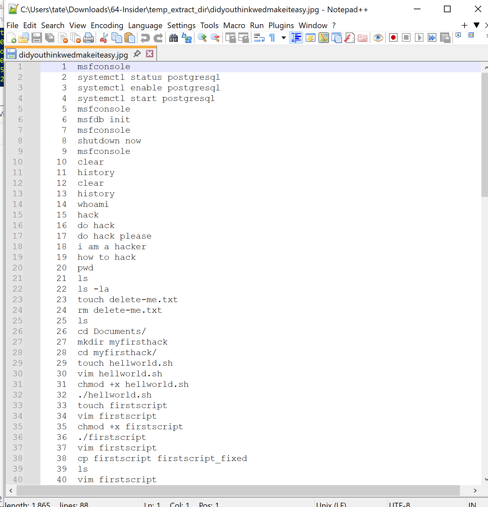
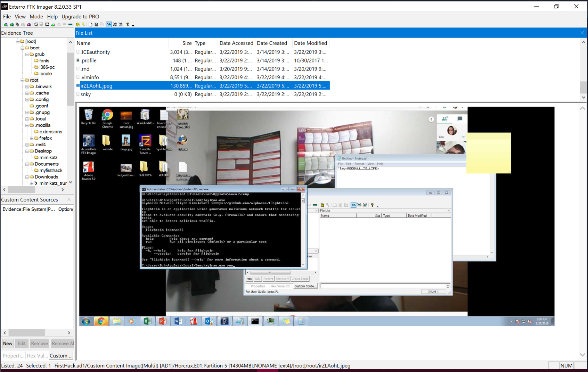
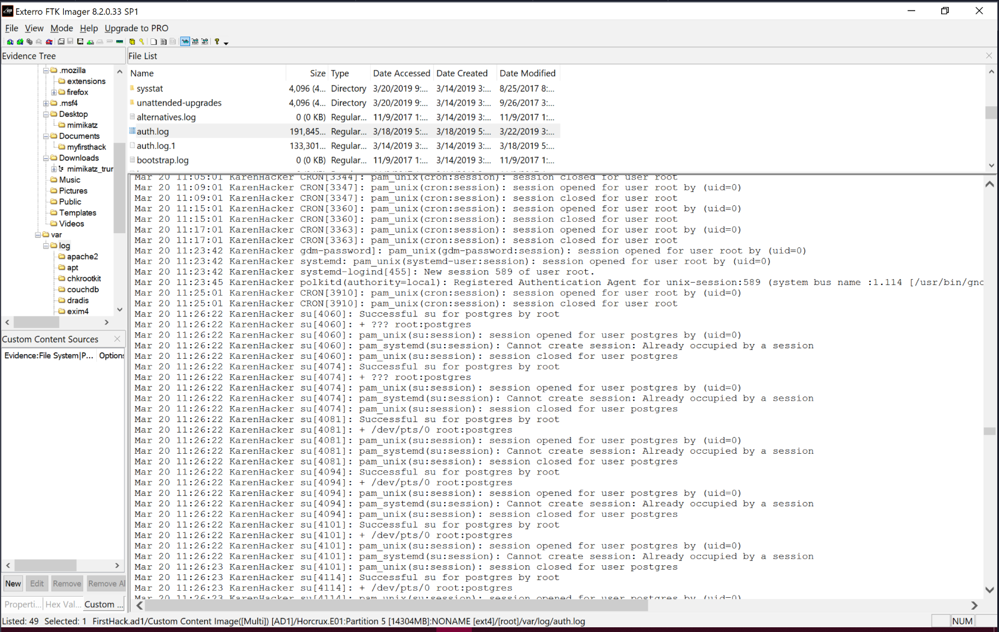

# Insider – Disk Image Investigation Write-Up

## Overview

TAAUSAI suspected insider activity after Karen began conducting unauthorized actions within the company. A forensic disk image of her Linux machine was acquired for analysis. The objective was to determine the extent of malicious activity and identify evidence of compromise.

The image was loaded into **FTK Imager** for examination.

---

## Initial Triage & System Identification

Inspection of the `/boot` directory revealed the system was running:

- **Kali Linux**
    
- Kernel version **4.13.0**
    

This is significant because Kali is an offensive security distribution, commonly used for penetration testing and red team activities — immediately increasing suspicion of malicious intent.

---

## Apache Log Analysis

The Apache access log was located at:

/var/log/apache2/access.log

The MD5 hash of the file was:

d41d8cd98f00b204e9800998ecf8427e

This hash corresponds to an empty file, indicating:

- Apache logs were cleared
    
- Evidence of activity may have been intentionally removed
    

Additionally, no meaningful Apache log data could be recovered.

---

## Suspicious Tool Discovery

Inside:

/root/Downloads

A file named:

mimikatz_trunk.zip

was identified.

Mimikatz is a credential dumping tool typically used to extract plaintext passwords and hashes from memory. Its presence strongly suggests intent to perform credential harvesting.

---

## Super Secret File Discovery

A symbolic link from the root directory pointed to:

/root/Desktop/SuperSecretFile.txt

This indicates deliberate file placement and potential concealment tactics.

---

## Image File Analysis

The file `didyouthinkwedmakeiteasy.jpg` was referenced in bash history with the use of `binwalk`.

Upon manual inspection using a text editor, the file was found to contain appended plaintext bash history data following the JPEG image content.

This indicates:

- Simple file concatenation was used to hide command history
    
- No steganographic encoding was applied
    
- The technique relied on obscurity rather than encryption
    

This demonstrates an attempt at concealment, albeit using a basic method.
    

Additionally, the image:

irZLAohL.jpeg

contained a screenshot showing evidence of hacking activity.

## Checklist Evidence

On Karen’s desktop, a checklist was discovered.

The third listed goal was:

Profit

This suggests financial motivation.

---

## Evidence of Attack Activity

The disk image contained evidence that the machine was used to launch an attack on another system. The image file `irZLAohL.jpeg` contained a screenshot demonstrating hacking activity, serving as visual confirmation.

---

## Bash Script Taunting

A bash script located within the Documents directory showed Karen taunting another expert named:

young

This suggests interpersonal motivation or rivalry.

---

## Privilege Escalation Evidence

The `/var/log/auth.log` file revealed multiple `su` command executions around 11:26.

Log entries confirmed that:

- The user **postgres** successfully escalated privileges to root multiple times.
    

This confirms privilege escalation activity and root access acquisition.

## IOCs 

| Type       | Value                            |
| ---------- | -------------------------------- |
| access.log | d41d8cd98f00b204e9800998ecf8427e |
| Tool       | mimikatz_trunk.zip               |
| User       | postgres (privilege escalation)  |
| OS         | Kali Linux 4.13.0                |

## Conclusion

The forensic analysis confirms deliberate malicious insider activity conducted by Karen. The system was configured with an offensive security distribution (Kali Linux), credential harvesting tools were staged, web logs were cleared to remove traces of activity, privilege escalation was successfully achieved, and bash history was intentionally concealed within a benign-looking image file.

>The combination of log tampering, tool staging, concealed command history, and documented attack execution demonstrates intentional misuse of corporate resources for offensive purposes. The presence of a financial motive ("Profit") further supports malicious intent.

I successfully completed Insider Blue Team Lab at @CyberDefenders!
https://cyberdefenders.org/blueteam-ctf-challenges/achievements/inksec/insider/
 
#CyberDefenders #CyberSecurity #BlueYard #BlueTeam #InfoSec #SOC #SOCAnalyst #DFIR #CCD #CyberDefender