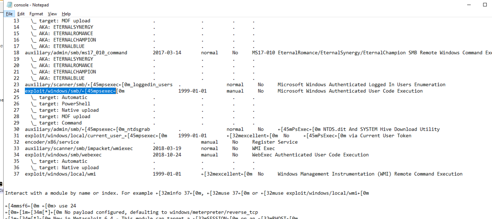
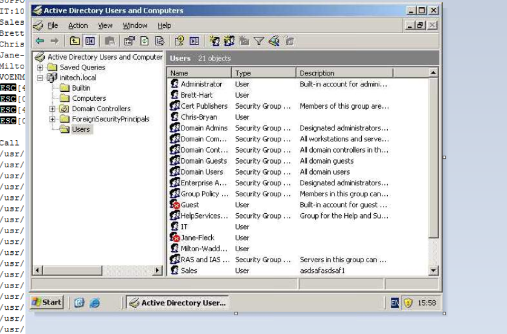
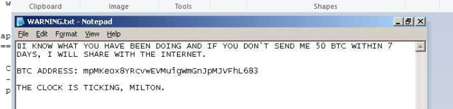

## Scenario

Initech's CISO, Milton Waddams (CISSP, CISM), was the victim of a blackmail attempt requesting payment of 50 BTC. An IT contractor named Brett Hart is the suspected culprit — operating as a standard user. Artefacts were collected from a folder called "Hacking" on his Kali Virtual Machine. Milton assured investigators the environment employs all best practices and is "unhackable."

Spoiler: it was not unhackable.

---

## Methodology

### Reconnaissance — Nmap Scan

The first artefact is `scan.txt` — an Nmap output file. The header reveals the full command and timestamp:

```
# Nmap 7.94SVN scan initiated Thu Apr 11 07:10:24 2024 as:
nmap -sS --script *smb*,*ldap* -sV --version-all -T5 -oN scan.txt 192.168.25.0/24
```

Key flags used:

- `-sS` — TCP SYN stealth scan
- `--script *smb*,*ldap*` — runs all SMB and LDAP NSE scripts (enumeration + brute force)
- `-sV --version-all` — aggressive service version detection
- `-T5` — maximum timing template (fastest, noisiest)
- `-oN scan.txt` — normal output to file

The first responding host returned MAC address `00:50:56:F4:3C:76` — a VMware OUI, confirming this is a virtualised environment.

### Domain Enumeration — LDAP Scripts

The LDAP scripts successfully enumerated the Active Directory domain:

```
dnsHostName: voenmeh-d0f286a.initech.local
ldapServiceName: initech.local:voenmeh-d0f286a$@INITECH.LOCAL
```

- **Domain:** `initech.local`
- **Domain Controller hostname:** `voenmeh-d0f286a.initech.local`
### Credential Brute Force — SMB Scripts

The `smb-brute` NSE script attempted credential stuffing against SMB. Results:

```
guest:<blank>         => Valid credentials, account disabled
it:football           => Valid credentials
jane-fleck:<blank>    => Valid credentials, account disabled
milton-waddams:password => Valid credentials
```

Two **enabled** accounts had passwords successfully guessed:

- `it` — password: `football`
- `milton-waddams` — password: `password`

Milton's password being literally `password` on an "unhackable" environment is the critical failure point. The SMB session data confirms Milton was actively logged in at the time of the scan:

```
Users logged in:
  INITECH\Milton-Waddams since 2024-04-11T10:47:17
Active SMB sessions:
  MILTON-WADDAMS is connected from 192.168.25.130 for 1s, idle for [not idle]
```

### Exploitation — Metasploit psexec

With valid credentials for `milton-waddams`, Brett moved to Metasploit. The screenshot `insider_msconsole_24.png` shows `use 24` in msfconsole — module index 24 corresponds to:

```
exploit/windows/smb/psexec
```

This exploit authenticates over SMB using the compromised credentials and uploads a payload executable to the target. The console output confirms:

```
Selecting native target
Uploading payload... VdMXyqeN.exe
```

The randomly-named `VdMXyqeN.exe` is the Meterpreter payload dropped to the target system at `192.168.25.136:445`.

### Post-Exploitation — Meterpreter Session

With a Meterpreter shell established, Brett navigated the filesystem and took screenshots. The first screenshot  shows **Active Directory Users and Computers** open — Brett was performing AD reconnaissance through the compromised CISO account.

The session commands show navigation to Milton's desktop:

```
meterpreter > cd "Documents and Settings"
meterpreter > cd milton-waddams
meterpreter > cd desktop
meterpreter > upload WARNING.txt
```

The blackmail note `WARNING.txt` was uploaded to:

```
C:\Documents and Settings\milton-waddams\desktop
```

### Extortion — BTC Demand

The second screenshot (`insider_warning_btc_add.png`) shows the WARNING.txt contents demanding 50 BTC payment to:

```
mpMKeox8YRCvwEVMuijgwmGnJpMJvFhL683
```

Note: the `mp` prefix identifies this as a **Bitcoin testnet address** — suggesting Brett may have been testing his extortion workflow rather than operating on mainnet, or was unfamiliar with the difference.

### Password Cracking — John the Ripper

The artefacts include `CRACKED.txt` — output from **John the Ripper** used to crack Brett's own password hashes (likely recovered from the domain during his AD recon):

```
VERYSECURE!    (Brett-Hart:1)
URE!           (Brett-Hart:2)
```

The split output across two hash types reveals Brett's full password: **`VERYSECURE!`** — ironic given the investigation.

---

## IOCs

|Type|Value|
|---|---|
|IP|192.168.25.136 (target DC)|
|IP|192.168.25.130 (attacker)|
|Domain|initech.local|
|Hostname|voenmeh-d0f286a.initech.local|
|MAC|00:50:56:F4:3C:76|
|Payload|VdMXyqeN.exe|
|BTC Address|mpMKeox8YRCvwEVMuijgwmGnJpMJvFhL683|
|Credential|milton-waddams:password|
|Credential|it:football|
|Credential|Brett-Hart:VERYSECURE!|

---

## MITRE ATT&CK

|Technique|ID|Description|
|---|---|---|
|Network Service Discovery|T1046|Nmap -sS scan of 192.168.25.0/24|
|Brute Force: Password Guessing|T1110.001|smb-brute NSE script against all accounts|
|SMB/Windows Admin Shares|T1021.002|psexec exploit over SMB port 445|
|Ingress Tool Transfer|T1105|VdMXyqeN.exe payload uploaded via psexec|
|Screen Capture|T1113|Meterpreter screenshot of AD Users and Computers|
|Data Encrypted for Impact / Extortion|T1486|WARNING.txt uploaded demanding 50 BTC|
|Password Cracking|T1110.002|John the Ripper used to crack NTLM hashes|

---

## Defender Takeaways

Milton's environment had several critical failures despite being declared "unhackable":

**Weak credentials** — `password` as the CISO's password and `football` for a service account are trivially guessable and would fall to any wordlist attack. Password complexity enforcement and lockout policies would have blocked the smb-brute attack entirely.

**SMB exposure** — Port 445 was reachable from the contractor's machine with no network segmentation. Contractors should operate in a separate VLAN with no direct access to the domain controller.

**psexec allowed** — Legitimate psexec use cases are narrow. Blocking or alerting on psexec-style lateral movement (Service Control Manager abuse) is a straightforward detection opportunity.

**No MFA** — A second factor on domain accounts would have rendered the brute-forced credentials useless for remote access even if the passwords were weak.


---

<div class="qa-item"> <div class="qa-question-text">Q1) What time was the nmap scan initiated? (Format: XXX XXX DD HH:MM:SS YYYY)</div> <div class="flag-reveal"> <input type="checkbox"> <span class="r-placeholder">Click flag to reveal</span> <span class="r-answer">thu Apr 11 07:10:24 2024</span> <button class="copy-btn" onclick="event.stopPropagation();navigator.clipboard.writeText(this.previousElementSibling.textContent);this.textContent='copied';setTimeout(()=>this.textContent='copy',1500)">copy</button> </div> </div>

<div class="qa-item"> <div class="qa-question-text">Q2) What is the full nmap command that ran? (Format: nmap command here)</div> <div class="answer-reveal"> <input type="checkbox"> <span class="r-placeholder">Click to reveal answer</span> <span class="r-answer">nmap -sS --script *smb*,*ldap* -sV --version-all -T5 -oN scan.txt 192.168.25.0/24</span> <button class="copy-btn" onclick="event.stopPropagation();navigator.clipboard.writeText(this.previousElementSibling.textContent);this.textContent='copied';setTimeout(()=>this.textContent='copy',1500)">copy</button> </div> </div>

<div class="qa-item"> <div class="qa-question-text">Q3) What is the MAC address of the first responding IP? (Format: xx:xx:xx:xx:xx:xx)</div> <div class="flag-reveal"> <input type="checkbox"> <span class="r-placeholder">Click flag to reveal</span> <span class="r-answer">00:50:56:F4:3C:76</span> <button class="copy-btn" onclick="event.stopPropagation();navigator.clipboard.writeText(this.previousElementSibling.textContent);this.textContent='copied';setTimeout(()=>this.textContent='copy',1500)">copy</button> </div> </div>

<div class="qa-item"> <div class="qa-question-text">Q4) What is the domain as determined by the LDAP scripts? (Format: string.tld)</div> <div class="answer-reveal"> <input type="checkbox"> <span class="r-placeholder">Click to reveal answer</span> <span class="r-answer">initech.local</span> <button class="copy-btn" onclick="event.stopPropagation();navigator.clipboard.writeText(this.previousElementSibling.textContent);this.textContent='copied';setTimeout(()=>this.textContent='copy',1500)">copy</button> </div> </div>

<div class="qa-item"> <div class="qa-question-text">Q5) What is the dnsHostName? (Format: string.string.tld)</div> <div class="flag-reveal"> <input type="checkbox"> <span class="r-placeholder">Click flag to reveal</span> <span class="r-answer">voenmeh-d0f286a.initech.local</span> <button class="copy-btn" onclick="event.stopPropagation();navigator.clipboard.writeText(this.previousElementSibling.textContent);this.textContent='copied';setTimeout(()=>this.textContent='copy',1500)">copy</button> </div> </div>

<div class="qa-item"> <div class="qa-question-text">Q6) Which enabled accounts had passwords guessed by the SMB brute force script? (Format: string, string)</div> <div class="answer-reveal"> <input type="checkbox"> <span class="r-placeholder">Click to reveal answer</span> <span class="r-answer">it, milton-waddams</span> <button class="copy-btn" onclick="event.stopPropagation();navigator.clipboard.writeText(this.previousElementSibling.textContent);this.textContent='copied';setTimeout(()=>this.textContent='copy',1500)">copy</button> </div> </div>

<div class="qa-item"> <div class="qa-question-text">Q7) What is the IP of the connecting machine in the active SMB session, and when did they log in? (Format: xx.xx.xx.xx, YYYY-MM-DDTHH:MM:SS)</div> <div class="flag-reveal"> <input type="checkbox"> <span class="r-placeholder">Click flag to reveal</span> <span class="r-answer">192.168.25.130, 2024-04-11T10:47:17</span> <button class="copy-btn" onclick="event.stopPropagation();navigator.clipboard.writeText(this.previousElementSibling.textContent);this.textContent='copied';setTimeout(()=>this.textContent='copy',1500)">copy</button> </div> </div>

<div class="qa-item"> <div class="qa-question-text">Q8) What exploit did the attacker use in msfconsole? (Format: something/something/something/something)</div> <div class="answer-reveal"> <input type="checkbox"> <span class="r-placeholder">Click to reveal answer</span> <span class="r-answer">exploit/windows/smb/mpsexec</span> <button class="copy-btn" onclick="event.stopPropagation();navigator.clipboard.writeText(this.previousElementSibling.textContent);this.textContent='copied';setTimeout(()=>this.textContent='copy',1500)">copy</button> </div> </div>

<div class="qa-item"> <div class="qa-question-text">Q9) What was the name of the uploaded payload? (Format: name.extension)</div> <div class="flag-reveal"> <input type="checkbox"> <span class="r-placeholder">Click flag to reveal</span> <span class="r-answer">VdMXyqeN.exe</span> <button class="copy-btn" onclick="event.stopPropagation();navigator.clipboard.writeText(this.previousElementSibling.textContent);this.textContent='copied';setTimeout(()=>this.textContent='copy',1500)">copy</button> </div> </div>

<div class="qa-item"> <div class="qa-question-text">Q10) What is the title of the open Window in the first grabbed screenshot? (Format: Window Name)</div> <div class="answer-reveal"> <input type="checkbox"> <span class="r-placeholder">Click to reveal answer</span> <span class="r-answer">active directory users and computers</span> <button class="copy-btn" onclick="event.stopPropagation();navigator.clipboard.writeText(this.previousElementSibling.textContent);this.textContent='copied';setTimeout(()=>this.textContent='copy',1500)">copy</button> </div> </div>

<div class="qa-item"> <div class="qa-question-text">Q11) What file did the attacker upload and where? (Format: name.extension, c:\path\to\folder)</div> <div class="flag-reveal"> <input type="checkbox"> <span class="r-placeholder">Click flag to reveal</span> <span class="r-answer">warning.txt c:\Documents and Setting\milton-addams\desktop</span> <button class="copy-btn" onclick="event.stopPropagation();navigator.clipboard.writeText(this.previousElementSibling.textContent);this.textContent='copied';setTimeout(()=>this.textContent='copy',1500)">copy</button> </div> </div>

<div class="qa-item"> <div class="qa-question-text">Q12) What is the BTC address in the second grabbed screenshot? (Format: address)</div> <div class="answer-reveal"> <input type="checkbox"> <span class="r-placeholder">Click to reveal answer</span> <span class="r-answer">mpMKeox8YRCvwEVMuijgwmGnJpMJvFhL683</span> <button class="copy-btn" onclick="event.stopPropagation();navigator.clipboard.writeText(this.previousElementSibling.textContent);this.textContent='copied';setTimeout(()=>this.textContent='copy',1500)">copy</button> </div> </div>

<div class="qa-item"> <div class="qa-question-text">Q13) What tool is CRACKED.txt the output of? (Format: tool)</div> <div class="flag-reveal"> <input type="checkbox"> <span class="r-placeholder">Click flag to reveal</span> <span class="r-answer">john</span> <button class="copy-btn" onclick="event.stopPropagation();navigator.clipboard.writeText(this.previousElementSibling.textContent);this.textContent='copied';setTimeout(()=>this.textContent='copy',1500)">copy</button> </div> </div>

<div class="qa-item"> <div class="qa-question-text">Q14) What is the password for Brett? (Format: password)</div> <div class="answer-reveal"> <input type="checkbox"> <span class="r-placeholder">Click to reveal answer</span> <span class="r-answer">VERYSECURE!</span> <button class="copy-btn" onclick="event.stopPropagation();navigator.clipboard.writeText(this.previousElementSibling.textContent);this.textContent='copied';setTimeout(()=>this.textContent='copy',1500)">copy</button> </div> </div>

