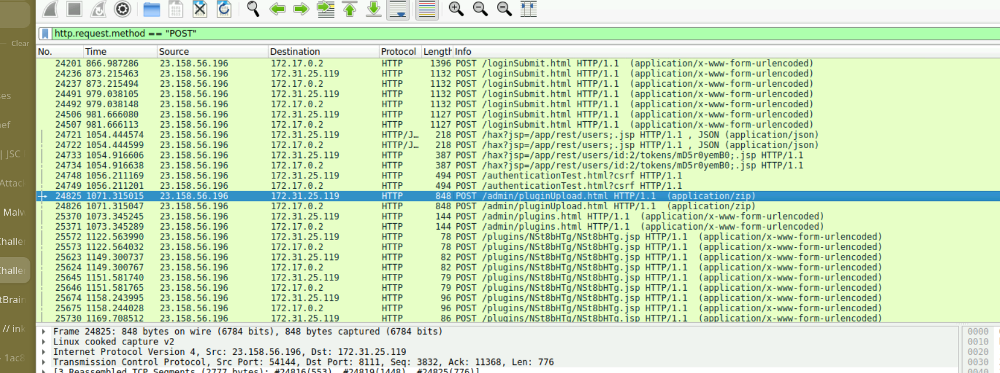
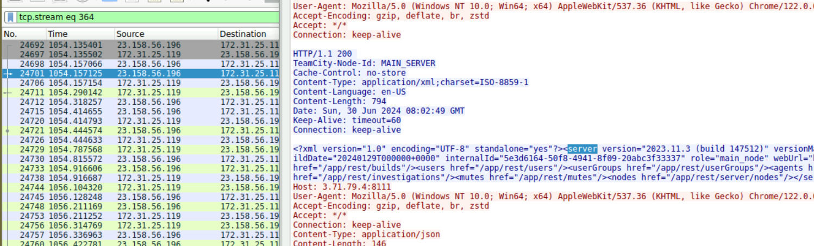
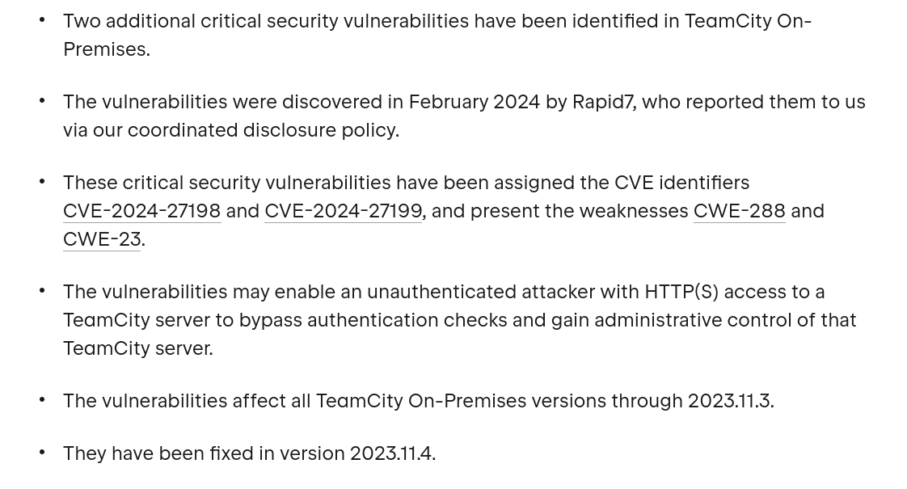
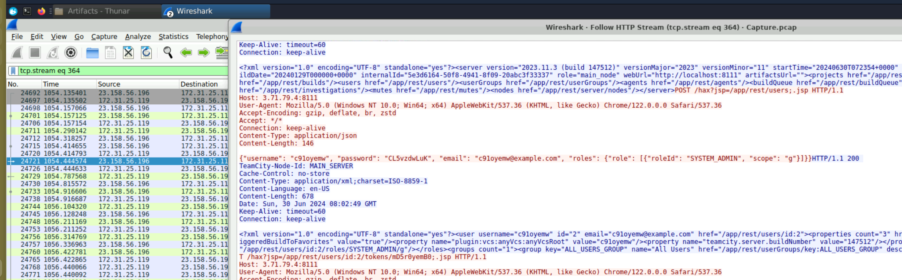
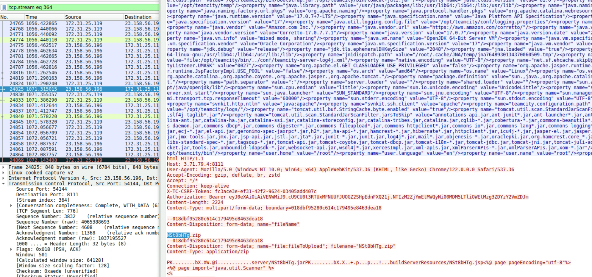
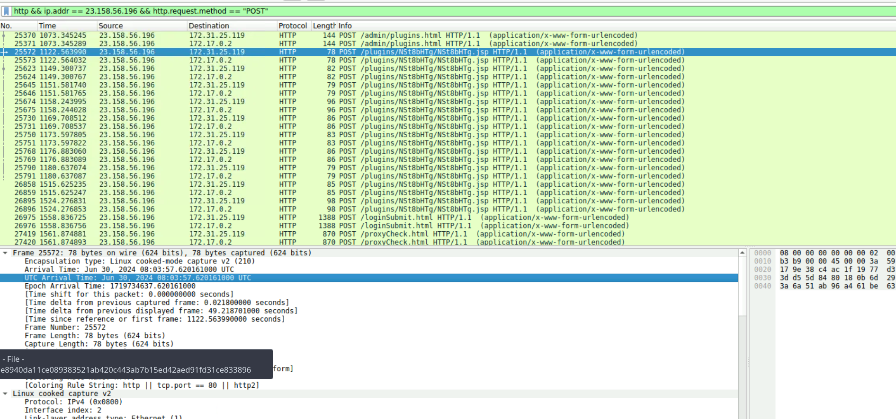
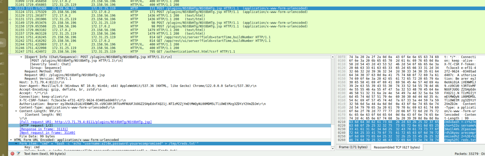
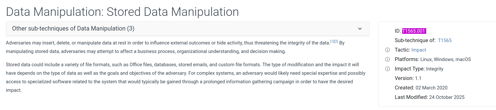
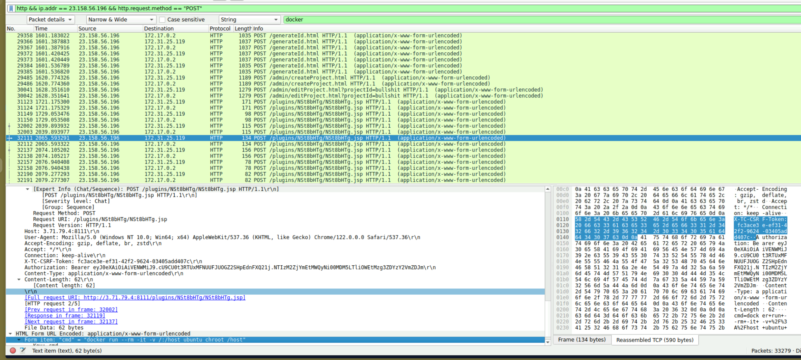

## Scenario

During a recent security incident, an attacker successfully exploited a vulnerability in a TeamCity web server, uploading a webshell and gaining full control of the system. A PCAP of network traffic during the attack was provided to reconstruct the attack timeline, identify tools and techniques, and determine the extent of the compromise.

---

## Tooling

- Wireshark

---

## Investigation

### Identifying the Attacker

Filtering for POST requests to identify outbound attacker activity:
```
http.request.method == "POST"
```
`http.request.method == "POST"`

The attacker IP `23.158.56.196` appeared consistently across login attempts, plugin uploads, and webshell interactions.


Narrowing to attacker traffic:
```
http && ip.addr == 23.158.56.196
```
---

### Server Version & CVE Identification

Following TCP stream 364 revealed the TeamCity server response header:

`tcp.stream eq 364`

The response exposed server version **2023.11.3**. Searching for known vulnerabilities against this version identified **CVE-2024-27198** — a critical authentication bypass vulnerability in JetBrains TeamCity On-Premises affecting all versions through 2023.11.3, discovered by Rapid7 in February 2024 and fixed in 2023.11.4.



CVE-2024-27198 (CWE-288) allows an unauthenticated attacker with HTTP(S) access to bypass authentication checks and gain administrative control of the TeamCity server.


---

### Account Creation

Continuing to follow attacker traffic, the attacker exploited CVE-2024-27198 to create a new administrative account:

`http && ip.addr == 23.158.56.196`

The response body revealed a newly created account:

**Username:** `c91oyemw` **Password:** `CL5vzdwLuK`



---
### Webshell Upload

Filtering for POST requests from the attacker IP:
```bash
http && ip.addr == 23.158.56.196 && http.request.method == "POST"
```

The attacker uploaded a plugin ZIP file to the admin plugin upload endpoint `/admin/pluginupload.html`:

**Webshell filename:** `NSt8bHTg.zip`

The ZIP contained a JSP webshell embedded in the plugin package.

### Webshell Execution

The attacker first accessed the webshell at:

**Timestamp:** `2024-06-30 08:03`

Subsequent POST requests to `/plugins/NSt8bHTg/NSt8bHTg.jsp` showed command execution via the `cmd` parameter.



---
### Credential Tampering

The attacker used the webshell to overwrite a credentials file:

```
Form item: "cmd" = "bash -c 'echo "username:a1l4m,password:youarecompromised" > /tmp/Creds.txt'"
```

**New credentials written:**

- Username: `a1l4m`
- Password: `youarecompromised`



This maps to **MITRE T1565.001 — Stored Data Manipulation**, where adversaries modify stored data to influence system behaviour or cover their tracks.


### Container Escape Attempt

The attacker attempted to escape the Docker container environment using multiple techniques:

```
docker run --rm -it --privileged ubuntu
docker run -v /var/run/docker.sock:/var/run/docker.sock -it ubuntu
docker run --rm -it -v /:/host ubuntu chroot /host
```

The final command — mounting the host filesystem and chrooting into it — was the escape attempt. It did not succeed.

## IOCs 

| Type           | Value                          |
| -------------- | ------------------------------ |
| IP             | 23.158.56.196                  |
| CVE            | CVE-2024-27198                 |
| Server Version | TeamCity 2023.11.3             |
| Username       | c91oyemw                       |
| Password       | CL5vzdwLuK                     |
| Webshell       | NSt8bHTg.zip                   |
| Webshell Path  | /plugins/NSt8bHTg/NSt8bHTg.jsp |
| Tampered Creds | a1l4m:youarecompromised        |
| Timestamp      | 2024-06-30 08:03 UTC           |
## Conclusion

> The attacker exploited CVE-2024-27198 to bypass authentication on a TeamCity 2023.11.3 server, created a backdoor admin account, uploaded a JSP webshell via the plugin upload functionality, executed commands to tamper with credential files, and attempted Docker container escape — ultimately unsuccessful. The attack chain demonstrates a well-known but still actively exploited authentication bypass leading to full server compromise.

---

## References

- [CVE-2024-27198 — JetBrains TeamCity Auth Bypass](https://www.rapid7.com/blog/post/2024/03/04/etr-cve-2024-27198-and-cve-2024-27199-jetbrains-teamcity-multiple-authentication-bypass-vulnerabilities-fixed/)
- [MITRE T1565.001 — Stored Data Manipulation](https://attack.mitre.org/techniques/T1565/001/)
- [CyberDefenders — JetBrains Lab](https://cyberdefenders.org/blueteam-ctf-challenges/jetbrains/)



















I successfully completed JetBrains Blue Team Lab at @CyberDefenders!
https://cyberdefenders.org/blueteam-ctf-challenges/achievements/inksec/jetbrains/
 
#CyberDefenders #CyberSecurity #BlueYard #BlueTeam #InfoSec #SOC #SOCAnalyst #DFIR #CCD #CyberDefender