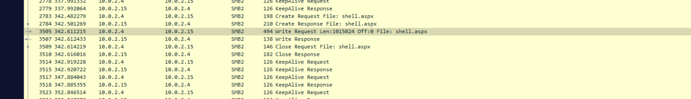
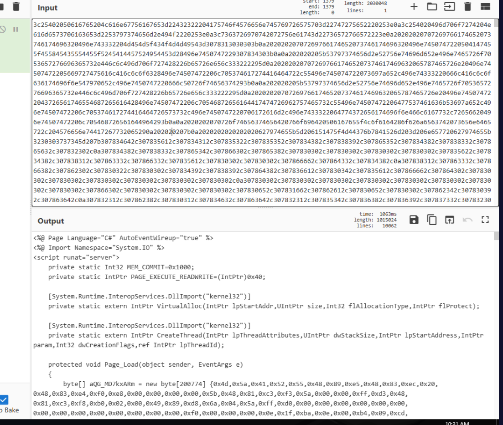
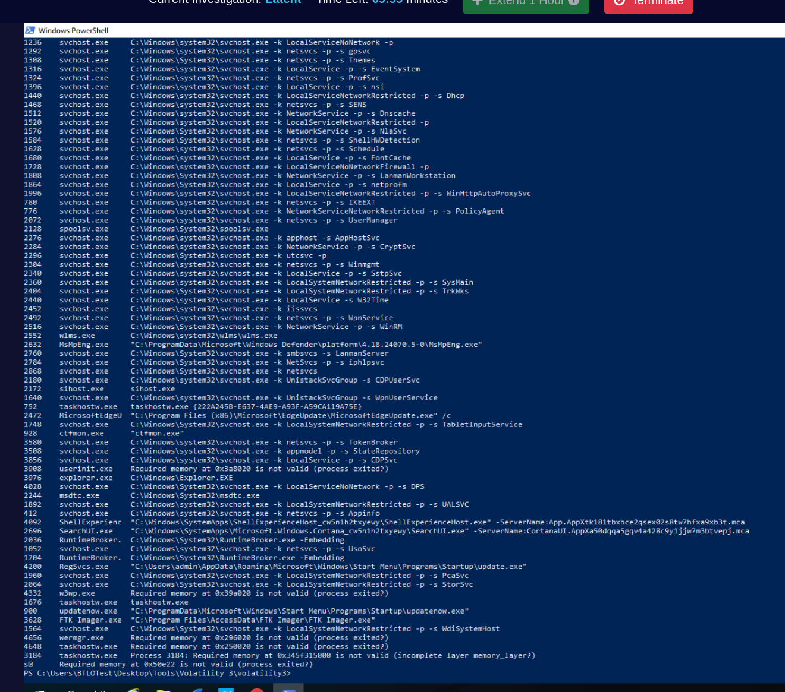
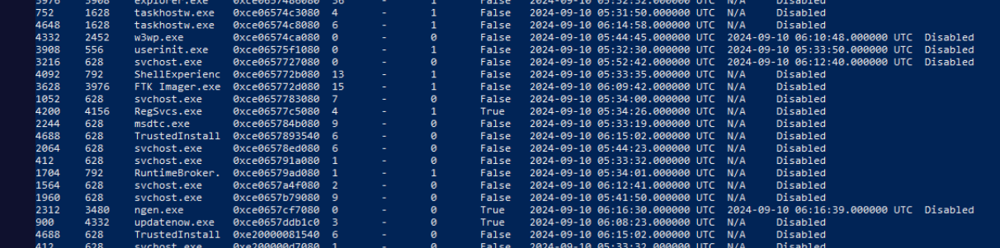
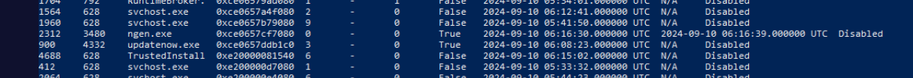
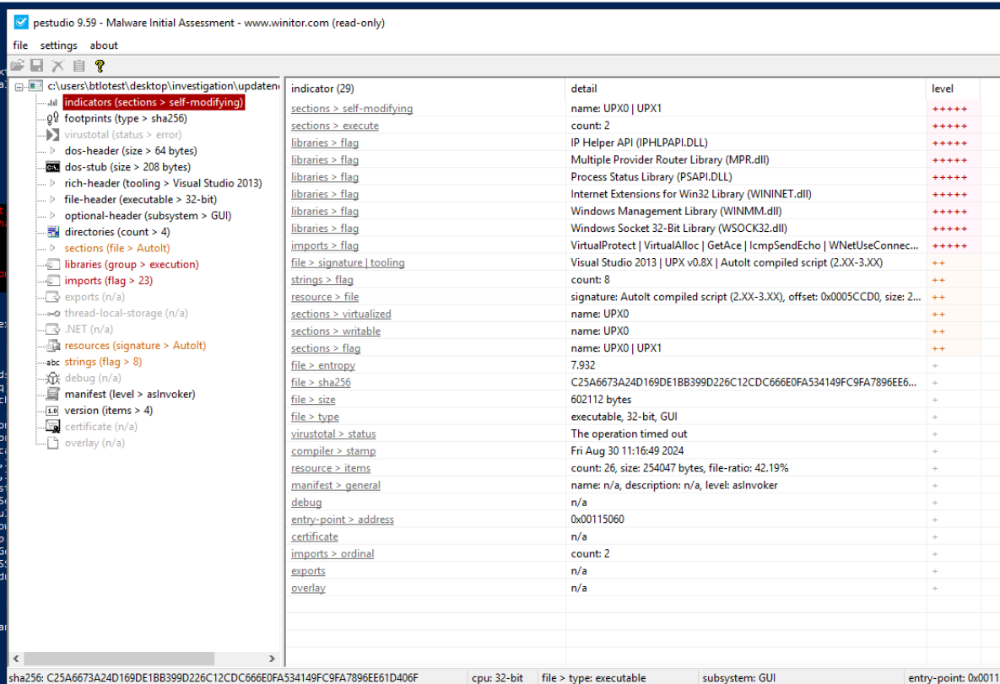
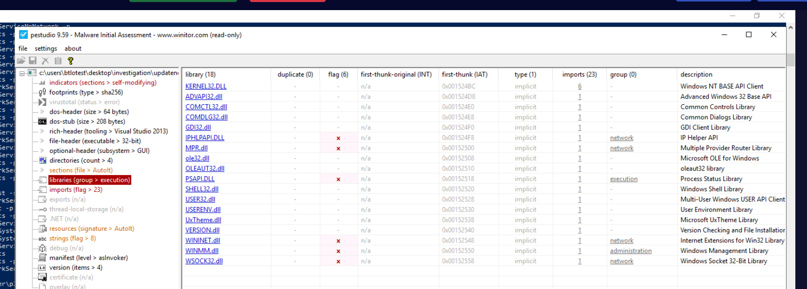

## Scenario

A financial services company experiences intermittent system delays during peak hours. After ruling out network congestion, the security team suspects latent malware — designed to remain dormant until triggered by specific time intervals and data patterns, evading traditional antivirus. Investigate using a network PCAP and memory dump.

---

## Methodology

### Reconnaissance — Port Scan

Opening the PCAP in Wireshark reveals four IP addresses across two subnets:

- `10.0.2.4` — attacker (internal)
- `10.0.2.15` — victim
- `23.58.93.34` — external
- `216.58.200.163` — external

Filtering HTTP traffic shows `10.0.2.4` requesting `/robots.txt` with an Nmap User-Agent string — the classic fingerprint of an active port scan against the victim host.

### Initial Access — SMB Share Access and Web Shell Upload

The attacker gained access to the victim via SMB, accessing the `\Documents` share. From there, `shell.aspx` was uploaded to the web server.



Inspecting the `shell.aspx` content reveals an ASP.NET loader with a large Base64-encoded blob embedded in the payload — likely a compiled binary or DLL loaded and executed in memory by the web shell.


### Execution — Reverse Shell

Filtering HTTP traffic surfaces the exact moment the attacker triggered the web shell:

```
Sep 10, 2024 01:49:39 EDT
```

Checking destination ports and connections in Wireshark confirms the attacker had port **4443** open on their machine as the reverse shell listener — all reverse shell traffic from the victim flows to `10.0.2.4:4443`.

### Memory Analysis — Volatility 3

Switching to memory forensics with Volatility 3 to enumerate running processes:


```bash
python vol.py -f memdump.mem windows.cmdline
```



This immediately surfaces the malicious process:

```
900     updatenow.exe   "C:\ProgramData\Microsoft\Windows\Start Menu\Programs\Startup\updatenow.exe"
```

`updatenow.exe` running from the Startup folder (PID 900) — the attacker moved the binary here after initial upload for persistence. The Startup path ensures `updatenow.exe` executes on every system boot.

The parent process is also significant. Running `psscan` reveals `w3wp.exe` (IIS worker process) as the parent of `updatenow.exe`:

```bash
python vol.py -f memdump.mem windows.psscan
```



`w3wp.exe` (PID 4332) spawning `updatenow.exe` confirms the shell.aspx web shell executed the binary — the IIS process is the application that handled the reverse shell connection.

### Virtual Address — filescan

To locate the file object in memory:

```bash
python .\vol.py -f ..\..\..\Investigation\memdump.mem -r json windows.filescan > filescan.txt
```

Searching the JSON output for `updatenow.exe` returns the file entry with its offset. Cross-referencing with `psscan` output provides the correct virtual address:

```
0xce0657ddb1c0
```



Note: `filescan` returns the offset as a decimal integer. Converting directly with `printf '0x%x\n'` gives a different address — the correct virtual address comes from `psscan` output which reads the in-memory process structure directly.

### Static Analysis — PEStudio

`updatenow.exe` loaded into PEStudio for static analysis:


Key findings:

- **Packer:** UPX — the binary is UPX-packed, explaining the high entropy and why traditional AV missed it at rest
- **Entropy:** 7.932 — anything above 7.0 strongly indicates packing or encryption
- **Socket library:** `wsock32.dll` imported — Windows socket functionality for C2 communication


`wsock32.dll` is the legacy Windows socket API. Its presence confirms the malware establishes network connections — consistent with AgentTesla's credential exfiltration over SMTP.

### Threat Intelligence — VirusTotal

MD5 hash obtained via PowerShell:

```zsh
Get-FileHash updatenow.exe -Algorithm MD5
```

**MD5: `D797600296DDBED4497725579D814B7E`**

Submitted to VirusTotal: **49/63 vendors** flagged the file as malicious.

- **Popular threat label:** `trojan.autoit/strab`
- **Family labels (automated):** autoit, strab, formbook
- **Behaviour tags:** calls-wmi, checks-bios, checks-network-adapters, detect-debug-environment, long-sleeps, obfuscated, smtp-communication

The automated family labels (FormBook/Strab) conflict with manual community analysis. The VirusTotal Community tab contains an analyst report identifying the sample as **AgentTesla** — a commercial infostealer/keylogger sold as Malware-as-a-Service, known for SMTP-based credential exfiltration. The `smtp-communication` behaviour tag and `wsock32.dll` import both support this attribution over the automated FormBook label.

**Malware Family: AgentTesla**

---

## Attack Summary

|Phase|Action|
|---|---|
|Reconnaissance|Nmap port scan from 10.0.2.4 against victim 10.0.2.15|
|Initial Access|SMB access to `\Documents` share|
|Execution|`shell.aspx` web shell uploaded and triggered at Sep 10, 2024 01:49:39 EDT|
|C2|Reverse shell established to 10.0.2.4:4443 via w3wp.exe (IIS)|
|Persistence|`updatenow.exe` moved to Startup folder — executes on every boot|
|Malware|AgentTesla infostealer — UPX packed, entropy 7.932, SMTP exfil via wsock32.dll|

---

## IOCs

| Type               | Value                                                                      |
| ------------------ | -------------------------------------------------------------------------- |
| IP (Attacker)      | 10.0.2.4                                                                   |
| IP (Victim)        | 10.0.2.15                                                                  |
| File               | shell.aspx                                                                 |
| File               | updatenow.exe                                                              |
| MD5                | D797600296DDBED4497725579D814B7E                                           |
| Path               | C:\ProgramData\Microsoft\Windows\Start Menu\Programs\Startup\updatenow.exe |
| Virtual Address    | 0xce0657ddb1c0                                                             |
| PID                | 900                                                                        |
| Reverse Shell Port | 4443                                                                       |
| Packer             | UPX                                                                        |
| Malware Family     | AgentTesla                                                                 |

---

## MITRE ATT&CK

|Technique|ID|Description|
|---|---|---|
|Exploit Public-Facing Application|T1190|SMB access to Documents share used as initial foothold|
|Server Software Component: Web Shell|T1505.003|shell.aspx uploaded to IIS web server via SMB|
|Network Service Discovery|T1046|Nmap port scan from attacker against victim|
|SMB/Windows Admin Shares|T1021.002|Attacker accessed \Documents share over SMB|
|Software Packing|T1027.002|updatenow.exe packed with UPX, entropy 7.932|
|Registry Run Keys / Startup Folder|T1547.001|updatenow.exe placed in Startup folder for persistence|
|Application Layer Protocol|T1071.001|C2 reverse shell over TCP to port 4443|
|Credentials from Password Stores|T1555|AgentTesla credential exfiltration via SMTP (wsock32.dll)|

---

## Defender Takeaways

**SMB share exposure** — The attacker's entire foothold came from accessing a writable SMB share (`\Documents`) without authentication or with weak credentials. SMB shares accessible from within the network without strict ACLs are a persistent entry point. Auditing share permissions and enforcing least-privilege access would have prevented the web shell upload entirely.

**IIS write permissions** — `w3wp.exe` spawning a child process (`updatenow.exe`) is an extremely high-fidelity detection signal. IIS worker processes have no legitimate reason to spawn executables. A single detection rule — alert on `w3wp.exe` creating child processes — would have caught this immediately. Most EDR products flag this by default.

**Startup folder monitoring** — Placing a binary in `C:\ProgramData\Microsoft\Windows\Start Menu\Programs\Startup\` is a well-known persistence mechanism. File integrity monitoring on Startup folders and Sysmon Event ID 11 watching that path would surface this within seconds of the file being written.

**Entropy-based detection** — Traditional AV missed `updatenow.exe` because UPX packing changes the file's signature while keeping the entropy anomalously high (7.932). Static analysis tools that flag high-entropy executables arriving via unusual paths (web server write → Startup folder) provide coverage where signature-based AV fails.

**Automated vs manual threat intelligence** — The automated VirusTotal family labels (FormBook, Strab) conflicted with community analyst attribution (AgentTesla). In real SOC work, automated family labels are a starting point, not a conclusion. The behaviour tags (`smtp-communication`, `long-sleeps`, `detect-debug-environment`) and the `wsock32.dll` import are more reliable indicators of AgentTesla than the automated label alone. Always cross-reference automated detections with behaviour analysis and community reports.


---

<div class="qa-item"> <div class="qa-question-text">1) What is the attacker source IP? (Format: IP Address)</div> <div class="flag-reveal"> <input type="checkbox"> <span class="r-placeholder">Click flag to reveal</span> <span class="r-answer">10.0.2.4</span> <button class="copy-btn" onclick="event.stopPropagation();navigator.clipboard.writeText(this.previousElementSibling.textContent);this.textContent='copied';setTimeout(()=>this.textContent='copy',1500)">copy</button> </div> </div>

<div class="qa-item"> <div class="qa-question-text">2) Which action did the attacker perform to discover different services running on the victim? (Format: Action)</div> <div class="answer-reveal"> <input type="checkbox"> <span class="r-placeholder">Click to reveal answer</span> <span class="r-answer">port scan</span> <button class="copy-btn" onclick="event.stopPropagation();navigator.clipboard.writeText(this.previousElementSibling.textContent);this.textContent='copied';setTimeout(()=>this.textContent='copy',1500)">copy</button> </div> </div>

<div class="qa-item"> <div class="qa-question-text">3) Which service is being exploited in the initial phase? (Format: Protocol)</div> <div class="flag-reveal"> <input type="checkbox"> <span class="r-placeholder">Click flag to reveal</span> <span class="r-answer">smb</span> <button class="copy-btn" onclick="event.stopPropagation();navigator.clipboard.writeText(this.previousElementSibling.textContent);this.textContent='copied';setTimeout(()=>this.textContent='copy',1500)">copy</button> </div> </div>

<div class="qa-item"> <div class="qa-question-text">4) Which share is being accessed by the attacker? (Format: Network Share)</div> <div class="answer-reveal"> <input type="checkbox"> <span class="r-placeholder">Click to reveal answer</span> <span class="r-answer">\Documents</span> <button class="copy-btn" onclick="event.stopPropagation();navigator.clipboard.writeText(this.previousElementSibling.textContent);this.textContent='copied';setTimeout(()=>this.textContent='copy',1500)">copy</button> </div> </div>

<div class="qa-item"> <div class="qa-question-text">5) What is the name of the malicious payload being uploaded to the share? (Format: Payload Name)</div> <div class="flag-reveal"> <input type="checkbox"> <span class="r-placeholder">Click flag to reveal</span> <span class="r-answer">shell.aspx</span> <button class="copy-btn" onclick="event.stopPropagation();navigator.clipboard.writeText(this.previousElementSibling.textContent);this.textContent='copied';setTimeout(()=>this.textContent='copy',1500)">copy</button> </div> </div>

<div class="qa-item"> <div class="qa-question-text">6) What is the time when the payload file was requested to receive a reverse shell? (Format: XXX DD, YYYY HH:MM:SS EDT)</div> <div class="answer-reveal"> <input type="checkbox"> <span class="r-placeholder">Click to reveal answer</span> <span class="r-answer">Sep 10, 2024 01:49:39 EDT</span> <button class="copy-btn" onclick="event.stopPropagation();navigator.clipboard.writeText(this.previousElementSibling.textContent);this.textContent='copied';setTimeout(()=>this.textContent='copy',1500)">copy</button> </div> </div>

<div class="qa-item"> <div class="qa-question-text">7) On which port the attacker is listening for the reverse shell connection? (Format: XXXX)</div> <div class="flag-reveal"> <input type="checkbox"> <span class="r-placeholder">Click flag to reveal</span> <span class="r-answer">4443</span> <button class="copy-btn" onclick="event.stopPropagation();navigator.clipboard.writeText(this.previousElementSibling.textContent);this.textContent='copied';setTimeout(()=>this.textContent='copy',1500)">copy</button> </div> </div>

<div class="qa-item"> <div class="qa-question-text">8) What is the name of the suspicious executable file running on the system? (Format: Program Name)</div> <div class="answer-reveal"> <input type="checkbox"> <span class="r-placeholder">Click to reveal answer</span> <span class="r-answer">updatenow.exe</span> <button class="copy-btn" onclick="event.stopPropagation();navigator.clipboard.writeText(this.previousElementSibling.textContent);this.textContent='copied';setTimeout(()=>this.textContent='copy',1500)">copy</button> </div> </div>

<div class="qa-item"> <div class="qa-question-text">9) What is the PID of the above process? (Format: XXX)</div> <div class="flag-reveal"> <input type="checkbox"> <span class="r-placeholder">Click flag to reveal</span> <span class="r-answer">900</span> <button class="copy-btn" onclick="event.stopPropagation();navigator.clipboard.writeText(this.previousElementSibling.textContent);this.textContent='copied';setTimeout(()=>this.textContent='copy',1500)">copy</button> </div> </div>

<div class="qa-item"> <div class="qa-question-text">10) What is the virtual address of the file object in the memory? (Format: 0xXXXXXXXXXXXX)</div> <div class="answer-reveal"> <input type="checkbox"> <span class="r-placeholder">Click to reveal answer</span> <span class="r-answer">0xce0657ddb1c0</span> <button class="copy-btn" onclick="event.stopPropagation();navigator.clipboard.writeText(this.previousElementSibling.textContent);this.textContent='copied';setTimeout(()=>this.textContent='copy',1500)">copy</button> </div> </div>

<div class="qa-item"> <div class="qa-question-text">11) The attacker has moved the executable file to a specific location after uploading it to the victim’s machine. What is the file location? (Format: Full Path)</div> <div class="flag-reveal"> <input type="checkbox"> <span class="r-placeholder">Click flag to reveal</span> <span class="r-answer">C:\ProgramData\Microsoft\Windows\Start Menu\Programs\Startup\updatenow.exe</span> <button class="copy-btn" onclick="event.stopPropagation();navigator.clipboard.writeText(this.previousElementSibling.textContent);this.textContent='copied';setTimeout(()=>this.textContent='copy',1500)">copy</button> </div> </div>

<div class="qa-item"> <div class="qa-question-text">Q12) Which application was handling the reverse shell connection from the victim? (Format: Application Name)</div> <div class="answer-reveal"> <input type="checkbox"> <span class="r-placeholder">Click to reveal answer</span> <span class="r-answer">w3wp.exe</span> <button class="copy-btn" onclick="event.stopPropagation();navigator.clipboard.writeText(this.previousElementSibling.textContent);this.textContent='copied';setTimeout(()=>this.textContent='copy',1500)">copy</button> </div> </div>

<div class="qa-item"> <div class="qa-question-text">Q13) What is the MD5 hash value of the malicious executable file? (Format: MD5)</div> <div class="flag-reveal"> <input type="checkbox"> <span class="r-placeholder">Click flag to reveal</span> <span class="r-answer">D797600296DDBED4497725579D814B7E</span> <button class="copy-btn" onclick="event.stopPropagation();navigator.clipboard.writeText(this.previousElementSibling.textContent);this.textContent='copied';setTimeout(()=>this.textContent='copy',1500)">copy</button> </div> </div>

<div class="qa-item"> <div class="qa-question-text">Q14) Which packer is used to obfuscate the malware code? (Format: XXX)</div> <div class="answer-reveal"> <input type="checkbox"> <span class="r-placeholder">Click to reveal answer</span> <span class="r-answer">upx</span> <button class="copy-btn" onclick="event.stopPropagation();navigator.clipboard.writeText(this.previousElementSibling.textContent);this.textContent='copied';setTimeout(()=>this.textContent='copy',1500)">copy</button> </div> </div>

<div class="qa-item"> <div class="qa-question-text">Q15) What is the entropy value of the application? (Format: X.XXX)</div> <div class="flag-reveal"> <input type="checkbox"> <span class="r-placeholder">Click flag to reveal</span> <span class="r-answer">7.932</span> <button class="copy-btn" onclick="event.stopPropagation();navigator.clipboard.writeText(this.previousElementSibling.textContent);this.textContent='copied';setTimeout(()=>this.textContent='copy',1500)">copy</button> </div> </div>

<div class="qa-item"> <div class="qa-question-text">Q16) Out of all the libraries used by the application, which library is used for managing Windows socket functionality? (Format: XXXXXXX.dll)</div> <div class="answer-reveal"> <input type="checkbox"> <span class="r-placeholder">Click to reveal answer</span> <span class="r-answer">wsock32.dll</span> <button class="copy-btn" onclick="event.stopPropagation();navigator.clipboard.writeText(this.previousElementSibling.textContent);this.textContent='copied';setTimeout(()=>this.textContent='copy',1500)">copy</button> </div> </div>

<div class="qa-item"> <div class="qa-question-text">Q17) To which family does this malware belong? (Format: Family Name)</div> <div class="flag-reveal"> <input type="checkbox"> <span class="r-placeholder">Click flag to reveal</span> <span class="r-answer">AgentTesla</span> <button class="copy-btn" onclick="event.stopPropagation();navigator.clipboard.writeText(this.previousElementSibling.textContent);this.textContent='copied';setTimeout(()=>this.textContent='copy',1500)">copy</button> </div> </div>
