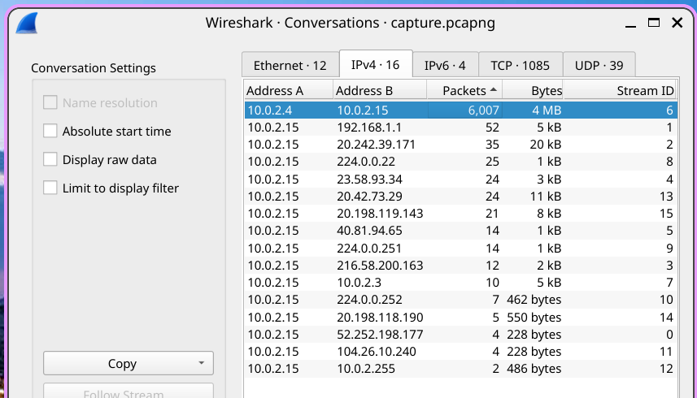
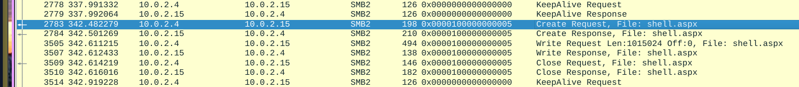
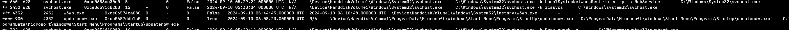
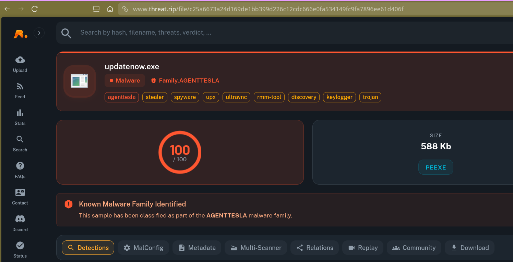

## Scenario

TechNova Systems' SOC detected suspicious outbound traffic from a public-facing IIS server. Three artefacts were provided for analysis: a PCAP of the initial traffic, a full memory image of the server, and a malware sample recovered from disk. The goal was to reconstruct the full intrusion timeline and identify all attacker activity.

---

## Tooling

- Wireshark
- Volatility
- CyberChef
- VirusTotal

---

## Investigation

### Reconnaissance — Network Service Discovery

Conversation statistics in Wireshark immediately revealed a high volume of traffic originating from `10.0.2.4`, consistent with rapid-fire probing of the IIS host.


Filtering for SMB2 traffic from the attacker IP exposed targeted share enumeration:
```bash
ip.addr==10.0.2.4 && smb2
```

The attacker connected to two UNC paths on the IIS host:

- `\\10.0.2.15\IPC$`
- `\\10.0.2.15\Documents`

This activity maps to **MITRE T1046 — Network Service Discovery**.

---
### Initial Access — Webshell Upload via SMB

Continuing to follow attacker SMB2 traffic revealed an SMB2 Write Request uploading a malicious file to the Documents share:

- **Filename:** `shell.aspx`
- **Size:** 1,015,024 bytes

Show Image

The uploaded ASPX webshell provided the attacker with remote code execution on the IIS server.

---
### Execution — Reverse Shell

Reviewing conversation statistics confirmed outbound callback traffic from the IIS host to the attacker on an uncommon but firewall-friendly port:

- **Reverse shell port:** `4443`

The uploaded hex blob was extracted and decoded in CyberChef using **From Hex**, revealing an MZ PE executable — confirming the shell uploaded a binary payload. The reconstructed file MD5:

`94bf1fafad9c0b1b3570922da19ed68f4930ea855c54fbf844fe4d9be8d6a133`

VirusTotal identified the sample as **Trojan.Meterpreter/Shellcode**.

### Memory Forensics — Volatility Analysis

With the memory image acquired, Volatility was used to examine the running system state.

**System information:**

bash

```bash
vol -f memdump.mem windows.info
```

- **Kernel Base:** `0xf80079213000`

**Process tree analysis:**

bash

```bash
vol -f memdump.mem windows.pstree
```


The process tree revealed `w3wp.exe` (IIS worker process, PID 4332) spawning a suspicious child process — a clear indicator of webshell-driven execution.

**Command line enumeration:**

bash

```bash
vol -f memdump.mem windows.cmdline
```

This confirmed the persistence implant path:

`900 updatenow.exe "C:\ProgramData\Microsoft\Windows\Start Menu\Programs\Startup\updatenow.exe"`

Dropping an executable into the Startup folder maps to **MITRE T1547 — Boot or Logon Autostart Execution**, ensuring the implant survives reboots.

---
### Malware Analysis — AgentTesla

Static analysis of `updatenow.exe` revealed the binary was packed with **UPX** to hinder analysis and evade signature-based detection.

Dynamic and threat intelligence analysis showed the malware beaconing to its C2 infrastructure:

- **C2 FQDN:** `cp8nl[.]hyperhost[.]ua`

VirusTotal open-source intelligence attributed the sample to the **AgentTesla** malware family — a well-known commodity RAT used for credential theft and keylogging.



## IOCs 

| Type               | Value                                                                      |
| ------------------ | -------------------------------------------------------------------------- |
| Attacker IP        | 10[.]0[.]2[.]4                                                             |
| IIS Host           | 10[.]0[.]2[.]15                                                            |
| Webshell           | shell.aspx                                                                 |
| Reverse Shell Port | 4443                                                                       |
| SHA256             | 94bf1fafad9c0b1b3570922da19ed68f4930ea855c54fbf844fe4d9be8d6a133           |
| Malware Family     | AgentTesla                                                                 |
| C2 FQDN            | cp8nl[.]hyperhost[.]ua                                                     |
| Persistence Path   | C:\ProgramData\Microsoft\Windows\Start Menu\Programs\Startup\updatenow.exe |
| Packer             | UPX                                                                        |
| Kernel Base        | 0xf80079213000                                                             |
## Conclusion

> The attacker conducted network service discovery against a public-facing IIS server, then used SMB to upload a Meterpreter ASPX webshell. The webshell provided code execution via the IIS worker process w3wp.exe, which was used to drop a UPX-packed AgentTesla implant into the Startup folder for persistence. Memory forensics confirmed the execution chain and identified the full on-disk path of the persistence mechanism. The malware beaconed to a Ukrainian hosting provider for C2 communications.

---

## References

- [MITRE T1046 — Network Service Discovery](https://attack.mitre.org/techniques/T1046/)
- [MITRE T1505.003 — Web Shell](https://attack.mitre.org/techniques/T1505/003/)
- [MITRE T1547 — Boot or Logon Autostart Execution](https://attack.mitre.org/techniques/T1547/)
- [MITRE T1027.002 — Software Packing](https://attack.mitre.org/techniques/T1027/002/)
- [LOLBAS — w3wp.exe](https://lolbas-project.github.io/lolbas/OtherMSBinaries/W3wp/)
- [CyberDefenders — Lockdown Lab](https://cyberdefenders.org/blueteam-ctf-challenges/lockdown/)























