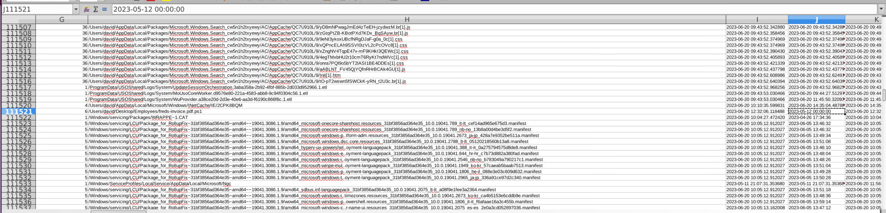

## Scenario

David from HR received a suspicious email, downloaded the attachment, and noticed nothing happened. EDR flagged unknown hashes that didn't match any known patterns and the OffSec team confirmed no pentest was scheduled. The CIRT team imaged David's machine and the investigation task is to analyse the MFT output for anti-forensics techniques — specifically timestomping — and recover the attacker's toolkit from the forensic artefacts.

The primary artefact is `output.csv` — an MFT (Master File Table) analysis export. The MFT stores two sets of timestamps per file: `$STANDARD_INFORMATION` (SI) timestamps which are user-visible and modifiable by tools, and `$FILE_NAME` (FN) timestamps which are harder to manipulate and maintained by the kernel. A discrepancy between SI and FN timestamps is the primary indicator of timestomping.

---

## Methodology

### Stage 1 — Locating the Suspicious Executable

The initial EDR alert referenced `appdir.dll` — a filename designed to look like a legitimate Windows DLL. Grepping the MFT CSV output for the filename:

```zsh
cat output.csv | grep -i "appdir.dll"
```
```
278597,Good,Active,File,1,108916,6,/Users/david/Desktop/Employees/appdir.dll.exe,
2023-06-20 11:57:46.398502,2021-07-22 00:00:00,2023-06-20 14:40:29.667946,
2023-06-20 11:57:46.398502,2020-03-02 13:00:44,2023-06-20 11:57:46.398502,
2023-06-20 14:31:41.938059,2023-06-20 12:17:03.165165,,,,,appdir.dll.exe,
```

Full path: `/Users/david/Desktop/Employees/appdir.dll.exe` — a double extension masquerade. The `.dll.exe` pattern is designed to appear as a DLL in a cursory filename scan while actually being an executable. Placing it in an `Employees` directory on David's Desktop adds social engineering context consistent with the phishing lure.

### Stage 2 — Timestomping Analysis: appdir.dll.exe

Examining the timestamp columns from the MFT output reveals the anti-forensics technique immediately. The SI Modified timestamp is:
```
2021-07-22 00:00:00
```

The round `00:00:00` time is a classic timestomping tell — legitimate file system operations produce fractional second precision timestamps. A perfectly zeroed time component almost always indicates manual timestamp manipulation via a tool like `timestomp` or PowerShell's `[System.IO.File]::SetLastWriteTime()`.

The `$FN` Date Accessed timestamp — maintained by the kernel and significantly harder to manipulate — tells a different story:
```
2020-03-02 13:00:44
````

Cross-referencing the full SI timestamp set against the FN value confirms the file was genuinely active on the system in mid-2023 (`2023-06-20` across multiple SI fields) despite the SI Modified timestamp being backdated to 2021 with a zeroed time component. The FN timestamp preserves the true access history.

### Stage 3 — PowerView Discovery

The SIEM alerted on file access at `2023-06-20 11:49:34.785433`. Grepping the MFT output for this timestamp:

````zsh
cat output.csv | grep -i "2023-06-20 11:49:34.785433"
```
```
113079,Good,Active,File,3,112795,3,
/Users/david/Desktop/Employees/sysupdate/Recon/PowerView.ps1,
2020-08-17 12:13:56,2023-06-20 11:49:34.800356,2023-06-20 11:49:34.800356,
2023-06-20 11:49:34.800356,2023-06-20 11:49:34.785433
````

`PowerView.ps1` — a widely-used Active Directory reconnaissance script from the PowerSploit framework — found at `/Users/david/Desktop/Employees/sysupdate/Recon/`. The directory structure `sysupdate/Recon/` mimics legitimate system update tooling to blend in.

The timestomped SI Date Accessed is `2020-08-17 12:13:56` — again a backdated manipulation to hide when the tool was actually deployed and accessed. The actual access timestamps cluster around `2023-06-20 11:49:34` consistent with the SIEM alert.

### Stage 4 — Mimikatz Discovery

An educated guess grep confirms the presence of a credential harvesting tool:

```zsh
cat output.csv | grep -i "mimikatz"
```
```
/Users/david/Downloads/mimikatz-master/debian/changelog:Zone.Identifier
````

Mimikatz found in David's Downloads directory — the `Zone.Identifier` alternate data stream confirms it was downloaded from the internet (Mark of the Web). The `mimikatz-master` directory structure indicates the full GitHub repository was downloaded as a ZIP and extracted. Mimikatz is the industry-standard tool for LSASS credential dumping on Windows systems.

### Stage 5 — PDF Masquerade Payload

Manual inspection of the MFT CSV in LibreOffice surfaces a second masqueraded payload in the Employees directory:

`/Users/david/Desktop/Employees/freds-invoice.pdf.ps1`

Another double extension — `freds-invoice.pdf.ps1` is a PowerShell script disguised as a PDF invoice. This is almost certainly the initial phishing lure that David downloaded and "nothing happened" — because the PS1 extension wasn't associated with a visible execution in Windows Explorer if the user was viewing it as a PDF. The filename `freds-invoice` provides plausible business context for David in an HR role.


---

## Attack Summary

|Phase|Action|
|---|---|
|Initial Access|freds-invoice.pdf.ps1 delivered via phishing email to David (HR)|
|Masquerading|Payload disguised with .pdf.ps1 double extension — appears as PDF invoice|
|Execution|PS1 script executed — drops toolkit to Desktop/Employees/|
|Anti-Forensics|Timestomping applied to appdir.dll.exe (SI Modified → 2021-07-22 00:00:00)|
|Anti-Forensics|Timestomping applied to PowerView.ps1 (SI Date Accessed → 2020-08-17)|
|Reconnaissance|PowerView.ps1 staged in sysupdate/Recon/ for AD enumeration|
|Credential Access|mimikatz-master downloaded to Downloads — LSASS dump capability staged|
|Execution Agent|appdir.dll.exe — masqueraded executable in Employees directory|

---

## IOCs

|Type|Value|
|---|---|
|File (Lure)|freds-invoice.pdf.ps1|
|File (Executable)|appdir.dll.exe|
|File (Recon Tool)|PowerView.ps1|
|File (Cred Tool)|mimikatz|
|Path (appdir)|/Users/david/Desktop/Employees/appdir.dll.exe|
|Path (PowerView)|/Users/david/Desktop/Employees/sysupdate/Recon/PowerView.ps1|
|Path (mimikatz)|/Users/david/Downloads/mimikatz-master/|
|Timestomped Modified (appdir)|2021-07-22 00:00:00|
|FN Date Accessed (appdir)|2020-03-02 13:00:44|
|Timestomped Date Accessed (PowerView)|2020-08-17 12:13:56|
|SIEM Alert Timestamp|2023-06-20 11:49:34.785433|

---

## MITRE ATT&CK

|Technique|ID|Description|
|---|---|---|
|Indicator Removal: Timestomp|T1070.006|SI timestamps manipulated on appdir.dll.exe and PowerView.ps1 to backdate to 2020-2021|
|Masquerading: Rename System Utilities|T1036.003|appdir.dll.exe and freds-invoice.pdf.ps1 use double extensions to obscure true file type|
|OS Credential Dumping: LSASS Memory|T1003.001|mimikatz-master downloaded for LSASS credential harvesting capability|
|Command and Scripting Interpreter: PowerShell|T1059.001|PowerView.ps1 staged for AD reconnaissance; freds-invoice.pdf.ps1 as initial payload|
|File and Directory Discovery|T1083|PowerView.ps1 in dedicated Recon directory indicates systematic AD enumeration preparation|

---

## Defender Takeaways

**$FN vs $SI timestamp discrepancy is the timestomping detection primitive** — timestomping tools modify `$STANDARD_INFORMATION` timestamps because these are the ones visible to users and most forensic tools by default. The `$FILE_NAME` attribute timestamps are written by the kernel during directory operations and are significantly harder to manipulate without elevated access and specific tooling. Any forensic analysis of suspicious files should compare both sets — a discrepancy, especially with a zeroed `HH:MM:SS` component in SI, is a reliable indicator of manipulation. MFT-aware tools like MFTECmd output both sets explicitly for this reason.

**Double extension masquerading depends on hidden file extensions** — `freds-invoice.pdf.ps1` and `appdir.dll.exe` are only convincing if the operating system is configured to hide known file extensions, which is the Windows default. Configuring endpoints to always show file extensions via Group Policy removes this technique's effectiveness entirely at no operational cost.

**Post-exploitation toolkit staging pattern** — the presence of PowerView in a `sysupdate/Recon/` subdirectory, mimikatz in Downloads, and a masqueraded executable in the Employees directory collectively indicates a prepared toolkit staged for a multi-phase attack. The attacker had not yet executed the full kill chain when the EDR flagged the unknown hashes — early detection here prevented credential access and lateral movement. EDR hash alerting on unknown binaries, even without signature matches, was the detection control that worked.

**Zone.Identifier ADS confirms internet origin** — the `changelog:Zone.Identifier` entry for the mimikatz download confirms it was downloaded directly from the internet rather than transferred from another internal system. Monitoring for Zone.Identifier creation events on sensitive directories and alerting on downloads of known offensive tool repository names (`mimikatz`, `PowerSploit`, `SharpHound` etc) provides additional coverage without requiring hash-based detection.

---

<div class="qa-item"> <div class="qa-question-text">What is the full file path of appdir.dll (including its extension) (Format: /path/to/appdir.dll.extension)</div> <div class="flag-reveal"> <input type="checkbox"> <span class="r-placeholder">Click flag to reveal</span> <span class="r-answer">/Users/david/Desktop/Employees/appdir.dll.exe</span> <button class="copy-btn" onclick="event.stopPropagation();navigator.clipboard.writeText(this.previousElementSibling.textContent);this.textContent='copied';setTimeout(()=>this.textContent='copy',1500)">copy</button> </div> </div>

<div class="qa-item"> <div class="qa-question-text">Looks like the attacker tried timestomp this file - what is the Modified time of this file? (Format YYYY-MM-DD XX:XX:XX)</div> <div class="answer-reveal"> <input type="checkbox"> <span class="r-placeholder">Click to reveal answer</span> <span class="r-answer">2021-07-22 00:00:00</span> <button class="copy-btn" onclick="event.stopPropagation();navigator.clipboard.writeText(this.previousElementSibling.textContent);this.textContent='copied';setTimeout(()=>this.textContent='copy',1500)">copy</button> </div> </div>

<div class="qa-item"> <div class="qa-question-text">According to this MFT analysis output, what was the actual $FN time accessed of this file? (Format: YYYY-MM-DD XX:XX:XX)</div> <div class="flag-reveal"> <input type="checkbox"> <span class="r-placeholder">Click flag to reveal</span> <span class="r-answer">2020-03-02 13:00:44</span> <button class="copy-btn" onclick="event.stopPropagation();navigator.clipboard.writeText(this.previousElementSibling.textContent);this.textContent='copied';setTimeout(()=>this.textContent='copy',1500)">copy</button> </div> </div>

<div class="qa-item"> <div class="qa-question-text">According to the analyst, the SIEM alerted the team about a file accessed at 2023-06-20 11:49:34.785433. What is the name of the tool the attacker was trying to use? (Format: toolname.ext)</div> <div class="answer-reveal"> <input type="checkbox"> <span class="r-placeholder">Click to reveal answer</span> <span class="r-answer">PowerView.ps1</span> <button class="copy-btn" onclick="event.stopPropagation();navigator.clipboard.writeText(this.previousElementSibling.textContent);this.textContent='copied';setTimeout(()=>this.textContent='copy',1500)">copy</button> </div> </div>

<div class="qa-item"> <div class="qa-question-text">The attacker was attempting to hide this tool in this directory too. What is the time-stomped Date Accessed for this tool? (Format: YYYY-MM-DD XX:XX:XX)</div> <div class="flag-reveal"> <input type="checkbox"> <span class="r-placeholder">Click flag to reveal</span> <span class="r-answer">2020-08-17 12:13:56</span> <button class="copy-btn" onclick="event.stopPropagation();navigator.clipboard.writeText(this.previousElementSibling.textContent);this.textContent='copied';setTimeout(()=>this.textContent='copy',1500)">copy</button> </div> </div>

<div class="qa-item"> <div class="qa-question-text">It looks like the attacker was attempting to download a collection of post-exploitation tools. One of which is notable for dumping LSASS credentials. What's the name of this tool? (Format: toolname)</div> <div class="answer-reveal"> <input type="checkbox"> <span class="r-placeholder">Click to reveal answer</span> <span class="r-answer">mimikatz</span> <button class="copy-btn" onclick="event.stopPropagation();navigator.clipboard.writeText(this.previousElementSibling.textContent);this.textContent='copied';setTimeout(()=>this.textContent='copy',1500)">copy</button> </div> </div>

<div class="qa-item"> <div class="qa-question-text">You discovered another file that was masquerading as a PDF file the Employees directory. What is the name of this file? (Format: filename.extension)</div> <div class="flag-reveal"> <input type="checkbox"> <span class="r-placeholder">Click flag to reveal</span> <span class="r-answer">freds-invoice.pdf.ps1</span> <button class="copy-btn" onclick="event.stopPropagation();navigator.clipboard.writeText(this.previousElementSibling.textContent);this.textContent='copied';setTimeout(()=>this.textContent='copy',1500)">copy</button> </div> </div>

<div class="qa-item"> <div class="qa-question-text">What is the timestomped Date Modified of this file? (Format: YYYY-MM-DD XX:XX:XX)</div> <div class="answer-reveal"> <input type="checkbox"> <span class="r-placeholder">Click to reveal answer</span> <span class="r-answer">ANSWER</span> <button class="copy-btn" onclick="event.stopPropagation();navigator.clipboard.writeText(this.previousElementSibling.textContent);this.textContent='copied';setTimeout(()=>this.textContent='copy',1500)">copy</button> </div> </div>
