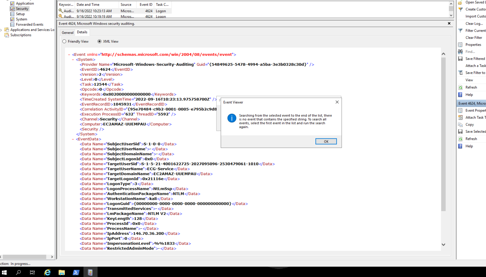
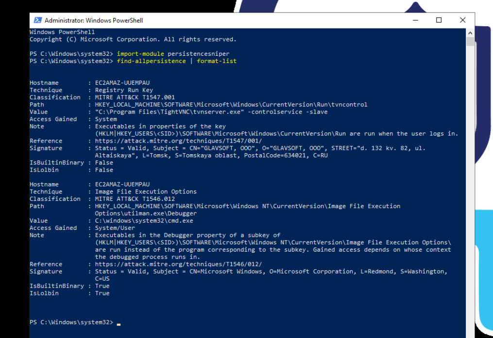
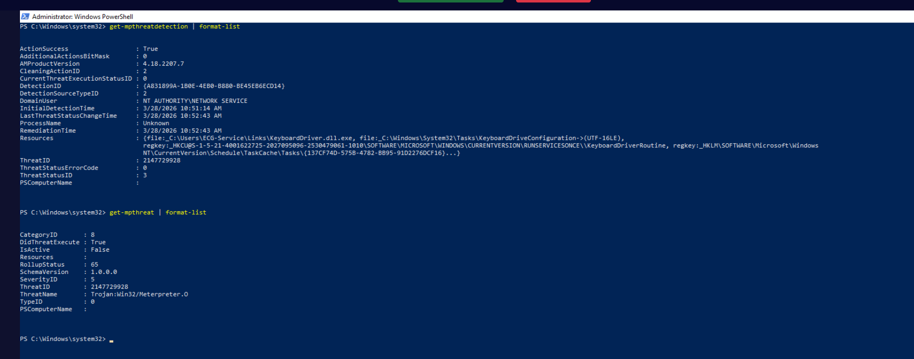
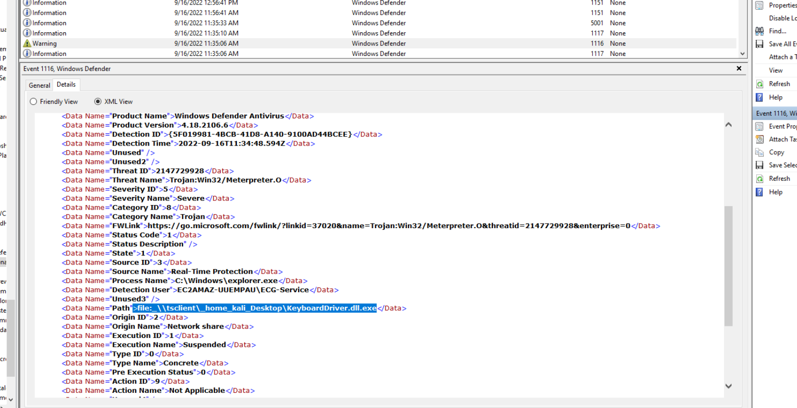
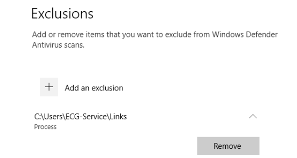
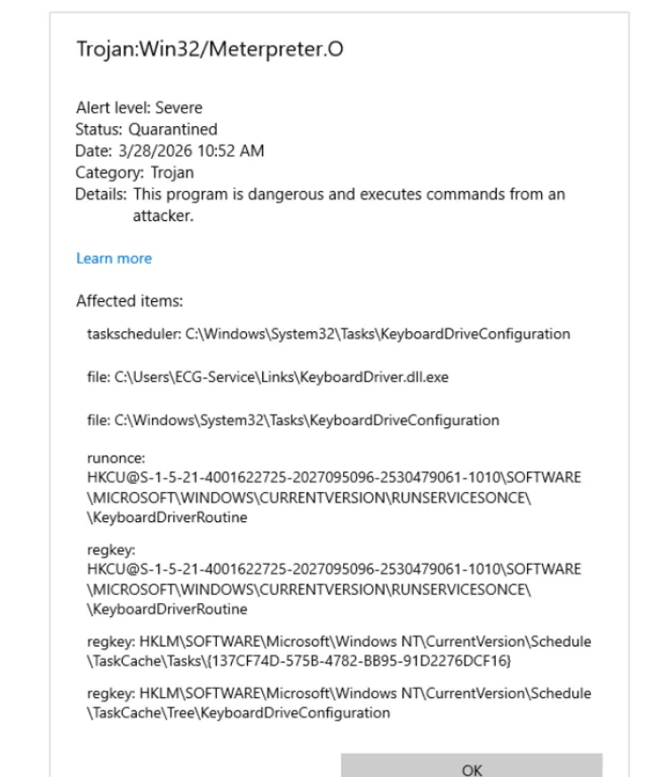
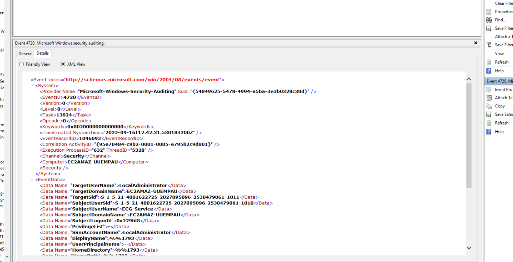
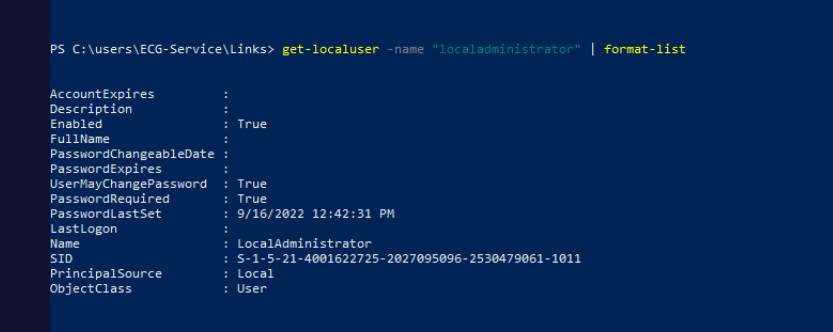
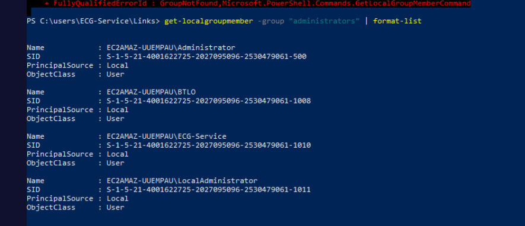

## Scenario

The security team is trialling PersistenceSniper, an open-source IR tool for detecting persistence mechanisms on Windows endpoints. An IR engagement is underway — the task is to combine PersistenceSniper output with manual investigation techniques across Event Logs, Windows Defender, Task Scheduler, and local user management to fully characterise the compromise.

---

## Methodology

### Stage 1 — Initial Access: Brute Force Identification

The Security event log is the first stop. Querying for failed logon events (Event ID 4625) immediately reveals the scale of the attack:

```
Get-WinEvent -FilterHashtable @{LogName='Security'; Id=4625} | Measure-Object
```

```
Count: 6504
```

6504 failed logons is unambiguous — this is a sustained brute force campaign, not a fat-finger lockout. The volume and pattern confirms **T1110.001 (Brute Force: Password Guessing)** as the initial access technique.

Ranking source IPs across the failed logon events surfaces the attacker: `146.70.36.200` from workstation `kali` — the hostname alone is a dead giveaway. The target account is `ECG-Service`.

Filtering Event ID 4624 (successful logon) for the same attacker IP identifies the first successful authentication:



- **First successful logon**: `9/16/2022 10:19:13 AM`
- **Workstation**: kali
- **Source IP**: 146.70.36.200
- **Logon Type**: 3 (network)

OSINT on `146.70.36.200` via ipinfo.io returns **Germany** as the associated country.

### Stage 2 — PersistenceSniper Output

With initial access established, PersistenceSniper is run to enumerate persistence mechanisms:

```powershell
Import-Module PersistenceSniper
Find-AllPersistence | Format-List
```



Two findings returned:

**Finding 1 — Registry Run Key (TightVNC):** `HKLM\SOFTWARE\Microsoft\Windows\CurrentVersion\Run\tvncontrol` pointing to `C:\Program Files\TightVNC\tvnserver.exe`. The signature is valid (GLAVSOFT OOO, Russia) and TightVNC is legitimate remote access software present in the lab environment. This is a **false positive** — rule 1 of security tool usage.

**Finding 2 — Image File Execution Options (IFEO):** `HKLM\SOFTWARE\Microsoft\Windows NT\CurrentVersion\Image File Execution Options\utilman.exe\Debugger` set to `C:\windows\system32\cmd.exe`. This is a classic accessibility feature abuse technique — pressing Win+U at the Windows login screen normally launches Utility Manager (`utilman.exe`), but with this debugger key set, `cmd.exe` launches instead as SYSTEM without any authentication required. Classification: **T1546.012**, Access Gained: System/User.

This is a genuine malicious finding — PersistenceSniper correctly identified it. The TightVNC entry demonstrates why tool output always requires analyst validation.

### Stage 3 — Windows Defender Threat Detection

```
Get-MpThreatDetection | Format-List
Get-MpThreat | Format-List
```



Defender detected and quarantined a threat. The Windows Defender Operational event log (Event ID 1116) confirms the exact detection timestamp and file origin:


- **Detection timestamp**: `9/16/2022 11:35 AM`
- **Threat name**: `Trojan:Win32/Meterpreter.O`
- **Affected item**: `file: \\tsclient\_home_kali_Desktop\KeyboardDriver.dll.exe`
- **Origin**: Network share
- **Detection user**: EC2AMAZ-UUEMPAU\ECG-Service

The path `\\tsclient\` is the RDP client drive redirection mapping — the attacker executed `KeyboardDriver.dll.exe` directly from the Kali machine's Desktop over the RDP session rather than copying it to disk first. Defender detected it via real-time protection and suspended execution. The `_home_kali_Desktop` path confirms the Kali home directory was mapped through the RDP session.

### Stage 4 — Defender Exclusion Tampering

Defender quarantined the payload — but the investigation doesn't end there. Checking Defender exclusions reveals the attacker's countermove:



The attacker added `C:\Users\ECG-Service\Links` to Defender's exclusion list — any file placed in that directory would be invisible to real-time protection. This explains the two-step approach: initial execution from the RDP share (detected), then re-deployment to the excluded folder for persistence.

### Stage 5 — Malicious File Recovery and Hashing

The malware was redeployed to the excluded path:

```
Get-FileHash "C:\Users\ECG-Service\Links\KeyboardDriver.dll.exe" -Algorithm SHA256
```

```
C321747522D6E865904EE21B138954BABF324E871B576A406C144B35698EF738
```

Note: the file appears and disappears depending on lab VM state — the artifact is present in the pre-loaded lab environment but may not survive certain reset conditions.

### Stage 6 — Scheduled Task Investigation

PersistenceSniper did not flag a scheduled task — but manual inspection of Task Scheduler surfaces `KeyboardDriveConfiguration`, created by `EC2AMAZ-UUEMPAU\ECG-Service`:


The task exists but will never execute. Examining the Triggers tab reveals the critical flaw:

**Trigger: One time — At 12:00 AM on 9/16/2022**

The trigger fired once in the past and will never fire again. The attacker created a one-time scheduled task rather than a recurring or startup trigger — an operational error that rendered the persistence mechanism completely ineffective. PersistenceSniper missed it because a one-time past trigger doesn't match persistence patterns it hunts for (Run keys, startup triggers, recurring schedules).

### Stage 7 — Attacker-Created Persistence Account

Filtering the Security event log for Event ID 4720 (user account created) after the first ECG-Service logon timestamp surfaces a new account creation:



Account created: `LocalAdministrator` — created by `ECG-Service` at `9/16/2022 12:42:31 PM`, approximately two hours after initial access.

```
Get-LocalUser -Name "LocalAdministrator" | Format-List
```



```
Get-LocalGroupMember -Group "Administrators"
Get-LocalGroupMember -Group "Remote Desktop Users"
Get-LocalGroupMember -Group "Users"
```



`LocalAdministrator` was added to three groups: **Administrators**, **Remote Desktop Users**, and **Users** — full local admin rights plus RDP access, providing a durable backdoor account independent of the compromised ECG-Service account.

---

## Attack Summary

|Phase|Action|
|---|---|
|Initial Access|6504 brute force attempts against ECG-Service from kali/146.70.36.200|
|First Successful Logon|9/16/2022 10:19:13 AM — Logon Type 3 (network)|
|Pre-Auth Persistence|IFEO: utilman.exe → cmd.exe (SYSTEM shell at login screen)|
|Payload Delivery|KeyboardDriver.dll.exe executed via RDP tsclient drive redirection|
|Defender Detection|Trojan:Win32/Meterpreter.O detected and quarantined at 11:35 AM|
|Defense Evasion|Defender exclusion added for C:\Users\ECG-Service\Links|
|Payload Redeployment|KeyboardDriver.dll.exe redeployed to excluded Links folder|
|Broken Persistence|KeyboardDriveConfiguration scheduled task — one-time trigger already expired|
|Account Persistence|LocalAdministrator created 12:42:31 PM — Administrators + RDP Users + Users|

---

## IOCs

|Type|Value|
|---|---|
|IP (Attacker)|146[.]70[.]36[.]200|
|Hostname (Attacker)|kali|
|Country|Germany|
|Account (Compromised)|ECG-Service|
|Account (Created)|LocalAdministrator|
|File (Payload)|KeyboardDriver.dll.exe|
|File Path (Excluded)|C:\Users\ECG-Service\Links\KeyboardDriver.dll.exe|
|File Path (Initial)|\tsclient_home_kali_Desktop\KeyboardDriver.dll.exe|
|SHA256|C321747522D6E865904EE21B138954BABF324E871B576A406C144B35698EF738|
|Threat Name|Trojan:Win32/Meterpreter.O|
|Defender Exclusion|C:\Users\ECG-Service\Links|
|Scheduled Task|KeyboardDriveConfiguration|
|IFEO Key|HKLM\SOFTWARE\Microsoft\Windows NT\CurrentVersion\Image File Execution Options\utilman.exe\Debugger|
|IFEO Value|C:\windows\system32\cmd.exe|
|First Logon|9/16/2022 10:19:13 AM|
|Threat Detection|9/16/2022 11:35 AM|
|Account Created|9/16/2022 12:42:31 PM|

---

## MITRE ATT&CK

|Technique|ID|Description|
|---|---|---|
|Brute Force: Password Guessing|T1110.001|6504 failed logons against ECG-Service from 146.70.36.200|
|Event Triggered Execution: IFEO|T1546.012|utilman.exe debugger set to cmd.exe — SYSTEM shell at login screen|
|Scheduled Task|T1053.005|KeyboardDriveConfiguration — one-time past trigger, never executed|
|Create Local Account|T1136.001|LocalAdministrator created post-compromise by ECG-Service|
|Account Manipulation|T1098|LocalAdministrator added to Administrators, RDP Users, Users groups|
|Impair Defenses: Disable or Modify Tools|T1562.001|Defender exclusion added for C:\Users\ECG-Service\Links|

---

## Defender Takeaways

**PersistenceSniper is a starting point, not a conclusion** — the tool correctly identified the IFEO abuse and flagged TightVNC as a false positive, but missed the scheduled task entirely because a one-time past trigger doesn't match its detection patterns. IR tools reduce analyst workload but cannot replace manual validation. Every finding requires verification and every gap requires manual follow-up — PersistenceSniper not flagging something is not evidence of clean persistence.

**RDP drive redirection as a delivery vector** — executing malware directly from `\\tsclient\` means the payload never touches the victim disk during initial execution, bypassing many file-based detection controls. Restricting or disabling RDP drive redirection via Group Policy (`Computer Configuration → Administrative Templates → Windows Components → Remote Desktop Services → Do not allow drive redirection`) removes this vector entirely.

**Defender exclusions as a post-compromise indicator** — adding a folder to Defender exclusions is a high-fidelity indicator of attacker activity when done outside of normal IT change management. Monitoring registry writes to `HKLM\SOFTWARE\Microsoft\Windows Defender\Exclusions\Paths` via Sysmon Event ID 13 or a SIEM rule provides near-real-time detection of this technique. The exclusion was the attacker's direct response to the initial quarantine — without it, redeployment would have been blocked.

**Attacker-created accounts as durable persistence** — `LocalAdministrator` with Administrators and Remote Desktop Users membership provides full independent access to the system regardless of what happens to ECG-Service. Account creation events (Event ID 4720) and group membership changes (Event ID 4732) should be alerted on in any SIEM, particularly for additions to privileged groups outside of business hours or change windows.

**Brute force prevention at the authentication layer** — 6504 failed logons against a single account should have triggered an account lockout policy long before success. Account lockout thresholds of 5-10 failures, combined with network-level rate limiting on RDP (port 3389) and MFA, would have prevented initial access entirely regardless of password strength.

---


<div class="qa-item"> <div class="qa-question-text">Based on the volume of logon Windows Events, what is the most appropriate MITRE ATT&CK sub-technique used to gain initial access? (Format: TXXXX.XXX)</div> <div class="flag-reveal"> <input type="checkbox"> <span class="r-placeholder">Click flag to reveal</span> <span class="r-answer">T1110.001</span> <button class="copy-btn" onclick="event.stopPropagation();navigator.clipboard.writeText(this.previousElementSibling.textContent);this.textContent='copied';setTimeout(()=>this.textContent='copy',1500)">copy</button> </div> </div>

<div class="qa-item"> <div class="qa-question-text">What is the timestamp of the first successful login to the suspected compromised account? (Format: M/DD/YYYY HH:MM:SS AM/PM)</div> <div class="answer-reveal"> <input type="checkbox"> <span class="r-placeholder">Click to reveal answer</span> <span class="r-answer">9/16/2022 10:19:13 AM</span> <button class="copy-btn" onclick="event.stopPropagation();navigator.clipboard.writeText(this.previousElementSibling.textContent);this.textContent='copied';setTimeout(()=>this.textContent='copy',1500)">copy</button> </div> </div>

<div class="qa-item"> <div class="qa-question-text">What is the hostname and IP address that logs into this account? (Format: WorkstationName, X.X.X.X)</div> <div class="flag-reveal"> <input type="checkbox"> <span class="r-placeholder">Click flag to reveal</span> <span class="r-answer">kali, 146.70.36.200</span> <button class="copy-btn" onclick="event.stopPropagation();navigator.clipboard.writeText(this.previousElementSibling.textContent);this.textContent='copied';setTimeout(()=>this.textContent='copy',1500)">copy</button> </div> </div>

<div class="qa-item"> <div class="qa-question-text">Perform a lookup on this IP address. What country is it associated with? (Format: Country)</div> <div class="answer-reveal"> <input type="checkbox"> <span class="r-placeholder">Click to reveal answer</span> <span class="r-answer">germany</span> <button class="copy-btn" onclick="event.stopPropagation();navigator.clipboard.writeText(this.previousElementSibling.textContent);this.textContent='copied';setTimeout(()=>this.textContent='copy',1500)">copy</button> </div> </div>

<div class="qa-item"> <div class="qa-question-text">Rule 1 of security - we can't always trust the output from our tools, it might include false positives or be missing true positives. What is the technique name (as stated by PersistenceSniper) that has been utilized to provide a SYSTEM-level CMD prompt without logging into a system, and what is the ATT&CK ID? (Format: Technique Name, TXXXX.XXX)</div> <div class="flag-reveal"> <input type="checkbox"> <span class="r-placeholder">Click flag to reveal</span> <span class="r-answer">brute force, T1110.001</span> <button class="copy-btn" onclick="event.stopPropagation();navigator.clipboard.writeText(this.previousElementSibling.textContent);this.textContent='copied';setTimeout(()=>this.textContent='copy',1500)">copy</button> </div> </div>

<div class="qa-item"> <div class="qa-question-text">An employee remembered seeing a Defender popup for a threat that was dealt with. Find the timestamp that this threat was detected at (Format: M/DD/YYYY HH:MM AM/PM)</div> <div class="answer-reveal"> <input type="checkbox"> <span class="r-placeholder">Click to reveal answer</span> <span class="r-answer">9/16/2022 11:35 AM</span> <button class="copy-btn" onclick="event.stopPropagation();navigator.clipboard.writeText(this.previousElementSibling.textContent);this.textContent='copied';setTimeout(()=>this.textContent='copy',1500)">copy</button> </div> </div>

<div class="qa-item"> <div class="qa-question-text">Investigate the threat alert in Defender. What is the affected item path? (Format: file: path\to\filename.extension)</div> <div class="flag-reveal"> <input type="checkbox"> <span class="r-placeholder">Click flag to reveal</span> <span class="r-answer">file: \\tsclient\_home_kali_Desktop\KeyboardDriver.dll.exe</span> <button class="copy-btn" onclick="event.stopPropagation();navigator.clipboard.writeText(this.previousElementSibling.textContent);this.textContent='copied';setTimeout(()=>this.textContent='copy',1500)">copy</button> </div> </div>

<div class="qa-item"> <div class="qa-question-text">What is the threat name, according to Microsoft Defender? (Format: something:WinXX/ThreatName)</div> <div class="answer-reveal"> <input type="checkbox"> <span class="r-placeholder">Click to reveal answer</span> <span class="r-answer">Trojan:Win32/Meterpreter.O</span> <button class="copy-btn" onclick="event.stopPropagation();navigator.clipboard.writeText(this.previousElementSibling.textContent);this.textContent='copied';setTimeout(()=>this.textContent='copy',1500)">copy</button> </div> </div>

<div class="qa-item"> <div class="qa-question-text">We know that the file was detected and quarantined by Defender, so did this stop them? Investigate Defender Virus & threat protection exclusions to see if the attacker has modified Defender to stop blocking their malware. Provide the file path of the folder that has been excluded from anti-virus actions (Format: Drive:\path\to\folder)</div> <div class="flag-reveal"> <input type="checkbox"> <span class="r-placeholder">Click flag to reveal</span> <span class="r-answer">c:\users\ECG-Service\links</span> <button class="copy-btn" onclick="event.stopPropagation();navigator.clipboard.writeText(this.previousElementSibling.textContent);this.textContent='copied';setTimeout(()=>this.textContent='copy',1500)">copy</button> </div> </div>

<div class="qa-item"> <div class="qa-question-text">On this occasion PersistenceSniper didn't give us much information, so it's time to check some common persistence techniques manually. Investigate Scheduled Tasks on the system, looking for any using the malicious file we found earlier. Is there a Scheduled Task using this binary? (Format: Task Name)</div> <div class="answer-reveal"> <input type="checkbox"> <span class="r-placeholder">Click to reveal answer</span> <span class="r-answer">KeyboardDriveConfiguration</span> <button class="copy-btn" onclick="event.stopPropagation();navigator.clipboard.writeText(this.previousElementSibling.textContent);this.textContent='copied';setTimeout(()=>this.textContent='copy',1500)">copy</button> </div> </div>

<div class="qa-item"> <div class="qa-question-text">The attacker messed up creating this Task. Provide the 'Details' text that highlights the reason this is not going to be an effective persistence mechanism, and why it wasn't flagged by PersistenceSniper (Format: Details Text)</div> <div class="flag-reveal"> <input type="checkbox"> <span class="r-placeholder">Click flag to reveal</span> <span class="r-answer">At 12:00 AM on 9/16/2022</span> <button class="copy-btn" onclick="event.stopPropagation();navigator.clipboard.writeText(this.previousElementSibling.textContent);this.textContent='copied';setTimeout(()=>this.textContent='copy',1500)">copy</button> </div> </div>

<div class="qa-item"> <div class="qa-question-text">Navigate to the location of the malicious file and retrieve the SHA256 hash so we can add it to our ongoing investigation case (Format: SHA256 Hash)</div> <div class="answer-reveal"> <input type="checkbox"> <span class="r-placeholder">Click to reveal answer</span> <span class="r-answer">C321747522D6E865904EE21B138954BABF324E871B576A406C144B35698EF738</span> <button class="copy-btn" onclick="event.stopPropagation();navigator.clipboard.writeText(this.previousElementSibling.textContent);this.textContent='copied';setTimeout(()=>this.textContent='copy',1500)">copy</button> </div> </div>

<div class="qa-item"> <div class="qa-question-text">Go back and look at the Event Logs for any account creations after the timestamp of the first login to ECG-Service. What is the name of the account that was created? (Format: New User Name)</div> <div class="flag-reveal"> <input type="checkbox"> <span class="r-placeholder">Click flag to reveal</span> <span class="r-answer">LocalAdministrator</span> <button class="copy-btn" onclick="event.stopPropagation();navigator.clipboard.writeText(this.previousElementSibling.textContent);this.textContent='copied';setTimeout(()=>this.textContent='copy',1500)">copy</button> </div> </div>

<div class="qa-item"> <div class="qa-question-text">Use PowerShell to look at the persistence account. Based on the 'Password last set' property, when was this account created? (Format: m/dd/yyyy hh:mm:ss AM/PM)</div> <div class="answer-reveal"> <input type="checkbox"> <span class="r-placeholder">Click to reveal answer</span> <span class="r-answer">9/16/2022 12:42:31 PM</span> <button class="copy-btn" onclick="event.stopPropagation();navigator.clipboard.writeText(this.previousElementSibling.textContent);this.textContent='copied';setTimeout(()=>this.textContent='copy',1500)">copy</button> </div> </div>

<div class="qa-item"> <div class="qa-question-text">What Local Group Memberships does this account have, in alphabetical order? (Format: AGroup, BGroup, ...)</div> <div class="flag-reveal"> <input type="checkbox"> <span class="r-placeholder">Click flag to reveal</span> <span class="r-answer">Administrators, Remote Desktop Users, Users</span> <button class="copy-btn" onclick="event.stopPropagation();navigator.clipboard.writeText(this.previousElementSibling.textContent);this.textContent='copied';setTimeout(()=>this.textContent='copy',1500)">copy</button> </div> </div>
