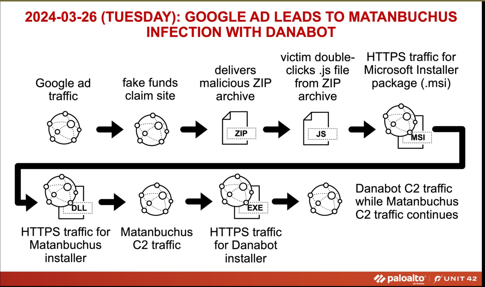
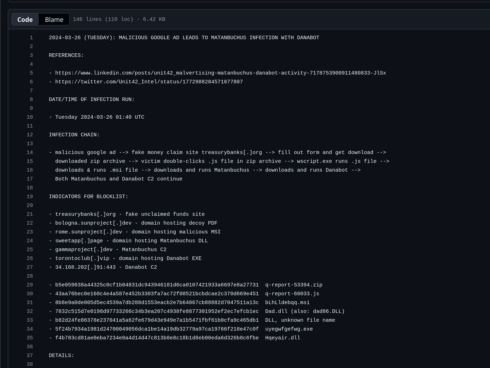
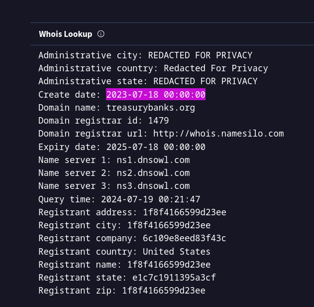
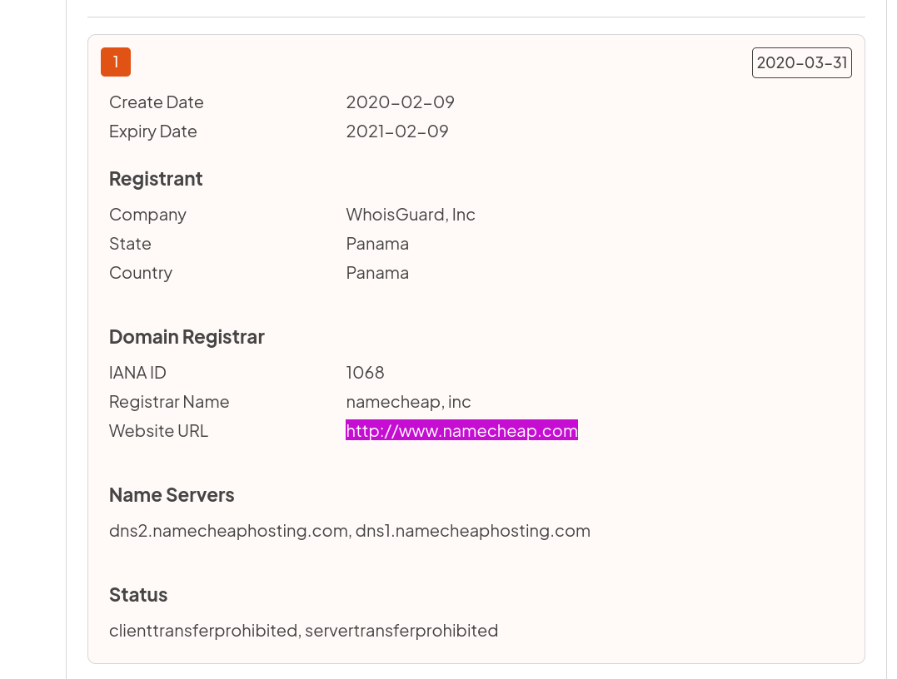
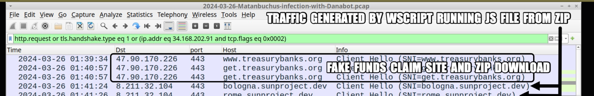
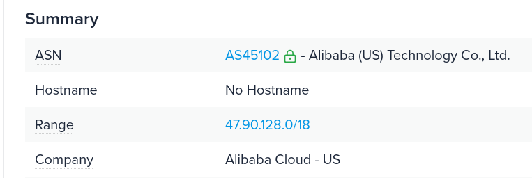
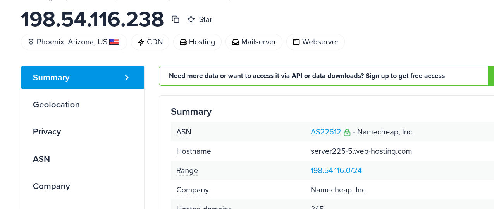

## Overview

In March 2024, employees at a mid-sized investment advisory firm began reporting system slowdowns and suspicious pop-ups after searching for financial recovery tools online. Internal traffic logs showed connections to `treasurybanks.org` shortly before endpoints exhibited abnormal behaviour. This lab investigates the attacker infrastructure, certificate chain, domain history, and malware delivery chain behind the Matanbuchus/Danabot malvertising campaign documented by Palo Alto Unit 42.


---

## Investigation

### Initial Access — Malvertising

The campaign began with **malvertising** — malicious Google Ads redirecting victims searching for financial recovery tools to a fake unclaimed funds site at `treasurybanks[.]org`. The use of Google's ad infrastructure gave the campaign legitimacy and broad reach, targeting victims who had no reason to distrust the search results they were clicking.

---

### Malware Delivery Chain

Victims who visited the fraudulent site and filled out a form were prompted to download:

**ZIP Archive:** `q-report-53394.zip`

Inside the ZIP was a JavaScript file. When the victim double-clicked it, `wscript.exe` executed the JS file which initiated the full infection chain:

```
Google Ad → treasurybanks.org → ZIP download → .js file → MSI installer → Matanbuchus DLL → Danabot EXE
```

The malware family inside the ZIP was **Matanbuchus** — a malware **loader** whose primary function is delivering and executing additional payloads rather than stealing data directly. Matanbuchus was responsible for downloading and executing **Danabot**, the credential-stealing banking trojan that completed the attack.

Before the JavaScript payload executed, a legitimate copy of `curl.exe` was copied to the Temp directory — used by the malware to facilitate downloads without triggering additional AV signatures.

**Temp file:** `C:\Users\Admin\AppData\Local\Temp\TNheBOJElq.exe` **SHA256:** `6cf60c768a7377f7c4842c14c3c4d416480a7044a7a5a72b61ff142a796273ec` — confirmed not malicious, copy of system curl.exe


---

### TLS Certificate Analysis — crt.sh

Searching `treasurybanks.org` on crt.sh returned the certificate used across the campaign domains. The relevant cert (ID `12296951595`) was logged 2024-03-06 and covered multiple subdomains including `download.treasurybanks.org`, `get.treasurybanks.org`, and `file.treasurybanks.org`.

**SHA-256 Fingerprint:** `329ec925f80dbd831c09b436cbf1b2200119bc43f95e84286f54f8a40aef73c5`

The certificate was issued by **GeoTrust** — specifically via the GeoTrust TLS RSA CA G1 intermediate, a DigiCert subsidiary. The attacker obtained a valid DV certificate, further lending credibility to the fake site.

```
Authority Information Access:
    OCSP - URI:http://status.geotrust.com
    CA Issuers - URI:http://cacerts.geotrust.com/GeoTrustTLSRSACAG1.crt
```

---

### Domain Registration

VirusTotal WHOIS data confirms `treasurybanks.org` was registered on **2023-07-18** — approximately 8 months before the campaign was detected, suggesting deliberate infrastructure staging well in advance.

The domain was registered via **Namecheap**.


---

### Infrastructure Analysis

#### Cloud Hosting

A Unit 42 X post containing a PCAP screenshot revealed `www.treasurybanks.org` resolved to `47.90.170.226` during the campaign. This IP belongs to **Alibaba Cloud** — a common hosting choice for threat actors due to its global reach and relatively permissive abuse policies.



#### ASN History

Historical IP records via viewdns.info show an earlier IP associated with `treasurybanks.org` was linked to ASN **AS22612** before the infrastructure migrated to Alibaba Cloud.


#### Astrology Domain

Research via embeeresearch.io's TLS certificate threat intel blog identified an attacker-controlled domain with an astro-themed name — `astrologytop.com` — which resolved to a network device login panel rather than a phishing page. Historical DNS records show the first recorded IP owner associated with this domain in 2011 was **ND-CA-ASN**, based in Toronto, Canada.

```
216.8.179.30 | Toronto - Canada | ND-CA-ASN | 2011-04-04
```

---

## IOCs

|Type|Value|
|---|---|
|Domain|`treasurybanks[.]org`|
|Domain|`get.treasurybanks[.]org`|
|Domain|`download.treasurybanks[.]org`|
|Domain|`bologna.sunproject[.]dev`|
|Domain|`rome.sunproject[.]dev`|
|Domain|`sweetapp[.]page`|
|Domain|`gammaproject[.]dev`|
|Domain|`torontoclub[.]vip`|
|Domain|`astrologytop[.]com`|
|IP|`47[.]90[.]170[.]226`|
|IP:Port|`34[.]168[.]202[.]91:443`|
|SHA256|`b5e059038a44325c0cf1b04831dc943946181d6ca0107421933a6697e8a27731` — q-report-53394.zip|
|SHA256|`43aa76bec0e160c4e4a587e452b3303fa7ac72f08521bcbdcae2c370d669e451` — q-report-60033.js|
|SHA256|`8b8e9a0de005d5ec4539a7db288d1553eacb2e7b64067cb88882d7047511a13c` — bLhLldebqq.msi|
|SHA256|`7832c515d7e0198d97733266c34b3ea207c4938fe8877301952ef2ec7efcb1ec` — Dad.dll|
|SHA256|`5f24b7934a1981d24700049056dca1be14a19db32779a97ca19766f218e47c0f` — uyegwfgefwg.exe|
|SHA256|`f4b783cd81ae0eba7234e0a4d14d47c813b0e8c18b1d8eb00eda6d326b8c6fbe` — Hqeyair.dll|
|TLS Fingerprint|`329ec925f80dbd831c09b436cbf1b2200119bc43f95e84286f54f8a40aef73c5`|
|ASN|AS22612|

---

## MITRE ATT&CK

|Technique|ID|
|---|---|
|Phishing: Spearphishing via Service (Malvertising)|T1566.002|
|User Execution: Malicious File|T1204.002|
|Ingress Tool Transfer|T1105|
|Command and Scripting Interpreter: JavaScript|T1059.007|
|Boot or Logon Autostart: Scheduled Task|T1053.005|
|Masquerading|T1036|

---

## Lessons Learned

This campaign demonstrates the effectiveness of malvertising as an initial access vector — victims interacted with what appeared to be legitimate Google search results, making traditional phishing awareness training insufficient as a defence. The use of valid TLS certificates (GeoTrust DV) and a convincing domain name removes the standard "check for HTTPS" advice as a reliable indicator of legitimacy.

The Matanbuchus loader pattern is worth noting — the malware's sole purpose is delivery, keeping its own footprint minimal while outsourcing credential theft to Danabot. Defenders should focus detection on the loader behaviours (scheduled task persistence, MSI execution via msiexec, curl.exe in Temp) rather than waiting for the downstream stealer activity.

crt.sh certificate transparency logs proved valuable for infrastructure pivoting — the wildcard cert covering multiple `treasurybanks.org` subdomains provided a clear picture of the full delivery infrastructure from a single lookup.

---

## References

- [Unit 42 IOC Report — GitHub](hxxps://github%5B.%5Dcom/PaloAltoNetworks/Unit42-timely-threat-intel/blob/main/2024-03-26-IOCs-for-Matanbuchus-infection-with-Danabot.txt)
- [embeeresearch.io — TLS Certificates for Threat Intel](hxxps://www%5B.%5Dembeeresearch%5B.%5Dio/tls-certificates-for-threat-intel-dns/)


---

<div class="qa-item"> <div class="qa-question-text">What type of malicious advertising method was used to initially lure victims to the fake financial websites?</div> <div class="flag-reveal"> <input type="checkbox"> <span class="r-placeholder">Click flag to reveal</span> <span class="r-answer">Malvertising</span> </div> </div>

<div class="qa-item"> <div class="qa-question-text">What filename was downloaded by users who visited the fraudulent fund recovery site?</div> <div class="answer-reveal"> <input type="checkbox"> <span class="r-placeholder">Click to reveal answer</span> <span class="r-answer">q-report-53394.zip</span> </div> </div>

<div class="qa-item"> <div class="qa-question-text">Which malware family was identified inside the ZIP archive downloaded by users?</div> <div class="flag-reveal"> <input type="checkbox"> <span class="r-placeholder">Click flag to reveal</span> <span class="r-answer">Matanbuchus</span> </div> </div>

<div class="qa-item"> <div class="qa-question-text">What is the primary function of the malware delivered in this campaign?</div> <div class="answer-reveal"> <input type="checkbox"> <span class="r-placeholder">Click to reveal answer</span> <span class="r-answer">Loader</span> </div> </div>

<div class="qa-item"> <div class="qa-question-text">What is the SHA-256 fingerprint of the TLS certificate used by the `treasurybanks.org` domain and its subdomains?</div> <div class="flag-reveal"> <input type="checkbox"> <span class="r-placeholder">Click flag to reveal</span> <span class="r-answer">329ec925f80dbd831c09b436cbf1b2200119bc43f95e84286f54f8a40aef73c5</span> </div> </div>

<div class="qa-item"> <div class="qa-question-text">What legitimate command-line tool filename was copied to the Temp directory before the JavaScript payload executed?</div> <div class="answer-reveal"> <input type="checkbox"> <span class="r-placeholder">Click to reveal answer</span> <span class="r-answer">curl.exe</span> </div> </div>

<div class="qa-item"> <div class="qa-question-text">Which Certificate Authority issued the valid SSL certificates used across the campaign domains?</div> <div class="flag-reveal"> <input type="checkbox"> <span class="r-placeholder">Click flag to reveal</span> <span class="r-answer">GeoTrust</span> </div> </div>

<div class="qa-item"> <div class="qa-question-text">When was the `treasurybanks.org` domain registered according to the current WHOIS information displayed on `VirusTotal`?</div> <div class="answer-reveal"> <input type="checkbox"> <span class="r-placeholder">Click to reveal answer</span> <span class="r-answer">2023-07-18</span> </div> </div>

<div class="qa-item"> <div class="qa-question-text">Which cloud infrastructure provider hosted the IP that served the `treasurybanks.org` site?</div> <div class="flag-reveal"> <input type="checkbox"> <span class="r-placeholder">Click flag to reveal</span> <span class="r-answer">Alibaba Cloud</span> </div> </div>

<div class="qa-item"> <div class="qa-question-text">What autonomous system (ASN) was associated with an earlier IP address tied to `treasurybanks.org` Before it changed to another infrastructure?</div> <div class="answer-reveal"> <input type="checkbox"> <span class="r-placeholder">Click to reveal answer</span> <span class="r-answer">AS22612</span> </div> </div>

<div class="qa-item"> <div class="qa-question-text">One attacker-controlled domain had a name that hinted at something astro-related and resolved to a network device login panel, unlike the campaign’s other phishing domains. Based on historical DNS records, who was the first recorded IP address owner associated with this domain in 2011?</div> <div class="flag-reveal"> <input type="checkbox"> <span class="r-placeholder">Click flag to reveal</span> <span class="r-answer">ND-CA-ASN</span> </div> </div>

<div class="qa-item"> <div class="qa-question-text">What registrar service did the attacker use to register the `treasurybanks.org` domain?</div> <div class="answer-reveal"> <input type="checkbox"> <span class="r-placeholder">Click to reveal answer</span> <span class="r-answer">namecheap</span> </div> </div>

I successfully completed MBuchus Blue Team Lab at @CyberDefenders!
https://cyberdefenders.org/blueteam-ctf-challenges/achievements/inksec/mbuchus/
 
#CyberDefenders #CyberSecurity #BlueYard #BlueTeam #InfoSec #SOC #SOCAnalyst #DFIR #CCD #CyberDefender