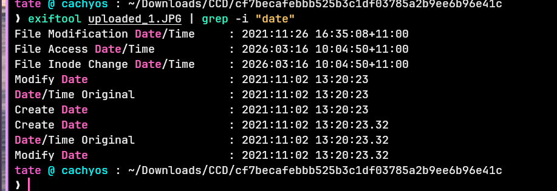
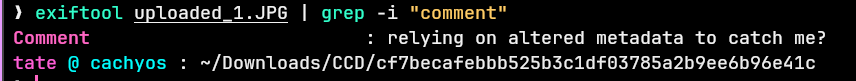
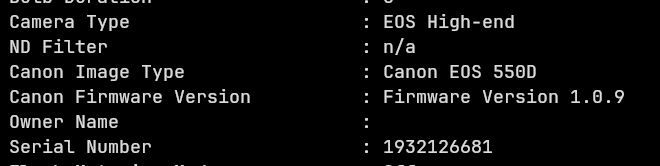
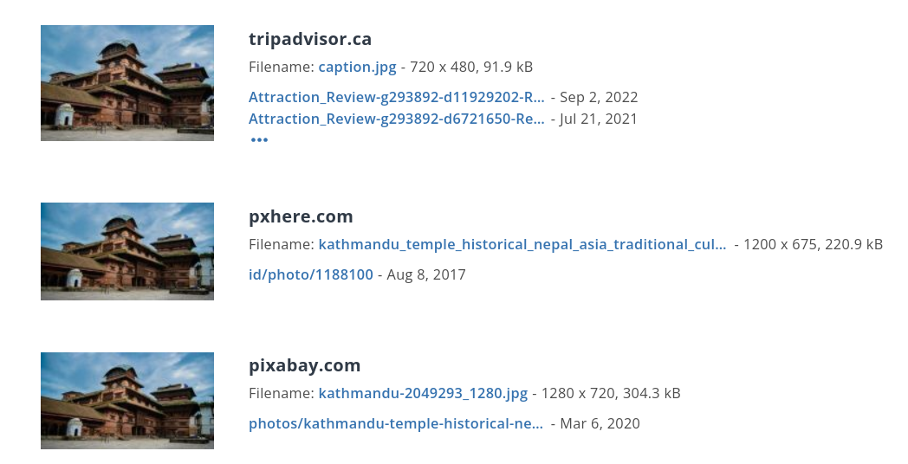

## Overview

A fugitive posts images online taunting investigators. Using metadata forensics and reverse image search, we prove him wrong. The investigation chain is straightforward: extract EXIF metadata → identify the camera → pull the timestamp → read the embedded comment → geolocate via reverse image search.

---

## Metadata Extraction — Exiftool

The attached images were posted publicly by the suspect. Running Exiftool against the first image pulls all embedded EXIF data:

```zsh
exiftool uploaded_1.JPG
```

Filtering for date and comment fields specifically:

```bash
exiftool uploaded_1.JPG | grep -i "date"
exiftool uploaded_1.JPG | grep -i "comment"
```

This reveals:

- **Camera Model:** Canon EOS 550D
- **Date Taken:** 2021:11:02 13:20:23
- **Comment:** `relying on altered metadata to catch me?`

The comment is a taunt — the suspect attempted to alter metadata to mislead investigators but missed fields. The camera model and timestamp remain intact.


---
## Geolocation — Reverse Image Search

Running the image through a reverse image search identifies the location as a historical temple in **Kathmandu, Nepal** — placing the suspect's location despite their attempts at evasion.



<div class="qa-item"> <div class="qa-question-text">What is the camera model?</div> <div class="flag-reveal"> <input type="checkbox"> <span class="r-placeholder">Click flag to reveal</span> <span class="r-answer">Canon EOS 550D</span> <button class="copy-btn" onclick="event.stopPropagation();navigator.clipboard.writeText(this.previousElementSibling.textContent);this.textContent='copied';setTimeout(()=>this.textContent='copy',1500)">copy</button> </div> </div>

<div class="qa-item"> <div class="qa-question-text">When was the picture taken?</div> <div class="answer-reveal"> <input type="checkbox"> <span class="r-placeholder">Click to reveal answer</span> <span class="r-answer">2021:11:02 13:20:23</span> <button class="copy-btn" onclick="event.stopPropagation();navigator.clipboard.writeText(this.previousElementSibling.textContent);this.textContent='copied';setTimeout(()=>this.textContent='copy',1500)">copy</button> </div> </div>

<div class="qa-item"> <div class="qa-question-text">What does the comment on the first image says?</div> <div class="flag-reveal"> <input type="checkbox"> <span class="r-placeholder">Click flag to reveal</span> <span class="r-answer">relying on altered metadata to catch me?</span> <button class="copy-btn" onclick="event.stopPropagation();navigator.clipboard.writeText(this.previousElementSibling.textContent);this.textContent='copied';setTimeout(()=>this.textContent='copy',1500)">copy</button> </div> </div>

<div class="qa-item"> <div class="qa-question-text">Where could the criminal be?</div> <div class="answer-reveal"> <input type="checkbox"> <span class="r-placeholder">Click to reveal answer</span> <span class="r-answer">Kathmandu</span> <button class="copy-btn" onclick="event.stopPropagation();navigator.clipboard.writeText(this.previousElementSibling.textContent);this.textContent='copied';setTimeout(()=>this.textContent='copy',1500)">copy</button> </div> </div>
