## Scenario

A Windows endpoint has been compromised by a wiper malware campaign. A KAPE triage image has been collected from the affected system. The objective is to reconstruct the full attack chain — from initial GPO-based execution through to bootloader destruction and filesystem wiping — using Registry Explorer, Event Log Explorer, and NTFS Log Tracker.

---

## Methodology

### Initial Triage — KAPE Collection Structure

The KAPE image provides the standard artifact set: Sysmon operational logs, registry hives, and NTFS journal data. The primary investigation tools are Registry Explorer for hive analysis and Event Log Explorer for Sysmon Event ID 1 (Process Create) correlation.

### Execution Origin — Group Policy Startup Script

Loading the SOFTWARE hive from `C:\Windows\System32\config\` in Registry Explorer — the hive was dirty, so it was exported to a clean copy first before loading. Navigating to:

```
Microsoft\Windows\CurrentVersion\Group Policy\Scripts\Startup\0
```

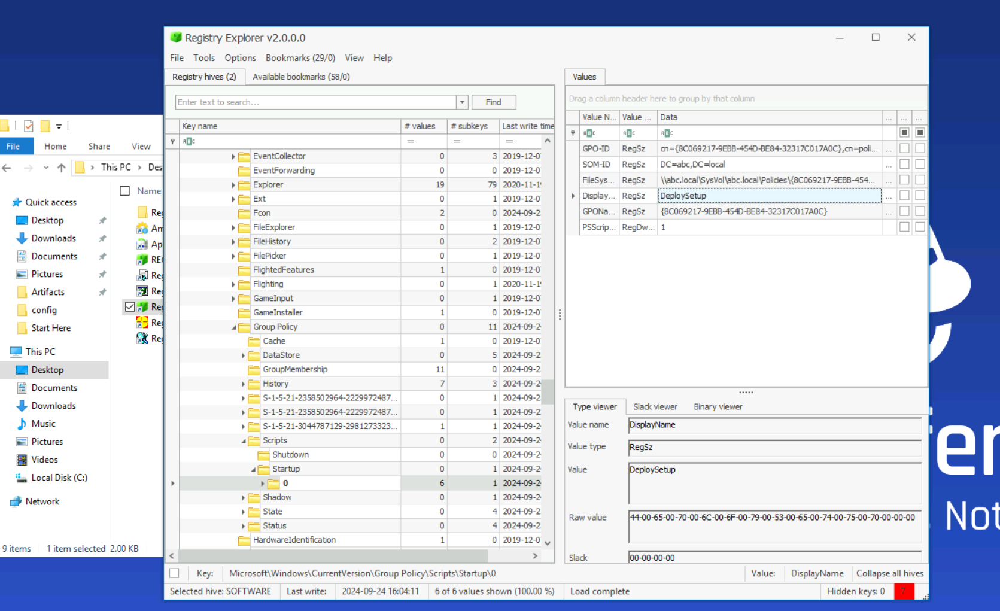

The GPO named **DeploySetup** is configured as a startup script, executing `setup.bat` from a network share:

```
C:\Windows\system32\cmd.exe /c ""\\WIN-499DAFSKAR7\Data\scripts\setup.bat"
```

This confirms the initial delivery vector — the attacker used a malicious GPO to push execution at system startup across the domain.

### Staging — Cabinet File Extraction

Filtering Sysmon Event ID 1 for `.bat` leads to the setup script activity. From there, a subsequent process creation event reveals the staging mechanism — the built-in `expand.exe` utility extracting a cabinet archive:

```
CommandLine: expand "C:\ProgramData\Microsoft\env\env.cab" /F:* "C:\ProgramData\Microsoft\env"
```

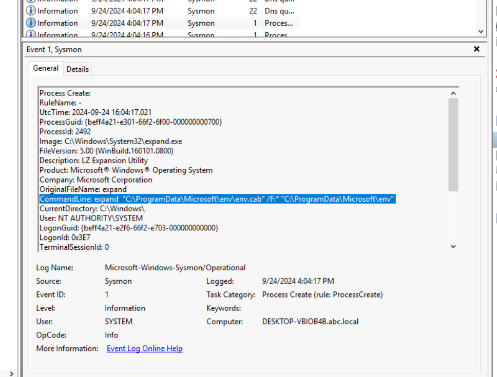

Using a signed Windows binary (`expand.exe`) to stage malware is a living-off-the-land technique that avoids dropping unapproved executables directly. The `.cab` file contains all subsequent payloads.

### Payload Extraction — Password-Protected RAR

After the cabinet is expanded, the attacker extracts a password-protected RAR archive:

```
CommandLine: "Rar.exe" x "C:\ProgramData\Microsoft\env\bcd.rar" -phackemall
```

The `-p` flag specifies the extraction password. `hackemall` is the credential protecting the malicious payload archive.

### Defence Evasion — Windows Defender Exclusions

Searching Sysmon Event ID 1 for `-ExclusionPath` reveals three Defender exclusion commands executed in sequence:

```powershell
powershell -Command "Add-MpPreference -Force -ExclusionPath 'C:\ProgramData\Microsoft\env\env.exe'"
powershell -Command "Add-MpPreference -Force -ExclusionPath 'C:\ProgramData\Microsoft\env\bcd.bat'"
powershell -Command "Add-MpPreference -Force -ExclusionPath 'C:\ProgramData\Microsoft\env\update.bat'"
```

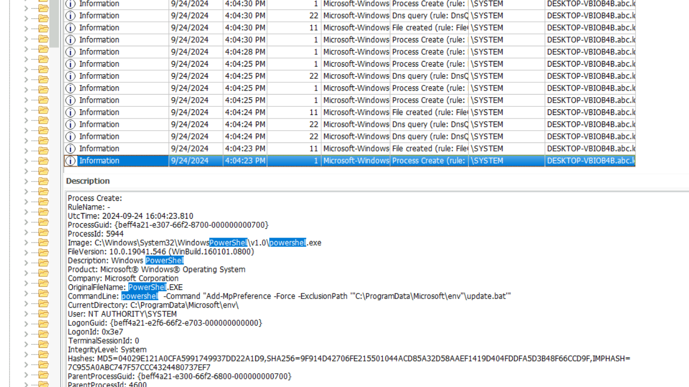

`update.bat` carries the earliest timestamp at 4:04:23 PM — making it the first file added to the exclusion list. Whitelisting malware paths in Defender before execution is standard pre-detonation hygiene for wiper campaigns.

### Persistence — Scheduled Task with Delay

Searching Sysmon for `schtasks` surfaces the persistence mechanism:

```
CommandLine: C:\Windows\System32\cmd.exe /c schtasks /CREATE /SC ONSTART /TN "Aa153!EGzN" /RL HIGHEST /RU SYSTEM /TR "\"C:\ProgramData\Microsoft\env\env.exe\" \"C:\temp\msconf.conf\"" /F
```

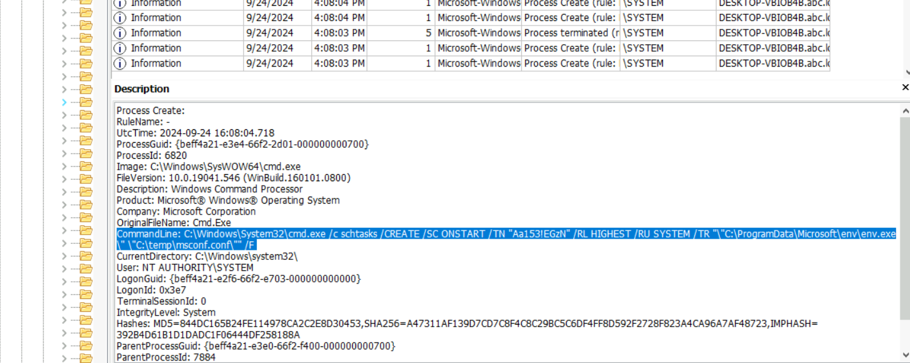

The task **Aa153!EGzN** runs `env.exe` at system start with SYSTEM privileges — ensuring the wiper survives a reboot. The attacker also calculated a specific execution delay using:

```
powershell -command "(Get-Date).AddMinutes(3.5).ToString('HH:mm:ss')"
```

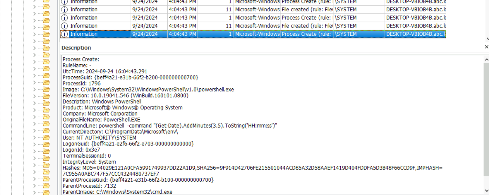

3.5 minutes = **210 seconds** — the delay between task creation and initial detonation, likely to allow the system to reach a stable state before the wiper fires.

### Domain Unjoin — WMIC

The attacker used WMIC to remove the machine from the domain, severing centralised management and hindering incident response:

```
CommandLine: C:\Windows\System32\cmd.exe /c wmic computersystem where name="%%computername%%" call unjoindomainorworkgroup  (PID 7200)
CommandLine: wmic computersystem where name="DESKTOP-VBIOB4B" call unjoindomainorworkgroup  (PID 7492)
```

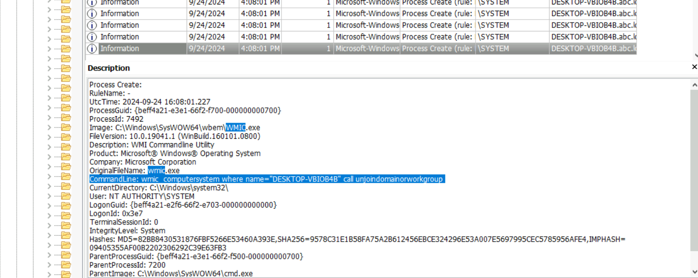

PID **7492** is the process that actually executed the unjoin against the resolved hostname — PID 7200 is the parent `cmd.exe` wrapper.

### Bootloader Destruction — bcdedit

Searching Sysmon for `delete` exposes the wiper's most destructive action — deletion of the Windows Boot Configuration Data:

```
CommandLine: C:\Windows\Sysnative\bcdedit.exe /delete {b2721d73-1db4-4c62-bf78-c548a880142d} /f
CommandLine: C:\Windows\Sysnative\bcdedit.exe /delete {9dea862c-5cdd-4e70-acc1-f32b344d4795} /f
```

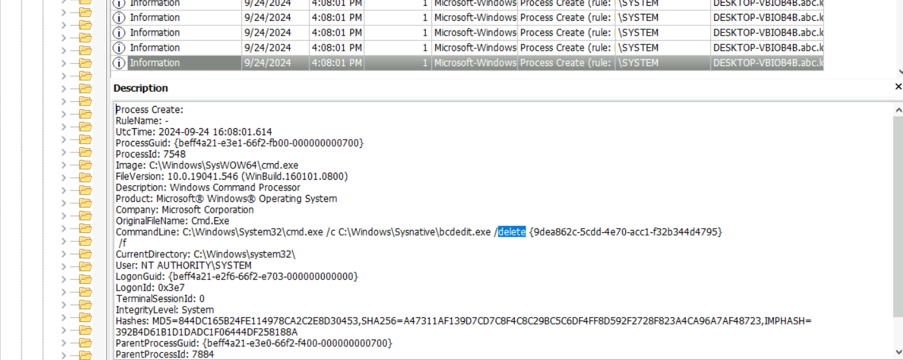

`{9dea862c-5cdd-4e70-acc1-f32b344d4795}` is the universal Windows Boot Manager GUID — static across all Windows installations. Deleting this entry renders the system unbootable without recovery media. The other GUID (`{b2721d73...}`) is the machine-specific OS loader entry.

### Screen Locker — BreakWin

Searching Sysmon for `lock` surfaces the final user-facing payload:

```
CommandLine: "C:\temp\mssetup.exe" /LOCK
```
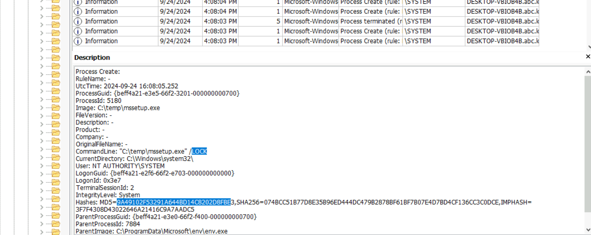

The hash `9A49102F53291A644BD14C8202D8FBE` submitted to VirusTotal returns the malware family label **BreakWin** — a screen locker deployed post-destruction to prevent any recovery attempts from the console.
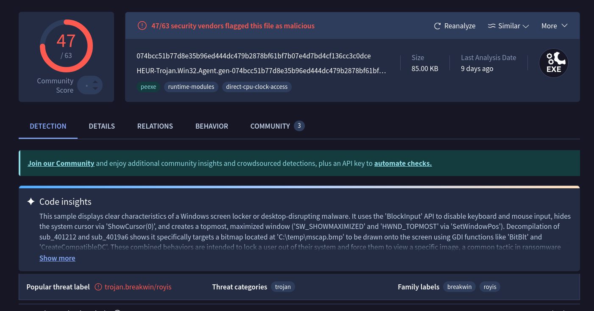

### Filesystem Wiping — USN Journal Analysis

The wiper overwrites files with zero-bytes before deleting them — a pattern designed to defeat file carving during recovery. Standard filesystem browsing won't surface deleted files, so the `$UsnJrnl` ($J stream) is parsed with **NTFS Log Tracker**.

Exporting the parsed journal and searching for `msuser.reg`:

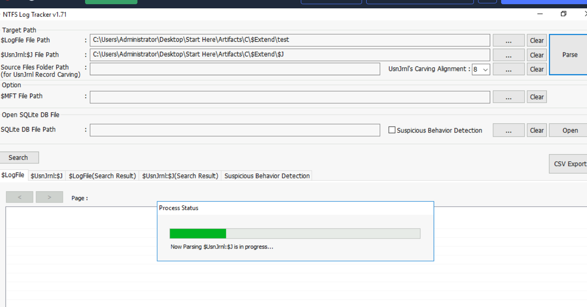
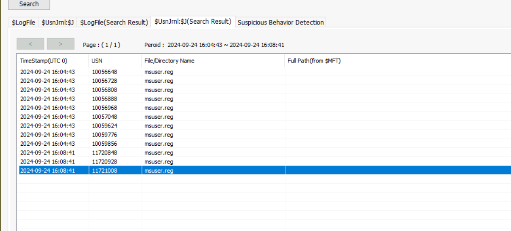
The deletion entry for `msuser.reg` carries USN **11721008**.

---

## Attack Summary

|Phase|Action|
|---|---|
|Initial Access|GPO `DeploySetup` executes `setup.bat` from network share at startup|
|Staging|`expand.exe` extracts `env.cab` to `C:\ProgramData\Microsoft\env`|
|Payload Delivery|`Rar.exe` extracts `bcd.rar` with password `hackemall`|
|Defence Evasion|Three Defender exclusions added for `env.exe`, `bcd.bat`, `update.bat`|
|Persistence|Scheduled task `Aa153!EGzN` created, runs `env.exe` at SYSTEM on startup|
|Discovery|Domain unjoin via WMIC (PID 7492), severing centralised management|
|Impact — Boot|`bcdedit /delete` destroys Windows Boot Manager and OS loader entries|
|Impact — Lock|`mssetup.exe /LOCK` deploys BreakWin screen locker|
|Impact — Wipe|Zero-byte overwrite and deletion of files; `msuser.reg` USN 11721008|

---

## IOCs

|Type|Value|
|---|---|
|Network Share|\\WIN-499DAFSKAR7\Data\scripts\setup.bat|
|File|C:\ProgramData\Microsoft\env\env.cab|
|File|C:\ProgramData\Microsoft\env\env.exe|
|File|C:\ProgramData\Microsoft\env\bcd.rar|
|File|C:\ProgramData\Microsoft\env\bcd.bat|
|File|C:\ProgramData\Microsoft\env\update.bat|
|File|C:\temp\mssetup.exe|
|File|C:\temp\msconf.conf|
|Archive Password|hackemall|
|Scheduled Task|Aa153!EGzN|
|GPO Name|DeploySetup|
|BCD GUID (Boot Manager)|{9dea862c-5cdd-4e70-acc1-f32b344d4795}|
|BCD GUID (OS Loader)|{b2721d73-1db4-4c62-bf78-c548a880142d}|
|Hash (mssetup.exe)|MD5: 9A49102F53291A644BD14C8202D8FBE|
|Malware Family|BreakWin|

---

## MITRE ATT&CK

|Technique|ID|Description|
|---|---|---|
|Windows Command Shell|T1059.003|setup.bat and bcd.bat executed via cmd.exe|
|Scheduled Task|T1053.005|Aa153!EGzN created for SYSTEM-level persistence on startup|
|Disable or Modify Tools|T1562.001|Windows Defender exclusions added for all malicious files|
|File Deletion|T1070.004|msuser.reg and other artifacts zero-wiped and deleted|
|Inhibit System Recovery|T1490|bcdedit /delete destroys boot manager and OS loader entries|
|Group Policy Modification|T1484.001|DeploySetup GPO used to push malicious startup script|
|Masquerading|T1036.005|Payloads staged under C:\ProgramData\Microsoft\ to blend in|

---

## Defender Takeaways

**GPO integrity monitoring** — The initial foothold was a malicious startup script deployed via Group Policy. Monitoring for new or modified GPO objects — particularly those adding startup or logon scripts — via Group Policy change auditing (Event ID 5136) would have flagged DeploySetup before it executed across the domain.

**Defender exclusion alerting** — `Add-MpPreference -ExclusionPath` is a high-fidelity detection signal. Legitimate software installers rarely need to whitelist specific executables in non-standard paths like `C:\ProgramData\Microsoft\env`. Alerting on any Defender exclusion targeting paths outside `Program Files` or vendor directories should be a baseline SOC rule.

**BCD change auditing** — `bcdedit /delete` against the Windows Boot Manager is unambiguous destructive intent. Process creation monitoring for `bcdedit.exe` with `/delete` arguments, particularly targeting well-known GUIDs like `{9dea862c...}`, is a trivially cheap detection with near-zero false positives.

**USN journal preservation** — The wiper relied on zero-byte overwrite before deletion to defeat file carving. The `$UsnJrnl` survived and allowed recovery of the deletion timeline. Ensuring NTFS journal collection is part of every KAPE triage target (`$J` and `$LogFile`) preserves this evidence before it rotates out.

**Domain isolation monitoring** — The attacker pre-empted incident response by unjoining the machine from the domain via WMIC. Monitoring for `Win32_ComputerSystem.UnjoinDomainOrWorkgroup` WMI method calls, or enforcing domain membership through conditional access policies, would surface or block this action before the wiper fully detonated.

**Sysmon as a force multiplier** — Almost every question in this lab was answered exclusively through Sysmon Event ID 1 (Process Create). The GPO script, cabinet extraction, RAR password, Defender exclusions, scheduled task, domain unjoin, bcdedit destruction, and screen locker execution were all visible in a single event log with zero additional tooling. That's the value proposition of a well-deployed Sysmon configuration — a comprehensive process creation audit trail that collapses what would otherwise require correlating prefetch, MFT, shellbags, and registry artifacts into a single queryable source. If an organisation has nothing else, Sysmon with a solid config like SwiftOnSecurity's baseline gets you most of the way there.


---

<div class="qa-item"> <div class="qa-question-text">The attack began with using a Group Policy Object (GPO) to execute a malicious batch file. What is the name of the malicious GPO responsible for initiating the attack by running a script?</div> <div class="flag-reveal"> <input type="checkbox"> <span class="r-placeholder">Click flag to reveal</span> <span class="r-answer">DeploySetup</span> <button class="copy-btn" onclick="event.stopPropagation();navigator.clipboard.writeText(this.previousElementSibling.textContent);this.textContent='copied';setTimeout(()=>this.textContent='copy',1500)">copy</button> </div> </div>

<div class="qa-item"> <div class="qa-question-text">During the investigation, a specific file containing critical components necessary for the later stages of the attack was found on the system. This file, expanded using a built-in tool, played a crucial role in staging the malware. What is the name of the file, and where was it located on the system? Please provide the full file path.</div> <div class="answer-reveal"> <input type="checkbox"> <span class="r-placeholder">Click to reveal answer</span> <span class="r-answer">C:\ProgramData\Microsoft\env\env.cab</span> <button class="copy-btn" onclick="event.stopPropagation();navigator.clipboard.writeText(this.previousElementSibling.textContent);this.textContent='copied';setTimeout(()=>this.textContent='copy',1500)">copy</button> </div> </div>

<div class="qa-item"> <div class="qa-question-text">The attacker employed password-protected archives to conceal malicious files, making it important to uncover the password used for extraction. Identifying this password is key to accessing the contents and analyzing the attack further. What is the password used to extract the malicious files?</div> <div class="flag-reveal"> <input type="checkbox"> <span class="r-placeholder">Click flag to reveal</span> <span class="r-answer">hackemall</span> <button class="copy-btn" onclick="event.stopPropagation();navigator.clipboard.writeText(this.previousElementSibling.textContent);this.textContent='copied';setTimeout(()=>this.textContent='copy',1500)">copy</button> </div> </div>

<div class="qa-item"> <div class="qa-question-text">Several commands were executed to add exclusions to Windows Defender, preventing it from scanning specific files. This behavior is commonly used by attackers to ensure that malicious files are not detected by the system's built-in antivirus. Tracking these exclusion commands is crucial for identifying which files have been protected from antivirus scans. What is the name of the first file added to the Windows Defender exclusion list?</div> <div class="answer-reveal"> <input type="checkbox"> <span class="r-placeholder">Click to reveal answer</span> <span class="r-answer">update.bat</span> <button class="copy-btn" onclick="event.stopPropagation();navigator.clipboard.writeText(this.previousElementSibling.textContent);this.textContent='copied';setTimeout(()=>this.textContent='copy',1500)">copy</button> </div> </div>

<div class="qa-item"> <div class="qa-question-text">A scheduled task has been configured to execute a file after a set delay. Understanding this delay is important for investigating the timing of potential malicious activity. How many seconds after the task creation time is it scheduled to run?</div> <div class="flag-reveal"> <input type="checkbox"> <span class="r-placeholder">Click flag to reveal</span> <span class="r-answer">210</span> <button class="copy-btn" onclick="event.stopPropagation();navigator.clipboard.writeText(this.previousElementSibling.textContent);this.textContent='copied';setTimeout(()=>this.textContent='copy',1500)">copy</button> </div> </div>

<div class="qa-item"> <div class="qa-question-text">After the malware execution, the wmic utility was used to unjoin the computer system from a domain or workgroup. Tracking this operation is essential for identifying system reconfigurations or unauthorized changes. What is the Process ID (PID) of the utility responsible for performing this action?</div> <div class="answer-reveal"> <input type="checkbox"> <span class="r-placeholder">Click to reveal answer</span> <span class="r-answer">7492</span> <button class="copy-btn" onclick="event.stopPropagation();navigator.clipboard.writeText(this.previousElementSibling.textContent);this.textContent='copied';setTimeout(()=>this.textContent='copy',1500)">copy</button> </div> </div>

<div class="qa-item"> <div class="qa-question-text">The malware executed a command to delete the Windows Boot Manager, a critical component responsible for loading the operating system during startup. This action can render the system unbootable, leading to serious operational disruptions and making recovery more difficult. What command did the malware use to delete the Windows Boot Manager?</div> <div class="flag-reveal"> <input type="checkbox"> <span class="r-placeholder">Click flag to reveal</span> <span class="r-answer">C:\Windows\Sysnative\bcdedit.exe /delete {9dea862c-5cdd-4e70-acc1-f32b344d4795} /f</span> <button class="copy-btn" onclick="event.stopPropagation();navigator.clipboard.writeText(this.previousElementSibling.textContent);this.textContent='copied';setTimeout(()=>this.textContent='copy',1500)">copy</button> </div> </div>

<div class="qa-item"> <div class="qa-question-text">The malware created a scheduled task to ensure persistence and maintain control over the compromised system. This task is configured to run with elevated privileges every time the system starts, ensuring the malware continues to execute. What is the name of the scheduled task created by the malware to maintain persistence?</div> <div class="answer-reveal"> <input type="checkbox"> <span class="r-placeholder">Click to reveal answer</span> <span class="r-answer">Aa153!EGzN</span> <button class="copy-btn" onclick="event.stopPropagation();navigator.clipboard.writeText(this.previousElementSibling.textContent);this.textContent='copied';setTimeout(()=>this.textContent='copy',1500)">copy</button> </div> </div>

<div class="qa-item"> <div class="qa-question-text">A malicious program was used to lock the screen, preventing users from accessing the system. Investigating this malware is important to identify its behavior and mitigate its impact. What is the name of this malware? (not the filename)</div> <div class="flag-reveal"> <input type="checkbox"> <span class="r-placeholder">Click flag to reveal</span> <span class="r-answer">BreakWin</span> <button class="copy-btn" onclick="event.stopPropagation();navigator.clipboard.writeText(this.previousElementSibling.textContent);this.textContent='copied';setTimeout(()=>this.textContent='copy',1500)">copy</button> </div> </div>

<div class="qa-item"> <div class="qa-question-text">The disk shows a pattern where malware overwrites data (potentially with zero-bytes) and then deletes it, a behavior commonly linked to Wiper malware activity. The USN (Update Sequence Number) is vital for tracking filesystem changes on an NTFS volume, enabling investigators to trace when files are created, modified, or deleted, even if they are no longer present. This is critical for building a timeline of file activity and detecting potential tampering. What is the USN associated with the deletion of the file msuser.reg?</div> <div class="answer-reveal"> <input type="checkbox"> <span class="r-placeholder">Click to reveal answer</span> <span class="r-answer">11721008</span> <button class="copy-btn" onclick="event.stopPropagation();navigator.clipboard.writeText(this.previousElementSibling.textContent);this.textContent='copied';setTimeout(()=>this.textContent='copy',1500)">copy</button> </div> </div>

