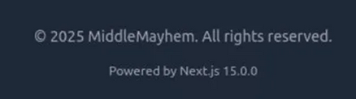
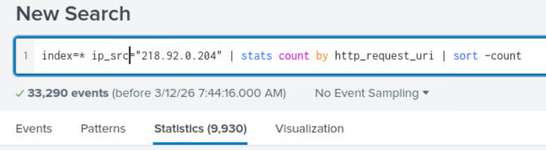
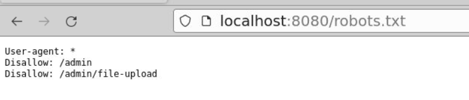
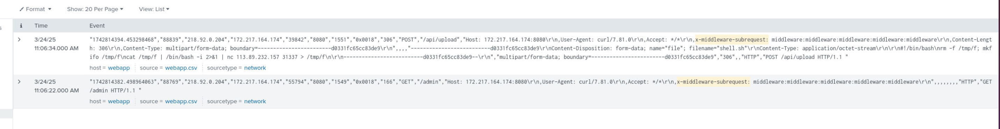
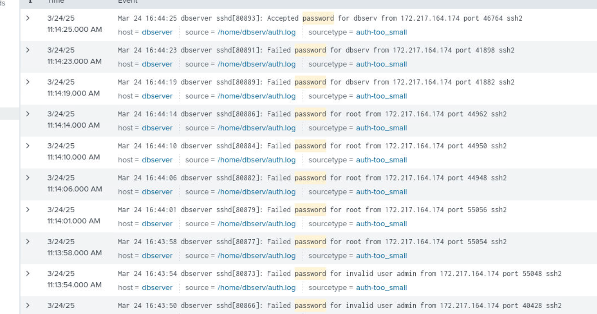

## Overview

MiddleMayhem Inc. detected unusual traffic targeting their admin portal. The web application runs on Next.js 15.0.0 — a version vulnerable to CVE-2025-29927, a critical middleware authorization bypass. This challenge covers attacker reconnaissance, CVE exploitation, reverse shell upload, and SSH brute-force lateral movement through the network.

---

## Reconnaissance

### Identifying the Framework

Accessing the site in the browser and checking the bookmark / response headers confirms the application is running **Next.js 15.0.0**.

### Finding the Attacker IP

Querying all events in Splunk immediately surfaces one external IP generating the overwhelming majority of traffic:

```
index=* ip_src="218.92.0.204"
```

Attacker IP: `218[.]92[.]0[.]204`

### Enumerating Unique URIs

To understand the scope of the attacker's scanning activity, we count unique URIs accessed:

```bash
index=* src_ip="218.92.0.204" | stats count by http_request_uri | sort -count
```

The attacker accessed **9930** unique URIs — a clear automated scan.

### Robots.txt Disclosure

Browsing to `/robots.txt` on the target site reveals two sensitive paths that shouldn't be public-facing:

- `/admin`
- `/admin/file-upload`

These become the attacker's primary targets once authentication is bypassed.


---

## Exploitation — CVE-2025-29927

### Vulnerability Background

**CVE-2025-29927** is a critical authorization bypass in Next.js affecting versions 11.1.4 through 15.2.2. The vulnerability stems from misuse of the internal `x-middleware-subrequest` header, which Next.js uses to prevent infinite middleware loops. By sending a crafted value in this header, an attacker can trick the application into skipping middleware execution entirely — bypassing any authentication or authorization checks implemented there.

Affected versions:

- 12.x < 12.3.5
- 13.x < 13.5.9
- 14.x < 14.2.25
- 15.x < 15.2.3 ✓ _(this target runs 15.0.0)_

### Detecting Exploitation in Splunk

To identify abuse of this CVE in the SIEM logs, search for requests containing the malicious header:

```
index=* "x-middleware-subrequest:"
```

The logs confirm the attacker sent requests with the bypass header — gaining access to the protected `/admin` route without valid credentials.

### Post-Exploitation URI

After bypassing the middleware, the attacker accessed the file upload endpoint:

**`/api/upload`**

---

## Reverse Shell Upload

With access to `/api/upload`, the attacker uploaded a reverse shell payload configured to connect back to their infrastructure:

- **C2 IP:** `113[.]89[.]232[.]157`
- **Port:** `31337`

Once the WebApp server executed the payload, the attacker had a remote shell on the compromised host.

---

## Lateral Movement — SSH Brute-Force

### Detection

Post-compromise, reviewing Splunk logs from the WebApp server shows it generating a high volume of connection attempts to an internal host on port 22:

```bash
index=* src_ip="<webserver_ip>" dest_port=22
| stats count by dest_ip
| sort -count
```

The logs confirm an **SSH brute-force** attack originating from the compromised web server toward internal infrastructure.

### Successful Compromise

The brute-force succeeded under the account: **`dbserv`**

Lateral movement technique: **SSH brute-force** (MITRE ATT&CK: T1110.001)

---

## IOCs

|Type|Value|
|---|---|
|Attacker IP|`218[.]92[.]0[.]204`|
|C2 IP|`113[.]89[.]232[.]157`|
|C2 Port|`31337`|
|CVE|CVE-2025-29927|
|Malicious Header|`x-middleware-subrequest`|
|Compromised Account|`dbserv`|

---

## Questions & Answers



 

 

 

 

 

 

 

 


