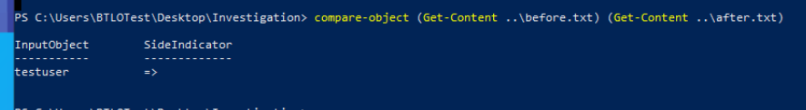
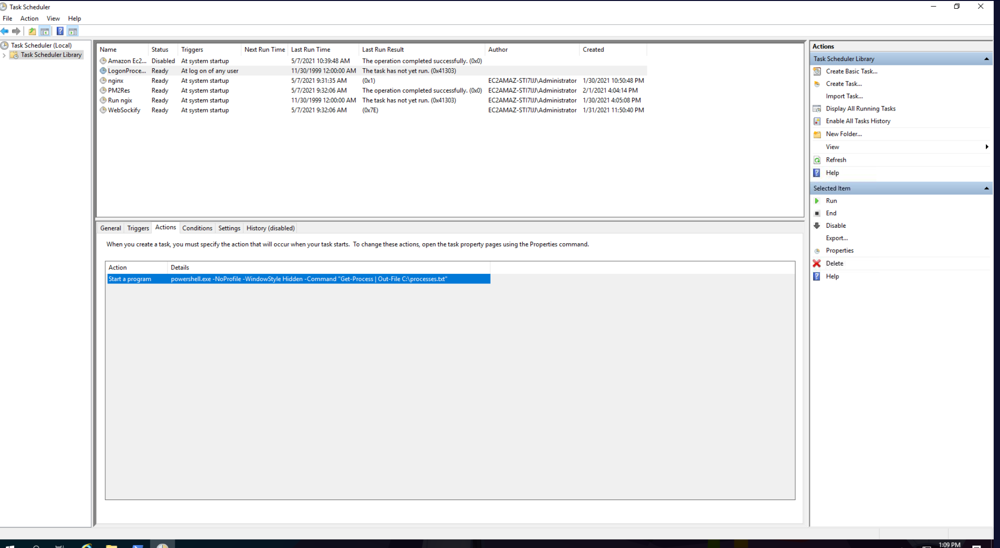
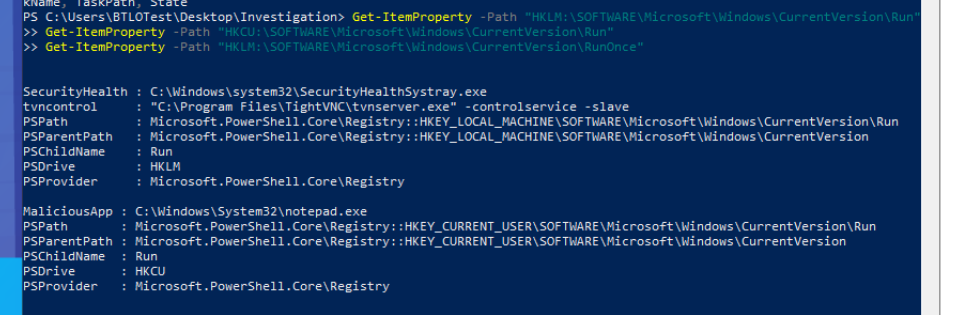

## Scenario

Suspicious activity has been reported on a Windows endpoint. Due to an unfortunate constraint (honey-related), the investigation must be conducted entirely through PowerShell — no GUI tools. The goal is to identify malicious programs, verify file authenticity, and uncover any persistence mechanisms installed by the attacker.

---

## Methodology

### File Triage — Hashing and VirusTotal Lookup

The first suspicious file on disk is `omgsoft.exe`. With no AV or sandbox GUI available, the fastest triage path is computing the hash and querying VirusTotal:


```
Get-FileHash omgsoft.exe
```

This returns a SHA256 of `E60D911F2EF120ED782449F1136C23DDF0C1C81F7479C5CE31ED6DCEA6F6ADF9`. Submitting to VirusTotal confirms the file as **LummaStealer** — an infostealer targeting browser credentials, crypto wallets, and session cookies. The binary is masquerading under a benign-looking name, a common delivery technique for commodity malware.

### Certificate Verification — neuro.msi

The second suspicious file is `neuro.msi`. Legitimate software distributed via MSI is typically signed by the vendor. PowerShell's `Get-AuthenticodeSignature` surfaces this immediately:

```powershell
Get-AuthenticodeSignature -FilePath "neuro.msi" | Select-Object Status
```

```
Status
------
NotSigned
```

An unsigned MSI from an unknown source is a strong indicator of a malicious or tampered installer. No further execution is warranted.

### Differential Analysis — Win_Update.exe

`Win_Update.exe` presents as a Windows update binary. Rather than running it blindly, a before/after differential captures system state changes caused by its execution. Local user accounts are snapshotted before and after:

```powershell
Get-LocalUser | Select-Object Name | Out-File C:\before.txt
# [run Win_Update.exe as administrator]
Get-LocalUser | Select-Object Name | Out-File C:\after.txt
Compare-Object (Get-Content ..\before.txt) (Get-Content ..\after.txt)
```



The diff reveals a new account — `testuser` — created by the binary. Checking group membership confirms it was silently added to the local **Administrators** group:


```powershell
Get-LocalGroupMember -Group "Administrators"
```

This is a classic privilege escalation and persistence play: create a backdoor admin account that survives reboots and allows re-entry even if the primary C2 channel is disrupted.

### Scheduled Task — logonprocessdump

Reviewing the Task Scheduler via PowerShell surfaces a suspicious entry. The name `logonprocessdump` sounds process-adjacent, but the trigger and command raise immediate flags:


The task fires at user logon and runs a hidden PowerShell command:

```powershell
powershell.exe -NoProfile -WindowsStyle Hidden -Command "Get-Process | Out-File c:\processes.txt"
```

On the surface this just dumps running processes to a file — but the `-WindowStyle Hidden` flag and the `logonprocessdump` name are designed to blend in. A task writing a process list on every logon provides the attacker with periodic reconnaissance data, or could serve as a stager placeholder that gets swapped out for a more aggressive payload once persistence is established.

### Registry Persistence — Startup Abuse

Checking the registry run keys surfaces a final persistence artefact:


`notepad.exe` has been added as a startup item at `HKCU\Software\Microsoft\Windows\CurrentVersion\Run` (or equivalent). A legitimate application — `C:\Windows\System32\notepad.exe` — being registered as a startup entry is suspicious regardless of the binary itself. This is either an abuse of a LOLBin for DLL sideloading, or a placeholder confirming the attacker has write access to persistence locations and is testing registry modification capability.

---

## Attack Summary

|Phase|Action|
|---|---|
|Discovery|omgsoft.exe (LummaStealer) present on disk, masquerading as benign software|
|Execution|neuro.msi present unsigned — likely malicious installer|
|Persistence|Win_Update.exe creates backdoor admin account `testuser`|
|Persistence|Scheduled task `logonprocessdump` fires hidden PowerShell at logon|
|Persistence|notepad.exe registered as startup item via registry run key|

---

## IOCs

|Type|Value|
|---|---|
|File|omgsoft.exe|
|Hash (SHA256)|E60D911F2EF120ED782449F1136C23DDF0C1C81F7479C5CE31ED6DCEA6F6ADF9|
|Malware Family|LummaStealer|
|File|neuro.msi|
|File|Win_Update.exe|
|Account|testuser (local Administrators)|
|Scheduled Task|logonprocessdump|
|Registry Startup|C:\Windows\System32\notepad.exe|

---

## MITRE ATT&CK

|Technique|ID|Description|
|---|---|---|
|Software Discovery: Security Software Discovery|T1518.001|Implicit — presence of AV/EDR bypassed by constraining tools|
|Create Account: Local Account|T1136.001|Win_Update.exe silently creates `testuser` in Administrators group|
|Scheduled Task/Job: Scheduled Task|T1053.005|`logonprocessdump` task runs hidden PowerShell at logon|
|Boot or Logon Autostart: Registry Run Keys|T1547.001|notepad.exe registered as startup item via registry run key|
|Command and Scripting Interpreter: PowerShell|T1059.001|Scheduled task payload executes via powershell.exe -WindowsStyle Hidden|
|Modify Registry|T1112|Registry run key modified to add startup persistence|

---

## Defender Takeaways

**Hash-based triage is the fastest first step.** When GUI tools are unavailable, `Get-FileHash` + VirusTotal provides immediate verdict on known malware. Integrating hash lookups into endpoint tooling or SOAR playbooks means this check happens automatically rather than requiring analyst intervention.

**Unsigned installers are a hard stop.** `Get-AuthenticodeSignature` returning `NotSigned` on an MSI that arrived through an uncontrolled channel should trigger immediate quarantine. Application control policies (AppLocker, WDAC) can enforce signature requirements at execution time, before a human has to make the call.

**Differential analysis reveals hidden installer behaviour.** Snapshotting system state before and after running a suspicious binary — accounts, scheduled tasks, services, registry — surfaces persistence mechanisms that would otherwise require hunting across every persistence location manually. This technique is equally valid in a sandbox or on a live host.

**Logon-triggered scheduled tasks warrant immediate scrutiny.** Any task with a logon trigger running PowerShell with `-WindowStyle Hidden` or `-NonInteractive` flags is a high-confidence detection signal. A SIEM rule alerting on `schtasks.exe` creating logon-triggered tasks with hidden PowerShell commands would catch this pattern at creation time.

**LOLBin startup registrations are a detection opportunity.** A legitimate binary like `notepad.exe` appearing in `HKCU\...\Run` has no valid use case. Monitoring for run key modifications where the target binary is a known Windows system tool (rather than an application installer) provides low-noise, high-fidelity alerting on registry-based persistence abuse.


---

<div class="qa-item"> <div class="qa-question-text">For the “omgsoft.exe” malware, what is its hash value? (Format: SHA256)</div> <div class="flag-reveal"> <input type="checkbox"> <span class="r-placeholder">Click flag to reveal</span> <span class="r-answer">E60D911F2EF120ED782449F1136C23DDF0C1C81F7479C5CE31ED6DCEA6F6ADF9</span> <button class="copy-btn" onclick="event.stopPropagation();navigator.clipboard.writeText(this.previousElementSibling.textContent);this.textContent='copied';setTimeout(()=>this.textContent='copy',1500)">copy</button> </div> </div>

<div class="qa-item"> <div class="qa-question-text">For the “omgsoft.exe” malware, what is its true infection name? (Format: Malware Name)</div> <div class="answer-reveal"> <input type="checkbox"> <span class="r-placeholder">Click to reveal answer</span> <span class="r-answer">lummastealer</span> <button class="copy-btn" onclick="event.stopPropagation();navigator.clipboard.writeText(this.previousElementSibling.textContent);this.textContent='copied';setTimeout(()=>this.textContent='copy',1500)">copy</button> </div> </div>

<div class="qa-item"> <div class="qa-question-text">Let’s verify the “neuro.msi” file. What is its certificate status according to PowerShell? (Format: Status)</div> <div class="flag-reveal"> <input type="checkbox"> <span class="r-placeholder">Click flag to reveal</span> <span class="r-answer">NotSigned</span> <button class="copy-btn" onclick="event.stopPropagation();navigator.clipboard.writeText(this.previousElementSibling.textContent);this.textContent='copied';setTimeout(()=>this.textContent='copy',1500)">copy</button> </div> </div>

<div class="qa-item"> <div class="qa-question-text">Perform differential analysis on the “Win_Update.exe” file. What is the name of the new user added after running the supposed update? What group does this user belong to? Note: run this program as administrator (Format: User, Group)</div> <div class="answer-reveal"> <input type="checkbox"> <span class="r-placeholder">Click to reveal answer</span> <span class="r-answer">testuser, Administrators</span> <button class="copy-btn" onclick="event.stopPropagation();navigator.clipboard.writeText(this.previousElementSibling.textContent);this.textContent='copied';setTimeout(()=>this.textContent='copy',1500)">copy</button> </div> </div>

<div class="qa-item"> <div class="qa-question-text">What is the name of the newly added Task Name? (Format: Task Name)</div> <div class="flag-reveal"> <input type="checkbox"> <span class="r-placeholder">Click flag to reveal</span> <span class="r-answer">logonprocessdump</span> <button class="copy-btn" onclick="event.stopPropagation();navigator.clipboard.writeText(this.previousElementSibling.textContent);this.textContent='copied';setTimeout(()=>this.textContent='copy',1500)">copy</button> </div> </div>

<div class="qa-item"> <div class="qa-question-text">Also, what is the full PowerShell command it runs at user logon? This seems to be a strange update (Format: Full Command)</div> <div class="answer-reveal"> <input type="checkbox"> <span class="r-placeholder">Click to reveal answer</span> <span class="r-answer">powershell.exe -NoProfile -WindowsStyle Hidden -Command "Get-Process | Out-File c:\processes.txt"</span> <button class="copy-btn" onclick="event.stopPropagation();navigator.clipboard.writeText(this.previousElementSibling.textContent);this.textContent='copied';setTimeout(()=>this.textContent='copy',1500)">copy</button> </div> </div>

<div class="qa-item"> <div class="qa-question-text">Strange, the registry has been updated as well. What legitimate Windows application is being used as a startup item incorrectly, possibly for nefarious reasons? Provide the full path. (Format: Full Path)</div> <div class="flag-reveal"> <input type="checkbox"> <span class="r-placeholder">Click flag to reveal</span> <span class="r-answer">C:\Windows\System32\notepad.exe</span> <button class="copy-btn" onclick="event.stopPropagation();navigator.clipboard.writeText(this.previousElementSibling.textContent);this.textContent='copied';setTimeout(()=>this.textContent='copy',1500)">copy</button> </div> </div>
