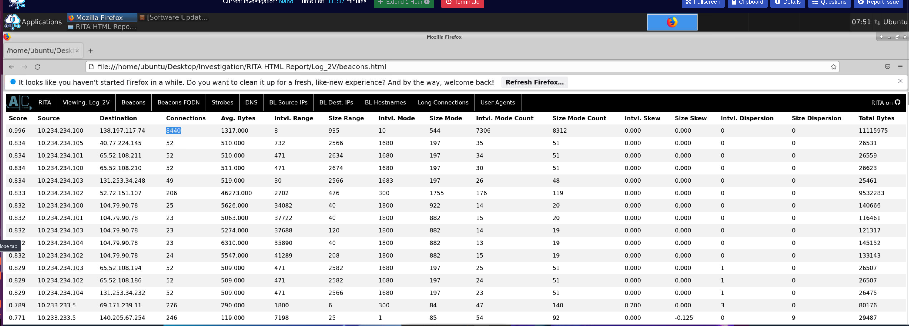
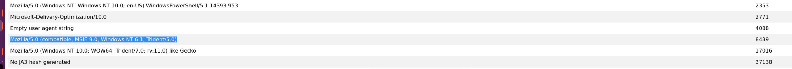
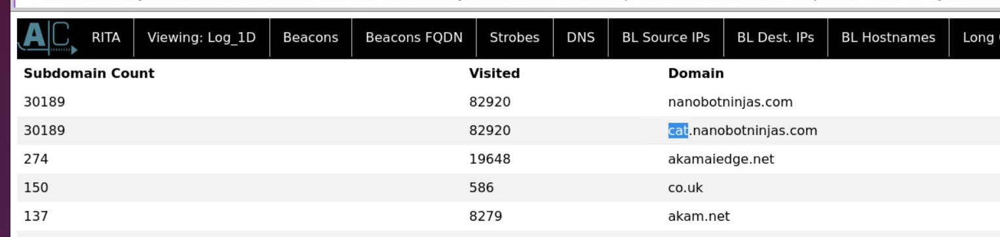
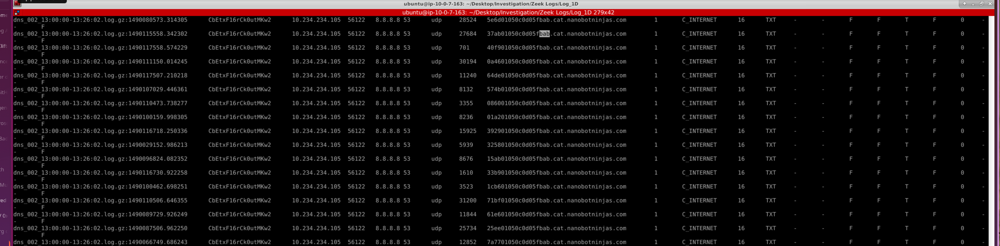

## Scenario

The SOC has detected unusual network activity from a critical server attributed to threat actor group Nano — known for stealth, persistence, and custom obfuscated protocols that mimic legitimate traffic. Two log sets are provided: `Log_2V` for beacon analysis and `Log_1D` for DNS tunnelling investigation. RITA (Real Intelligence Threat Analytics) is the primary analysis tool alongside raw Zeek log inspection.

---

## Methodology

### Stage 1 — RITA: C2 Beacon Identification (Log_2V)

RITA analyses Zeek connection logs and scores traffic for beacon-like regularity — consistent intervals, consistent byte sizes, and high connection counts are the hallmarks of automated C2 communication. Opening the RITA HTML report for `Log_2V` and navigating to the **Beacons** tab surfaces the threat immediately:



The top entry is unambiguous:

- **Score**: 0.996 — near-perfect beacon regularity
- **Source**: 10.234.234.100
- **Destination**: 138.197.117.74
- **Connections**: 8440
- **Avg Bytes**: 1317
- **Interval Range**: 8 seconds

A beacon score of 0.996 means the connection intervals are almost perfectly regular — exactly what automated C2 heartbeat traffic looks like. The 8440 connection count across a consistent 8-second interval range over the capture period confirms sustained, long-running C2 communication.

OSINT on `138.197.117.74` via ipinfo.io confirms the infrastructure:

```
Range:   138.197.112.0/20
Company: DigitalOcean, LLC
```

**DigitalOcean** is the cloud provider — a common C2 hosting choice due to low cost, easy deployment, and abuse-tolerant reputation historically.

### Stage 2 — RITA: User Agent Correlation (Log_2V)

Navigating to the **User Agents** tab in Log_2V correlates the connection count to a specific system fingerprint:



The user agent matching the 8440 connection count is:

```
Mozilla/5.0 (compatible; MSIE 9.0; Windows NT 6.1; Trident/5.0)
```

Internet Explorer 9 on Windows 7 — a browser and OS combination that has been end-of-life since 2016 and 2020 respectively. This UA string appearing in high-volume automated traffic in a modern environment is a strong indicator of spoofing — malware frequently uses outdated UA strings to appear as legacy enterprise traffic that might not trigger modern detection rules.

### Stage 3 — RITA: DNS Anomaly Detection (Log_1D)

Switching to `Log_1D` and opening the **DNS** tab reveals a dramatic anomaly in subdomain activity:



```
Subdomain Count: 30189    Visited: 82920    Domain: cat.nanobotninjas.com
```

30189 unique subdomains and 82920 total requests to `cat.nanobotninjas.com` — orders of magnitude above every other domain in the log. No legitimate service generates 30,000 unique subdomains. This is the signature of **DNS tunnelling** — each unique subdomain carries encoded data in the query itself, using the DNS protocol as a covert channel.

### Stage 4 — Zeek Log Analysis: TXT Record Queries

With the suspicious domain identified, pivoting to the raw Zeek DNS logs confirms the tunnelling mechanism. Grepping for TXT record queries to `cat.nanobotninjas.com`:

```bash
zgrep -i "cat.nanobotninjas" dns* | grep "TXT" | awk '{print $3}' | sort -u
```

```
10.234.234.105
```

A single internal IP — `10.234.234.105` — is responsible for all DNS TXT record queries to the tunnelling domain. TXT records are the preferred record type for DNS tunnelling because they can carry arbitrary data payloads up to 255 bytes per record, making them ideal for covert data exfiltration.

### Stage 5 — Subdomain Prefix Analysis

Examining the actual query structure from the Zeek logs reveals the cache-busting mechanism:

```bash
zgrep -i "cat.nanobotninjas" dns* | head -20
```



Each query prepends a unique hex string to the subdomain:

```
062901050c0d05fbab.cat.nanobotninjas.com
15c201050c0d05fbab.cat.nanobotninjas.com
118801050c0d05fbab.cat.nanobotninjas.com
0a8901050c0d05fbab.cat.nanobotninjas.com
```

The prefix is **hexadecimal** — Base 16 values that change with each query. The purpose is cache-busting: intermediate DNS resolvers cache responses for previously seen queries. By prepending a unique hex value to each query, the attacker ensures every request reaches the authoritative DNS server (under attacker control) rather than being served from cache — guaranteeing a fresh C2 response each time.

The query pattern — TXT record type, hex-prefixed subdomains, high query volume to a single domain, and the tool's known signature — identifies the tool as **dnscat2**, a popular open-source DNS C2 framework that uses DNS TXT, MX, and CNAME records for command and control communication over the DNS protocol.

---

## Attack Summary

|Phase|Action|
|---|---|
|C2 Beaconing|10.234.234.100 → 138.197.117.74 (DigitalOcean) — 8440 connections, score 0.996|
|UA Spoofing|IE9/Windows 7 user agent used to masquerade as legacy enterprise traffic|
|DNS Tunnelling|10.234.234.105 → cat.nanobotninjas.com — 82920 queries, 30189 unique subdomains|
|Data Encoding|Hex-prefixed subdomains carry encoded data in TXT record queries|
|Cache Busting|Unique hex prefix per query bypasses intermediate DNS resolver caching|
|Tool|dnscat2 — DNS-based C2 tunnelling framework|

---

## IOCs

|Type|Value|
|---|---|
|IP (C2 Server)|138[.]197[.]117[.]74|
|Infrastructure|DigitalOcean|
|IP (Internal - Beaconing)|10.234.234.100|
|IP (Internal - DNS Tunnel)|10.234.234.105|
|Domain (C2 Tunnel)|cat[.]nanobotninjas[.]com|
|User Agent (Spoofed)|Mozilla/5.0 (compatible; MSIE 9.0; Windows NT 6.1; Trident/5.0)|
|Tool|dnscat2|
|DNS Record Type|TXT|
|Beacon Score|0.996|
|Connection Count|8440|
|DNS Query Count|82920|

---

## MITRE ATT&CK

|Technique|ID|Description|
|---|---|---|
|Application Layer Protocol: DNS|T1071.004|dnscat2 tunnels C2 communication over DNS TXT record queries|
|Non-Standard Port|T1571|Beaconing traffic exhibits consistent interval/size regularity indicating custom C2 protocol|
|Web Service|T1102|DigitalOcean VPS used as attacker-controlled C2 infrastructure|

---

## Defender Takeaways

**RITA as a beaconing detection primitive** — RITA scores connections based on interval regularity, byte size consistency, and connection volume. A score above 0.8 warrants investigation; 0.996 is a near-certain automated beacon. Running RITA against Zeek connection logs as part of regular threat hunting provides durable coverage against C2 traffic that evades signature-based detection by using valid protocols over standard ports.

**DNS TXT record volume as a detection signal** — legitimate services rarely generate thousands of TXT record queries to a single domain. A SIEM rule alerting on any single internal host generating more than a threshold of TXT record queries (e.g. 100 per hour) to a non-corporate domain provides reliable dnscat2 and iodine detection. The 30,189 unique subdomain count is an extreme outlier that would have triggered this rule immediately.

**Outdated user agents in high-volume automated traffic** — IE9 on Windows 7 appearing in thousands of connections is an immediate anomaly in any modern environment. Maintaining a baseline of expected user agents and alerting on outliers — particularly legacy browser versions — adds a lightweight detection layer that doesn't depend on knowing the C2 IP in advance.

**DNS as an exfiltration channel** — DNS is rarely filtered at the egress layer because it's required for basic network function. DNS tunnelling exploits this trust by encoding data in query fields. Deploying a DNS security solution (Cisco Umbrella, Cloudflare Gateway, or equivalent) that monitors query volume, subdomain entropy, and TXT record usage per host closes this gap without blocking legitimate DNS traffic.

**Cache-busting as a tunnelling indicator** — the hex prefix pattern that changes per query is specifically designed to defeat DNS caching. Detecting this pattern — high entropy subdomain prefixes changing on every query to the same parent domain — is a reliable dnscat2 fingerprint that can be implemented as a Zeek or Suricata detection rule.

---

<div class="qa-item"> <div class="qa-question-text">Q1) Looking at the RITA HTML Report (Log_2V), what is the IP of the attacker’s C2 server? Provide the number of connections as well. (Format: IP Address, Connections)</div> <div class="flag-reveal"> <input type="checkbox"> <span class="r-placeholder">Click flag to reveal</span> <span class="r-answer">138.197.117.74, 8440</span> <button class="copy-btn" onclick="event.stopPropagation();navigator.clipboard.writeText(this.previousElementSibling.textContent);this.textContent='copied';setTimeout(()=>this.textContent='copy',1500)">copy</button> </div> </div>

<div class="qa-item"> <div class="qa-question-text">Q2) What is the cloud infrastructure being used for the C2 server? (Format: Infrastructure)</div> <div class="answer-reveal"> <input type="checkbox"> <span class="r-placeholder">Click to reveal answer</span> <span class="r-answer">DigitalOcean</span> <button class="copy-btn" onclick="event.stopPropagation();navigator.clipboard.writeText(this.previousElementSibling.textContent);this.textContent='copied';setTimeout(()=>this.textContent='copy',1500)">copy</button> </div> </div>

<div class="qa-item"> <div class="qa-question-text">Q3) Looking at the RITA User Agent report, what is the system that corresponds to the connection count in Q1? (Format: User Agent String)</div> <div class="flag-reveal"> <input type="checkbox"> <span class="r-placeholder">Click flag to reveal</span> <span class="r-answer">Mozilla/5.0 (compatible; MSIE 9.0; Windows NT 6.1; Trident/5.0)</span> <button class="copy-btn" onclick="event.stopPropagation();navigator.clipboard.writeText(this.previousElementSibling.textContent);this.textContent='copied';setTimeout(()=>this.textContent='copy',1500)">copy</button> </div> </div>

<div class="qa-item"> <div class="qa-question-text">Q4) Let’s look at Log_1D, what is the low-profile subdomain with the absurd amount of requests? Provide the number of requests as well. (Format: Subdomain, Request)</div> <div class="answer-reveal"> <input type="checkbox"> <span class="r-placeholder">Click to reveal answer</span> <span class="r-answer">cat.nanobotninjas.com, 82920</span> <button class="copy-btn" onclick="event.stopPropagation();navigator.clipboard.writeText(this.previousElementSibling.textContent);this.textContent='copied';setTimeout(()=>this.textContent='copy',1500)">copy</button> </div> </div>

<div class="qa-item"> <div class="qa-question-text">Q5) In the Zeek logs (Log_1D), we can see a large number of DNS TXT record requests for a private IP for the subdomain found in Q4. List the IP. (Format: IP Address)</div> <div class="flag-reveal"> <input type="checkbox"> <span class="r-placeholder">Click flag to reveal</span> <span class="r-answer">10.234.234.105</span> <button class="copy-btn" onclick="event.stopPropagation();navigator.clipboard.writeText(this.previousElementSibling.textContent);this.textContent='copied';setTimeout(()=>this.textContent='copy',1500)">copy</button> </div> </div>

<div class="qa-item"> <div class="qa-question-text">Q6) This is an unusual activity. To avoid cached results on the intermediate DNS server(s), a certain value prepended to the subdomain is being changed. What numeral system is being used for the value that changes? It seems like a Base 16 numbering system. (Format: value)</div> <div class="answer-reveal"> <input type="checkbox"> <span class="r-placeholder">Click to reveal answer</span> <span class="r-answer">hex</span> <button class="copy-btn" onclick="event.stopPropagation();navigator.clipboard.writeText(this.previousElementSibling.textContent);this.textContent='copied';setTimeout(()=>this.textContent='copy',1500)">copy</button> </div> </div>

<div class="qa-item"> <div class="qa-question-text">Q7) Judging from the logs (Log_1D), what tool was the attacker using? A tool to help C2s channel over the DNS protocol. (Format: tool)</div> <div class="flag-reveal"> <input type="checkbox"> <span class="r-placeholder">Click flag to reveal</span> <span class="r-answer">dnscat2</span> <button class="copy-btn" onclick="event.stopPropagation();navigator.clipboard.writeText(this.previousElementSibling.textContent);this.textContent='copied';setTimeout(()=>this.textContent='copy',1500)">copy</button> </div> </div>

