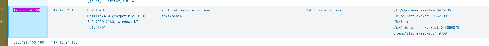
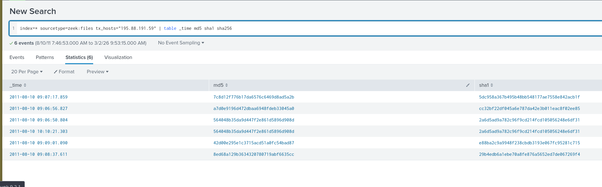
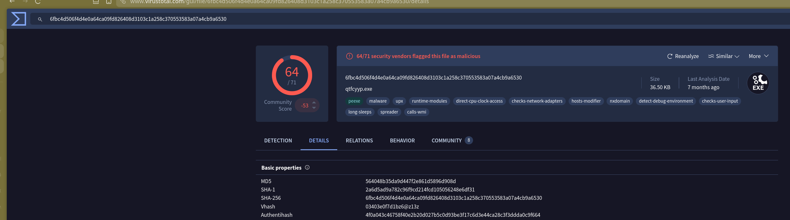

## Overview

Unusual network activity was detected within a university environment, with anomalies observed across a six-hour window. The indicators suggested active C2 communications and malicious file downloads. The investigation used Splunk to query Suricata IDS logs and Zeek file metadata to identify the attacker infrastructure, compromised host, and downloaded payloads.

---

## Evidence Source

|Artifact|Detail|
|---|---|
|IDS Logs|Suricata (via Splunk)|
|File Metadata|Zeek|
|Index|`index=*`|

---

## Step 1 — Narrow Down IDS Alerts

Starting broad with Suricata attack events returned 2872 results — too many to work with directly. The approach was to aggregate by source IP to surface which host was generating the most anomalous traffic.

```
index=* sourcetype=suricata eventtype=suricata_eve_ids_attack
| stats values(dest_ip) values(http.http_user_agent) values(http.http_content_type)
  values(http.http_protocol) values(http.status) values(http.hostname) values(http.url)
  by src_ip
```

One source IP stood out immediately: `195.88.191.59`. This host was making HTTP requests with a spoofed IE6 on Windows XP user-agent string — a classic bot masquerading as a legacy browser to blend into older network environments.

The requests all pointed to a single external domain: `nocomcom.com`. The destination host receiving the traffic was `147.32.84.165`.


## Step 2 — Enumerate Downloaded Files

With the attacker IP confirmed, Zeek file logs were queried to pull all files transferred from that host and extract their hashes for further analysis.

```
index=* sourcetype=zeek:files tx_hosts="195.88.191.59"
| table _time md5 sha1 sha256
```

This returned 5 unique files downloaded to the compromised host. To correlate file hashes with the URLs they were retrieved from, a join was performed across Zeek and Suricata:

```
index=* sourcetype=zeek:files tx_hosts="195.88.191.59"
| join left=L right=R where L.seen_bytes=R.bytes
  [search index=* sourcetype=suricata src_ip=147.32.84.165 dest_ip=195.88.191.59 url=*]
| table L.md5, R.url
```

The downloaded files were:

|Filename|Notes|
|---|---|
|`chooseee.exe`|Malicious executable|
|`client.exe`|Malicious executable|
|`fjuivgfhurew.exe`|Malicious executable|
|`3425.exe`|Malicious executable|
|`kx4.txt`|Disguised executable — confirmed malicious via VirusTotal|

`kx4.txt` is particularly notable — it has a `.txt` extension but VirusTotal flagged it as a PE32 executable (64/71 vendors). This is a common evasion technique to bypass naive file type filtering.


## Step 3 — Validate on VirusTotal

The SHA256 hash for `kx4.txt` was submitted to VirusTotal, which confirmed it as malicious with a high detection rate. The file was identified as part of the Neris botnet family.

---



## IOCs 


| Type             | Value                                                             |
| ---------------- | ----------------------------------------------------------------- |
| SHA256 (kx4.txt) | `6fbc4d506f4d4e0a64ca09fd826408d3103c1a258c370553583a07a4cb9a6530 |
| C2 Domain        | `nocomcom.com`                                                    |
| Attacker IP      | 195.88.191.59                                                     |
| Compromised Host | 147.32.84.165                                                     |
| Malicious Files  | chooseee.exe, client.exe, fjuivgfhurew.exe, 3425.exe, kx4.txt     |
|                  |                                                                   |


## Lessons Learned

Aggregating IDS alerts by `src_ip` with `stats values()` is far more efficient than scrolling raw events — it collapses thousands of alerts into a handful of actionable rows. The IE6/WinXP user-agent is a strong Neris botnet indicator and worth adding to detection rules.

Joining Zeek file metadata with Suricata HTTP logs is a powerful technique for correlating _what_ was downloaded with _where_ it came from — neither data source tells the full story alone. Always check `.txt` and other non-executable extensions against file magic bytes or hashes when they appear in suspicious download activity.

> The investigation successfully identified the attacker IP, C2 domain, compromised host, all downloaded payloads, and the SHA256 hash of the disguised executable using Splunk queries across Suricata and Zeek data sources.

---

## Lab Questions












I successfully completed NerisBot Blue Team Lab at @CyberDefenders!
https://cyberdefenders.org/blueteam-ctf-challenges/achievements/inksec/nerisbot/
 
#CyberDefenders #CyberSecurity #BlueYard #BlueTeam #InfoSec #SOC #SOCAnalyst #DFIR #CCD #CyberDefender
