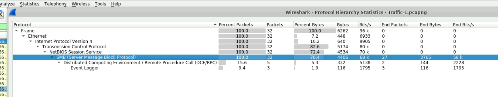
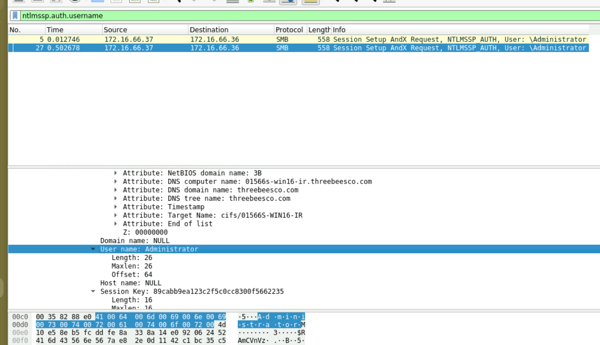
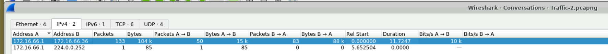
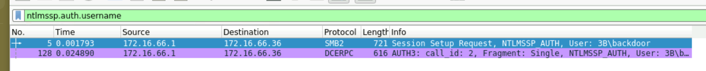
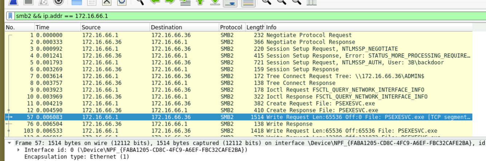

# PacketDetective – Network Traffic Investigation
## Scenario
In September 2020, the SOC detected suspicious activity from a user device flagged by unusual SMB protocol usage. Initial analysis indicated a possible compromise of a privileged account and remote access tool usage. Three PCAP files were provided to trace the attacker's methods, persistence tactics, and goals. --- ## Tooling - Wireshark - Protocol Hierarchy Statistics - Conversations view

---

## Investigation Findings 
### PCAP 1 – SMB Authentication and Initial Access 
**Protocol Analysis** 
Using Wireshark's Protocol Hierarchy (`Statistics → Protocol Hierarchy`) revealed that SMB accounted for the majority of traffic with a total of **4406 bytes** transferred. 

**Compromised Account Identification** 
Filtering for NTLMSSP authentication: 
```bash 
ntlmssp.auth.username 
``` 

Revealed the `Administrator` account authenticating from `172.16.66.37` to `172.16.66.36` — confirming a privileged account was compromised. 
**Attacker IP:** `172.16.66.37` 
**Event Log Tampering** 
Searching packet details for `create` revealed an `eventlog` file access attempt. The attacker attempted to clear the Windows Event Log at: 
**2020-09-23 16:50 UTC** 
This is consistent with MITRE T1070.001 – Indicator Removal: Clear Windows Event Logs.

---

### PCAP 2 – RPC Lateral Movement via Named Pipe

**Named Pipe Identification**

Filtering with `smb && ip.addr == 172.16.66.37` and investigating RPC/DCOM traffic, expanding `OxidBindings → StringBindings` revealed a named pipe binding:

`\\01566S-WIN16-IR[\PIPE\atsvc]`

**atsvc** is the Windows Task Scheduler service — confirming the attacker used RPC over named pipes to interact with Task Scheduler for lateral movement (MITRE T1053.005).

**Communication Duration**

Using `Statistics → Conversations` and filtering `ip.addr == 172.16.66.1 && ip.addr == 172.16.66.36` the duration of communication between the two hosts was **11.7247 seconds**.

---
### PCAP 3 – Persistence and Remote Execution

**Secondary Username**

Filtering with 
```
ntlmssp.auth.username
```
revealed a second non-standard username: **3B\backdoor** — indicating the attacker established a backdoor account for persistence (MITRE T1136).

**Remote Execution via PsExec**

Filtering with 
```bash
smb2 && ip.addr == 172.16.66.1
```
 revealed the attacker writing `PSEXESVC.exe` to the target — confirming use of Sysinternals PsExec for remote process execution (MITRE T1569.002).


## IOCs 

| Type      | Value                |
| --------- | -------------------- |
| IP        | 172.16.66.1          |
| IP        | 172.16.66.37         |
| username  | administrator        |
| username  | backdoor             |
| file      | PSEXESVC.EXE         |
| timestamp | 2020-09-23 16:50 UTC |
|           |                      |
## Conclusion

> The attacker compromised the Administrator account via SMB, used RPC over named pipes to interact with the Task Scheduler service, attempted to clear event logs to cover their tracks, and established persistence through a backdoor account before executing remote processes via PsExec.

---

















I successfully completed PacketDetective Blue Team Lab at @CyberDefenders!
https://cyberdefenders.org/blueteam-ctf-challenges/achievements/inksec/packetdetective/
 
#CyberDefenders #CyberSecurity #BlueYard #BlueTeam #InfoSec #SOC #SOCAnalyst #DFIR #CCD #CyberDefender
