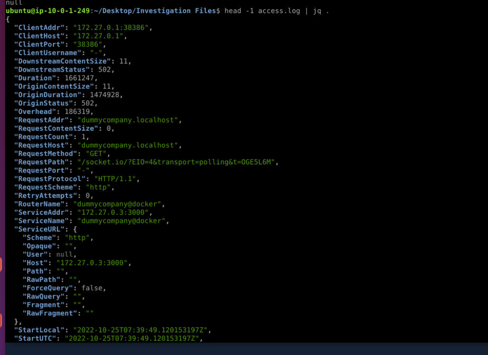
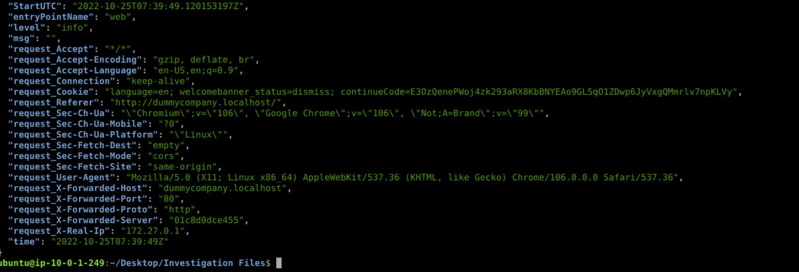
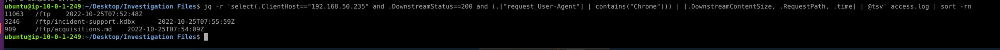
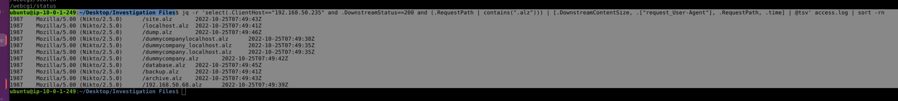

## Scenario

DummyCompany's internal service `dummycompany.localhost` receives excessive requests from an internal IP. The Security Team suspects unauthorised access to confidential files due to an authentication/authorisation misconfiguration. A Traefik access log in JSON format is provided for analysis.

---

## Methodology

### Stage 1 — Log Structure Orientation

The log file contains one JSON object per line — standard Traefik structured logging. Inspecting a single record reveals the full field schema:

```zsh
head -1 access.log | jq .
```



Key fields for analysis: `ClientHost` (source IP), `RequestPath`, `DownstreamStatus`, `DownstreamContentSize`, `request_User-Agent`, `downstream_Content-Type`, and `time`. The request and response headers are flattened into the top-level object with `request_` and `downstream_` prefixes respectively — important to know before querying nested values.

### Stage 2 — Statistical Analysis to Identify the Attacker

Ranking all source IPs by request volume immediately surfaces the anomaly:

````zsh
jq -r '.ClientHost' access.log | sort | uniq -c | sort -rn
```
```
1567 192.168.50.235
  45 192.168.50.146
  24 172.28.0.1
   9 172.27.0.1
````

`192.168.50.235` generates 1567 requests — more than 34x the next highest source. The volume disparity alone is sufficient to flag this as automated activity from an internal host.

### Stage 3 — User-Agent Analysis

Extracting all unique user-agent strings from the attacker IP surfaces three distinct values:

````zsh
jq -r 'select(.ClientHost=="192.168.50.235") | .["request_User-Agent"]' access.log | sort -u
```
```
() { :; }; echo 93e4r0-CVE-2014-6271: true;echo;echo;
Mozilla/5.0 (X11; Linux x86_64) AppleWebKit/537.36 (KHTML, like Gecko) Chrome/106.0.0.0 Safari/537.36
Mozilla/5.00 (Nikto/2.5.0)
````

Three user-agents, three distinct phases of the attack:

**Nikto/2.5.0** — automated web vulnerability scanner. This is the reconnaissance phase, responsible for the bulk of the 1567 requests. Nikto performs comprehensive checks against known vulnerable paths, CGI scripts, backup files, and common misconfigurations.

**Shellshock payload** — `() { :; }; echo 93e4r0-CVE-2014-6271: true` injected into the User-Agent header. This is a probe for CVE-2014-6271 (Shellshock) — a critical bash vulnerability that allows remote code execution when bash processes specially crafted environment variables. Nikto automatically tests for Shellshock as part of its CGI checks by injecting the payload into request headers including User-Agent.

**Chrome/106.0.0.0 on Linux** — the attacker's actual browser, used for manual investigation after Nikto completed its scan. The switch from automated to manual tooling signals the attacker pivoting to hands-on exploitation of discovered findings.

### Stage 4 — Identifying the Exposed Directory

Filtering for successful Chrome-UA requests reveals what the attacker found during manual exploration:

````zsh
jq -r 'select(.ClientHost=="192.168.50.235" and .DownstreamStatus==200 and (.["request_User-Agent"] | contains("Chrome"))) | [.DownstreamContentSize, .RequestPath, .time] | @tsv' access.log | sort -rn | head -20
```
```
11063   /ftp        2022-10-25T07:52:48Z
3246    /ftp/incident-support.kdbx   2022-10-25T07:55:59Z
909     /ftp/acquisitions.md    2022-10-25T07:54:09Z
````

The `/ftp/` directory is exposed and browsable — the attacker retrieved a directory listing (11063 bytes) then accessed two files within it. An unauthenticated FTP-style file share on an internal web service is the misconfiguration the scenario references.

### Stage 5 — Identifying the Exfiltrated File

Two files were accessed from `/ftp/`: `incident-support.kdbx` (a KeePass password database) and `acquisitions.md`. The confidential document is `acquisitions.md` — company acquisition data is the sensitive business information consistent with the scenario's reference to confidential files.

Confirming the content-type:

````zsh
jq -r 'select(.ClientHost=="192.168.50.235" and (.RequestPath | contains("acquisitions.md"))) | .["downstream_Content-Type"]' access.log
```
```
text/markdown; charset=UTF-8
````



### Stage 6 — Nikto ALZ Enumeration (Noise Identification)

During investigation, a large volume of `.alz` files appeared in the 200-response list. Cross-referencing against the Nikto UA confirms these were all automated Nikto probes returning the same 1987-byte response — the server returns a consistent response body for non-existent files, making every guessed `.alz` path appear as a hit by byte count alone. This is a common false positive pattern in Nikto output and not indicative of real files being present.



The real finding is the `/ftp/` directory — identified by switching focus to Chrome-UA requests only, filtering out Nikto noise entirely.

---

## Attack Summary

|Phase|Action|
|---|---|
|Reconnaissance|Nikto/2.5.0 scans dummycompany.localhost — 1567 requests across all common paths|
|Exploitation Attempt|Shellshock payload (CVE-2014-6271) injected via User-Agent header|
|Manual Investigation|Attacker pivots to Chrome browser, browses service manually|
|Discovery|/ftp/ directory found exposed and unauthenticated — directory listing accessible|
|Exfiltration|acquisitions.md retrieved at 2022-10-25T07:54:09Z (909 bytes, text/markdown)|

---

## IOCs

|Type|Value|
|---|---|
|IP (Attacker)|192.168.50.235|
|User-Agent (Recon)|Mozilla/5.00 (Nikto/2.5.0)|
|User-Agent (Browser)|Mozilla/5.0 (X11; Linux x86_64) AppleWebKit/537.36 (KHTML, like Gecko) Chrome/106.0.0.0 Safari/537.36|
|User-Agent (Exploit)|() { :; }; echo 93e4r0-CVE-2014-6271: true;echo;echo;|
|CVE|CVE-2014-6271 (Shellshock)|
|Exposed Directory|/ftp/|
|File Exfiltrated|/ftp/acquisitions.md|
|Content-Type|text/markdown; charset=UTF-8|
|Timestamp|2022-10-25T07:54:09Z|

---

## MITRE ATT&CK

|Technique|ID|Description|
|---|---|---|
|Active Scanning: Vulnerability Scanning|T1595.002|Nikto/2.5.0 performs automated vulnerability and path enumeration|
|Exploit Public-Facing Application|T1190|Shellshock CVE-2014-6271 injected via User-Agent header|
|File and Directory Discovery|T1083|/ftp/ directory browsed manually; directory listing exposed|
|Data from Local System|T1005|acquisitions.md retrieved from unauthenticated internal file share|

---

## Defender Takeaways

**`jq` for JSON log analysis** — Traefik structured logging produces JSON rather than traditional space-delimited access logs. `jq` with `select()` filters and field extraction replaces `awk`/`grep` pipelines for this format. The pattern `select(.Field=="value") | .["hyphenated-field"]` handles both standard and hyphenated field names cleanly. Building familiarity with `jq` is increasingly relevant as modern reverse proxies and API gateways default to JSON logging.

**Volume-based anomaly detection** — 1567 requests from a single internal IP against an internal service is trivially detectable. Internal traffic is often trusted by default and excluded from monitoring thresholds — this is a mistake. Anomaly detection rules should apply equally to internal source IPs, particularly for services that are not expected to receive high-volume automated traffic.

**Unauthenticated internal file shares** — the `/ftp/` directory was accessible with no authentication and with directory listing enabled. Internal services should apply the same access controls as external ones — the attacker was an internal IP but had no legitimate access to acquisition data. Principle of least privilege applies at the HTTP layer: sensitive directories must require authentication regardless of network location.

**Shellshock as a Nikto signal** — the Shellshock User-Agent payload is a standard Nikto check. Any request containing `() { :; };` in a header field is an unambiguous indicator of Nikto execution or manual Shellshock testing. WAF rules or SIEM alerts matching this pattern provide reliable Nikto detection independent of IP or rate thresholds.

**Noise separation in log analysis** — the `.alz` false positive pattern demonstrates the importance of correlating response size and user-agent together rather than status code alone. A 200 response from a scanner UA with a uniform byte count across hundreds of paths is scanner noise, not successful retrieval. Pivoting to manual-UA requests exclusively cut through the noise and surfaced the actual exfiltration in three lines of output.

---

<div class="qa-item"> <div class="qa-question-text">Question 1) Based on statistical analysis, which IP address is likely to be the attackers? (Format: X.X.X.X)</div> <div class="flag-reveal"> <input type="checkbox"> <span class="r-placeholder">Click flag to reveal</span> <span class="r-answer">192.168.50.235</span> <button class="copy-btn" onclick="event.stopPropagation();navigator.clipboard.writeText(this.previousElementSibling.textContent);this.textContent='copied';setTimeout(()=>this.textContent='copy',1500)">copy</button> </div> </div>

<div class="qa-item"> <div class="qa-question-text">Question 2) What is the name of the reconnaissance tool used by the attacker? (Format: ToolName)</div> <div class="answer-reveal"> <input type="checkbox"> <span class="r-placeholder">Click to reveal answer</span> <span class="r-answer">nikto</span> <button class="copy-btn" onclick="event.stopPropagation();navigator.clipboard.writeText(this.previousElementSibling.textContent);this.textContent='copied';setTimeout(()=>this.textContent='copy',1500)">copy</button> </div> </div>

<div class="qa-item"> <div class="qa-question-text">Question 3) After conducting reconnaissance, it is likely that the attacker manually began to investigate the server. What is the browser user-agent used by the attacker? (Format: Full UA String)</div> <div class="flag-reveal"> <input type="checkbox"> <span class="r-placeholder">Click flag to reveal</span> <span class="r-answer">Mozilla/5.0 (X11; Linux x86_64) AppleWebKit/537.36 (KHTML, like Gecko) Chrome/106.0.0.0 Safari/537.36</span> <button class="copy-btn" onclick="event.stopPropagation();navigator.clipboard.writeText(this.previousElementSibling.textContent);this.textContent='copied';setTimeout(()=>this.textContent='copy',1500)">copy</button> </div> </div>

<div class="qa-item"> <div class="qa-question-text">Question 4) Based on the UA found in Question 3, what is browser name, version, and operating system used by the attacker? (Format: BrowserName VersionNumber, OSName)</div> <div class="answer-reveal"> <input type="checkbox"> <span class="r-placeholder">Click to reveal answer</span> <span class="r-answer">Chrome 106,  Linux</span> <button class="copy-btn" onclick="event.stopPropagation();navigator.clipboard.writeText(this.previousElementSibling.textContent);this.textContent='copied';setTimeout(()=>this.textContent='copy',1500)">copy</button> </div> </div>

<div class="qa-item"> <div class="qa-question-text">Question 5) Some web attacks can utilize the user-agent field to conduct exploitation. What is the vulnerability identifier related to the attempted exploit? (Format: CVE-XXXX-XXXX)</div> <div class="flag-reveal"> <input type="checkbox"> <span class="r-placeholder">Click flag to reveal</span> <span class="r-answer">CVE-2014-6271</span> <button class="copy-btn" onclick="event.stopPropagation();navigator.clipboard.writeText(this.previousElementSibling.textContent);this.textContent='copied';setTimeout(()=>this.textContent='copy',1500)">copy</button> </div> </div>

<div class="qa-item"> <div class="qa-question-text">Question 6) How many unique user-agent strings were observed from the attacker? (Format: Number)</div> <div class="answer-reveal"> <input type="checkbox"> <span class="r-placeholder">Click to reveal answer</span> <span class="r-answer">3</span> <button class="copy-btn" onclick="event.stopPropagation();navigator.clipboard.writeText(this.previousElementSibling.textContent);this.textContent='copied';setTimeout(()=>this.textContent='copy',1500)">copy</button> </div> </div>

<div class="qa-item"> <div class="qa-question-text">Question 7) What is the name of the exposed directory containing files that the attacker identified? (Format: /Directory/)</div> <div class="flag-reveal"> <input type="checkbox"> <span class="r-placeholder">Click flag to reveal</span> <span class="r-answer">/ftp</span> <button class="copy-btn" onclick="event.stopPropagation();navigator.clipboard.writeText(this.previousElementSibling.textContent);this.textContent='copied';setTimeout(()=>this.textContent='copy',1500)">copy</button> </div> </div>

<div class="qa-item"> <div class="qa-question-text">Question 8) What is the name of the file that the attacker retrieved from the server? (Format: filename.extension)</div> <div class="answer-reveal"> <input type="checkbox"> <span class="r-placeholder">Click to reveal answer</span> <span class="r-answer">acquisitions.md</span> <button class="copy-btn" onclick="event.stopPropagation();navigator.clipboard.writeText(this.previousElementSibling.textContent);this.textContent='copied';setTimeout(()=>this.textContent='copy',1500)">copy</button> </div> </div>

<div class="qa-item"> <div class="qa-question-text">Question 9) What is the content-type value of the confidential document retrieved by the attacker? (Format: Content-Type Value)</div> <div class="flag-reveal"> <input type="checkbox"> <span class="r-placeholder">Click flag to reveal</span> <span class="r-answer">text/markdown; charset=UTF-8</span> <button class="copy-btn" onclick="event.stopPropagation();navigator.clipboard.writeText(this.previousElementSibling.textContent);this.textContent='copied';setTimeout(()=>this.textContent='copy',1500)">copy</button> </div> </div>

<div class="qa-item"> <div class="qa-question-text">Question 10) Provide the timestamp for when the attacker retrieved the document, using the Time field (Format: YYYY-MM-DDTHH:MM:SSZ)</div> <div class="answer-reveal"> <input type="checkbox"> <span class="r-placeholder">Click to reveal answer</span> <span class="r-answer">2022-10-25T07:54:09Z</span> <button class="copy-btn" onclick="event.stopPropagation();navigator.clipboard.writeText(this.previousElementSibling.textContent);this.textContent='copied';setTimeout(()=>this.textContent='copy',1500)">copy</button> </div> </div>

